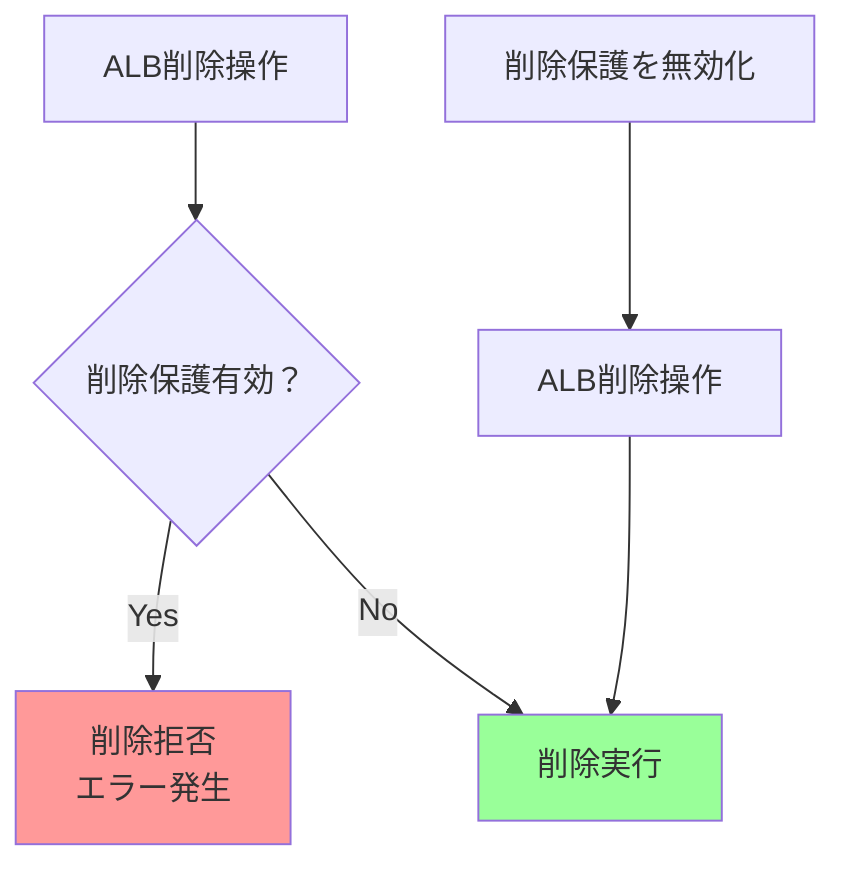
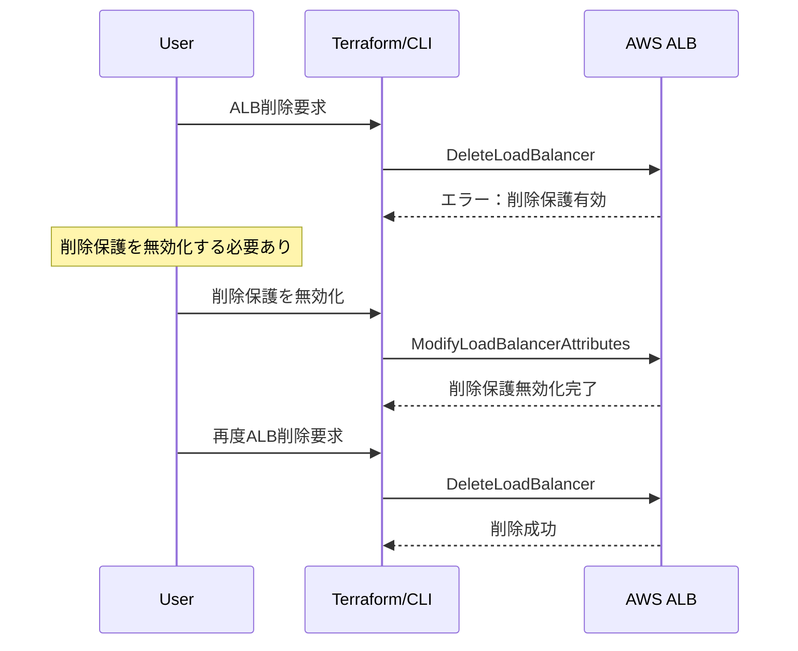
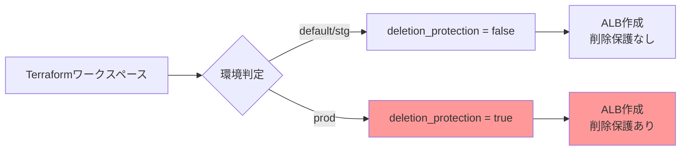

# AWS ALBのenable_deletion_protection設定とは

## What's this file?
> [!NOTE]
> **What**
> 
> AWS Application Load Balancer (ALB)のenable_deletion_protection設定項目とは何かについて記載しています。

## Conclusion (忙しいとき向け)
> [!IMPORTANT]
> **What** : ALBのenable_deletion_protection設定とは何か
> 
> **Answer** : ALBを誤って削除することを防ぐセーフティ機能で、有効化すると通常のAWS操作（コンソール、CLI、API、Terraform）でALBを削除できなくなり、削除前に明示的な無効化が必要になる設定

## 目次

<details>
<summary>目次を開く</summary>

- [削除保護機能の概要](#削除保護機能の概要)
- [削除保護の動作原理](#削除保護の動作原理)
- [設定方法と確認方法](#設定方法と確認方法)
- [削除保護有効時の削除手順](#削除保護有効時の削除手順)
- [利用シナリオと推奨事項](#利用シナリオと推奨事項)
- [プロジェクトでの実装例](#プロジェクトでの実装例)
- [Terraformでの管理パターン](#terraformでの管理パターン)
- [注意事項とトラブルシューティング](#注意事項とトラブルシューティング)

</details>

## 削除保護機能の概要

`enable_deletion_protection`は、AWS ALBに組み込まれた安全機能で、重要なロードバランサーを誤操作から保護します。

### 基本的な特徴

```hcl
resource "aws_lb" "example" {
  name                       = "my-alb"
  enable_deletion_protection = true  # 削除保護を有効化
}
```

### 保護の対象



## 削除保護の動作原理

### 削除保護が防ぐ操作

1. **AWSコンソールからの削除**
   - 削除ボタンがグレーアウト
   - エラーメッセージ表示

2. **AWS CLIからの削除**
   ```bash
   # 削除保護有効時
   $ aws elbv2 delete-load-balancer --load-balancer-arn arn:aws:elasticloadbalancing:...
   
   An error occurred (OperationNotPermitted) when calling the DeleteLoadBalancer operation:
   Load balancer 'arn:aws:elasticloadbalancing:...' cannot be deleted because deletion
   protection is enabled
   ```

3. **Terraformでの削除**
   ```bash
   # terraform destroy実行時
   Error: error deleting ELBv2 Load Balancer: OperationNotPermitted:
   Load balancer cannot be deleted because deletion protection is enabled
   ```

### 削除保護が防がない操作

- ALBの設定変更（リスナー、ターゲットグループなど）
- ALBの停止（ALBには停止機能なし）
- ターゲットの登録/解除
- セキュリティグループの変更

## 設定方法と確認方法

### Terraformでの設定

```hcl
# 削除保護を有効化
resource "aws_lb" "production" {
  name                       = "prod-alb"
  enable_deletion_protection = true
  
  # その他の設定...
}

# 削除保護を無効化（デフォルト）
resource "aws_lb" "staging" {
  name                       = "stg-alb"
  enable_deletion_protection = false
}
```

### AWS CLIでの設定変更

```bash
# 削除保護を有効化
aws elbv2 modify-load-balancer-attributes \
  --load-balancer-arn arn:aws:elasticloadbalancing:region:account-id:loadbalancer/app/my-alb/50dc6c495c0c9188 \
  --attributes Key=deletion_protection.enabled,Value=true

# 削除保護を無効化
aws elbv2 modify-load-balancer-attributes \
  --load-balancer-arn arn:aws:elasticloadbalancing:region:account-id:loadbalancer/app/my-alb/50dc6c495c0c9188 \
  --attributes Key=deletion_protection.enabled,Value=false
```

### 現在の設定確認

```bash
# CLIで確認
aws elbv2 describe-load-balancer-attributes \
  --load-balancer-arn arn:aws:elasticloadbalancing:region:account-id:loadbalancer/app/my-alb/50dc6c495c0c9188 \
  --query 'Attributes[?Key==`deletion_protection.enabled`].Value' \
  --output text

# Terraformで確認
terraform state show aws_lb.example | grep deletion_protection
```

## 削除保護有効時の削除手順

### 手順のフロー



### Terraformでの削除手順

```hcl
# Step 1: 削除保護を無効化
resource "aws_lb" "example" {
  name                       = "my-alb"
  enable_deletion_protection = false  # true → false に変更
  # その他の設定...
}
```

```bash
# Step 2: 変更を適用
terraform apply

# Step 3: リソースを削除
terraform destroy
```

## 利用シナリオと推奨事項

### 削除保護を有効にすべきケース

| 環境 | 推奨設定 | 理由 |
|------|----------|------|
| 本番環境 | `true` | サービス継続性の確保 |
| ステージング環境 | 場合による | 本番同等の扱いなら`true` |
| 開発環境 | `false` | 頻繁な再作成のため |
| 一時的な検証環境 | `false` | 短期間で削除するため |

### ベストプラクティス

1. **環境変数での管理**
   ```hcl
   variable "is_production" {
     type    = bool
     default = false
   }
   
   resource "aws_lb" "main" {
     enable_deletion_protection = var.is_production
   }
   ```

2. **Terraformワークスペースとの連携**
   ```hcl
   locals {
     is_prod = terraform.workspace == "prod"
   }
   
   resource "aws_lb" "main" {
     enable_deletion_protection = local.is_prod
   }
   ```

## プロジェクトでの実装例

### 現在の実装（example-project）

```hcl
# variables.tf - 環境別設定
variable "environment_config" {
  type = map(object({
    deletion_protection = bool
    # その他の設定...
  }))
  default = {
    stg = {
      deletion_protection = false  # ステージング：削除保護なし
    }
    prod = {
      deletion_protection = true   # 本番：削除保護あり
    }
  }
}

# main.tf - モジュールへの受け渡し
module "server" {
  enable_deletion_protection = local.config.deletion_protection
}

# server/aws_alb.tf - 実際の使用
resource "aws_lb" "example_project" {
  enable_deletion_protection = var.enable_deletion_protection
}
```

### 環境別の自動設定



## Terraformでの管理パターン

### パターン1: 直接指定

```hcl
# シンプルだが柔軟性に欠ける
resource "aws_lb" "example" {
  enable_deletion_protection = true
}
```

### パターン2: 変数による制御

```hcl
variable "enable_alb_deletion_protection" {
  description = "ALBの削除保護を有効にするか"
  type        = bool
  default     = false
}

resource "aws_lb" "example" {
  enable_deletion_protection = var.enable_alb_deletion_protection
}
```

### パターン3: 環境による自動判定

```hcl
locals {
  # 環境名に基づいて自動設定
  enable_deletion_protection = contains(["prod", "production"], var.environment)
}

resource "aws_lb" "example" {
  enable_deletion_protection = local.enable_deletion_protection
}
```

### パターン4: タグベースの判定

```hcl
locals {
  # criticalタグがtrueの場合は削除保護
  is_critical = lookup(var.tags, "critical", "false") == "true"
}

resource "aws_lb" "example" {
  enable_deletion_protection = local.is_critical
  
  tags = merge(var.tags, {
    Name = "my-alb"
  })
}
```

## 注意事項とトラブルシューティング

### よくある問題と対処法

#### 1. Terraform Destroyが失敗する

```bash
Error: error deleting ELBv2 Load Balancer: OperationNotPermitted
```

**対処法**:
```bash
# 一時的に削除保護を無効化
terraform apply -var="enable_deletion_protection=false"

# その後削除
terraform destroy
```

#### 2. 循環参照の問題

```hcl
# ❌ 問題のあるコード
resource "aws_lb" "example" {
  enable_deletion_protection = aws_ssm_parameter.deletion_protection.value
}

resource "aws_ssm_parameter" "deletion_protection" {
  name  = "/alb/${aws_lb.example.name}/deletion_protection"
  value = "true"
}
```

**解決策**: 外部から値を注入

#### 3. 状態の不整合

```bash
# Terraformの状態と実際のAWSリソースが異なる場合
terraform refresh

# または状態を強制的に更新
terraform apply -refresh-only
```

### セキュリティ上の考慮事項

1. **IAMポリシーとの組み合わせ**
   ```json
   {
     "Version": "2012-10-17",
     "Statement": [{
       "Effect": "Deny",
       "Action": "elasticloadbalancing:ModifyLoadBalancerAttributes",
       "Resource": "*",
       "Condition": {
         "StringEquals": {
           "elasticloadbalancing:ResourceTag/Environment": "production"
         }
       }
     }]
   }
   ```

2. **変更の監査**
   - CloudTrailで削除保護の変更を監視
   - 変更時にSNS通知を送信

### コスト面での注意

- 削除保護自体に追加コストはない
- ただし、削除できないことで不要なALBが残り続ける可能性
- 定期的な棚卸しが重要

## 関連

- [AWS ALB Deletion Protection Documentation](https://docs.aws.amazon.com/elasticloadbalancing/latest/application/application-load-balancers.html#deletion-protection)
- [Terraform aws_lb Resource](https://registry.terraform.io/providers/hashicorp/aws/latest/docs/resources/lb#enable_deletion_protection)
- プロジェクトの環境別設定ガイド
- インフラストラクチャのセキュリティポリシー