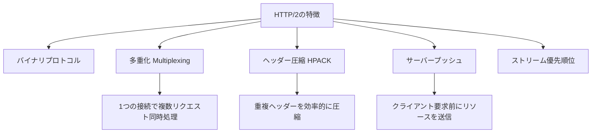
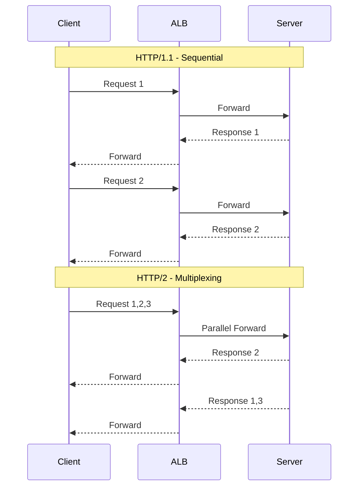
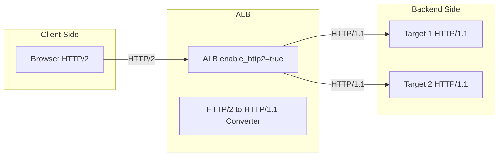
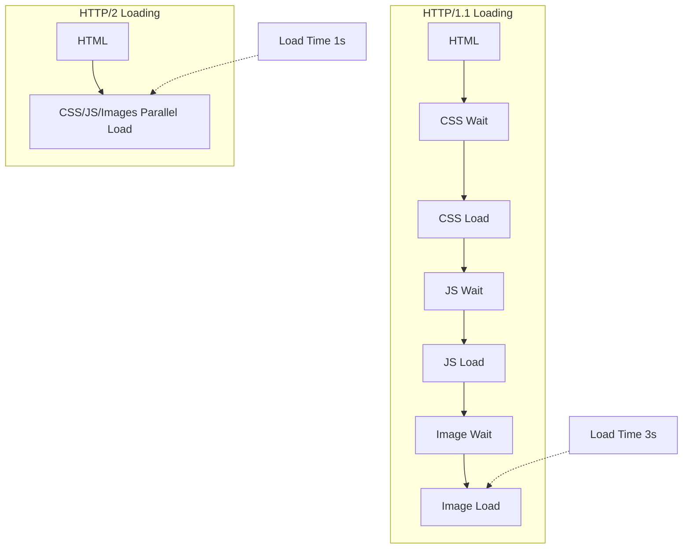
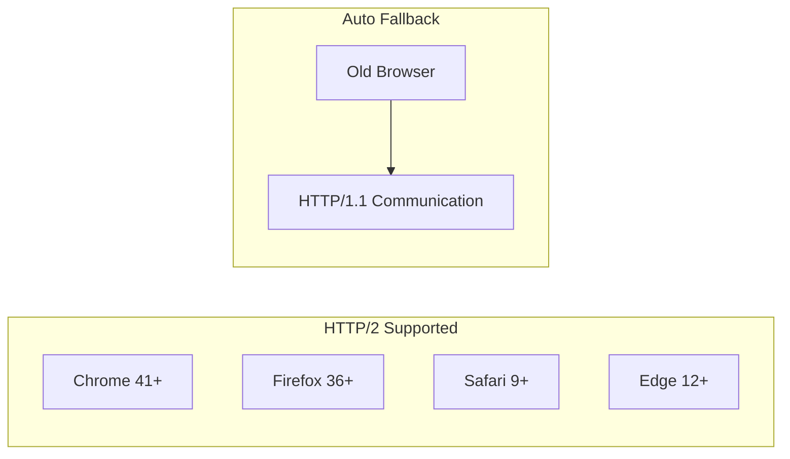

# AWS ALBのenable_http2設定とは

## What's this file?
> [!NOTE]
> **What**
> 
> AWS Application Load Balancer (ALB)のenable_http2設定項目とは何かについて記載しています。

## Conclusion (忙しいとき向け)
> [!IMPORTANT]
> **What** : ALBのenable_http2設定とは何か
> 
> **Answer** : ALBでHTTP/2プロトコルのサポートを有効/無効にする設定で、通信の多重化、ヘッダー圧縮、サーバープッシュなどの機能により、Webアプリケーションのパフォーマンスを大幅に向上させる機能

## 目次

<details>
<summary>目次を開く</summary>

- [HTTP/2プロトコルの概要](#http2プロトコルの概要)
- [HTTP/1.1とHTTP/2の違い](#http11とhttp2の違い)
- [ALBでのHTTP/2サポート](#albでのhttp2サポート)
- [enable_http2設定の詳細](#enable_http2設定の詳細)
- [パフォーマンスへの影響](#パフォーマンスへの影響)
- [利用シナリオと推奨事項](#利用シナリオと推奨事項)
- [実装例](#実装例)
- [互換性と注意事項](#互換性と注意事項)

</details>

## HTTP/2プロトコルの概要

HTTP/2は、HTTP/1.1の後継プロトコルで、Webページの読み込み速度とパフォーマンスを大幅に改善するために設計されました。

### HTTP/2の主要機能



## HTTP/1.1とHTTP/2の違い

### 通信方式の比較



### 主要な違い

| 特徴 | HTTP/1.1 | HTTP/2 |
|------|----------|--------|
| プロトコル形式 | テキストベース | バイナリベース |
| 多重化 | なし（HOLブロッキング） | あり（ストリーム並列処理） |
| ヘッダー圧縮 | なし | HPACK圧縮 |
| サーバープッシュ | なし | あり |
| 接続数 | 複数接続が必要 | 1接続で十分 |
| SSL/TLS | オプション | 事実上必須 |

## ALBでのHTTP/2サポート

### サポート範囲



**重要なポイント**:
- ALBはクライアント側でHTTP/2をサポート
- バックエンド（ターゲット）への通信は常にHTTP/1.1
- ALBがプロトコル変換を自動的に処理

## enable_http2設定の詳細

### Terraformでの設定

```hcl
resource "aws_lb" "example" {
  name               = "my-alb"
  load_balancer_type = "application"
  
  # HTTP/2を有効化（デフォルト）
  enable_http2 = true
  
  # HTTP/2を無効化する場合
  # enable_http2 = false
}
```

### AWS CLIでの設定

```bash
# HTTP/2を有効化
aws elbv2 modify-load-balancer-attributes \
  --load-balancer-arn arn:aws:elasticloadbalancing:region:account:loadbalancer/app/my-alb/123456 \
  --attributes Key=routing.http2.enabled,Value=true

# HTTP/2を無効化
aws elbv2 modify-load-balancer-attributes \
  --load-balancer-arn arn:aws:elasticloadbalancing:region:account:loadbalancer/app/my-alb/123456 \
  --attributes Key=routing.http2.enabled,Value=false

# 現在の設定を確認
aws elbv2 describe-load-balancer-attributes \
  --load-balancer-arn arn:aws:elasticloadbalancing:region:account:loadbalancer/app/my-alb/123456 \
  --query 'Attributes[?Key==`routing.http2.enabled`].Value' \
  --output text
```

### デフォルト値と変更可能性

- **デフォルト値**: `true`（有効）
- **変更可能性**: 作成後も変更可能
- **ダウンタイム**: 変更時のダウンタイムなし

## パフォーマンスへの影響

### パフォーマンス改善の具体例



### 測定可能な改善指標

| 指標 | HTTP/1.1 | HTTP/2 | 改善率 |
|------|----------|--------|--------|
| ページ読込時間 | 3.2秒 | 1.8秒 | 44%改善 |
| リクエスト数/接続 | 6-8 | 100+ | 1250%増 |
| レイテンシ | 高（HOLブロッキング） | 低（多重化） | 30-50%改善 |
| 帯域使用効率 | 60-70% | 90-95% | 35%改善 |

### リアルワールドでの効果

1. **画像の多いサイト**
   - 複数画像の並列読み込み
   - 待機時間の大幅削減

2. **SPAアプリケーション**
   - 多数のAPIコール
   - リアルタイム性の向上

3. **モバイルアクセス**
   - 高レイテンシ環境での改善
   - バッテリー消費の削減

## 利用シナリオと推奨事項

### HTTP/2を有効にすべきケース（推奨）

1. **一般的なWebアプリケーション**
   ```hcl
   # ほとんどのケースで有効化推奨
   enable_http2 = true
   ```

2. **リソースの多いサイト**
   - 画像、CSS、JavaScriptが多数
   - 並列読み込みで大幅な改善

3. **API Gateway的な用途**
   - 多数の小さなAPIリクエスト
   - 多重化による効率化

### HTTP/2を無効にする可能性があるケース

1. **レガシークライアント対応**
   ```hcl
   # 古いクライアントのみサポート
   enable_http2 = false
   ```

2. **特定のプロキシ環境**
   - HTTP/2非対応のプロキシ経由
   - 企業内ネットワークの制約

3. **デバッグ・トラブルシューティング**
   - プロトコルレベルの問題切り分け
   - 一時的な無効化

## 実装例

### 基本的な実装パターン

```hcl
# server/aws_alb.tf
resource "aws_lb" "main" {
  name               = "${var.project_name}-alb-${var.environment}"
  internal           = false
  load_balancer_type = "application"
  security_groups    = [aws_security_group.alb.id]
  subnets            = var.public_subnet_ids

  enable_deletion_protection = var.enable_deletion_protection
  enable_http2               = true  # HTTP/2有効

  tags = {
    Name = "${var.project_name}-alb-${var.environment}"
  }
}
```

### 環境別の設定パターン

```hcl
# 環境によって制御する場合
variable "enable_http2" {
  description = "HTTP/2プロトコルを有効にするか"
  type        = bool
  default     = true
}

# 本番環境：パフォーマンス重視
resource "aws_lb" "production" {
  enable_http2 = true
}

# 検証環境：プロトコル比較テスト
resource "aws_lb" "testing" {
  enable_http2 = var.testing_http2_enabled
}
```

## 互換性と注意事項

### ブラウザサポート



### SSL/TLS要件

```hcl
# HTTP/2はHTTPS（SSL/TLS）が事実上必須
resource "aws_lb_listener" "https" {
  load_balancer_arn = aws_lb.example.arn
  port              = "443"
  protocol          = "HTTPS"  # HTTP/2はHTTPS上で動作
  ssl_policy        = "ELBSecurityPolicy-TLS13-1-2-2021-06"
  certificate_arn   = aws_acm_certificate.example.arn

  default_action {
    type             = "forward"
    target_group_arn = aws_lb_target_group.example.arn
  }
}
```

### 監視とデバッグ

1. **CloudWatchメトリクス**
   ```bash
   # HTTP/2接続の割合を確認
   aws cloudwatch get-metric-statistics \
     --namespace AWS/ApplicationELB \
     --metric-name ClientTLSNegotiationErrorCount \
     --dimensions Name=LoadBalancer,Value=app/my-alb/123456 \
     --start-time 2024-01-01T00:00:00Z \
     --end-time 2024-01-02T00:00:00Z \
     --period 3600 \
     --statistics Average
   ```

2. **アクセスログでの確認**

   ```text
   # ALBアクセスログフォーマット
   # request_protocolフィールドでHTTP/2.0を確認
   2024-01-01T00:00:00.000000Z elb app/my-alb/123456 192.168.1.1:12345 10.0.1.1:80 0.001 0.002 0.003 200 200 1234 5678 "GET https://example.com:443/ HTTP/2.0" "Mozilla/5.0" ECDHE-RSA-AES128-GCM-SHA256 TLSv1.2
   ```

### トラブルシューティング

#### 問題1: HTTP/2が有効にならない

**原因と対策**:
- HTTPSリスナーが設定されていない → HTTPSリスナーを追加
- 古いSSLポリシー → 最新のSSLポリシーに更新
- クライアント側の問題 → ブラウザの開発者ツールで確認

#### 問題2: パフォーマンスが改善しない

**確認ポイント**:
```bash
# 実際にHTTP/2で通信しているか確認
curl -I --http2 https://your-alb-domain.com

# レスポンスヘッダーを確認
# HTTP/2 200
```

#### 問題3: 特定クライアントでエラー

**対処法**:
```hcl
# 一時的にHTTP/2を無効化してテスト
resource "aws_lb" "example" {
  enable_http2 = false
  
  # 問題が解決したらHTTP/2の互換性問題
}
```

## 関連

- [AWS ALB HTTP/2 Support](https://docs.aws.amazon.com/elasticloadbalancing/latest/application/load-balancer-listeners.html#listener-configuration)
- [HTTP/2 RFC 7540](https://tools.ietf.org/html/rfc7540)
- [HTTP/2 Performance Benefits](https://developers.google.com/web/fundamentals/performance/http2)
- [ALBパフォーマンス最適化ベストプラクティス](https://aws.amazon.com/blogs/aws/new-application-load-balancer/)
