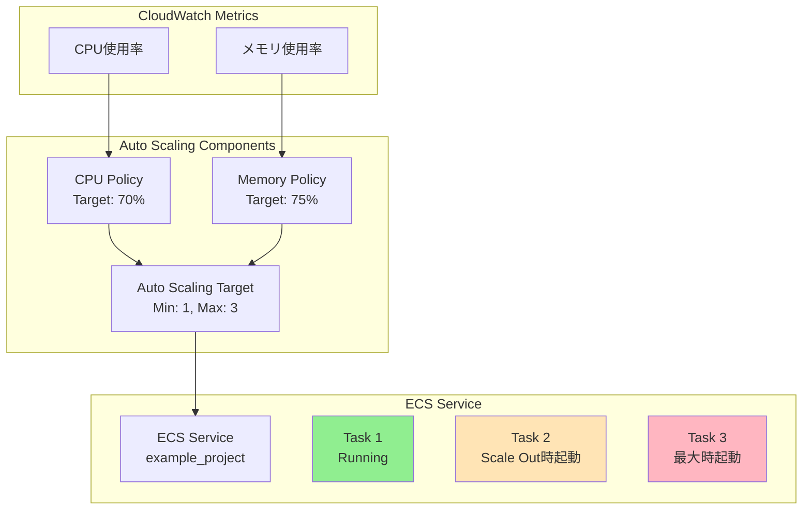
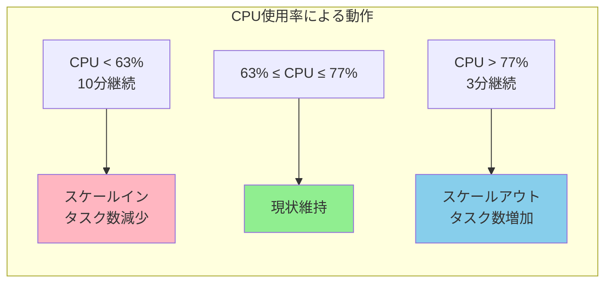
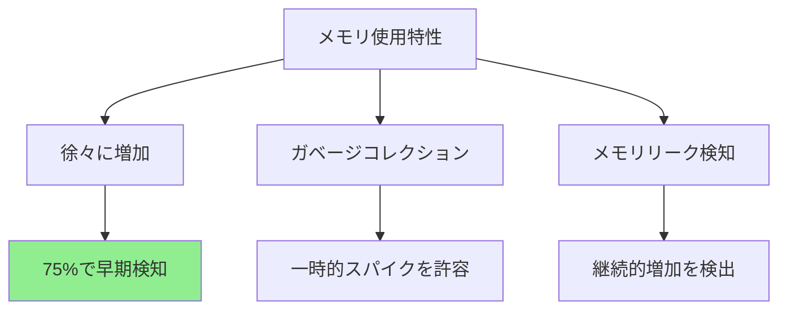
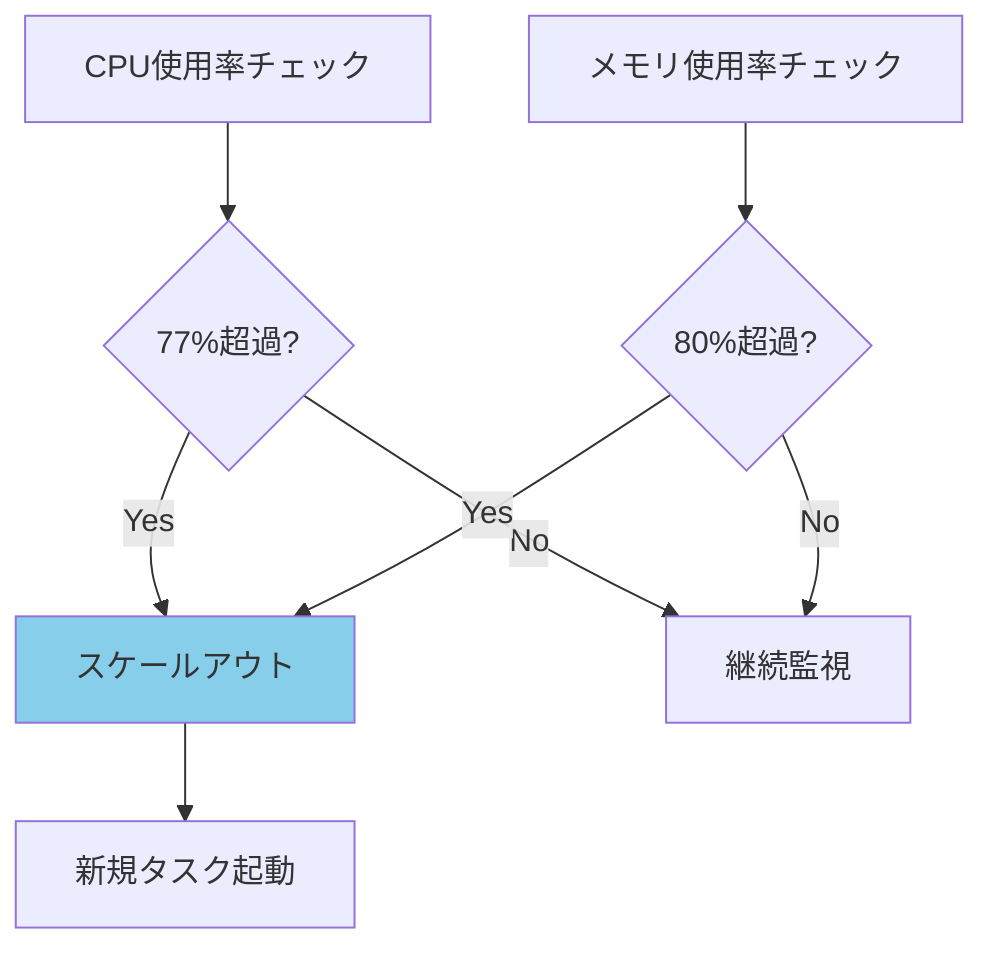
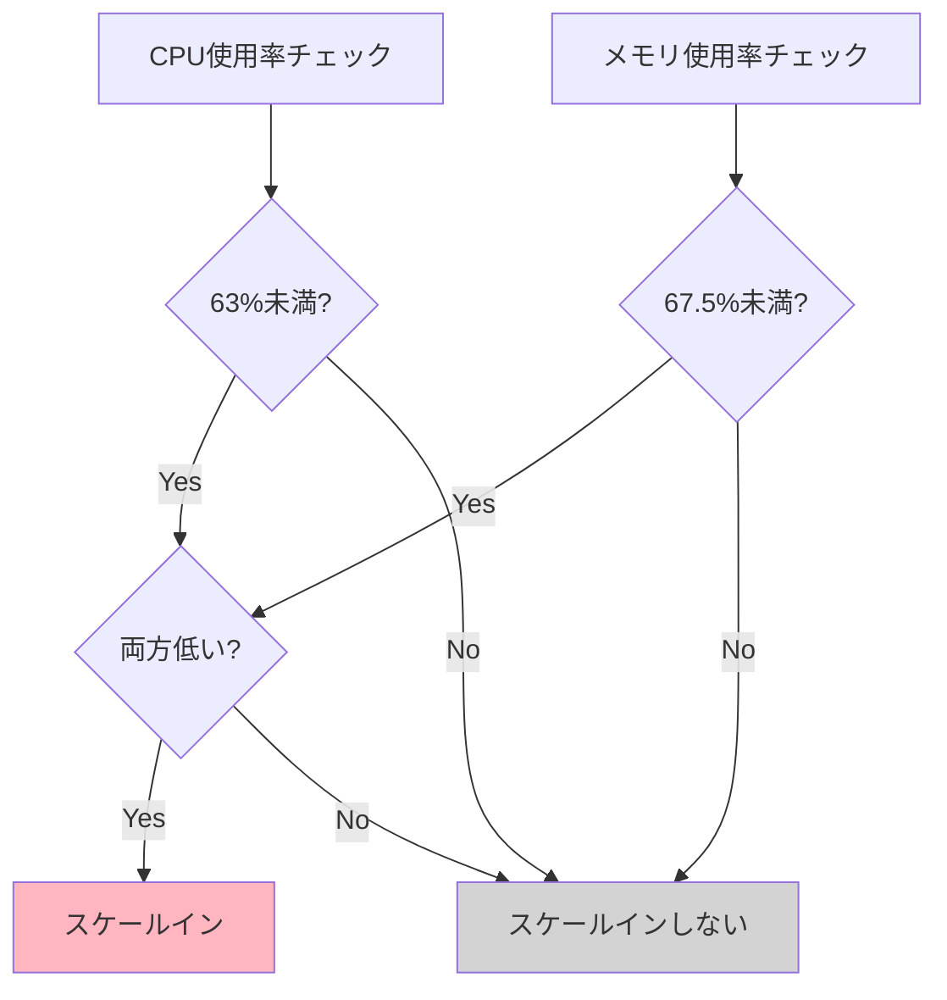
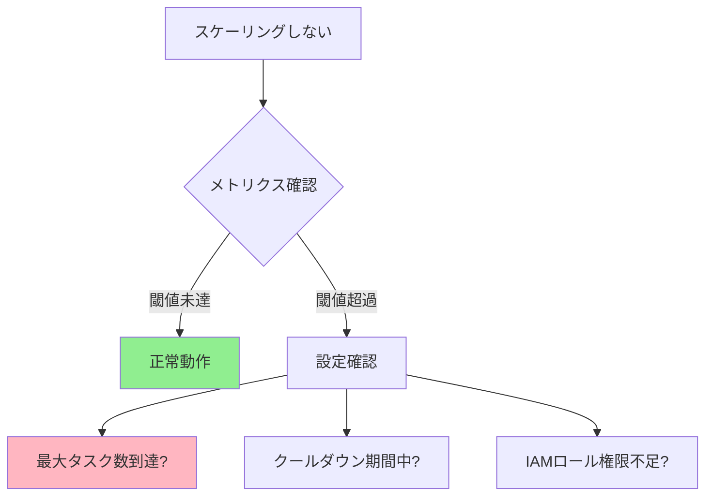

# AWS ECS Auto ScalingのTerraform実装パターン

## What's this file?
> [!NOTE]
> **How**
> 
> どのようにTerraformでECS Auto Scalingポリシーを実装するかについて記載しています。

## Conclusion (忙しいとき向け)
> [!IMPORTANT]
> **How** : どのようにECS Auto Scalingを実装するか
> 
> **Answer** : Target Tracking Scalingポリシーを使用し、CPUやメモリ使用率を閾値に自動スケーリングを実現する実装パターン

## 目次

<details>
<summary>目次を開く</summary>

- [Auto Scaling構成の全体像](#auto-scaling構成の全体像)
- [実装されている3つのリソース](#実装されている3つのリソース)
- [Auto Scaling Targetの設定](#auto-scaling-targetの設定)
- [CPUベースのスケーリングポリシー](#cpuベースのスケーリングポリシー)
- [メモリベースのスケーリングポリシー](#メモリベースのスケーリングポリシー)
- [2つのポリシーの連携動作](#2つのポリシーの連携動作)
- [プロジェクト固有の設定値と理由](#プロジェクト固有の設定値と理由)
- [監視とトラブルシューティング](#監視とトラブルシューティング)

</details>

## Auto Scaling構成の全体像

### アーキテクチャ図



### 実装ファイル構成

```
server/
├── aws_ecs_service.tf           # ECSサービス定義
├── aws_ecs_autoscaling.tf       # Auto Scaling設定（このファイル）
│   ├── Auto Scaling Target
│   ├── CPU Policy
│   └── Memory Policy
└── aws_ecs_task_definition.tf   # タスク定義
```

## 実装されている3つのリソース

### 1. Auto Scaling Target（スケーリング対象）

```hcl
resource "aws_appautoscaling_target" "ecs_target" {
  max_capacity       = 3    # 最大タスク数
  min_capacity       = 1    # 最小タスク数
  resource_id        = "service/${aws_ecs_cluster.example_project.name}/${aws_ecs_service.example_project.name}"
  scalable_dimension = "ecs:service:DesiredCount"
  service_namespace  = "ecs"

  depends_on = [aws_ecs_service.example_project]
}
```

### 2. CPUスケーリングポリシー

```hcl
resource "aws_appautoscaling_policy" "ecs_policy_cpu" {
  name               = "${var.project_name}-cpu-autoscaling-${var.environment}"
  policy_type        = "TargetTrackingScaling"
  # ... (Target設定参照)
}
```

### 3. メモリスケーリングポリシー

```hcl
resource "aws_appautoscaling_policy" "ecs_policy_memory" {
  name               = "${var.project_name}-memory-autoscaling-${var.environment}"
  policy_type        = "TargetTrackingScaling"
  # ... (Target設定参照)
}
```

## Auto Scaling Targetの設定

### 設定パラメータの詳細

| パラメータ | 設定値 | 説明 |
|-----------|--------|------|
| `max_capacity` | 3 | スケールアウトの上限 |
| `min_capacity` | 1 | スケールインの下限 |
| `resource_id` | 動的生成 | `service/クラスター名/サービス名` |
| `scalable_dimension` | `ecs:service:DesiredCount` | ECSサービスのタスク数を調整 |
| `service_namespace` | `ecs` | ECSサービスを対象 |

### resource_idの構成

```
service/${aws_ecs_cluster.example_project.name}/${aws_ecs_service.example_project.name}
↓
service/example-project-stg/example-project-stg
```

### 依存関係の重要性

```hcl
depends_on = [aws_ecs_service.example_project]
```

ECSサービスが作成された後にAuto Scalingを設定する必要があるため、明示的な依存関係を定義。

## CPUベースのスケーリングポリシー

### ポリシー設定の詳細

```hcl
target_tracking_scaling_policy_configuration {
  predefined_metric_specification {
    predefined_metric_type = "ECSServiceAverageCPUUtilization"
  }
  
  target_value = 70.0  # CPU使用率70%を維持
}
```

### スケーリング動作



### 70%を選択した理由

1. **安定性**: 瞬間的なスパイクでスケーリングしない
2. **レスポンス**: 高負荷になる前に対応開始
3. **コスト**: 過剰なリソース確保を防止

## メモリベースのスケーリングポリシー

### ポリシー設定の詳細

```hcl
target_tracking_scaling_policy_configuration {
  predefined_metric_specification {
    predefined_metric_type = "ECSServiceAverageMemoryUtilization"
  }
  
  target_value = 75.0  # メモリ使用率75%を維持
}
```

### メモリ特有の考慮事項



## 2つのポリシーの連携動作

### どちらかの条件でスケールアウト



### スケールインは両方の条件を満たす必要



## プロジェクト固有の設定値と理由

### タスク数の設定根拠

| 環境 | 最小 | 最大 | 理由 |
|------|------|------|------|
| ステージング | 1 | 3 | コスト優先、検証用途 |
| 本番（想定） | 2 | 5 | 可用性優先、負荷分散 |

### 現在の設定（ステージング環境）

```hcl
# 最小1タスク：コスト最適化
min_capacity = 1

# 最大3タスク：想定負荷の3倍まで対応
max_capacity = 3

# CPU 70%：安定運用とレスポンスのバランス
target_value = 70.0  # CPU

# メモリ 75%：メモリリークの早期発見
target_value = 75.0  # Memory
```

### ユースケース別の推奨設定

| ユースケース | CPU閾値 | メモリ閾値 | 特徴 |
|-------------|---------|-----------|------|
| 一般的なWebアプリ | 70-80% | 75-85% | バランス重視 |
| APIサービス | 60-70% | 70-80% | レスポンス重視 |
| バッチ処理 | 80-90% | 80-90% | コスト重視 |
| リアルタイム処理 | 50-60% | 60-70% | 低レイテンシ重視 |

## 監視とトラブルシューティング

### CloudWatchでの監視

```bash
# スケーリング履歴の確認
aws application-autoscaling describe-scaling-activities \
  --service-namespace ecs \
  --resource-id service/example-project-stg/example-project-stg \
  --max-results 10

# 現在のスケーリング状態
aws ecs describe-services \
  --cluster example-project-stg \
  --services example-project-stg \
  --query 'services[0].{desired:desiredCount,running:runningCount,pending:pendingCount}'
```

### メトリクスの確認

```bash
# CPU使用率の確認
aws cloudwatch get-metric-statistics \
  --namespace AWS/ECS \
  --metric-name CPUUtilization \
  --dimensions Name=ServiceName,Value=example-project-stg \
               Name=ClusterName,Value=example-project-stg \
  --start-time $(date -u -d '1 hour ago' +%Y-%m-%dT%H:%M:%S) \
  --end-time $(date -u +%Y-%m-%dT%H:%M:%S) \
  --period 300 \
  --statistics Average
```

### よくある問題と対処

#### 1. スケーリングが発生しない



#### 2. 頻繁なスケーリング（フラッピング）

**対処法**:
- Target Tracking Scalingは自動的にクールダウンを管理
- スケールアウト：3分のウォームアップ
- スケールイン：15分のクールダウン

#### 3. デバッグコマンド

```bash
# Auto Scalingポリシーの詳細確認
aws application-autoscaling describe-scaling-policies \
  --service-namespace ecs \
  --resource-id service/example-project-stg/example-project-stg

# アラーム状態の確認
aws cloudwatch describe-alarms \
  --alarm-name-prefix "TargetTracking-service/example-project"
```

### ベストプラクティス

1. **段階的な調整**
   ```hcl
   # 初期は控えめに設定
   target_value = 80.0  # 開始時
   # 運用データを見て調整
   target_value = 70.0  # 最適化後
   ```

2. **アラートの設定**
   ```hcl
   # 別途CloudWatchアラームを設定
   resource "aws_cloudwatch_metric_alarm" "high_cpu" {
     alarm_name          = "${var.project_name}-high-cpu-${var.environment}"
     comparison_operator = "GreaterThanThreshold"
     evaluation_periods  = "2"
     metric_name         = "CPUUtilization"
     namespace           = "AWS/ECS"
     period              = "300"
     statistic           = "Average"
     threshold           = "90"
     alarm_description   = "This metric monitors ECS CPU utilization"
   }
   ```

3. **コスト監視**
   - タスク数 × 実行時間でコスト計算
   - 不要な時間帯のスケールダウン検討

## 関連

- [AWS Auto Scaling Documentation](https://docs.aws.amazon.com/autoscaling/application/userguide/application-auto-scaling-target-tracking.html)
- [ECS Service Auto Scaling](https://docs.aws.amazon.com/AmazonECS/latest/developerguide/service-auto-scaling.html)
- [Terraform aws_appautoscaling_policy](https://registry.terraform.io/providers/hashicorp/aws/latest/docs/resources/appautoscaling_policy)
- [ECS Auto Scaling Best Practices](https://aws.amazon.com/blogs/containers/amazon-ecs-auto-scaling-best-practices/)