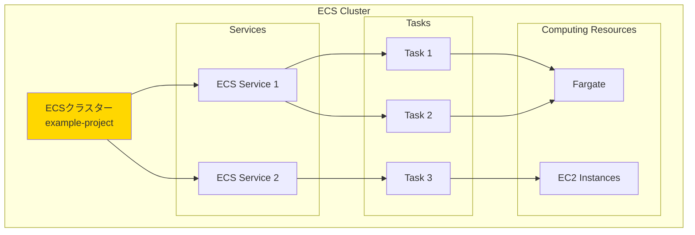
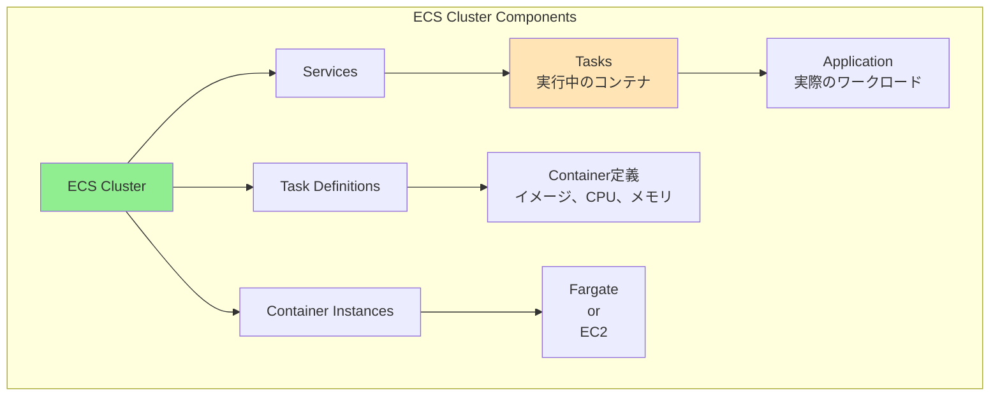
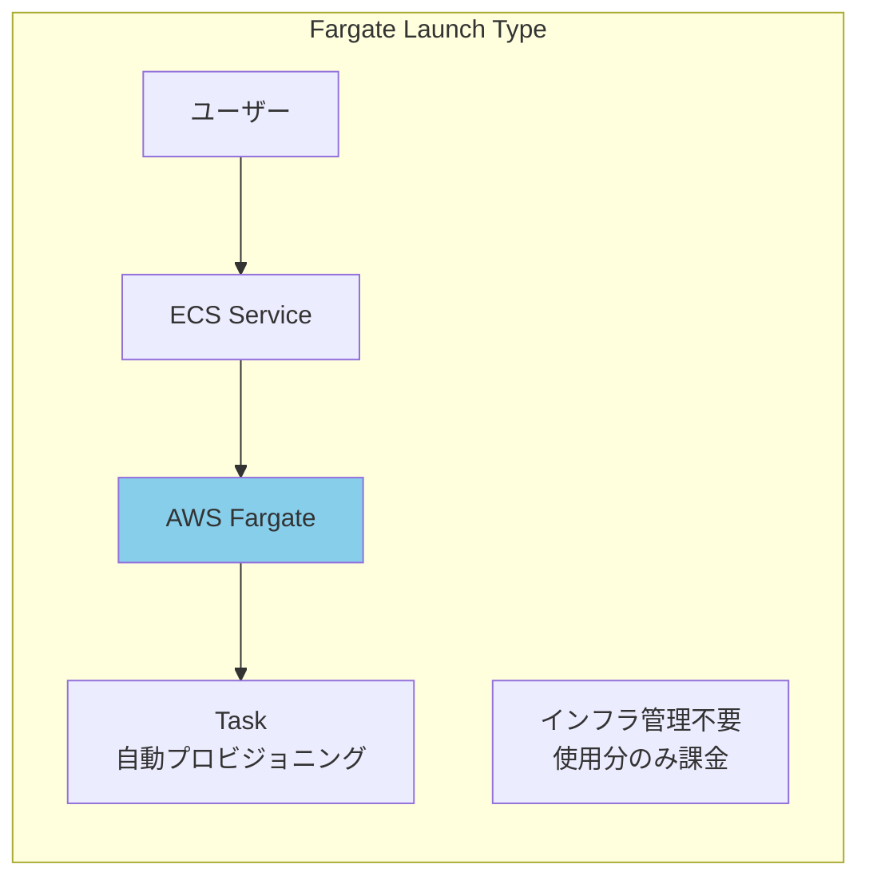
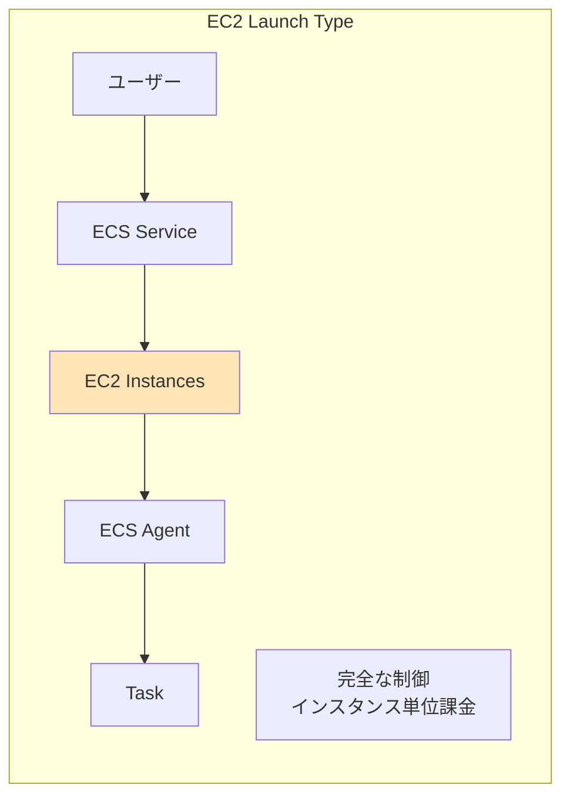
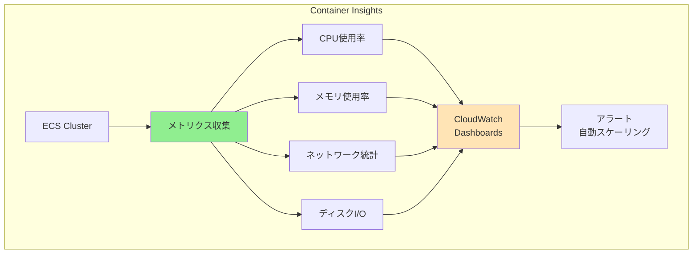
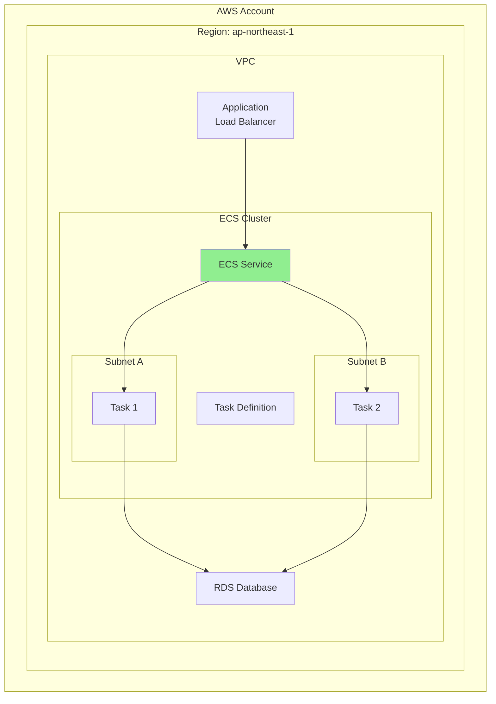
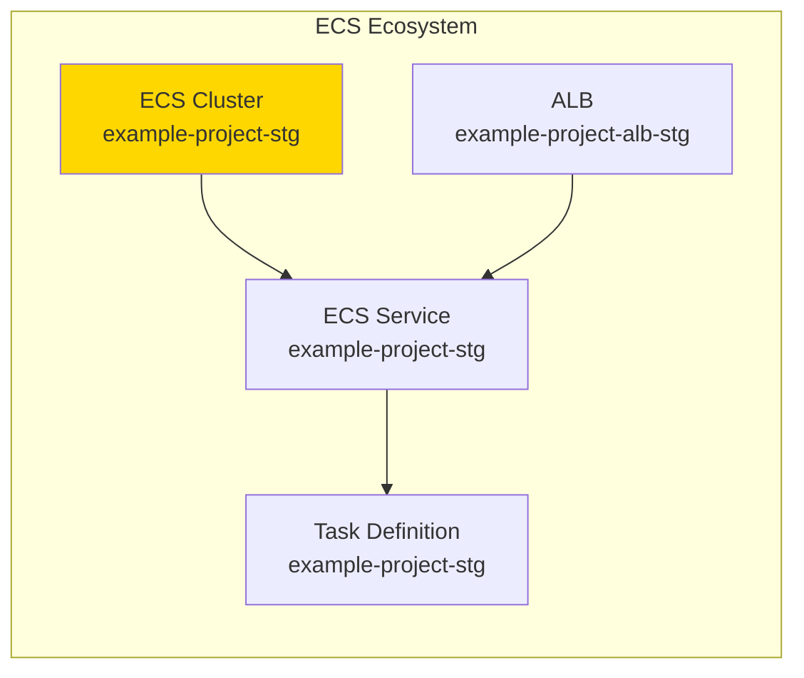

# AWS ECSクラスターリソースとは

## What's this file?
> [!NOTE]
> **What**
> 
> AWS ECS（Elastic Container Service）クラスターリソースとは何かについて記載しています。

## Conclusion (忙しいとき向け)
> [!IMPORTANT]
> **What** : AWS ECSクラスターとは何か
> 
> **Answer** : コンテナ化されたアプリケーションを実行するためのリソースの論理的なグループで、EC2インスタンスやFargateなどのコンピューティングリソースとタスク、サービスを管理する基盤となるリソース

## 目次

<details>
<summary>目次を開く</summary>

- [ECSクラスターの概要](#ecsクラスターの概要)
- [クラスターの構成要素](#クラスターの構成要素)
- [2つの起動タイプ](#2つの起動タイプ)
- [Terraformでの基本設定](#terraformでの基本設定)
- [Container Insights設定](#container-insights設定)
- [クラスターの階層構造](#クラスターの階層構造)
- [ネーミング戦略](#ネーミング戦略)
- [プロジェクトでの実装例](#プロジェクトでの実装例)

</details>

## ECSクラスターの概要

ECSクラスターは、AWS上でDockerコンテナを実行・管理するための基盤となるリソースです。

### 基本的な役割



### 主な機能

1. **リソース管理**: コンテナを実行するコンピューティングリソースの管理
2. **タスク配置**: どのリソースでタスクを実行するかの決定
3. **サービス管理**: 長期実行タスクの管理とヘルスチェック
4. **スケーリング**: リソースの自動拡張・縮小
5. **監視**: CloudWatchとの統合による監視

## クラスターの構成要素

### 論理的な構成



### 各要素の説明

| 要素 | 説明 | 例 |
|------|------|-----|
| **Cluster** | 最上位の管理単位 | example-project-stg |
| **Service** | タスクの実行と維持を管理 | web-service |
| **Task** | 実行中のコンテナのインスタンス | web-task-123 |
| **Task Definition** | コンテナの設計図 | web-app:1 |
| **Container Instance** | タスクを実行するリソース | Fargate or EC2 |

## 2つの起動タイプ

### Fargate起動タイプ（サーバーレス）



**特徴**:
- サーバー管理不要
- タスク単位での課金
- 自動スケーリング
- セキュリティパッチ自動適用

### EC2起動タイプ



**特徴**:
- EC2インスタンスの完全制御
- GPUインスタンス利用可能
- 既存のEC2料金体系
- カスタマイズ可能

## Terraformでの基本設定

### 最小構成

```hcl
resource "aws_ecs_cluster" "minimal" {
  name = "my-cluster"
}
```

### 標準的な構成

```hcl
resource "aws_ecs_cluster" "standard" {
  name = "${var.project_name}-${var.environment}"

  setting {
    name  = "containerInsights"
    value = "enabled"
  }

  tags = {
    Name        = "${var.project_name}-cluster-${var.environment}"
    Environment = var.environment
    Project     = var.project_name
  }
}
```

### 高度な構成

```hcl
resource "aws_ecs_cluster" "advanced" {
  name = "${var.project_name}-${var.environment}"

  # Container Insights有効化
  setting {
    name  = "containerInsights"
    value = "enabled"
  }

  # デフォルトキャパシティプロバイダー戦略
  default_capacity_provider_strategy {
    capacity_provider = "FARGATE"
    weight            = 100
    base              = 0
  }

  # 暗号化設定
  configuration {
    execute_command_configuration {
      kms_key_id = aws_kms_key.ecs.arn
      logging    = "OVERRIDE"

      log_configuration {
        cloud_watch_encryption_enabled = true
        cloud_watch_log_group_name     = aws_cloudwatch_log_group.ecs_exec.name
      }
    }
  }

  tags = {
    Name        = "${var.project_name}-cluster-${var.environment}"
    Environment = var.environment
    ManagedBy   = "Terraform"
  }
}
```

## Container Insights設定

### Container Insightsとは



### 設定方法

```hcl
setting {
  name  = "containerInsights"
  value = var.container_insights_enabled ? "enabled" : "disabled"
}
```

### 有効化のメリット

| メトリクス | 説明 | 用途 |
|-----------|------|------|
| CPU使用率 | タスク/サービスレベルのCPU | スケーリング判断 |
| メモリ使用率 | 実際のメモリ消費量 | リソース最適化 |
| ネットワーク | 送受信バイト数 | トラフィック分析 |
| タスク数 | 実行中/保留中のタスク | 可用性監視 |

### コスト考慮

```hcl
# 環境別の設定例
variable "container_insights_enabled" {
  description = "Container Insightsを有効にするか"
  type        = bool
  default     = {
    dev  = false  # 開発環境：コスト削減
    stg  = true   # ステージング：本番同等
    prod = true   # 本番：完全監視
  }
}
```

## クラスターの階層構造

### 全体アーキテクチャ



### リソースの関係性

1. **1つのAWSアカウント** → 複数のリージョン
2. **1つのリージョン** → 複数のクラスター
3. **1つのクラスター** → 複数のサービス
4. **1つのサービス** → 複数のタスク
5. **1つのタスク** → 複数のコンテナ

## ネーミング戦略

### 推奨される命名規則

```hcl
# パターン1: プロジェクト-環境
name = "${var.project_name}-${var.environment}"
# 例: example-project-stg

# パターン2: プロジェクト-用途-環境
name = "${var.project_name}-${var.purpose}-${var.environment}"
# 例: example-project-web-prod

# パターン3: 組織-プロジェクト-環境
name = "${var.org}-${var.project_name}-${var.environment}"
# 例: example-project-platform-dev
```

### タグ戦略

```hcl
tags = {
  Name        = "${var.project_name}-cluster-${var.environment}"
  Environment = var.environment
  Project     = var.project_name
  ManagedBy   = "Terraform"
  CostCenter  = var.cost_center
  Owner       = var.team_name
}
```

## プロジェクトでの実装例

### 現在の設定（example-project）

```hcl
resource "aws_ecs_cluster" "example_project" {
  name = "${var.project_name}-${var.environment}"
  # 実際の値: example-project-stg

  setting {
    name  = "containerInsights"
    value = var.container_insights_enabled ? "enabled" : "disabled"
    # ステージング環境: enabled
  }

  tags = {
    Name = "${var.project_name}-cluster-${var.environment}"
    # 実際の値: example-project-cluster-stg
  }
}
```

### 設定の意図

1. **シンプルな構成**
   - Fargate専用（EC2インスタンス管理不要）
   - 最小限の設定で運用

2. **Container Insights有効**
   - パフォーマンス監視
   - トラブルシューティング支援

3. **環境別管理**
   - ワークスペースによる環境分離
   - 命名規則による識別性向上

### 関連リソースとの連携



### ベストプラクティス

1. **1環境1クラスター**
   ```hcl
   # ステージング用クラスター
   resource "aws_ecs_cluster" "staging" {
     name = "myapp-staging"
   }
   
   # 本番用クラスター（別途作成）
   resource "aws_ecs_cluster" "production" {
     name = "myapp-production"
   }
   ```

2. **監視の有効化**
   ```hcl
   # 本番環境は必須
   setting {
     name  = "containerInsights"
     value = "enabled"
   }
   ```

3. **タグによる管理**
   - コスト配分
   - アクセス制御
   - 自動化ツールとの連携

## 関連

- [AWS ECS Documentation](https://docs.aws.amazon.com/AmazonECS/latest/developerguide/Welcome.html)
- [ECS Cluster Configuration](https://docs.aws.amazon.com/AmazonECS/latest/developerguide/clusters.html)
- [Container Insights](https://docs.aws.amazon.com/AmazonCloudWatch/latest/monitoring/ContainerInsights.html)
- [Terraform aws_ecs_cluster Resource](https://registry.terraform.io/providers/hashicorp/aws/latest/docs/resources/ecs_cluster)