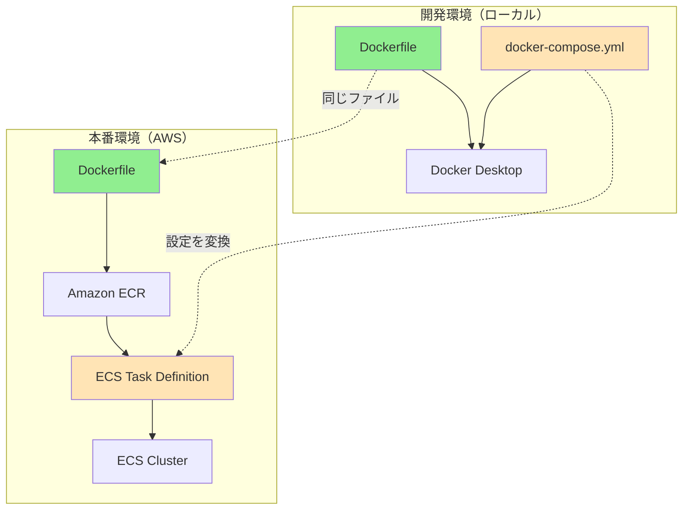
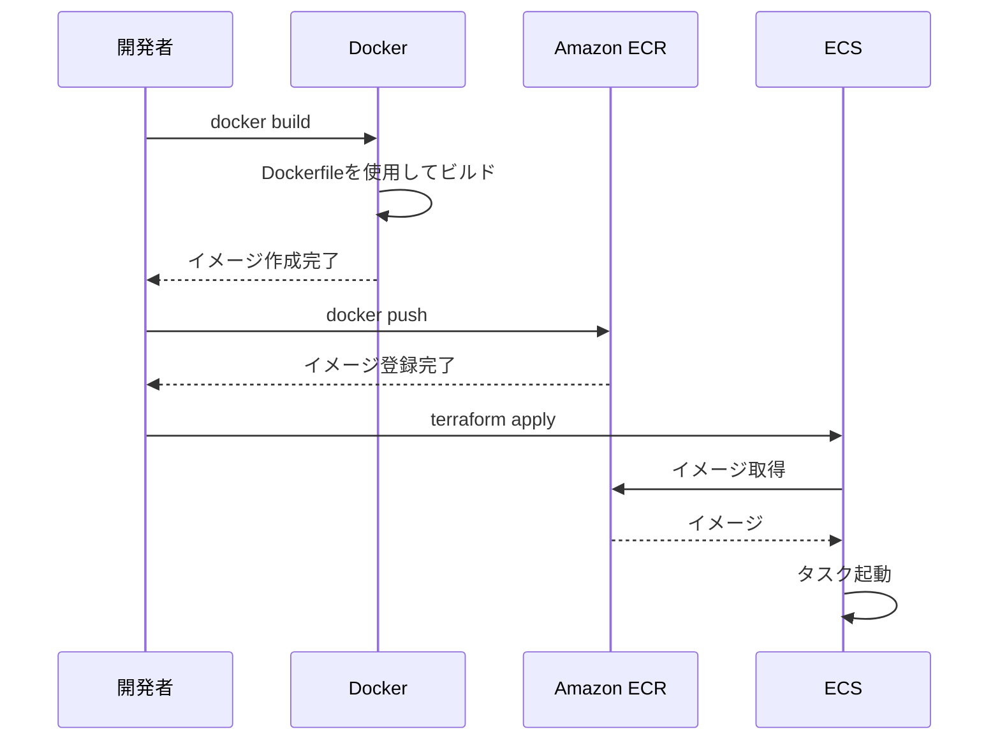
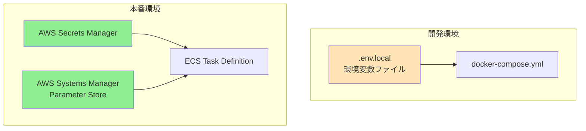

# DockerとECSを連携させる方法

## What's this file?
> [!NOTE]
> **How**
> 
> どのようにDockerファイル（Dockerfile、docker-compose.yml）とECSを連携させて使用するかについて記載しています。

## Conclusion (忙しいとき向け)
> [!IMPORTANT]
> **How** : どのようにDockerとECSを連携させるか
> 
> **Answer** : 開発環境ではDockerfileとdocker-compose.ymlを使用し、本番環境ではDockerfileでビルドしたイメージをECRにプッシュして、ECSタスク定義で実行する、という環境別の使い分けで連携

## 目次

<details>
<summary>目次を開く</summary>

- [開発環境と本番環境の違い](#開発環境と本番環境の違い)
- [Dockerファイルの役割](#dockerファイルの役割)
- [ECSでの実行フロー](#ecsでの実行フロー)
- [docker-compose.ymlからECSタスク定義への変換](#docker-composeymlからecsタスク定義への変換)
- [実装例：Dockerfileの作成](#実装例dockerfileの作成)
- [実装例：docker-compose.ymlの作成](#実装例docker-composeymlの作成)
- [実装例：ECSタスク定義との対応](#実装例ecsタスク定義との対応)
- [ベストプラクティス](#ベストプラクティス)

</details>

## 開発環境と本番環境の違い

### 環境別の使用ツール



### 各環境の特徴

| 環境 | 使用ツール | 用途 | 管理方法 |
|------|-----------|------|----------|
| 開発環境 | Docker Desktop | 高速な開発サイクル | docker-compose.yml |
| ステージング | ECS | 本番同等のテスト | Terraform |
| 本番環境 | ECS | 実際のサービス提供 | Terraform |

## Dockerファイルの役割

### Dockerfile：共通のイメージ定義

```dockerfile
# 開発・本番共通のDockerfile
FROM node:18-alpine AS base

# 依存関係インストール用ステージ
FROM base AS deps
WORKDIR /app
COPY package*.json ./
RUN npm ci

# ビルド用ステージ
FROM base AS builder
WORKDIR /app
COPY --from=deps /app/node_modules ./node_modules
COPY . .
RUN npm run build

# 実行用ステージ
FROM base AS runner
WORKDIR /app

ENV NODE_ENV production

# 必要なファイルのみコピー
COPY --from=builder /app/public ./public
COPY --from=builder /app/.next/standalone ./
COPY --from=builder /app/.next/static ./.next/static

EXPOSE 3000
ENV PORT 3000

CMD ["node", "server.js"]
```

### docker-compose.yml：開発環境の構成

```yaml
version: '3.8'

services:
  app:
    build:
      context: .
      dockerfile: Dockerfile
      target: builder  # 開発用ステージを使用
    ports:
      - "3000:3000"
    environment:
      NODE_ENV: development
      DATABASE_URL: postgresql://user:password@db:5432/example_project
    volumes:
      - .:/app
      - /app/node_modules
    command: npm run dev
    depends_on:
      - db

  db:
    image: postgres:15
    environment:
      POSTGRES_USER: user
      POSTGRES_PASSWORD: password
      POSTGRES_DB: example_project
    volumes:
      - postgres_data:/var/lib/postgresql/data
    ports:
      - "5432:5432"

volumes:
  postgres_data:
```

## ECSでの実行フロー

### イメージのビルドとデプロイ



### 実際のコマンド例

```bash
# 1. Dockerイメージのビルド
docker build -t example-project:latest .

# 2. ECRへのログイン
aws ecr get-login-password --region ap-northeast-1 | \
  docker login --username AWS --password-stdin \
  123456789012.dkr.ecr.ap-northeast-1.amazonaws.com

# 3. タグ付け
docker tag example-project:latest \
  123456789012.dkr.ecr.ap-northeast-1.amazonaws.com/example-project:latest

# 4. ECRへプッシュ
docker push \
  123456789012.dkr.ecr.ap-northeast-1.amazonaws.com/example-project:latest

# 5. ECSサービスの更新
aws ecs update-service \
  --cluster example-project-stg \
  --service example-project-stg \
  --force-new-deployment
```

## docker-compose.ymlからECSタスク定義への変換

### 対応関係のマッピング

| docker-compose.yml | ECSタスク定義 | 説明 |
|-------------------|---------------|------|
| `services` | `container_definitions` | コンテナの定義 |
| `image` | `image` | 使用するイメージ |
| `ports` | `portMappings` | ポートマッピング |
| `environment` | `environment` | 環境変数 |
| `volumes` | `mountPoints` + `volumes` | ボリューム設定 |
| `depends_on` | （ECSサービスで管理） | 依存関係 |
| `command` | `command` | 実行コマンド |
| `healthcheck` | `healthCheck` | ヘルスチェック |

### 変換例

```yaml
# docker-compose.yml
services:
  app:
    image: myapp:latest
    ports:
      - "3000:3000"
    environment:
      NODE_ENV: production
      PORT: 3000
```

↓ 変換

```hcl
# ECSタスク定義
container_definitions = jsonencode([
  {
    name  = "app"
    image = "${aws_ecr_repository.myapp.repository_url}:latest"
    
    portMappings = [
      {
        containerPort = 3000
        protocol      = "tcp"
      }
    ]
    
    environment = [
      {
        name  = "NODE_ENV"
        value = "production"
      },
      {
        name  = "PORT"
        value = "3000"
      }
    ]
  }
])
```

## 実装例：Dockerfileの作成

### Next.js用のDockerfile

```dockerfile
# Multi-stage build for Next.js
FROM node:18-alpine AS base

# Install dependencies only when needed
FROM base AS deps
RUN apk add --no-cache libc6-compat
WORKDIR /app

# Install dependencies based on the preferred package manager
COPY package.json yarn.lock* package-lock.json* pnpm-lock.yaml* ./
RUN \
  if [ -f yarn.lock ]; then yarn --frozen-lockfile; \
  elif [ -f package-lock.json ]; then npm ci; \
  elif [ -f pnpm-lock.yaml ]; then yarn global add pnpm && pnpm i --frozen-lockfile; \
  else echo "Lockfile not found." && exit 1; \
  fi

# Rebuild the source code only when needed
FROM base AS builder
WORKDIR /app
COPY --from=deps /app/node_modules ./node_modules
COPY . .

# Next.js collects completely anonymous telemetry data about general usage.
ENV NEXT_TELEMETRY_DISABLED 1

RUN npm run build

# Production image, copy all the files and run next
FROM base AS runner
WORKDIR /app

ENV NODE_ENV production
ENV NEXT_TELEMETRY_DISABLED 1

RUN addgroup --system --gid 1001 nodejs
RUN adduser --system --uid 1001 nextjs

COPY --from=builder /app/public ./public

# Automatically leverage output traces to reduce image size
COPY --from=builder --chown=nextjs:nodejs /app/.next/standalone ./
COPY --from=builder --chown=nextjs:nodejs /app/.next/static ./.next/static

USER nextjs

EXPOSE 3000

ENV PORT 3000

CMD ["node", "server.js"]
```

## 実装例：docker-compose.ymlの作成

### フルスタックアプリケーション用

```yaml
version: '3.8'

services:
  # Next.jsアプリケーション
  app:
    build:
      context: .
      dockerfile: Dockerfile
      target: builder
    ports:
      - "3000:3000"
    environment:
      NODE_ENV: development
      DATABASE_URL: postgresql://postgres:password@db:5432/example_project
      NEXTAUTH_URL: http://localhost:3000
      NEXTAUTH_SECRET: development-secret
    volumes:
      - .:/app
      - /app/node_modules
      - /app/.next
    command: npm run dev
    depends_on:
      db:
        condition: service_healthy

  # PostgreSQLデータベース
  db:
    image: postgres:15-alpine
    environment:
      POSTGRES_USER: postgres
      POSTGRES_PASSWORD: password
      POSTGRES_DB: example_project
    volumes:
      - postgres_data:/var/lib/postgresql/data
    ports:
      - "5432:5432"
    healthcheck:
      test: ["CMD-SHELL", "pg_isready -U postgres"]
      interval: 10s
      timeout: 5s
      retries: 5

  # Redis（セッション管理用）
  redis:
    image: redis:7-alpine
    ports:
      - "6379:6379"
    volumes:
      - redis_data:/data

  # 開発用メールサーバー
  mailhog:
    image: mailhog/mailhog
    ports:
      - "1025:1025" # SMTP
      - "8025:8025" # Web UI

volumes:
  postgres_data:
  redis_data:
```

## 実装例：ECSタスク定義との対応

### プロジェクトのECSタスク定義

```hcl
resource "aws_ecs_task_definition" "example_project" {
  family                   = "${var.project_name}-${var.environment}"
  network_mode             = "awsvpc"
  requires_compatibilities = ["FARGATE"]
  cpu                      = "1024"
  memory                   = "2048"
  execution_role_arn       = aws_iam_role.ecs_task_execution.arn
  task_role_arn            = aws_iam_role.ecs_task.arn

  container_definitions = jsonencode([
    {
      name  = "${var.project_name}-${var.environment}"
      image = "${aws_ecr_repository.example_project.repository_url}:latest"

      portMappings = [
        {
          containerPort = 3000
          protocol      = "tcp"
        }
      ]

      healthCheck = {
        command     = ["CMD-SHELL", "curl -f http://localhost:3000/api/health || exit 1"]
        interval    = 30
        timeout     = 5
        retries     = 3
        startPeriod = 60
      }

      environment = [
        {
          name  = "NODE_ENV"
          value = var.node_env
        },
        {
          name  = "PORT"
          value = "3000"
        }
      ]

      secrets = [
        {
          name      = "DATABASE_URL"
          valueFrom = aws_secretsmanager_secret.db_connection_string.arn
        },
        {
          name      = "NEXTAUTH_SECRET"
          valueFrom = aws_secretsmanager_secret.nextauth_secret.arn
        }
      ]

      logConfiguration = {
        logDriver = "awslogs"
        options = {
          awslogs-group         = aws_cloudwatch_log_group.ecs_example_project.name
          awslogs-region        = var.region
          awslogs-stream-prefix = "ecs"
        }
      }
    }
  ])
}
```

## ベストプラクティス

### 1. 環境変数の管理



### 2. イメージサイズの最適化

```dockerfile
# マルチステージビルドの活用
FROM node:18-alpine AS deps
# 依存関係のみ

FROM node:18-alpine AS builder
# ビルドステージ

FROM node:18-alpine AS runner
# 最小限の実行環境
```

### 3. セキュリティの考慮

1. **非rootユーザーでの実行**
   ```dockerfile
   RUN adduser -D appuser
   USER appuser
   ```

2. **最新のベースイメージ使用**
   ```dockerfile
   FROM node:18-alpine@sha256:...
   ```

3. **不要なファイルの除外**
   ```dockerfile
   # .dockerignore
   node_modules
   .env
   .git
   ```

### 4. 開発と本番の設定分離

```yaml
# docker-compose.yml（開発用）
version: '3.8'
services:
  app:
    build:
      target: development
    volumes:
      - .:/app

# docker-compose.prod.yml（本番相当）
version: '3.8'
services:
  app:
    build:
      target: production
    restart: always
```

### 5. CI/CDパイプラインの構築

```yaml
# GitHub Actions例
name: Deploy to ECS
on:
  push:
    branches: [main]

jobs:
  deploy:
    runs-on: ubuntu-latest
    steps:
      - uses: actions/checkout@v3
      
      - name: Configure AWS credentials
        uses: aws-actions/configure-aws-credentials@v1
        with:
          aws-access-key-id: ${{ secrets.AWS_ACCESS_KEY_ID }}
          aws-secret-access-key: ${{ secrets.AWS_SECRET_ACCESS_KEY }}
          aws-region: ap-northeast-1

      - name: Login to Amazon ECR
        id: login-ecr
        uses: aws-actions/amazon-ecr-login@v1

      - name: Build and push image
        env:
          ECR_REGISTRY: ${{ steps.login-ecr.outputs.registry }}
          ECR_REPOSITORY: example-project
          IMAGE_TAG: ${{ github.sha }}
        run: |
          docker build -t $ECR_REGISTRY/$ECR_REPOSITORY:$IMAGE_TAG .
          docker push $ECR_REGISTRY/$ECR_REPOSITORY:$IMAGE_TAG

      - name: Update ECS service
        run: |
          aws ecs update-service \
            --cluster example-project-prod \
            --service example-project-prod \
            --force-new-deployment
```

## 関連

- [Docker Documentation](https://docs.docker.com/)
- [AWS ECS Documentation](https://docs.aws.amazon.com/AmazonECS/latest/developerguide/Welcome.html)
- [Docker Compose to ECS](https://docs.docker.com/cloud/ecs-integration/)
- [ECR Best Practices](https://docs.aws.amazon.com/AmazonECR/latest/userguide/security-best-practices.html)