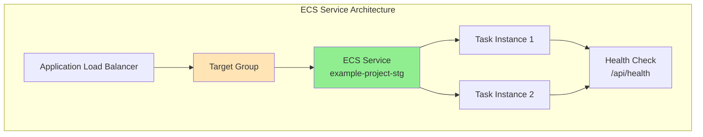
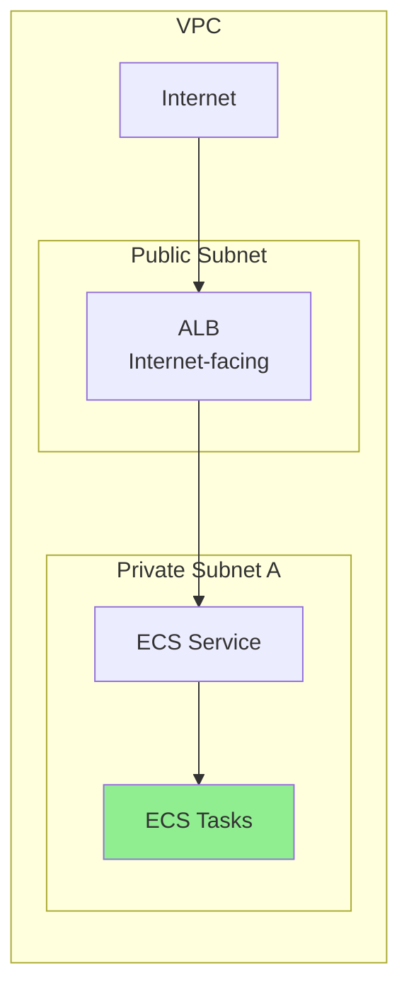
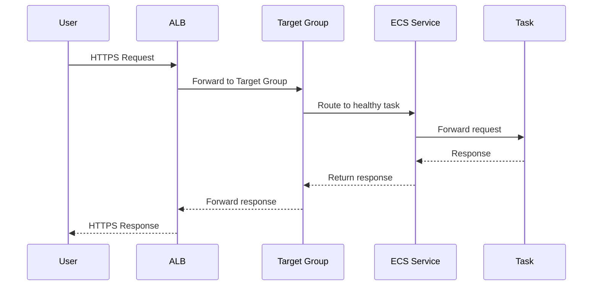
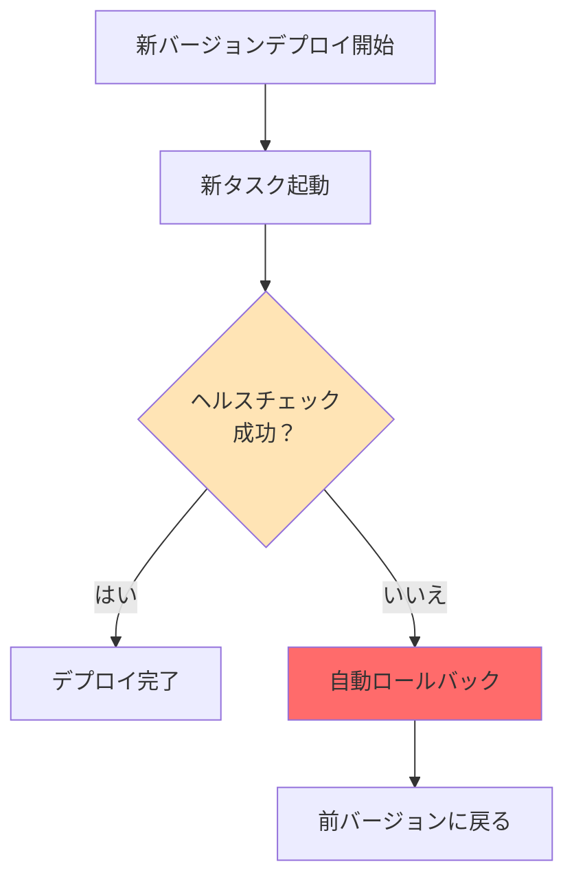
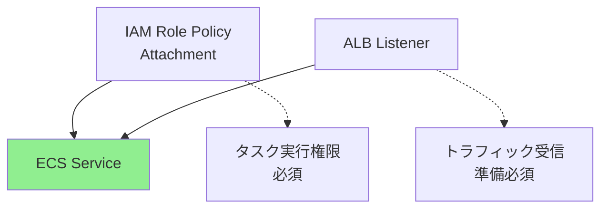
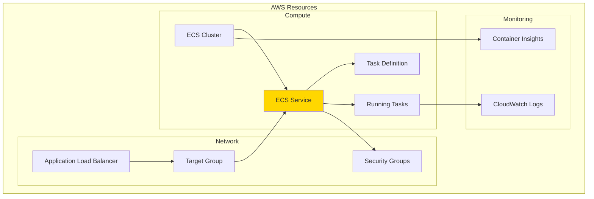

# ECSサービスリソースの設定方法

## What's this file?
> [!NOTE]
> **How**
> 
> どのようにプロジェクトでECSサービスリソースを設定するかについて記載しています。

## Conclusion (忙しいとき向け)
> [!IMPORTANT]
> **How** : どのようにECSサービスを設定するか
> 
> **Answer** : Fargateタイプでプライベートサブネット内に配置し、ALBとの連携、自動デプロイメント保護、ヘルスチェックを含む本番向けの堅牢な設定を実装

## 目次

<details>
<summary>目次を開く</summary>

- [ECSサービスの概要](#ecsサービスの概要)
- [プロジェクトでの設定内容](#プロジェクトでの設定内容)
- [ネットワーク構成](#ネットワーク構成)
- [ロードバランサー連携](#ロードバランサー連携)
- [デプロイメント保護機能](#デプロイメント保護機能)
- [依存関係の管理](#依存関係の管理)
- [設定パラメータ詳細](#設定パラメータ詳細)
- [関連リソースとの連携](#関連リソースとの連携)

</details>

## ECSサービスの概要

ECSサービスは、指定された数のタスクを常に実行し続けることを保証するリソースです。



## プロジェクトでの設定内容

### 実際のECSサービス定義

```hcl
resource "aws_ecs_service" "example_project" {
  name            = "${var.project_name}-${var.environment}"
  cluster         = aws_ecs_cluster.example_project.id
  task_definition = aws_ecs_task_definition.example_project.arn
  desired_count   = var.desired_count
  launch_type     = "FARGATE"

  network_configuration {
    subnets          = [aws_subnet.private_app_a.id]
    security_groups  = [aws_security_group.example_ecs_tasks.id]
    assign_public_ip = false
  }

  load_balancer {
    target_group_arn = aws_lb_target_group.example_project.arn
    container_name   = "${var.project_name}-${var.environment}"
    container_port   = var.container_port
  }

  deployment_circuit_breaker {
    enable   = true
    rollback = true
  }

  depends_on = [
    aws_lb_listener.example_project,
    aws_iam_role_policy_attachment.ecs_task_execution
  ]

  tags = {
    Name = "${var.project_name}-service-${var.environment}"
  }
}
```

### 設定の特徴

1. **Fargate専用構成**
   - サーバーレスでインフラ管理不要
   - 自動スケーリング対応

2. **高可用性設計**
   - デプロイメント保護機能
   - 自動ロールバック

3. **セキュアな配置**
   - プライベートサブネット配置
   - パブリックIP割り当てなし

## ネットワーク構成

### サブネット配置戦略



### ネットワーク設定の詳細

```hcl
network_configuration {
  subnets          = [aws_subnet.private_app_a.id]  # プライベートサブネット
  security_groups  = [aws_security_group.example_ecs_tasks.id]
  assign_public_ip = false  # パブリックIP不要
}
```

**設定の意図**：
- **プライベートサブネット配置**: セキュリティ強化
- **パブリックIP不要**: ALB経由でのみアクセス可能
- **セキュリティグループ**: 必要最小限のアクセス制御

## ロードバランサー連携

### ALBとの統合設定

```hcl
load_balancer {
  target_group_arn = aws_lb_target_group.example_project.arn
  container_name   = "${var.project_name}-${var.environment}"
  container_port   = var.container_port  # 3000番ポート
}
```

### ターゲットグループのヘルスチェック

```hcl
# aws_lb_target_group.tfより
health_check {
  enabled             = true
  healthy_threshold   = 2
  interval            = 30
  matcher             = "200"
  path                = "/api/health"
  port                = "traffic-port"
  protocol            = "HTTP"
  timeout             = 5
  unhealthy_threshold = 2
}
```

### トラフィックフロー



## デプロイメント保護機能

### Circuit Breaker設定

```hcl
deployment_circuit_breaker {
  enable   = true
  rollback = true
}
```

### 動作の仕組み



### メリット

1. **ダウンタイム防止**
   - 失敗時の自動復旧
   - サービス継続性の確保

2. **デプロイリスク軽減**
   - 問題の早期検出
   - 自動的な安全策

## 依存関係の管理

### depends_on設定

```hcl
depends_on = [
  aws_lb_listener.example_project,
  aws_iam_role_policy_attachment.ecs_task_execution
]
```

### 依存関係の理由



## 設定パラメータ詳細

### 主要パラメータ一覧

| パラメータ | 説明 | 値の例 |
|-----------|------|--------|
| `name` | サービス名 | example-project-stg |
| `cluster` | 所属クラスター | ECSクラスターID |
| `task_definition` | 使用するタスク定義 | タスク定義ARN |
| `desired_count` | 希望タスク数 | 2 |
| `launch_type` | 起動タイプ | FARGATE |

### 変数による柔軟性

```hcl
# variables.tfでの定義
variable "desired_count" {
  description = "Number of tasks to run"
  type        = number
  default     = 2
}

variable "container_port" {
  description = "Container port"
  type        = number
  default     = 3000
}
```

## 関連リソースとの連携

### 全体アーキテクチャでの位置づけ



### 連携する主要リソース

1. **ECSクラスター** (`aws_ecs_cluster.example_project`)
   - サービスの実行基盤

2. **タスク定義** (`aws_ecs_task_definition.example_project`)
   - コンテナの設計図

3. **ALB** (`aws_lb.example_project`)
   - トラフィックの入り口

4. **ターゲットグループ** (`aws_lb_target_group.example_project`)
   - ヘルスチェックとルーティング

5. **セキュリティグループ** (`aws_security_group.example_ecs_tasks`)
   - ネットワークアクセス制御

### ベストプラクティス

1. **最小権限の原則**
   - 必要最小限のIAMロール
   - 制限的なセキュリティグループ

2. **高可用性設計**
   - 複数タスクの実行
   - 自動復旧機能

3. **監視とログ**
   - CloudWatch Logsへの出力
   - Container Insightsでの監視

4. **コスト最適化**
   - 適切なタスク数設定
   - Auto Scalingの活用

## 関連

- [AWS ECS Service Documentation](https://docs.aws.amazon.com/AmazonECS/latest/developerguide/ecs_services.html)
- [ECS Service Load Balancing](https://docs.aws.amazon.com/AmazonECS/latest/developerguide/service-load-balancing.html)
- [ECS Deployment Circuit Breaker](https://docs.aws.amazon.com/AmazonECS/latest/developerguide/deployment-circuit-breaker.html)
- [Terraform aws_ecs_service Resource](https://registry.terraform.io/providers/hashicorp/aws/latest/docs/resources/ecs_service)
- [AWS ECS Best Practices Guide](https://docs.aws.amazon.com/AmazonECS/latest/bestpracticesguide/)
- [ECS Task Definition Parameters](https://docs.aws.amazon.com/AmazonECS/latest/developerguide/task_definition_parameters.html)