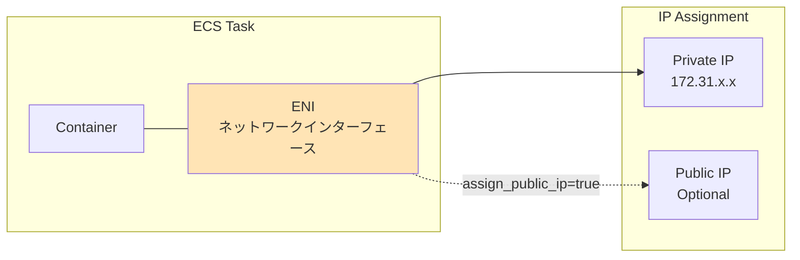
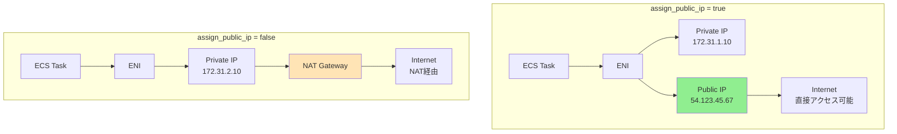
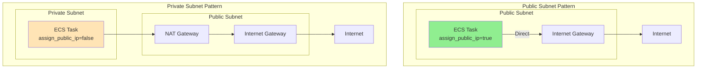
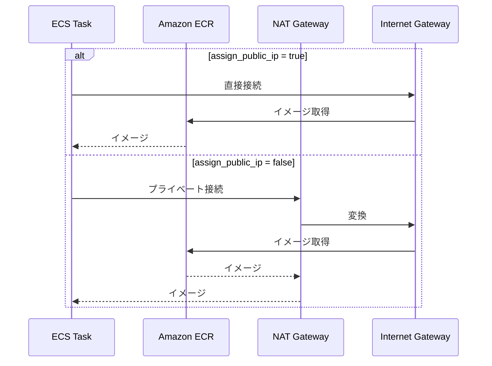
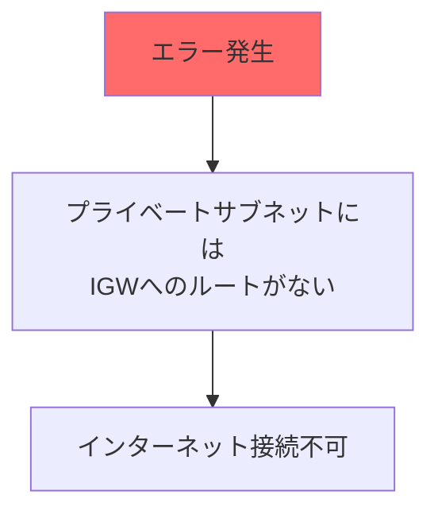
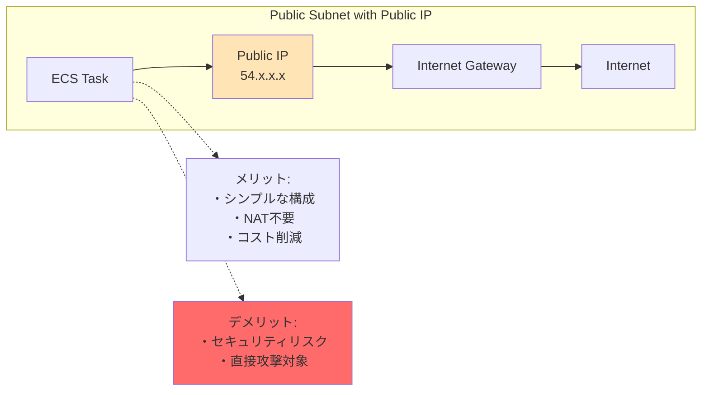
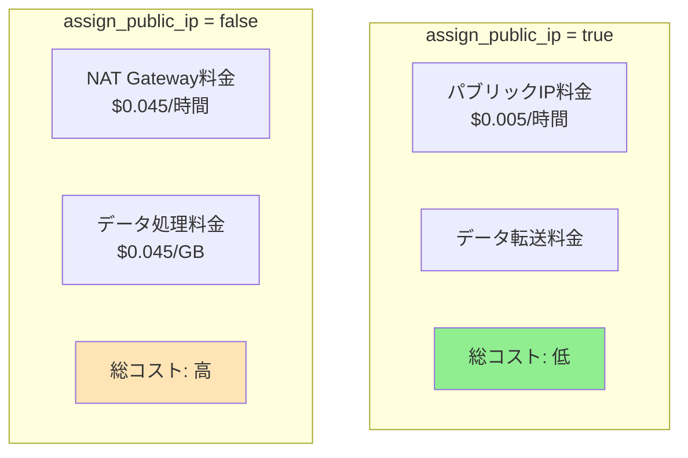

# ECSネットワーク設定のassign_public_ipプロパティとは

## What's this file?
> [!NOTE]
> **What**
> 
> ECSサービスのnetwork_configuration内のassign_public_ipプロパティとは何かについて記載しています。

## Conclusion (忙しいとき向け)
> [!IMPORTANT]
> **What** : assign_public_ipとは何か
> 
> **Answer** : ECSタスクのENI（Elastic Network Interface）にパブリックIPアドレスを割り当てるかどうかを制御するブール値設定で、インターネット接続方法を決定する重要なプロパティ

## 目次

<details>
<summary>目次を開く</summary>

- [assign_public_ipの概要](#assign_public_ipの概要)
- [設定値と動作](#設定値と動作)
- [ネットワークアーキテクチャへの影響](#ネットワークアーキテクチャへの影響)
- [プライベートサブネットでの設定](#プライベートサブネットでの設定)
- [パブリックサブネットでの設定](#パブリックサブネットでの設定)
- [セキュリティ考慮事項](#セキュリティ考慮事項)
- [コスト影響](#コスト影響)
- [ユースケース別の推奨設定](#ユースケース別の推奨設定)

</details>

## assign_public_ipの概要

`assign_public_ip`は、FargateタスクのENI（Elastic Network Interface）にパブリックIPアドレスを自動的に割り当てるかどうかを制御します。

```hcl
network_configuration {
  subnets          = [aws_subnet.private_app_a.id]
  security_groups  = [aws_security_group.example_ecs_tasks.id]
  assign_public_ip = false  # パブリックIPを割り当てない
}
```

### ENI（Elastic Network Interface）とは



## 設定値と動作

### 設定可能な値

| 値 | 説明 | 使用場面 |
|---|------|---------|
| `true` | パブリックIPを割り当てる | パブリックサブネット配置時 |
| `false` | パブリックIPを割り当てない | プライベートサブネット配置時 |

### 各設定での動作の違い



## ネットワークアーキテクチャへの影響

### インターネットアクセスパターン



### ECRイメージ取得への影響



## プライベートサブネットでの設定

### 推奨設定：false

```hcl
# プライベートサブネット配置時の設定
network_configuration {
  subnets          = [aws_subnet.private_app_a.id]
  assign_public_ip = false  # 必須
}
```

### 設定理由

1. **セキュリティ強化**
   - 外部から直接アクセス不可
   - ALB経由のみのアクセス

2. **NAT Gateway利用**
   - アウトバウンド通信はNAT経由
   - 統一されたIPアドレス管理

3. **ベストプラクティス準拠**
   - AWS推奨のセキュアな構成

### プライベートサブネットでtrueにした場合



## パブリックサブネットでの設定

### 設定オプション

```hcl
# パブリックサブネット配置時の選択肢
network_configuration {
  subnets          = [aws_subnet.public_a.id]
  assign_public_ip = true  # or false
}
```

### true設定時の特徴



## セキュリティ考慮事項

### セキュリティレベル比較

| 設定 | サブネット | セキュリティ | 推奨度 |
|-----|-----------|------------|--------|
| `false` | Private | 高（推奨） | ⭐⭐⭐ |
| `true` | Public | 中 | ⭐⭐ |
| `false` | Public | 高（NAT必要） | ⭐⭐ |
| `true` | Private | エラー | ❌ |

### セキュリティグループとの連携

```hcl
# assign_public_ip = false 時の典型的なSG設定
resource "aws_security_group" "ecs_tasks" {
  name_prefix = "ecs-tasks-"
  vpc_id      = aws_vpc.main.id

  # ALBからのみ許可
  ingress {
    from_port       = 3000
    to_port         = 3000
    protocol        = "tcp"
    security_groups = [aws_security_group.alb.id]
  }

  # アウトバウンドは全許可（NAT経由）
  egress {
    from_port   = 0
    to_port     = 0
    protocol    = "-1"
    cidr_blocks = ["0.0.0.0/0"]
  }
}
```

## コスト影響

### コスト比較



### 月額コスト例（1タスクの場合）

| 設定 | 構成 | 概算月額 |
|-----|------|---------|
| Public IP | タスク1台 | $3.60 |
| NAT Gateway | 共有利用 | $32.40 + データ転送料 |

## ユースケース別の推奨設定

### 1. Webアプリケーション（本番環境）

```hcl
# 推奨：プライベートサブネット + false
network_configuration {
  subnets          = [aws_subnet.private_app_a.id]
  assign_public_ip = false
}
```

**理由**：
- セキュリティ最優先
- ALB経由でのアクセス
- 予測可能なアウトバウンドIP

### 2. バッチ処理タスク

```hcl
# ケースバイケース
network_configuration {
  subnets          = var.batch_public_access ? 
                     [aws_subnet.public_a.id] : 
                     [aws_subnet.private_a.id]
  assign_public_ip = var.batch_public_access
}
```

**考慮点**：
- 外部APIアクセスの頻度
- セキュリティ要件
- コスト最適化

### 3. 開発環境

```hcl
# 柔軟に選択可能
network_configuration {
  subnets          = [aws_subnet.public_a.id]
  assign_public_ip = true  # シンプルさ優先
}
```

**理由**：
- 設定の簡素化
- コスト削減
- 迅速な開発

### ベストプラクティス

1. **本番環境**
   - 常に`false`設定
   - プライベートサブネット配置

2. **外部通信が必要な場合**
   - NAT Gateway経由
   - VPCエンドポイント活用

3. **監査とコンプライアンス**
   - パブリックIP割り当ての追跡
   - セキュリティグループの定期レビュー

## 関連

- [AWS ECS Task Networking](https://docs.aws.amazon.com/AmazonECS/latest/developerguide/task-networking.html)
- [AWS Fargate Task Networking](https://docs.aws.amazon.com/AmazonECS/latest/userguide/fargate-task-networking.html)
- [ECS Service Network Configuration](https://docs.aws.amazon.com/AmazonECS/latest/APIReference/API_NetworkConfiguration.html)
- [AWS VPC Design Patterns](https://docs.aws.amazon.com/vpc/latest/userguide/VPC_Scenarios.html)