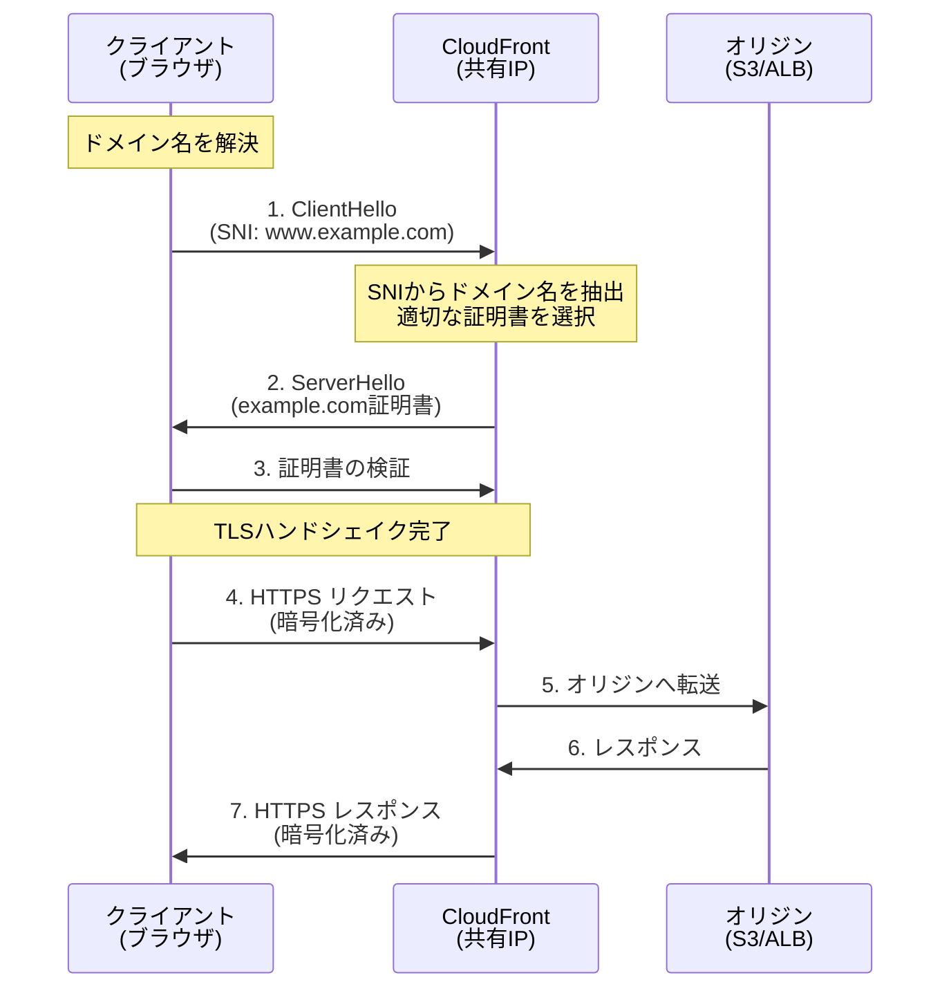
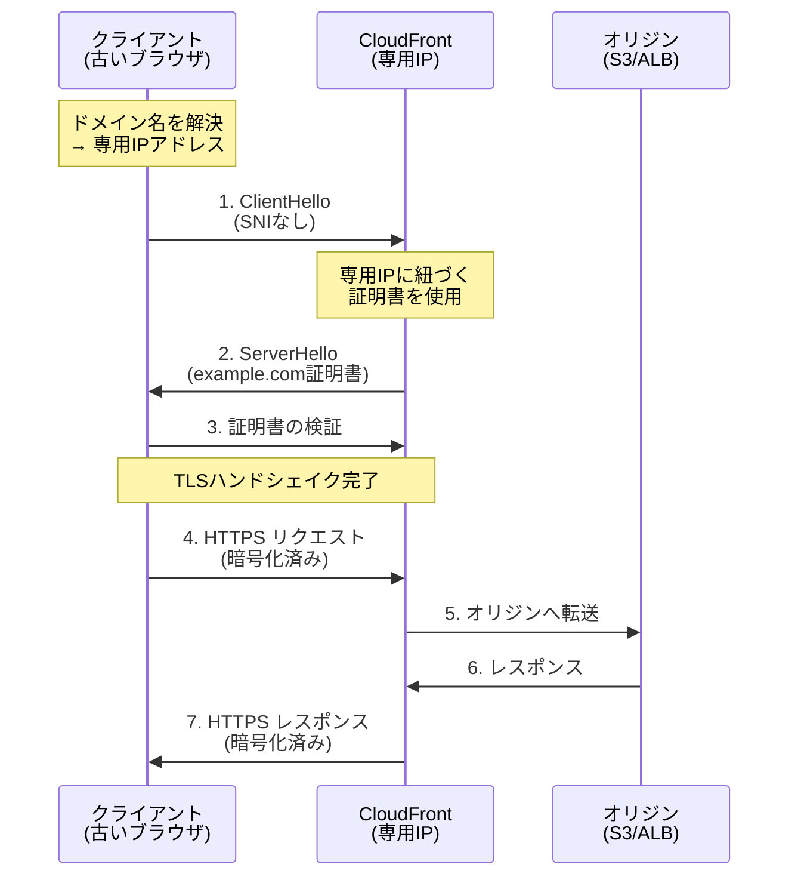
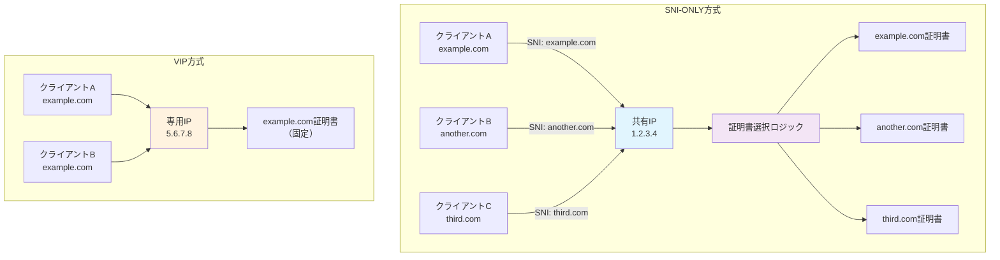

# CloudFront Distribution の ssl_support_method とは

## What's this file?
> [!NOTE]
> **What**
> 
> AWS CloudFront Distributionの`viewer_certificate`ブロック内の`ssl_support_method`プロパティとは何かについて記載しています。

## Conclusion (忙しいとき向け)
> [!IMPORTANT]
> **What** : CloudFrontのssl_support_methodとは何か
> 
> **Answer** : カスタムSSL証明書を使用する際のクライアントとの接続方法を指定する設定。"sni-only"（推奨）または"vip"から選択。

## 目次

<details>
<summary>目次を開く</summary>

- [1. 概要](#1-概要)
- [2. 設定値の種類](#2-設定値の種類)
  - [2.1 sni-only（Server Name Indication）](#21-sni-onlyserver-name-indication)
  - [2.2 vip（専用IPアドレス）](#22-vip専用ipアドレス)
- [3. SNIとは](#3-sniとは)
- [4. 設定例](#4-設定例)
- [5. 比較表](#5-比較表)
- [6. ブラウザサポート](#6-ブラウザサポート)
- [7. ベストプラクティス](#7-ベストプラクティス)
- [8. トラブルシューティング](#8-トラブルシューティング)

</details>

## 1. 概要

`ssl_support_method`は、CloudFront Distributionでカスタムドメイン名とSSL証明書を使用する際に、クライアントとの SSL/TLS 接続をどのように処理するかを指定する設定です。

主な特徴：
- カスタムドメイン（CNAME）使用時に必須
- SSL/TLSハンドシェイクの方法を決定
- コストとブラウザ互換性に影響

## 2. 設定値の種類

### 2.1 sni-only（Server Name Indication）

最も一般的で推奨される設定：

```hcl
viewer_certificate {
  acm_certificate_arn = aws_acm_certificate.cloudfront.arn
  ssl_support_method  = "sni-only"
}
```

**特徴：**
- 追加料金なし
- 1つのIPアドレスで複数のSSL証明書をホスト
- モダンなブラウザ・デバイスで広くサポート
- CloudFrontの共有IPアドレスを使用

### 2.2 vip（専用IPアドレス）

レガシーサポートが必要な場合の設定：

```hcl
viewer_certificate {
  acm_certificate_arn = aws_acm_certificate.cloudfront.arn
  ssl_support_method  = "vip"
}
```

**特徴：**
- 月額$600の追加料金（2024年時点）
- 専用IPアドレスを各エッジロケーションに割り当て
- 古いブラウザやデバイスもサポート
- SNI非対応のクライアントでも動作

## 3. SNIとは

**Server Name Indication (SNI)** は、TLSハンドシェイクの拡張機能です：

### 動作原理

#### SNI-ONLYの場合



#### VIPの場合



#### SNI vs VIP の違い



### SNIのメリット

- 1つのIPアドレスで複数のドメインをホスト
- リソースの効率的な利用
- コスト削減

## 4. 設定例

### 基本的な設定（推奨）

```hcl
resource "aws_cloudfront_distribution" "main" {
  # ... その他の設定 ...
  
  aliases = ["www.example.com"]
  
  viewer_certificate {
    acm_certificate_arn = aws_acm_certificate.main.arn
    ssl_support_method  = "sni-only"
    minimum_protocol_version = "TLSv1.2_2021"
  }
}
```

### 複数ドメインの設定

```hcl
resource "aws_cloudfront_distribution" "multi_domain" {
  # ... その他の設定 ...
  
  aliases = [
    "www.example.com",
    "api.example.com",
    "cdn.example.com"
  ]
  
  viewer_certificate {
    acm_certificate_arn = aws_acm_certificate.wildcard.arn
    ssl_support_method  = "sni-only"
  }
}
```

### レガシーサポート（VIP）

```hcl
resource "aws_cloudfront_distribution" "legacy_support" {
  # ... その他の設定 ...
  
  viewer_certificate {
    acm_certificate_arn = aws_acm_certificate.main.arn
    ssl_support_method  = "vip"  # 高額な追加料金に注意
  }
}
```

## 5. 比較表

| 項目 | sni-only | vip |
|------|----------|-----|
| **月額料金** | 無料 | $600 |
| **IPアドレス** | 共有 | 専用 |
| **ブラウザサポート** | モダンブラウザ | 全ブラウザ |
| **Android対応** | 4.0以降 | 全バージョン |
| **Windows XP IE** | 非対応 | 対応 |
| **設定の複雑さ** | シンプル | シンプル |
| **推奨度** | ★★★★★ | ★★☆☆☆ |

## 6. ブラウザサポート

### SNI対応ブラウザ

- Chrome: 全バージョン
- Firefox: 2.0以降
- Safari: macOS 10.6以降、iOS 4以降
- Edge: 全バージョン
- Internet Explorer: Windows Vista以降のIE7+

### SNI非対応の主なケース

- Windows XP上のInternet Explorer
- Android 2.x
- Java 6以前
- 一部の古い組み込みシステム

## 7. ベストプラクティス

### 1. デフォルトは sni-only

```hcl
# ほとんどの場合、これで十分
viewer_certificate {
  acm_certificate_arn = aws_acm_certificate.main.arn
  ssl_support_method  = "sni-only"
}
```

### 2. プロトコルバージョンも指定

```hcl
viewer_certificate {
  acm_certificate_arn      = aws_acm_certificate.main.arn
  ssl_support_method       = "sni-only"
  minimum_protocol_version = "TLSv1.2_2021"  # セキュリティ強化
}
```

### 3. アクセスログで確認

```hcl
logging_config {
  include_cookies = false
  bucket          = aws_s3_bucket.logs.bucket_domain_name
  prefix          = "cloudfront/"
}
```

### 4. コスト管理

VIPを使用する場合の判断基準：
- ビジネス要件で必須か
- 対象ユーザーのブラウザ統計
- ROIの検証

## 8. トラブルシューティング

### 問題1: SSL証明書エラー

**症状**: 一部の古いブラウザでSSL証明書エラー

**原因**: SNI非対応のブラウザ

**解決方法**:
1. アクセスログを分析
2. 影響を受けるユーザー数を確認
3. 必要に応じてVIPを検討（コストに注意）

### 問題2: 設定変更が反映されない

**症状**: ssl_support_methodを変更したが反映されない

**解決方法**:
```bash
# CloudFront設定の確認
aws cloudfront get-distribution-config --id ABCDEFG1234567

# 必要に応じて無効化
aws cloudfront create-invalidation \
  --distribution-id ABCDEFG1234567 \
  --paths "/*"
```

### 問題3: Terraformエラー

**症状**: `InvalidViewerCertificate`エラー

**解決方法**:
```hcl
# 証明書がus-east-1にあることを確認
provider "aws" {
  alias  = "virginia"
  region = "us-east-1"
}

resource "aws_acm_certificate" "cloudfront" {
  provider = aws.virginia
  # ... 証明書設定 ...
}
```

### 問題4: コスト超過

**症状**: VIP使用による予想外の請求

**対策**:
- CloudWatchでコストアラートを設定
- 定期的にアクセスログを分析
- SNI非対応クライアントの割合を監視

## 関連
- [CloudFront Distribution設定](/Users/username/example-project-app/infra/terraform/client/aws_cloudfront_distribution.tf)
- [AWS ACM証明書のTerraform設定ガイド](/Users/username/example-project-app/my-documents/knowledges/2025.08.01.14.31_AWS_ACM証明書のTerraform設定ガイド.md)
- [AWS公式ドキュメント - カスタムSSL証明書](https://docs.aws.amazon.com/ja_jp/AmazonCloudFront/latest/DeveloperGuide/cnames-and-https-requirements.html)