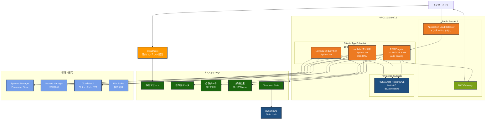

# Terraformで構成可能な主要AWSリソース

## What's this file?

> [!NOTE]
> **What**
> 
> Terraformで構成できる一般的なAWSリソースの種類と構成パターンについて記載しています。

## Conclusion (忙しいとき向け)

> [!IMPORTANT]
> **What** : Terraformで構成される主要なAWSリソースとは何か
> 
> **Answer** : VPC、ECS Fargate、RDS Aurora、S3、CloudFront、Lambda等を含む、スケーラブルで高可用性のあるサーバーレスアーキテクチャの構成要素

## 目次

<details>
<summary>目次を開く</summary>

- [概要](#概要)
- [ネットワーク層](#ネットワーク層)
  - [VPC](#vpc)
  - [サブネット](#サブネット)
  - [セキュリティグループ](#セキュリティグループ)
- [コンピューティング層](#コンピューティング層)
  - [ECS Fargate](#ecs-fargate)
  - [Lambda関数](#lambda関数)
- [ストレージ層](#ストレージ層)
  - [S3バケット](#s3バケット)
  - [RDS Aurora](#rds-aurora)
- [配信層](#配信層)
  - [CloudFront](#cloudfront)
  - [Application Load Balancer](#application-load-balancer)
- [管理・運用層](#管理運用層)
  - [IAMロール](#iamロール)
  - [Systems Manager](#systems-manager)
  - [CloudWatch](#cloudwatch)
- [Terraform State管理](#terraform-state管理)
- [アーキテクチャ図](#アーキテクチャ図)

</details>

## 概要

清水建設現場監視アプリケーションは、以下のディレクトリ構造でAWSリソースを管理しています：

```bash
infra/terraform/
├── server/     # バックエンドリソース
├── client/     # フロントエンドリソース
└── backend.tf  # Terraform state管理
```

## ネットワーク層

### VPC

**リソース名**: `aws_vpc.example_project`

| 項目 | 値 |
|------|-----|
| CIDR | 10.0.0.0/16 |
| リージョン | ap-northeast-1 |
| DNS有効化 | true |
| DNSホスト名 | true |

### サブネット

4つのサブネットで構成：

| サブネット | CIDR | AZ | 用途 |
|-----------|------|-----|------|
| public_a | 10.0.1.0/24 | ap-northeast-1a | ALB, NAT Gateway |
| private_app_a | 10.0.11.0/24 | ap-northeast-1a | ECS Tasks, Lambda |
| private_db_a | 10.0.21.0/24 | ap-northeast-1a | RDS Primary |
| private_db_b | 10.0.22.0/24 | ap-northeast-1c | RDS Standby |

### セキュリティグループ

| セキュリティグループ | 用途 | インバウンド | アウトバウンド |
|-------------------|------|------------|--------------|
| example_alb | ALB用 | 80, 443 (0.0.0.0/0) | VPC内すべて |
| example_ecs_tasks | ECS用 | 3000 (ALBから) | すべて許可 |
| example_rds | RDS用 | 5432 (ECS, Lambdaから) | なし |
| example_lambda | Lambda用 | なし | すべて許可 |

## コンピューティング層

### ECS Fargate

**クラスター**: `example-project-{environment}`

**サービス設定**:
- 起動タイプ: Fargate
- CPU: 1024 (1 vCPU)
- メモリ: 2048 (2 GB)
- 希望タスク数: 1
- 最大タスク数: 3

**オートスケーリング**:
- CPU使用率 > 70%
- メモリ使用率 > 75%

### Lambda関数

| 関数名 | ランタイム | メモリ | タイムアウト | 用途 |
|--------|----------|--------|------------|------|
| difference_analysis | Python 3.9 | 3008 MB | 15分 | 点群差分解析 |

## ストレージ層

### S3バケット

| バケット名 | 用途 | ライフサイクル | 暗号化 |
|-----------|------|--------------|--------|
| example-project-static | 静的アセット | なし | AES-256 |
| example-reference-surfaces | 基準面データ | なし | AES-256 |
| example-point-clouds | 点群データ | 7日後削除 | AES-256 |
| example-difference-analysis | 解析結果 | 90日後Glacier | AES-256 |
| example-project-terraform-state | Terraform state | なし | AES-256 |

### RDS Aurora

**エンジン**: Aurora PostgreSQL 15.4

| 項目 | 設定値 |
|------|--------|
| インスタンスクラス | db.t3.medium |
| Multi-AZ | 有効 |
| バックアップ保持 | 7日 |
| 暗号化 | 有効 |
| 自動バックアップ | 02:00-03:00 JST |

## 配信層

### CloudFront

**ディストリビューション設定**:
- オリジン: S3 (静的コンテンツ)
- 価格クラス: PriceClass_100
- SSL証明書: ACM (us-east-1)
- セキュリティポリシー: TLSv1.2_2021

### Application Load Balancer

**設定**:
- タイプ: application
- スキーム: internet-facing
- リスナー: HTTP (80)
- ターゲットグループ: ECS Tasks

## 管理・運用層

### IAMロール

| ロール名 | 用途 | 主なポリシー |
|---------|------|------------|
| ecs_task_execution | ECSタスク実行 | AmazonECSTaskExecutionRolePolicy |
| ecs_task | ECSタスク | S3, CloudWatch, Secrets Manager |
| lambda_execution | Lambda実行 | VPC, S3, RDS, CloudWatch |

### Systems Manager

**Parameter Store**:
- RDSエンドポイント
- ALB DNS名
- VPC ID
- サブネットID
- CloudFront Distribution ID

**Secrets Manager**:
- DB接続情報
- APIキー
- 認証情報

### CloudWatch

**ロググループ**:
- `/aws/ecs/example-project`
- `/aws/lambda/example-difference-analysis`

**アラーム**:
- ECS CPU/メモリ使用率
- ALBヘルスチェック
- RDS CPU/ストレージ
- Lambda エラー率

## Terraform State管理

**S3バックエンド**:
- バケット: `example-project-terraform-state`
- キー: `terraform.tfstate`
- リージョン: ap-northeast-1
- 暗号化: 有効

**DynamoDBテーブル**:
- テーブル名: `example-project-terraform-state-lock`
- 用途: State locking
- 課金: PAY_PER_REQUEST

## アーキテクチャ図

以下は、Terraformで構成されるAWSインフラストラクチャの全体像です：



### アーキテクチャの特徴

1. **高可用性**: Multi-AZ構成のRDS、複数AZに配置可能なECSタスク
2. **スケーラビリティ**: ECS Auto Scaling、Lambda関数による処理
3. **セキュリティ**: プライベートサブネット、セキュリティグループによる制御
4. **コスト最適化**: Fargateによるサーバーレス実行、S3ライフサイクルポリシー
5. **運用性**: CloudWatchによる監視、Systems Managerによる設定管理

## リソース命名規則

すべてのリソースは以下の命名規則に従います：

```
{project_name}-{resource_type}-{environment}
```

例:
- `example-project-alb-prod`
- `example-project-ecs-cluster-stg`

## コスト見積もり

| サービス | 月額費用（USD） |
|----------|----------------|
| ECS Fargate | $30 |
| RDS Aurora | $140 |
| ALB | $25 |
| S3 | $35 |
| CloudFront | $10 |
| Lambda | $5 |
| その他 | $50 |
| **合計** | **$295** |

## 関連

- [設計書: SYS002_インフラ構成図](/docs/2.%20基本設計書/2-2.%20システム方式設計書/SYS002_インフラ構成図.md)
- [AWS Well-Architected Framework](https://aws.amazon.com/jp/architecture/well-architected/)
- [Terraform AWS Provider Documentation](https://registry.terraform.io/providers/hashicorp/aws/latest)