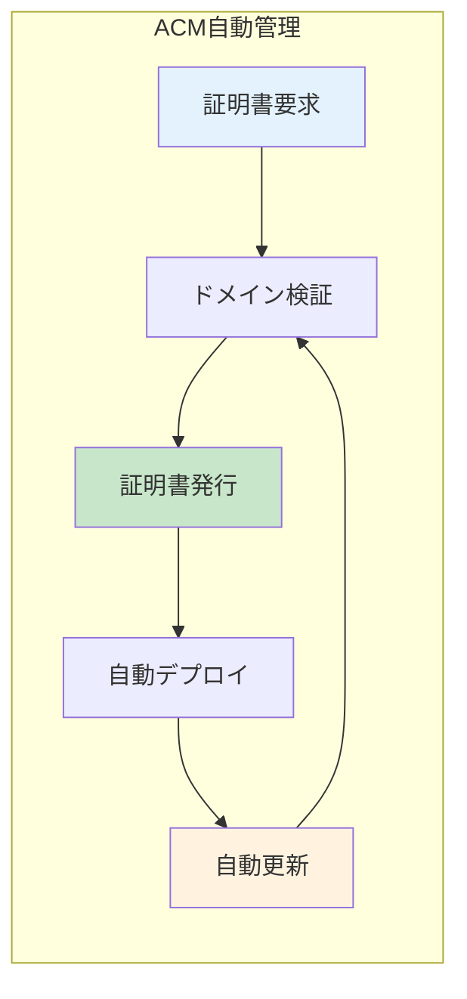
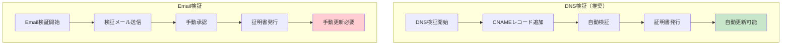
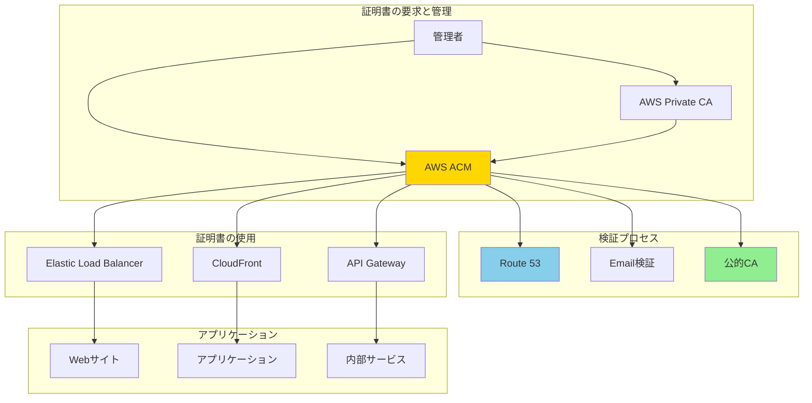
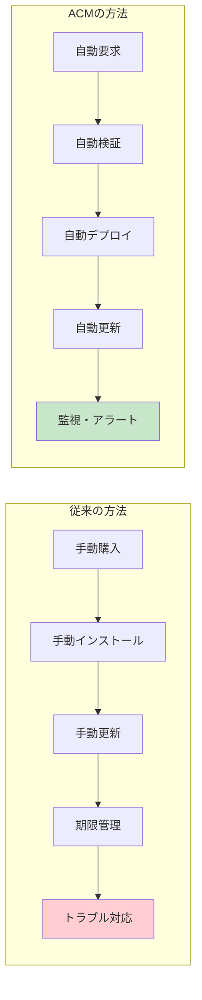
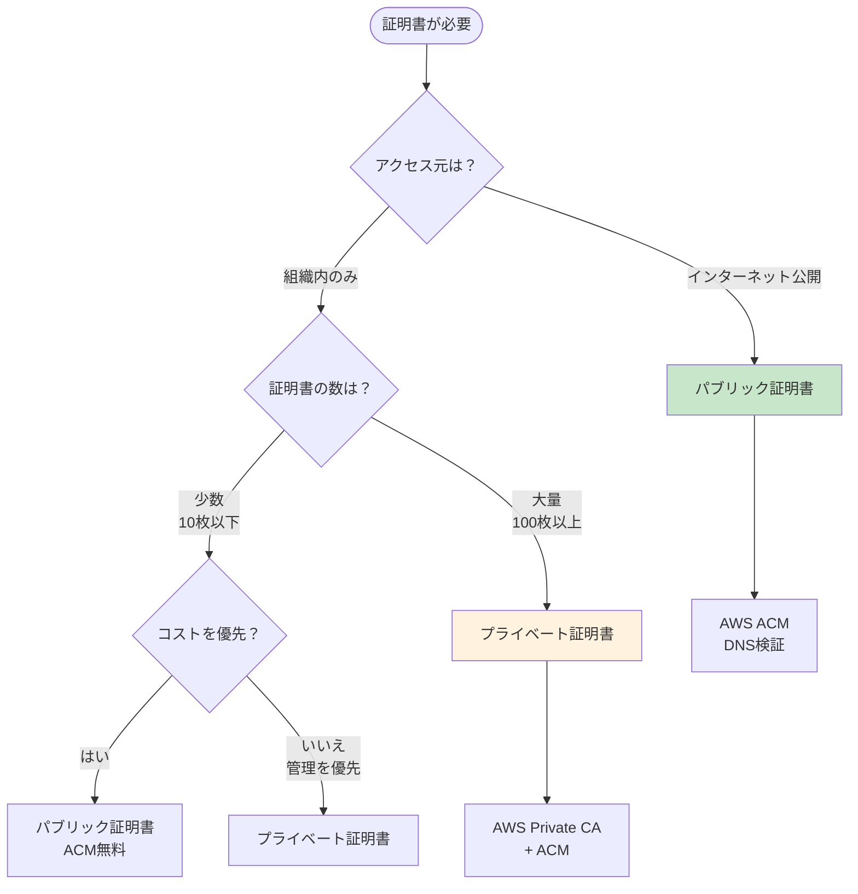

# About AWS ACM Certificates

> [!NOTE]
> このドキュメントはAWS Certificate Manager (ACM)に関する学習内容を体系的にまとめた要約版です。
> 詳細な実装例や日々の学習記録は、参照セクションのdaily-TILリンクをご確認ください。

## 目次

<details>
<summary>目次を開く</summary>

- [概要](#概要)
- [What - AWS ACMとは何か](#what---aws-acmとは何か)
  - [基本概念](#基本概念)
  - [主要な特徴](#主要な特徴)
  - [アーキテクチャ](#アーキテクチャ)
- [Why - なぜAWS ACMを使うのか](#why---なぜaws-acmを使うのか)
  - [解決する課題](#解決する課題)
  - [メリット](#メリット)
  - [デメリット](#デメリット)
  - [他の選択肢との比較](#他の選択肢との比較)
- [How - AWS ACMの実装方法](#how---aws-acmの実装方法)
  - [基本的な使い方](#基本的な使い方)
  - [パブリック証明書とプライベート証明書](#パブリック証明書とプライベート証明書)
  - [高度な実装パターン](#高度な実装パターン)
  - [ベストプラクティス](#ベストプラクティス)
- [参照：daily-TIL](#参照daily-til)

</details>

---

## 概要

AWS Certificate Manager (ACM) は、SSL/TLS証明書のプロビジョニング、管理、デプロイを簡素化するマネージドサービスです。パブリック証明書とプライベート証明書の両方を管理でき、AWSサービスとの統合により証明書の自動更新やデプロイが可能です。

### キーポイント

- **無料のパブリック証明書**: AWSサービスで使用する場合は無料
- **自動更新**: DNS検証を使用すれば完全自動化
- **統合管理**: パブリック証明書とプライベート証明書を一元管理
- **AWSサービスとの深い統合**: ELB、CloudFront、API Gatewayなどで簡単に使用

---

## What - AWS ACMとは何か

### 基本概念

<details>
<summary>基本概念の詳細</summary>

AWS ACMは、SSL/TLS証明書のライフサイクル全体を管理するサービスです。

#### 定義

AWSサービスおよび内部接続用のリソースで使用するパブリックおよびプライベートSSL/TLS証明書のプロビジョニング、管理、およびデプロイを処理するサービス。

#### 構成要素

1. **証明書の種類**
   - パブリック証明書: インターネット向けサービス用
   - プライベート証明書: 内部システム用

2. **検証方法**
   - DNS検証: 推奨（自動更新可能）
   - Email検証: レガシー（手動更新必要）

3. **統合サービス**
   - Elastic Load Balancer (ELB)
   - Amazon CloudFront
   - Amazon API Gateway
   - AWS Elastic Beanstalk
   - AWS CloudFormation

</details>

### 主要な特徴

<details>
<summary>特徴の詳細</summary>

#### 1. 証明書の自動管理



#### 2. 証明書の種類と特性

| 証明書タイプ | 発行元 | 信頼性 | 用途 | コスト |
|------------|--------|--------|------|--------|
| パブリック | 公的CA | グローバル | インターネット公開 | 無料* |
| プライベート | Private CA | 組織内 | 内部システム | CA運用費 |

*AWSサービスで使用する場合

#### 3. 検証方法の比較



</details>

### アーキテクチャ

<details>
<summary>アーキテクチャ図と説明</summary>



#### データフロー

1. **証明書の要求**: 管理者がACMに証明書を要求
2. **ドメイン検証**: DNS/Email経由でドメイン所有権を確認
3. **証明書発行**: 検証完了後、証明書を発行
4. **自動デプロイ**: 指定されたAWSサービスに自動配置
5. **自動更新**: 期限前に自動的に更新（DNS検証時）

</details>

---

## Why - なぜAWS ACMを使うのか

### 解決する課題

<details>
<summary>課題の詳細</summary>

#### 従来の証明書管理の問題点

1. **手動プロセスの負担**
   - 証明書の購入・更新の手間
   - 各サーバーへの手動インストール
   - 期限管理の煩雑さ

2. **セキュリティリスク**
   - 証明書の期限切れによるサービス停止
   - 秘密鍵の漏洩リスク
   - 不適切な証明書管理

3. **コストの問題**
   - 高額な証明書購入費用
   - 管理工数による人件費
   - 証明書関連のインシデント対応コスト

#### ACMによる解決



</details>

### メリット

<details>
<summary>メリットの詳細</summary>

#### ビジネス面のメリット

1. **コスト削減**
   - パブリック証明書が無料（AWSサービス利用時）
   - 管理工数の大幅削減
   - 証明書関連の障害減少

2. **運用効率化**
   - 証明書の自動更新
   - 一元管理による効率化
   - APIによる自動化対応

3. **セキュリティ向上**
   - AWS KMSによる秘密鍵の保護
   - 証明書期限切れリスクの排除
   - 監査ログの自動記録

#### 技術面のメリット

1. **シームレスな統合**
   ```hcl
   # ELBへの簡単な適用
   resource "aws_lb_listener" "https" {
     load_balancer_arn = aws_lb.main.arn
     port              = "443"
     protocol          = "HTTPS"
     certificate_arn   = aws_acm_certificate.cert.arn
   }
   ```

2. **自動化対応**
   - Terraform/CloudFormationサポート
   - AWS CLIでの操作
   - SDKによるプログラマブル管理

3. **高可用性**
   - マルチリージョン対応
   - 自動フェイルオーバー
   - 99.9% SLA

</details>

### デメリット

<details>
<summary>デメリットと対策</summary>

| デメリット | 影響 | 対策 |
|-----------|------|------|
| AWS限定 | 他クラウドで使用不可 | エクスポート機能の活用 |
| リージョン制限 | CloudFrontはus-east-1必須 | クロスリージョンレプリケーション |
| ワイルドカード制限 | *.*.example.com不可 | SANで複数ドメイン指定 |
| Private CA費用 | 月額$400〜 | 証明書数でコスト評価 |

</details>

### 他の選択肢との比較

<details>
<summary>比較表</summary>

| 項目 | AWS ACM | Let's Encrypt | 商用CA | 自己署名 |
|------|---------|---------------|--------|----------|
| コスト | 無料* | 無料 | 有料 | 無料 |
| 自動更新 | ○ | △ | × | × |
| 信頼性 | 高 | 中 | 高 | 低 |
| 管理負荷 | 最小 | 中 | 高 | 中 |
| AWS統合 | 完全 | 手動 | 手動 | 手動 |

*AWSサービスで使用する場合

</details>

---

## How - AWS ACMの実装方法

### 基本的な使い方

<details>
<summary>基本実装例</summary>

#### 1. パブリック証明書の作成

```hcl
resource "aws_acm_certificate" "main" {
  domain_name       = "example.com"
  validation_method = "DNS"
  
  subject_alternative_names = [
    "*.example.com",
    "api.example.com"
  ]
  
  tags = {
    Name        = "main-certificate"
    Environment = "production"
  }
  
  lifecycle {
    create_before_destroy = true
  }
}
```

#### 2. DNS検証の自動化

```hcl
# Route53でのDNS検証レコード作成
resource "aws_route53_record" "cert_validation" {
  for_each = {
    for dvo in aws_acm_certificate.main.domain_validation_options : dvo.domain_name => {
      name   = dvo.resource_record_name
      record = dvo.resource_record_value
      type   = dvo.resource_record_type
    }
  }
  
  allow_overwrite = true
  name            = each.value.name
  records         = [each.value.record]
  ttl             = 60
  type            = each.value.type
  zone_id         = data.aws_route53_zone.main.zone_id
}

# 検証の完了待機
resource "aws_acm_certificate_validation" "main" {
  certificate_arn         = aws_acm_certificate.main.arn
  validation_record_fqdns = [for record in aws_route53_record.cert_validation : record.fqdn]
}
```

#### 3. ELBへの適用

```hcl
resource "aws_lb_listener" "https" {
  load_balancer_arn = aws_lb.main.arn
  port              = "443"
  protocol          = "HTTPS"
  ssl_policy        = "ELBSecurityPolicy-TLS-1-2-2017-01"
  certificate_arn   = aws_acm_certificate_validation.main.certificate_arn
  
  default_action {
    type             = "forward"
    target_group_arn = aws_lb_target_group.main.arn
  }
}
```

</details>

### パブリック証明書とプライベート証明書

<details>
<summary>証明書タイプ別実装</summary>

#### 証明書選択フローチャート



#### パブリック証明書の実装

```hcl
# インターネット向けサービス用
resource "aws_acm_certificate" "public" {
  domain_name       = "www.example.com"
  validation_method = "DNS"
  
  # 透過性ログを有効化（推奨）
  options {
    certificate_transparency_logging_preference = "ENABLED"
  }
  
  lifecycle {
    create_before_destroy = true
  }
}
```

#### プライベート証明書の実装

```hcl
# Private CAの作成
resource "aws_acmpca_certificate_authority" "private_ca" {
  type = "ROOT"
  
  certificate_authority_configuration {
    key_algorithm     = "RSA_4096"
    signing_algorithm = "SHA512WITHRSA"
    
    subject {
      common_name  = "Internal Root CA"
      organization = "Example Corp"
    }
  }
}

# プライベート証明書の発行
resource "aws_acm_certificate" "private" {
  domain_name               = "internal.example.local"
  certificate_authority_arn = aws_acmpca_certificate_authority.private_ca.arn
  
  options {
    certificate_transparency_logging_preference = "DISABLED"
  }
}
```

</details>

### 高度な実装パターン

<details>
<summary>実装パターン集</summary>

#### パターン1: マルチリージョン証明書

```hcl
# CloudFront用（us-east-1必須）
provider "aws" {
  alias  = "virginia"
  region = "us-east-1"
}

resource "aws_acm_certificate" "cloudfront" {
  provider          = aws.virginia
  domain_name       = "cdn.example.com"
  validation_method = "DNS"
}

# リージョナルサービス用
resource "aws_acm_certificate" "regional" {
  domain_name       = "api.example.com"
  validation_method = "DNS"
}
```

#### パターン2: ワイルドカード証明書戦略

```hcl
# 環境別ワイルドカード証明書
locals {
  environments = ["dev", "staging", "prod"]
}

resource "aws_acm_certificate" "env_certs" {
  for_each = toset(local.environments)
  
  domain_name = "*.${each.key}.example.com"
  subject_alternative_names = [
    "${each.key}.example.com",
    "*.api.${each.key}.example.com"
  ]
  
  validation_method = "DNS"
}
```

#### パターン3: 証明書の監視とアラート

```hcl
# 証明書期限監視
resource "aws_cloudwatch_metric_alarm" "cert_expiry" {
  alarm_name          = "acm-certificate-expiry"
  comparison_operator = "LessThanThreshold"
  evaluation_periods  = "1"
  metric_name        = "DaysToExpiry"
  namespace          = "AWS/CertificateManager"
  period             = "86400"
  statistic          = "Average"
  threshold          = "30"
  alarm_description  = "Certificate expiring in 30 days"
  
  dimensions = {
    CertificateArn = aws_acm_certificate.main.arn
  }
}
```

</details>

### ベストプラクティス

<details>
<summary>推奨される実装方法</summary>

#### 1. DNS検証の使用

```hcl
# 推奨：DNS検証
resource "aws_acm_certificate" "recommended" {
  domain_name       = "example.com"
  validation_method = "DNS"  # 自動更新可能
}

# 非推奨：Email検証
resource "aws_acm_certificate" "not_recommended" {
  domain_name       = "example.com"
  validation_method = "EMAIL"  # 手動更新必要
}
```

#### 2. CAA レコードの設定

```hcl
# 証明書発行を制限するCAAレコード
resource "aws_route53_record" "caa" {
  zone_id = data.aws_route53_zone.main.zone_id
  name    = "example.com"
  type    = "CAA"
  ttl     = 300
  
  records = [
    "0 issue \"amazon.com\"",
    "0 issuewild \"amazon.com\""
  ]
}
```

#### 3. タグ戦略

```hcl
locals {
  common_tags = {
    ManagedBy   = "Terraform"
    Service     = "ACM"
    Environment = var.environment
    CostCenter  = var.cost_center
  }
}

resource "aws_acm_certificate" "tagged" {
  domain_name = var.domain_name
  
  tags = merge(local.common_tags, {
    Name        = "${var.project_name}-certificate"
    Type        = "public"
    AutoRenew   = "true"
    ValidMethod = "DNS"
  })
}
```

#### 4. 証明書のライフサイクル管理

```hcl
# 証明書更新時の無停止切り替え
resource "aws_acm_certificate" "zero_downtime" {
  domain_name       = "api.example.com"
  validation_method = "DNS"
  
  lifecycle {
    create_before_destroy = true
  }
}

# ALBリスナーでの証明書切り替え
resource "aws_lb_listener_certificate" "additional" {
  listener_arn    = aws_lb_listener.https.arn
  certificate_arn = aws_acm_certificate.zero_downtime.arn
}
```

#### 5. セキュリティベストプラクティス

**パブリック証明書の場合:**
- DNS検証を使用（自動更新可能）
- CAAレコードで発行元を制限
- Certificate Transparencyログを有効化
- HSTS設定と組み合わせ

**プライベート証明書の場合:**
- ルートCAはオフライン管理
- 中間CAによる階層構造
- 定期的な監査ログレビュー
- HSM（Hardware Security Module）の使用検討

</details>

---

## 参照：daily-TIL

このドキュメントは以下のdaily-TILファイルから情報を集約・整理しています：

### What関連

- [2025.07.24.08.47 - what_aws_acm_certificate.md](../daily/2025.07.24.08.47_what_aws_acm_certificate.md)
  - AWS ACM証明書リソースの基本
- [2025.08.02.12.57 - what_public_certificate_vs_private_certificate_differences_and_usage.md](../daily/2025.08.02.12.57_what_public_certificate_vs_private_certificate_differences_and_usage.md)
  - パブリック証明書とプライベート証明書の詳細比較
- [2025.08.02.14.35 - what_aws_acm_certificate_configuration_items_detailed_reference.md](../daily/2025.08.02.14.35_what_aws_acm_certificate_configuration_items_detailed_reference.md)
  - ACM証明書の設定項目詳細リファレンス
- [2025.07.17.12.20 - what_ssl_tls_certificates.md](../daily/2025.07.17.12.20_what_ssl_tls_certificates.md)
  - SSL/TLS証明書の基本概念

### Why関連

- [2025.08.01.13.47 - why_acm_certificate_management_patterns_comparison.md](../daily/2025.08.01.13.47_why_acm_certificate_management_patterns_comparison.md)
  - ACM証明書管理パターンの比較

### How関連

- [2025.07.24.08.35 - how_aws_acm_certificate_tutorial.md](../daily/2025.07.24.08.35_how_aws_acm_certificate_tutorial.md)
  - AWS ACM証明書のチュートリアル
- [2025.08.01.14.31 - how_aws_acm_certificate_terraform_configuration_guide.md](../daily/2025.08.01.14.31_how_aws_acm_certificate_terraform_configuration_guide.md)
  - Terraform設定ガイド
- [2025.08.01.14.38 - how_aws_acm_certificate_provider_configuration_details.md](../daily/2025.08.01.14.38_how_aws_acm_certificate_provider_configuration_details.md)
  - プロバイダー設定の詳細
- [2025.08.01.14.43 - how_aws_acm_certificate_count_configuration_details.md](../daily/2025.08.01.14.43_how_aws_acm_certificate_count_configuration_details.md)
  - 証明書数設定の詳細
- [2025.08.02.13.21 - how_terraform_acm_certificate_type_determination_method.md](../daily/2025.08.02.13.21_how_terraform_acm_certificate_type_determination_method.md)
  - 証明書タイプの決定方法

---

## バージョン履歴

| バージョン | 更新日 | 主な変更内容 |
|-----------|---------|-------------|
| 1.0.0 | 2025-08-11 | 初版作成 |

---

> [!TIP]
> より詳細な情報や具体的な実装例については、上記のdaily-TILリンクを参照してください。
> このドキュメントは定期的に更新され、新しい学習内容が追加されます。
