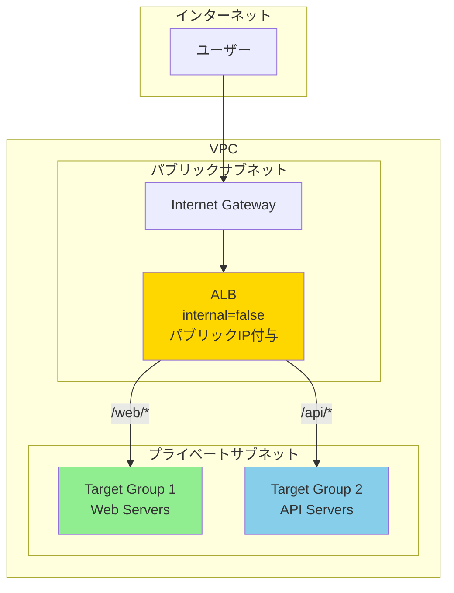
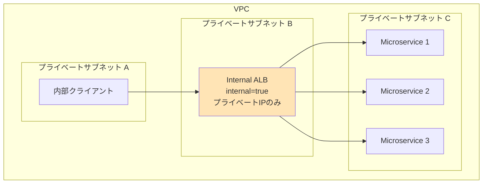
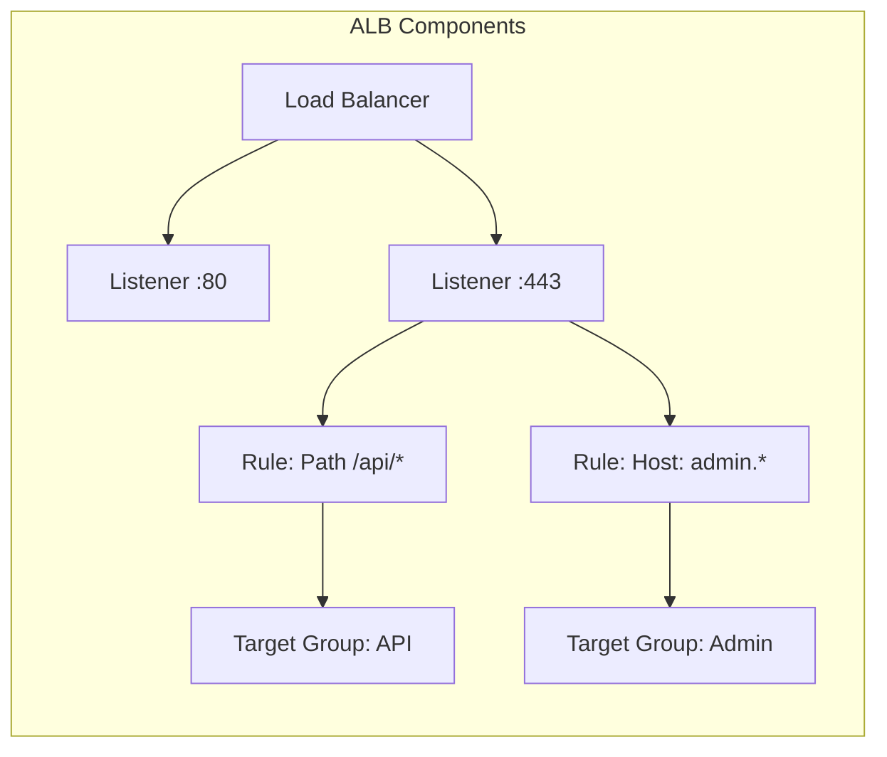

# About ALB & Load Balancer

> [!NOTE]
> このドキュメントはAWS Application Load Balancer (ALB)に関する学習内容を体系的にまとめた要約版です。
> 詳細な実装例や日々の学習記録は、参照セクションのdaily-TILリンクをご確認ください。

## 目次

<details>
<summary>目次を開く</summary>

- [About ALB \& Load Balancer](#about-alb--load-balancer)
  - [目次](#目次)
  - [概要](#概要)
    - [キーポイント](#キーポイント)
  - [What - ALBとは何か](#what---albとは何か)
    - [基本概念](#基本概念)
      - [定義](#定義)
      - [構成要素](#構成要素)
    - [主要な特徴](#主要な特徴)
    - [アーキテクチャ](#アーキテクチャ)
      - [インターネット向けALB](#インターネット向けalb)
      - [内部向けALB](#内部向けalb)
      - [コンポーネント関係](#コンポーネント関係)
  - [Why - なぜALBが必要なのか](#why---なぜalbが必要なのか)
    - [解決する課題](#解決する課題)
      - [従来の問題点](#従来の問題点)
      - [ALBによる解決策](#albによる解決策)
    - [メリット](#メリット)
      - [ビジネス面のメリット](#ビジネス面のメリット)
      - [技術面のメリット](#技術面のメリット)
    - [デメリット](#デメリット)
    - [他の選択肢との比較](#他の選択肢との比較)
  - [How - ALBの実装方法](#how---albの実装方法)
    - [基本的な使い方](#基本的な使い方)
      - [Terraformでの実装](#terraformでの実装)
      - [セキュリティグループ](#セキュリティグループ)
    - [ベストプラクティス](#ベストプラクティス)
      - [1. Multi-AZ配置](#1-multi-az配置)
      - [2. パスベースルーティング](#2-パスベースルーティング)
      - [3. セキュリティ強化](#3-セキュリティ強化)
    - [よくある実装パターン](#よくある実装パターン)
      - [パターン1: Blue/Greenデプロイメント](#パターン1-bluegreenデプロイメント)
      - [パターン2: マルチテナント構成](#パターン2-マルチテナント構成)
      - [パターン3: 内部マイクロサービス](#パターン3-内部マイクロサービス)
    - [トラブルシューティング](#トラブルシューティング)
      - [エラー1: 504 Gateway Timeout](#エラー1-504-gateway-timeout)
      - [エラー2: ヘルスチェック失敗](#エラー2-ヘルスチェック失敗)
      - [エラー3: SSL/TLS証明書エラー](#エラー3-ssltls証明書エラー)
  - [参照：daily-TIL](#参照daily-til)
    - [What関連](#what関連)
    - [Why関連](#why関連)
    - [How関連](#how関連)
  - [バージョン履歴](#バージョン履歴)

</details>

---

## 概要

AWS Application Load Balancer (ALB)は、レイヤー7（アプリケーション層）で動作する高度なロードバランサーです。HTTP/HTTPSトラフィックを複数のターゲットに分散し、コンテンツベースのルーティング、SSL/TLS終端、WebSocketサポートなどの機能を提供します。

### キーポイント

- **レイヤー7ロードバランシング**: HTTP/HTTPSレベルでの高度なルーティング
- **インターネット向け/内部向け**: internal設定で公開範囲を制御
- **リスナーとルール**: ポートごとに柔軟なトラフィック制御

---

## What - ALBとは何か

### 基本概念

<details>
<summary>基本概念の詳細</summary>

ALBは、アプリケーション層（OSI参照モデルのレイヤー7）で動作するロードバランサーです。HTTPヘッダー、メソッド、クエリパラメータ、ソースIPなどに基づいて、きめ細かいルーティング決定を行います。

#### 定義

受信したアプリケーショントラフィックを、登録されたターゲット（EC2インスタンス、コンテナ、IPアドレス、Lambda関数）に分散する、フルマネージドなロードバランシングサービス。

#### 構成要素

1. **ロードバランサー本体**
   - リージョナルリソース
   - 複数のアベイラビリティーゾーンに分散
   - internal設定で公開範囲を制御

2. **リスナー**
   - 指定ポートで接続を待ち受け
   - プロトコル（HTTP/HTTPS）を処理
   - SSL/TLS証明書の管理

3. **ターゲットグループ**
   - トラフィックの転送先を管理
   - ヘルスチェックの実施
   - 負荷分散アルゴリズムの適用

4. **ルール**
   - リスナーに関連付けられた条件
   - パスやホストヘッダーに基づくルーティング

</details>

### 主要な特徴

<details>
<summary>特徴の詳細</summary>

1. **コンテンツベースルーティング**
   - URLパス、ホストヘッダー、HTTPメソッドなどでルーティング
   - 利点: マイクロサービスアーキテクチャに最適

2. **SSL/TLS終端**
   - 証明書の一元管理
   - 利点: バックエンドサーバーの負荷軽減

3. **WebSocketとHTTP/2サポート**
   - 長時間接続のサポート
   - 利点: リアルタイムアプリケーションに対応

4. **統合されたセキュリティ**
   - AWS WAFとの統合
   - 利点: アプリケーション層での攻撃防御

</details>

### アーキテクチャ

<details>
<summary>アーキテクチャの詳細</summary>

#### インターネット向けALB



#### 内部向けALB



#### コンポーネント関係



</details>

---

## Why - なぜALBが必要なのか

### 解決する課題

<details>
<summary>課題の詳細</summary>

#### 従来の問題点

1. **単一障害点**
   - 影響: サーバー障害でサービス全体がダウン
   - 例: Webサーバー1台構成での運用リスク

2. **スケーラビリティの限界**
   - 影響: トラフィック増加時の対応困難
   - 例: 単一サーバーでは処理能力に限界

3. **複雑なSSL/TLS管理**
   - 影響: 証明書の更新漏れやセキュリティリスク
   - 例: 各サーバーでの個別証明書管理

#### ALBによる解決策

- 複数のターゲットへの自動的なトラフィック分散
- ヘルスチェックによる障害サーバーの自動除外
- 証明書の一元管理とSSL/TLS処理のオフロード

</details>

### メリット

<details>
<summary>メリットの詳細</summary>

#### ビジネス面のメリット

1. **高可用性**
   - サービス稼働率: 99.99% SLA
   - 自動フェイルオーバーでダウンタイム最小化

2. **柔軟なスケーリング**
   - トラフィックに応じた自動スケール
   - コスト効率的なリソース利用

3. **セキュリティ強化**
   - DDoS攻撃の自動緩和
   - WAF統合による脅威防御

#### 技術面のメリット

1. **高度なルーティング**
   - パスベース、ホストベースルーティング
   - マイクロサービス対応

2. **運用の簡素化**
   - マネージドサービスでメンテナンス不要
   - CloudWatchとの統合監視

</details>

### デメリット

<details>
<summary>デメリットと対策</summary>

| デメリット | 影響 | 対策 |
|-----------|------|------|
| レイテンシーの追加 | 数ミリ秒の遅延 | Connection Drainingの最適化 |
| コスト | 時間課金+LCU課金 | 適切なサイジングとReserved Capacity |
| 設定の複雑さ | 初期学習が必要 | テンプレート活用、IaC実装 |

</details>

### 他の選択肢との比較

<details>
<summary>比較表</summary>

| 特性 | ALB | NLB | CLB | API Gateway |
|------|-----|-----|-----|-------------|
| レイヤー | 7（アプリケーション） | 4（トランスポート） | 4/7 | 7 |
| プロトコル | HTTP/HTTPS | TCP/UDP/TLS | HTTP/HTTPS/TCP | HTTP/HTTPS |
| パフォーマンス | 高 | 超高速 | 中 | 中 |
| ルーティング | 高度 | 基本的 | 基本的 | 高度 |
| WebSocket | ○ | ○ | × | ○ |
| 料金 | 中 | 低 | 低 | 高 |

</details>

---

## How - ALBの実装方法

### 基本的な使い方

<details>
<summary>基本実装例</summary>

#### Terraformでの実装

```hcl
# ALB本体
resource "aws_lb" "main" {
  name               = "${var.project_name}-alb-${var.environment}"
  internal           = false  # インターネット向け
  load_balancer_type = "application"
  security_groups    = [aws_security_group.alb.id]
  subnets           = var.public_subnet_ids  # 最低2つのAZ
  
  enable_deletion_protection = var.environment == "production"
  enable_http2              = true
  enable_cross_zone_load_balancing = true
  
  access_logs {
    bucket  = aws_s3_bucket.alb_logs.id
    prefix  = "alb"
    enabled = true
  }
  
  tags = {
    Name        = "${var.project_name}-alb-${var.environment}"
    Environment = var.environment
  }
}

# HTTPリスナー（HTTPSへリダイレクト）
resource "aws_lb_listener" "http" {
  load_balancer_arn = aws_lb.main.arn
  port              = "80"
  protocol          = "HTTP"
  
  default_action {
    type = "redirect"
    redirect {
      port        = "443"
      protocol    = "HTTPS"
      status_code = "HTTP_301"
    }
  }
}

# HTTPSリスナー
resource "aws_lb_listener" "https" {
  load_balancer_arn = aws_lb.main.arn
  port              = "443"
  protocol          = "HTTPS"
  ssl_policy        = "ELBSecurityPolicy-TLS-1-2-2017-01"
  certificate_arn   = aws_acm_certificate_validation.main.certificate_arn
  
  default_action {
    type             = "forward"
    target_group_arn = aws_lb_target_group.main.arn
  }
}

# ターゲットグループ
resource "aws_lb_target_group" "main" {
  name     = "${var.project_name}-tg-${var.environment}"
  port     = 80
  protocol = "HTTP"
  vpc_id   = var.vpc_id
  
  health_check {
    enabled             = true
    healthy_threshold   = 2
    unhealthy_threshold = 2
    timeout             = 5
    interval            = 30
    path                = "/health"
    matcher             = "200"
  }
  
  deregistration_delay = 30
  
  stickiness {
    type            = "lb_cookie"
    cookie_duration = 86400
    enabled         = true
  }
  
  tags = {
    Name = "${var.project_name}-tg-${var.environment}"
  }
}
```

#### セキュリティグループ

```hcl
resource "aws_security_group" "alb" {
  name_prefix = "${var.project_name}-alb-"
  vpc_id      = var.vpc_id
  
  ingress {
    from_port   = 80
    to_port     = 80
    protocol    = "tcp"
    cidr_blocks = ["0.0.0.0/0"]
  }
  
  ingress {
    from_port   = 443
    to_port     = 443
    protocol    = "tcp"
    cidr_blocks = ["0.0.0.0/0"]
  }
  
  egress {
    from_port   = 0
    to_port     = 0
    protocol    = "-1"
    cidr_blocks = ["0.0.0.0/0"]
  }
  
  tags = {
    Name = "${var.project_name}-alb-sg-${var.environment}"
  }
}
```

</details>

### ベストプラクティス

<details>
<summary>推奨される実装方法</summary>

#### 1. Multi-AZ配置

```hcl
# 最低2つ、推奨3つ以上のAZに配置
resource "aws_lb" "main" {
  subnets = [
    aws_subnet.public_az_a.id,
    aws_subnet.public_az_c.id,
    aws_subnet.public_az_d.id
  ]
}
```

**理由**: 単一AZ障害時でもサービス継続可能

#### 2. パスベースルーティング

```hcl
# APIトラフィック用ルール
resource "aws_lb_listener_rule" "api" {
  listener_arn = aws_lb_listener.https.arn
  priority     = 100
  
  action {
    type             = "forward"
    target_group_arn = aws_lb_target_group.api.arn
  }
  
  condition {
    path_pattern {
      values = ["/api/*"]
    }
  }
}

# 管理画面用ルール
resource "aws_lb_listener_rule" "admin" {
  listener_arn = aws_lb_listener.https.arn
  priority     = 200
  
  action {
    type = "authenticate-cognito"
    authenticate_cognito {
      user_pool_arn       = aws_cognito_user_pool.admin.arn
      user_pool_client_id = aws_cognito_user_pool_client.admin.id
      user_pool_domain    = aws_cognito_user_pool_domain.admin.domain
    }
  }
  
  action {
    type             = "forward"
    target_group_arn = aws_lb_target_group.admin.arn
  }
  
  condition {
    host_header {
      values = ["admin.example.com"]
    }
  }
}
```

**理由**: マイクロサービスの効率的な管理

#### 3. セキュリティ強化

```hcl
# WAF統合
resource "aws_wafv2_web_acl_association" "alb" {
  resource_arn = aws_lb.main.arn
  web_acl_arn  = aws_wafv2_web_acl.main.arn
}

# セキュリティヘッダー追加
resource "aws_lb_listener_rule" "security_headers" {
  listener_arn = aws_lb_listener.https.arn
  
  action {
    type = "fixed-response"
    fixed_response {
      content_type = "text/plain"
      message_body = "Not Found"
      status_code  = "404"
    }
  }
  
  condition {
    http_header {
      http_header_name = "X-Bad-Header"
      values          = ["malicious-value"]
    }
  }
}
```

**理由**: アプリケーション層での脅威防御

</details>

### よくある実装パターン

<details>
<summary>実装パターン集</summary>

#### パターン1: Blue/Greenデプロイメント

**用途**: ゼロダウンタイムデプロイメント

```hcl
# Blue環境
resource "aws_lb_target_group" "blue" {
  name = "${var.project_name}-blue"
  # ... 設定
}

# Green環境
resource "aws_lb_target_group" "green" {
  name = "${var.project_name}-green"
  # ... 設定
}

# 重み付きルーティング
resource "aws_lb_listener_rule" "weighted" {
  listener_arn = aws_lb_listener.https.arn
  
  action {
    type = "forward"
    forward {
      target_group {
        arn    = aws_lb_target_group.blue.arn
        weight = var.blue_weight  # 例: 80
      }
      target_group {
        arn    = aws_lb_target_group.green.arn
        weight = var.green_weight  # 例: 20
      }
    }
  }
}
```

#### パターン2: マルチテナント構成

**用途**: 複数顧客の分離

```hcl
# テナントごとのルール
resource "aws_lb_listener_rule" "tenant" {
  for_each = var.tenants
  
  listener_arn = aws_lb_listener.https.arn
  priority     = each.value.priority
  
  action {
    type             = "forward"
    target_group_arn = aws_lb_target_group.tenant[each.key].arn
  }
  
  condition {
    host_header {
      values = ["${each.key}.example.com"]
    }
  }
}
```

#### パターン3: 内部マイクロサービス

**用途**: サービス間通信の負荷分散

```hcl
# 内部ALB
resource "aws_lb" "internal" {
  name     = "${var.project_name}-internal-alb"
  internal = true
  subnets  = var.private_subnet_ids
  
  # サービスディスカバリー統合
  enable_cross_zone_load_balancing = true
}

# サービスメッシュ統合
resource "aws_lb_target_group" "service" {
  name        = "${var.service_name}-tg"
  target_type = "ip"  # Fargateサポート
  
  health_check {
    path     = "/health"
    port     = "traffic-port"
    protocol = "HTTP"
  }
}
```

</details>

### トラブルシューティング

<details>
<summary>よくある問題と解決方法</summary>

#### エラー1: 504 Gateway Timeout

**原因**: ターゲットの応答が遅い
**解決方法**:

```hcl
# タイムアウト値の調整
resource "aws_lb_target_group" "main" {
  # ターゲットのタイムアウトを延長
  health_check {
    timeout = 10  # デフォルト5秒から延長
  }
  
  # アイドルタイムアウトの調整
  stickiness {
    type            = "lb_cookie"
    cookie_duration = 86400
  }
}

# ALB側の設定
resource "aws_lb" "main" {
  idle_timeout = 60  # デフォルト60秒
}
```

#### エラー2: ヘルスチェック失敗

**原因**: ヘルスチェックパスの設定ミス
**解決方法**:

```bash
# ターゲットに直接アクセスして確認
curl -I http://target-ip/health

# セキュリティグループの確認
aws ec2 describe-security-groups \
  --group-ids sg-xxxxx \
  --query 'SecurityGroups[0].IpPermissions'
```

#### エラー3: SSL/TLS証明書エラー

**原因**: 証明書のドメイン不一致または期限切れ
**解決方法**:

```hcl
# 証明書の確認
data "aws_acm_certificate" "issued" {
  domain   = "*.example.com"
  statuses = ["ISSUED"]
  most_recent = true
}

# リスナーに適用
resource "aws_lb_listener" "https" {
  certificate_arn = data.aws_acm_certificate.issued.arn
  
  # 追加の証明書（SNI）
  default_action {
    type = "forward"
    target_group_arn = aws_lb_target_group.main.arn
  }
}

# 追加証明書の登録
resource "aws_lb_listener_certificate" "additional" {
  listener_arn    = aws_lb_listener.https.arn
  certificate_arn = aws_acm_certificate.additional.arn
}
```

</details>

---

## 参照：daily-TIL

このドキュメントは以下のdaily-TILファイルから情報を集約・整理しています：

### What関連

- [2025.08.07.11.42 - what_aws_lb_listener.md](../daily/2025.08.07.11.42_what_aws_lb_listener.md)
  - AWS LB Listenerの詳細説明
- [2025.08.07.10.15 - what_internal_setting_in_aws_lb.md](../daily/2025.08.07.10.15_what_internal_setting_in_aws_lb.md)
  - ALBのinternal設定の詳細
- [2025.08.07.11.00 - what_enable_deletion_protection_for_aws_alb.md](../daily/2025.08.07.11.00_what_enable_deletion_protection_for_aws_alb.md)
  - 削除保護機能について
- [2025.08.07.11.05 - what_enable_http2_for_aws_alb.md](../daily/2025.08.07.11.05_what_enable_http2_for_aws_alb.md)
  - HTTP/2サポートについて

### Why関連

- [2025.08.04.15.34 - why_alb_must_assign_in_public_subnet.md](../daily/2025.08.04.15.34_why_alb_must_assign_in_public_subnet.md)
  - インターネット向けALBがパブリックサブネット配置必須の理由

### How関連

- 実装例は上記のWhatファイルに含まれています

---

## バージョン履歴

| バージョン | 更新日 | 主な変更内容 |
|-----------|---------|-------------|
| 1.0.0 | 2025-08-11 | 初版作成 |

---

> [!TIP]
> より詳細な情報や具体的な実装例については、上記のdaily-TILリンクを参照してください。
> このドキュメントは定期的に更新され、新しい学習内容が追加されます。

