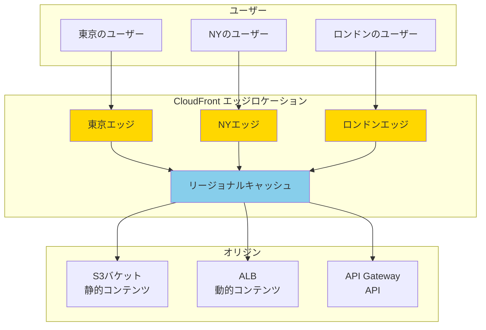

# About CloudFront CDN

> [!NOTE]
> このドキュメントはAWS CloudFrontに関する学習内容を体系的にまとめた要約版です。
> 詳細な実装例や日々の学習記録は、参照セクションのdaily-TILリンクをご確認ください。

## 目次

<details>
<summary>目次を開く</summary>

- [About CloudFront CDN](#about-cloudfront-cdn)
  - [目次](#目次)
  - [概要](#概要)
    - [キーポイント](#キーポイント)
  - [What - CloudFrontとは何か](#what---cloudfrontとは何か)
    - [基本概念](#基本概念)
      - [定義](#定義)
      - [構成要素](#構成要素)
    - [主要な特徴](#主要な特徴)
    - [アーキテクチャ](#アーキテクチャ)
      - [データフローの説明](#データフローの説明)
  - [Why - なぜCloudFrontが必要なのか](#why---なぜcloudfrontが必要なのか)
    - [解決する課題](#解決する課題)
      - [従来の問題点](#従来の問題点)
      - [CloudFrontによる解決策](#cloudfrontによる解決策)
    - [メリット](#メリット)
      - [ビジネス面のメリット](#ビジネス面のメリット)
      - [技術面のメリット](#技術面のメリット)
    - [デメリット](#デメリット)
    - [他の選択肢との比較](#他の選択肢との比較)
      - [EC2単体との詳細比較](#ec2単体との詳細比較)
  - [How - CloudFrontの実装方法](#how---cloudfrontの実装方法)
    - [基本的な使い方](#基本的な使い方)
      - [Terraformでの実装](#terraformでの実装)
    - [ベストプラクティス](#ベストプラクティス)
      - [1. パスベースルーティングの設計](#1-パスベースルーティングの設計)
      - [2. セキュリティヘッダーの追加](#2-セキュリティヘッダーの追加)
      - [3. コスト最適化](#3-コスト最適化)
    - [よくある実装パターン](#よくある実装パターン)
      - [パターン1: 静的サイトホスティング](#パターン1-静的サイトホスティング)
      - [パターン2: マルチオリジン構成](#パターン2-マルチオリジン構成)
      - [パターン3: 地域制限付き配信](#パターン3-地域制限付き配信)
    - [トラブルシューティング](#トラブルシューティング)
      - [エラー1: オリジンタイムアウト](#エラー1-オリジンタイムアウト)
      - [エラー2: キャッシュが更新されない](#エラー2-キャッシュが更新されない)
      - [エラー3: CORS エラー](#エラー3-cors-エラー)
  - [参照：daily-TIL](#参照daily-til)
    - [What関連](#what関連)
    - [Why関連](#why関連)
    - [How関連](#how関連)
  - [バージョン履歴](#バージョン履歴)

</details>

---

## 概要

AWS CloudFrontは、グローバルなコンテンツ配信ネットワーク（CDN）サービスです。世界中に分散された450以上のエッジロケーションを活用し、低レイテンシーで高速なコンテンツ配信を実現します。静的・動的コンテンツの両方に対応し、セキュリティ機能も統合されています。

### キーポイント

- **グローバル配信**: 450以上のエッジロケーションで世界中に高速配信
- **統合セキュリティ**: AWS Shield、WAFとの統合でDDoS攻撃から保護
- **コスト効率**: オリジンサーバーの負荷を軽減し、データ転送コストを削減

---

## What - CloudFrontとは何か

### 基本概念

<details>
<summary>基本概念の詳細</summary>

CloudFrontは、Webコンテンツの配信を高速化するAWSのCDNサービスです。ユーザーに最も近いエッジロケーションからコンテンツを配信することで、レイテンシーを最小化します。

#### 定義

地理的に分散されたサーバーのネットワークを使用して、Webコンテンツやアプリケーションを高速かつ安全に配信するフルマネージドサービス。

#### 構成要素

1. **ディストリビューション**
   - CloudFrontの基本単位
   - 配信設定の集合体
   - WebディストリビューションとRTMPディストリビューション（廃止予定）

2. **オリジン**
   - コンテンツの配信元
   - S3、EC2、ALB、カスタムオリジン

3. **ビヘイビア（動作）**
   - パスパターンに基づくルーティング設定
   - キャッシュポリシーとオリジンリクエストポリシー

4. **エッジロケーション**
   - 世界中に分散された配信拠点
   - 自動的に最適なロケーションを選択

</details>

### 主要な特徴

<details>
<summary>特徴の詳細</summary>

1. **グローバルな高速配信**
   - 450以上のPoP（Point of Presence）
   - 利点: どこからでも低レイテンシーアクセス

2. **インテリジェントなキャッシング**
   - 階層型キャッシング（エッジとリージョナルキャッシュ）
   - 利点: オリジンへの負荷を大幅に削減

3. **セキュリティの統合**
   - AWS Shield Standard（DDoS保護）が標準装備
   - 利点: 追加コストなしでセキュリティ確保

4. **動的コンテンツの最適化**
   - 動的コンテンツも高速化
   - 利点: APIレスポンスも高速化

</details>

### アーキテクチャ

<details>
<summary>アーキテクチャ図と説明</summary>



#### データフローの説明

1. **初回リクエスト（キャッシュミス）**
   - ユーザー → 最寄りのエッジ → リージョナルキャッシュ → オリジン
   - レスポンスは逆順でキャッシュされながら返却

2. **2回目以降（キャッシュヒット）**
   - ユーザー → 最寄りのエッジ → 即座にレスポンス
   - オリジンへのアクセス不要

</details>

---

## Why - なぜCloudFrontが必要なのか

### 解決する課題

<details>
<summary>課題の詳細</summary>

#### 従来の問題点

1. **地理的な遅延**
   - 影響: 海外ユーザーのレスポンスタイムが10倍以上
   - 例: 東京のサーバーへNYから320ms以上の遅延

2. **スケーラビリティの限界**
   - 影響: トラフィック急増時にサーバーダウン
   - 例: テレビ放映後に100倍のアクセスで障害

3. **高額な帯域幅コスト**
   - 影響: オリジンからの直接配信で転送料金が高額
   - 例: 月間5TBで$450以上のコスト

#### CloudFrontによる解決策

- グローバルエッジネットワークで物理的距離の問題を解消
- 自動スケーリングでトラフィック急増に対応
- キャッシングによりオリジンの転送量を90%以上削減

</details>

### メリット

<details>
<summary>メリットの詳細</summary>

#### ビジネス面のメリット

1. **パフォーマンス向上**
   - ページ読み込み時間: 平均80%短縮
   - コンバージョン率: 20-30%向上

2. **コスト削減**
   - EC2構成と比較: 60-95%のコスト削減
   - 運用工数: ほぼゼロ（フルマネージド）

3. **グローバル展開**
   - 追加インフラなしで世界展開
   - 各地域で一貫したパフォーマンス

#### 技術面のメリット

1. **可用性**
   - 99.99% SLA
   - 自動フェイルオーバー

2. **セキュリティ**
   - DDoS攻撃を自動的に吸収
   - SSL/TLS証明書の自動管理

</details>

### デメリット

<details>
<summary>デメリットと対策</summary>

| デメリット | 影響 | 対策 |
|-----------|------|------|
| キャッシュの複雑性 | 更新の反映に時間がかかる | 適切なTTL設定とInvalidation |
| 初期設定の学習曲線 | 設定ミスによる配信エラー | テンプレート活用とテスト環境 |
| リアルタイム性の制限 | WebSocketなどに不向き | 動的コンテンツは別経路で配信 |

</details>

### 他の選択肢との比較

<details>
<summary>比較表</summary>

| 項目 | CloudFront | EC2単体 | Akamai | Cloudflare |
|------|------------|---------|--------|------------|
| 初期費用 | なし | なし | 高額 | なし |
| 最小契約 | なし | なし | あり | なし |
| AWS統合 | 完全統合 | N/A | 限定的 | 限定的 |
| エッジ数 | 450+ | 1-2 | 300+ | 200+ |
| 価格 | 従量課金 | 固定+従量 | 高額 | 従量課金 |

#### EC2単体との詳細比較

| 指標 | EC2単体 | CloudFront |
|------|---------|------------|
| 東京→NY遅延 | 170ms | 20ms |
| スケーラビリティ | 手動設定必要 | 自動 |
| 月額コスト（5TB） | $1,110 | $427 |
| 運用工数 | 52時間/月 | 0時間 |

</details>

---

## How - CloudFrontの実装方法

### 基本的な使い方

<details>
<summary>基本実装例</summary>

#### Terraformでの実装

```hcl
# S3オリジンの設定
resource "aws_s3_bucket" "static_assets" {
  bucket = "my-static-assets"
}

resource "aws_s3_bucket_public_access_block" "static_assets" {
  bucket = aws_s3_bucket.static_assets.id

  block_public_acls       = true
  block_public_policy     = true
  ignore_public_acls      = true
  restrict_public_buckets = true
}

# CloudFront OAI
resource "aws_cloudfront_origin_access_identity" "oai" {
  comment = "OAI for static assets"
}

# CloudFront Distribution
resource "aws_cloudfront_distribution" "main" {
  enabled             = true
  is_ipv6_enabled     = true
  default_root_object = "index.html"
  
  # S3オリジン
  origin {
    domain_name = aws_s3_bucket.static_assets.bucket_regional_domain_name
    origin_id   = "S3-${aws_s3_bucket.static_assets.id}"
    
    s3_origin_config {
      origin_access_identity = aws_cloudfront_origin_access_identity.oai.cloudfront_access_identity_path
    }
  }
  
  # ALBオリジン（動的コンテンツ用）
  origin {
    domain_name = aws_lb.main.dns_name
    origin_id   = "ALB-${aws_lb.main.id}"
    
    custom_origin_config {
      http_port              = 80
      https_port             = 443
      origin_protocol_policy = "https-only"
      origin_ssl_protocols   = ["TLSv1.2"]
    }
  }
  
  # デフォルトキャッシュビヘイビア
  default_cache_behavior {
    allowed_methods  = ["GET", "HEAD"]
    cached_methods   = ["GET", "HEAD"]
    target_origin_id = "S3-${aws_s3_bucket.static_assets.id}"
    
    forwarded_values {
      query_string = false
      cookies {
        forward = "none"
      }
    }
    
    viewer_protocol_policy = "redirect-to-https"
    min_ttl                = 0
    default_ttl            = 86400
    max_ttl                = 31536000
  }
  
  # APIパス用のビヘイビア
  ordered_cache_behavior {
    path_pattern     = "/api/*"
    allowed_methods  = ["DELETE", "GET", "HEAD", "OPTIONS", "PATCH", "POST", "PUT"]
    cached_methods   = ["GET", "HEAD"]
    target_origin_id = "ALB-${aws_lb.main.id}"
    
    forwarded_values {
      query_string = true
      headers      = ["Authorization", "Origin", "Accept", "Content-Type"]
      
      cookies {
        forward = "all"
      }
    }
    
    viewer_protocol_policy = "https-only"
    min_ttl                = 0
    default_ttl            = 0
    max_ttl                = 0
  }
  
  # 地理的制限
  restrictions {
    geo_restriction {
      restriction_type = "none"
    }
  }
  
  # SSL証明書
  viewer_certificate {
    acm_certificate_arn = aws_acm_certificate_validation.cert.certificate_arn
    ssl_support_method  = "sni-only"
  }
  
  tags = {
    Name        = "${var.project}-cloudfront-${var.environment}"
    Environment = var.environment
  }
}
```

</details>

### ベストプラクティス

<details>
<summary>推奨される実装方法</summary>

#### 1. パスベースルーティングの設計

```hcl
# 静的コンテンツ
ordered_cache_behavior {
  path_pattern = "/static/*"
  # 長期キャッシュ
  default_ttl  = 86400  # 1日
  max_ttl      = 31536000  # 1年
}

# 動的コンテンツ
ordered_cache_behavior {
  path_pattern = "/api/*"
  # キャッシュなし
  default_ttl  = 0
  max_ttl      = 0
}
```

**理由**: コンテンツタイプに応じた最適なキャッシュ戦略

#### 2. セキュリティヘッダーの追加

```hcl
response_headers_policy_id = aws_cloudfront_response_headers_policy.security.id

resource "aws_cloudfront_response_headers_policy" "security" {
  name = "security-headers-policy"
  
  security_headers_config {
    content_type_options {
      override = true
    }
    frame_options {
      frame_option = "DENY"
      override     = true
    }
    referrer_policy {
      referrer_policy = "same-origin"
      override        = true
    }
    xss_protection {
      mode_block = true
      protection = true
      override   = true
    }
    strict_transport_security {
      access_control_max_age_sec = 63072000
      include_subdomains         = true
      override                   = true
    }
  }
}
```

**理由**: セキュリティベストプラクティスの実装

#### 3. コスト最適化

```hcl
# 圧縮の有効化
default_cache_behavior {
  compress = true
}

# 不要なヘッダーの除外
forwarded_values {
  headers = []  # 必要最小限のみ
}
```

**理由**: データ転送量の削減とキャッシュヒット率の向上

</details>

### よくある実装パターン

<details>
<summary>実装パターン集</summary>

#### パターン1: 静的サイトホスティング

**用途**: S3 + CloudFrontでの静的サイト配信

```hcl
# S3バケットポリシー
data "aws_iam_policy_document" "s3_policy" {
  statement {
    actions   = ["s3:GetObject"]
    resources = ["${aws_s3_bucket.static_site.arn}/*"]
    
    principals {
      type        = "AWS"
      identifiers = [aws_cloudfront_origin_access_identity.oai.iam_arn]
    }
  }
}

# エラーページの設定
custom_error_response {
  error_code         = 404
  response_code      = 200
  response_page_path = "/index.html"
}
```

#### パターン2: マルチオリジン構成

**用途**: 複数のバックエンドを統合

```hcl
# /api/* → API Gateway
# /images/* → S3
# /static/* → S3
# /* → ALB (アプリケーション)

ordered_cache_behavior {
  path_pattern     = "/api/*"
  target_origin_id = "APIGateway"
}

ordered_cache_behavior {
  path_pattern     = "/images/*"
  target_origin_id = "S3-Images"
}

ordered_cache_behavior {
  path_pattern     = "/static/*"
  target_origin_id = "S3-Static"
}

default_cache_behavior {
  target_origin_id = "ALB-App"
}
```

#### パターン3: 地域制限付き配信

**用途**: 特定地域のみへのコンテンツ配信

```hcl
restrictions {
  geo_restriction {
    restriction_type = "whitelist"
    locations        = ["JP", "US", "GB", "DE", "FR"]
  }
}

# カスタムエラーページ
custom_error_response {
  error_code         = 403
  response_code      = 403
  response_page_path = "/geo-blocked.html"
}
```

</details>

### トラブルシューティング

<details>
<summary>よくある問題と解決方法</summary>

#### エラー1: オリジンタイムアウト

**原因**: オリジンサーバーの応答が遅い
**解決方法**:

```hcl
custom_origin_config {
  origin_read_timeout      = 60  # デフォルト30秒から延長
  origin_keepalive_timeout = 5
}
```

#### エラー2: キャッシュが更新されない

**原因**: TTLが長すぎる、またはキャッシュキーの設定ミス
**解決方法**:

```bash
# 特定パスの無効化
aws cloudfront create-invalidation \
  --distribution-id ABCDEFG1234567 \
  --paths "/images/*" "/index.html"

# 全体の無効化（コストに注意）
aws cloudfront create-invalidation \
  --distribution-id ABCDEFG1234567 \
  --paths "/*"
```

#### エラー3: CORS エラー

**原因**: オリジンからのCORSヘッダーが転送されていない
**解決方法**:

```hcl
ordered_cache_behavior {
  forwarded_values {
    headers = [
      "Origin",
      "Access-Control-Request-Headers",
      "Access-Control-Request-Method"
    ]
  }
}

# オリジン側でもCORSヘッダーを設定
```

</details>

---

## 参照：daily-TIL

このドキュメントは以下のdaily-TILファイルから情報を集約・整理しています：

### What関連

- [2025.07.31.11.05 - what_aws_cloudfront_path_based_routing_documentation.md](../daily/2025.07.31.11.05_what_aws_cloudfront_path_based_routing_documentation.md)
  - パスベースルーティングの詳細説明
- [2025.08.07.13.50 - what_geo_restriction_cloudfront_terraform.md](../daily/2025.08.07.13.50_what_geo_restriction_cloudfront_terraform.md)
  - 地理的制限機能の詳細
- [2025.08.07.13.57 - what_default_root_object_cloudfront_terraform.md](../daily/2025.08.07.13.57_what_default_root_object_cloudfront_terraform.md)
  - デフォルトルートオブジェクトの設定
- [2025.08.07.14.05 - what_ssl_support_method_cloudfront_terraform.md](../daily/2025.08.07.14.05_what_ssl_support_method_cloudfront_terraform.md)
  - SSL/TLSサポート方法の詳細

### Why関連

- [2025.08.02.11.40 - why_ec2_standalone_delivery_but_cloudfront_needed_reason.md](../daily/2025.08.02.11.40_why_ec2_standalone_delivery_but_cloudfront_needed_reason.md)
  - EC2単体ではなくCloudFrontが必要な理由の詳細分析
- [2025.08.02.11.40 - why_ec2_vs_cloudfront_comparison.md](../daily/2025.08.02.11.40_why_ec2_vs_cloudfront_comparison.md)
  - EC2とCloudFrontの比較

### How関連

- 実装例は上記のWhatファイルに含まれています

---

## バージョン履歴

| バージョン | 更新日 | 主な変更内容 |
|-----------|---------|-------------|
| 1.0.0 | 2025-08-11 | 初版作成 |

---

> [!TIP]
> より詳細な情報や具体的な実装例については、上記のdaily-TILリンクを参照してください。
> このドキュメントは定期的に更新され、新しい学習内容が追加されます。

