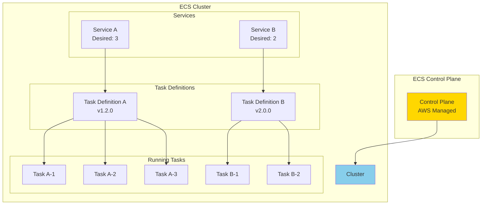
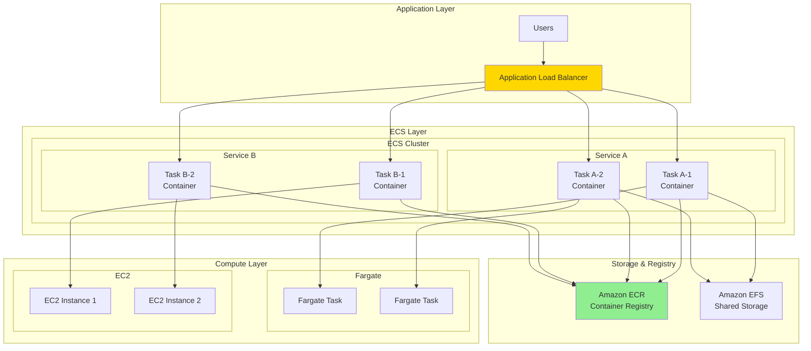

# About ECS

> [!NOTE]
> このドキュメントはAWS ECS（Elastic Container Service）に関する学習内容を体系的にまとめた要約版です。
> 詳細な実装例や日々の学習記録は、参照セクションのdaily-TILリンクをご確認ください。

## 目次

<details>
<summary>目次を開く</summary>

- [About ECS](#about-ecs)
  - [目次](#目次)
  - [概要](#概要)
    - [キーポイント](#キーポイント)
  - [What - ECSとは何か](#what---ecsとは何か)
    - [基本概念](#基本概念)
      - [定義](#定義)
      - [主要コンポーネント](#主要コンポーネント)
    - [主要な特徴](#主要な特徴)
    - [アーキテクチャ](#アーキテクチャ)
  - [Why - なぜECSが必要なのか](#why---なぜecsが必要なのか)
    - [解決する課題](#解決する課題)
      - [従来の問題点](#従来の問題点)
      - [ECSによる解決策](#ecsによる解決策)
    - [メリット](#メリット)
      - [ビジネス面のメリット](#ビジネス面のメリット)
      - [技術面のメリット](#技術面のメリット)
    - [デメリット](#デメリット)
    - [他の選択肢との比較](#他の選択肢との比較)
  - [How - ECSの実装方法](#how---ecsの実装方法)
    - [基本的な使い方](#基本的な使い方)
      - [Terraformでの実装](#terraformでの実装)
    - [ベストプラクティス](#ベストプラクティス)
      - [1. タスク定義の最適化](#1-タスク定義の最適化)
      - [2. サービスディスカバリー](#2-サービスディスカバリー)
      - [3. ログとモニタリング](#3-ログとモニタリング)
    - [よくある実装パターン](#よくある実装パターン)
      - [パターン1: Blue/Greenデプロイメント](#パターン1-bluegreenデプロイメント)
      - [パターン2: サイドカーパターン](#パターン2-サイドカーパターン)
      - [パターン3: ジョブ実行](#パターン3-ジョブ実行)
    - [トラブルシューティング](#トラブルシューティング)
      - [エラー1: タスクが起動しない](#エラー1-タスクが起動しない)
      - [エラー2: ヘルスチェック失敗](#エラー2-ヘルスチェック失敗)
      - [エラー3: サービスディスカバリーの失敗](#エラー3-サービスディスカバリーの失敗)
  - [参照：daily-TIL](#参照daily-til)
    - [What関連](#what関連)
    - [How関連](#how関連)
  - [バージョン履歴](#バージョン履歴)

</details>

---

## 概要

AWS ECS（Elastic Container Service）は、コンテナ化されたアプリケーションを簡単に実行、停止、管理できるフルマネージドなコンテナオーケストレーションサービスです。DockerコンテナをAWS上で大規模に実行するための包括的なソリューションを提供します。

### キーポイント

- **フルマネージド**: コントロールプレーンの管理が不要
- **高い統合性**: AWSサービスとのネイティブ統合
- **柔軟な実行環境**: EC2とFargateの両方をサポート

---

## What - ECSとは何か

### 基本概念

<details>
<summary>基本概念の詳細</summary>

ECSは、Dockerコンテナのクラスター管理とオーケストレーションを提供するサービスです。

#### 定義

コンテナ化されたアプリケーションをAWS上で実行、スケーリング、管理するためのフルマネージドコンテナオーケストレーションサービス。

#### 主要コンポーネント



1. **クラスター**
   - リソースの論理的なグループ
   - EC2インスタンスまたはFargateを含む

2. **タスク定義**
   - コンテナの設計図
   - CPU、メモリ、ネットワーク設定を定義

3. **タスク**
   - 実行中のコンテナインスタンス
   - タスク定義から起動

4. **サービス**
   - タスクの実行と管理
   - 指定された数のタスクを維持

</details>

### 主要な特徴

<details>
<summary>特徴の詳細</summary>

1. **コンテナオーケストレーション**
   - 自動的なタスク配置
   - 利点: リソースの効率的な利用

2. **サービスディスカバリー**
   - AWS Cloud Mapとの統合
   - 利点: マイクロサービス間の通信簡素化

3. **ロードバランシング**
   - ALB/NLBとの統合
   - 利点: 高可用性の実現

4. **オートスケーリング**
   - タスクとクラスターの自動スケーリング
   - 利点: 需要に応じた柔軟な対応

</details>

### アーキテクチャ

<details>
<summary>アーキテクチャ詳細</summary>



</details>

---

## Why - なぜECSが必要なのか

### 解決する課題

<details>
<summary>課題の詳細</summary>

#### 従来の問題点

1. **コンテナ管理の複雑性**
   - 影響: 手動でのコンテナ配置とスケーリング
   - 例: 複数のDockerホストの管理

2. **統合の困難さ**
   - 影響: AWSサービスとの連携が複雑
   - 例: IAMロール、VPC、ロードバランサーの設定

3. **運用負荷**
   - 影響: クラスター管理に多大な労力
   - 例: ノードの監視、パッチ適用

#### ECSによる解決策

- フルマネージドなコントロールプレーン
- AWSサービスとのネイティブ統合
- 自動化されたタスク配置とスケーリング

</details>

### メリット

<details>
<summary>メリットの詳細</summary>

#### ビジネス面のメリット

1. **コスト効率**
   - リソースの最適利用
   - 使用した分だけの課金

2. **開発速度向上**
   - 簡単なデプロイメント
   - CI/CDパイプラインの統合

3. **スケーラビリティ**
   - 自動スケーリング
   - 需要に応じた柔軟な対応

#### 技術面のメリット

1. **AWS統合**
   - IAMロールの自動管理
   - CloudWatchログの統合

2. **セキュリティ**
   - タスクレベルのIAMロール
   - VPCネットワーク分離

</details>

### デメリット

<details>
<summary>デメリットと対策</summary>

| デメリット | 影響 | 対策 |
|-----------|------|------|
| AWS依存 | ベンダーロックイン | 標準的なDocker形式を維持 |
| 学習曲線 | 初期の習得に時間 | AWSトレーニングの活用 |
| 複雑な設定 | 初期設定が煩雑 | IaCツールの使用 |

</details>

### 他の選択肢との比較

<details>
<summary>比較表</summary>

| 特徴 | ECS | Kubernetes (EKS) | Docker Swarm |
|------|-----|-----------------|--------------|
| 管理の容易さ | 高 | 中 | 高 |
| AWS統合 | 完全 | 良好 | 限定的 |
| エコシステム | AWS中心 | 広大 | 限定的 |
| 学習曲線 | 緩やか | 急 | 緩やか |
| コスト | 低〜中 | 中〜高 | 低 |

</details>

---

## How - ECSの実装方法

### 基本的な使い方

<details>
<summary>基本実装例</summary>

#### Terraformでの実装

```hcl
# ECS Cluster
resource "aws_ecs_cluster" "main" {
  name = "${var.project_name}-cluster-${var.environment}"
  
  setting {
    name  = "containerInsights"
    value = "enabled"
  }
  
  tags = {
    Name        = "${var.project_name}-cluster-${var.environment}"
    Environment = var.environment
  }
}

# Task Definition
resource "aws_ecs_task_definition" "app" {
  family                   = "${var.project_name}-app"
  network_mode            = "awsvpc"
  requires_compatibilities = ["FARGATE"]
  cpu                     = "256"
  memory                  = "512"
  execution_role_arn      = aws_iam_role.ecs_execution.arn
  task_role_arn           = aws_iam_role.ecs_task.arn
  
  container_definitions = jsonencode([
    {
      name  = "app"
      image = "${aws_ecr_repository.app.repository_url}:latest"
      
      portMappings = [
        {
          containerPort = 80
          protocol      = "tcp"
        }
      ]
      
      environment = [
        {
          name  = "ENV"
          value = var.environment
        }
      ]
      
      logConfiguration = {
        logDriver = "awslogs"
        options = {
          "awslogs-group"         = aws_cloudwatch_log_group.ecs.name
          "awslogs-region"        = var.aws_region
          "awslogs-stream-prefix" = "ecs"
        }
      }
      
      healthCheck = {
        command     = ["CMD-SHELL", "curl -f http://localhost/health || exit 1"]
        interval    = 30
        timeout     = 5
        retries     = 3
        startPeriod = 60
      }
    }
  ])
}

# ECS Service
resource "aws_ecs_service" "app" {
  name            = "${var.project_name}-app-service"
  cluster         = aws_ecs_cluster.main.id
  task_definition = aws_ecs_task_definition.app.arn
  desired_count   = var.app_count
  launch_type     = "FARGATE"
  
  network_configuration {
    security_groups  = [aws_security_group.ecs_tasks.id]
    subnets         = var.private_subnet_ids
    assign_public_ip = false
  }
  
  load_balancer {
    target_group_arn = aws_lb_target_group.app.arn
    container_name   = "app"
    container_port   = 80
  }
  
  deployment_controller {
    type = "ECS"
  }
  
  deployment_configuration {
    maximum_percent         = 200
    minimum_healthy_percent = 100
  }
  
  depends_on = [aws_lb_listener.app]
}

# Auto Scaling
resource "aws_appautoscaling_target" "ecs" {
  max_capacity       = 10
  min_capacity       = 2
  resource_id        = "service/${aws_ecs_cluster.main.name}/${aws_ecs_service.app.name}"
  scalable_dimension = "ecs:service:DesiredCount"
  service_namespace  = "ecs"
}

resource "aws_appautoscaling_policy" "cpu" {
  name               = "${var.project_name}-cpu-scaling"
  policy_type        = "TargetTrackingScaling"
  resource_id        = aws_appautoscaling_target.ecs.resource_id
  scalable_dimension = aws_appautoscaling_target.ecs.scalable_dimension
  service_namespace  = aws_appautoscaling_target.ecs.service_namespace
  
  target_tracking_scaling_policy_configuration {
    predefined_metric_specification {
      predefined_metric_type = "ECSServiceAverageCPUUtilization"
    }
    target_value = 70.0
  }
}
```

</details>

### ベストプラクティス

<details>
<summary>推奨される実装方法</summary>

#### 1. タスク定義の最適化

```hcl
# CPU/メモリの適切な設定
resource "aws_ecs_task_definition" "optimized" {
  # Fargateの組み合わせ制限に注意
  cpu    = "512"   # 0.5 vCPU
  memory = "1024"  # 1 GB
  
  # ヘルスチェックの設定
  container_definitions = jsonencode([{
    healthCheck = {
      command     = ["CMD-SHELL", "wget --no-verbose --tries=1 --spider http://localhost/health || exit 1"]
      interval    = 30
      timeout     = 5
      retries     = 3
      startPeriod = 60
    }
  }])
}
```

**理由**: リソースの効率的な利用とサービスの安定性向上

#### 2. サービスディスカバリー

```hcl
resource "aws_service_discovery_service" "app" {
  name = "app"
  
  dns_config {
    namespace_id = aws_service_discovery_private_dns_namespace.main.id
    
    dns_records {
      ttl  = 10
      type = "A"
    }
    
    routing_policy = "MULTIVALUE"
  }
  
  health_check_custom_config {
    failure_threshold = 1
  }
}
```

**理由**: マイクロサービス間の通信簡素化

#### 3. ログとモニタリング

```hcl
# CloudWatch Container Insights
resource "aws_ecs_cluster" "main" {
  setting {
    name  = "containerInsights"
    value = "enabled"
  }
}

# X-Ray統合
container_definitions = jsonencode([{
  name  = "xray-daemon"
  image = "public.ecr.aws/xray/aws-xray-daemon:latest"
  
  portMappings = [{
    containerPort = 2000
    protocol      = "udp"
  }]
}])
```

**理由**: 可観測性の向上とトラブルシューティングの簡素化

</details>

### よくある実装パターン

<details>
<summary>実装パターン集</summary>

#### パターン1: Blue/Greenデプロイメント

**用途**: ゼロダウンタイムデプロイメント

```hcl
resource "aws_ecs_service" "blue_green" {
  deployment_controller {
    type = "CODE_DEPLOY"
  }
  
  load_balancer {
    target_group_arn = aws_lb_target_group.blue.arn
    container_name   = "app"
    container_port   = 80
  }
}
```

#### パターン2: サイドカーパターン

**用途**: ログ収集、プロキシ、監視エージェント

```hcl
container_definitions = jsonencode([
  {
    name  = "app"
    image = "app:latest"
  },
  {
    name  = "fluentd"
    image = "fluent/fluentd:latest"
    
    firelensConfiguration = {
      type = "fluentd"
    }
  }
])
```

#### パターン3: ジョブ実行

**用途**: バッチ処理、定期実行タスク

```hcl
resource "aws_cloudwatch_event_rule" "batch" {
  name                = "batch-job"
  schedule_expression = "rate(1 hour)"
}

resource "aws_cloudwatch_event_target" "ecs" {
  rule      = aws_cloudwatch_event_rule.batch.name
  target_id = "ecs-target"
  arn       = aws_ecs_cluster.main.arn
  role_arn  = aws_iam_role.events.arn
  
  ecs_target {
    task_definition_arn = aws_ecs_task_definition.batch.arn
    task_count          = 1
    launch_type         = "FARGATE"
    
    network_configuration {
      subnets = var.private_subnet_ids
    }
  }
}
```

</details>

### トラブルシューティング

<details>
<summary>よくある問題と解決方法</summary>

#### エラー1: タスクが起動しない

**原因**: リソース不足またはIAMロールの問題
**解決方法**:

```bash
# タスクの停止理由を確認
aws ecs describe-tasks \
  --cluster my-cluster \
  --tasks arn:aws:ecs:region:account:task/task-id \
  --query 'tasks[0].stoppedReason'

# 実行ロールの権限確認
aws iam simulate-principal-policy \
  --policy-source-arn arn:aws:iam::account:role/ecsTaskExecutionRole \
  --action-names ecr:GetAuthorizationToken ecr:BatchGetImage
```

#### エラー2: ヘルスチェック失敗

**原因**: アプリケーションの起動時間不足
**解決方法**:

```hcl
# startPeriodを延長
healthCheck = {
  startPeriod = 120  # 2分に延長
}

# ALBのヘルスチェックも調整
resource "aws_lb_target_group" "app" {
  health_check {
    interval            = 30
    timeout             = 10
    healthy_threshold   = 2
    unhealthy_threshold = 3
    matcher             = "200-299"
  }
}
```

#### エラー3: サービスディスカバリーの失敗

**原因**: DNS設定またはネットワーク設定の問題
**解決方法**:

```bash
# DNS解決のテスト
aws servicediscovery discover-instances \
  --namespace-name my-namespace \
  --service-name my-service

# セキュリティグループの確認
aws ec2 describe-security-groups \
  --group-ids sg-xxxxx \
  --query 'SecurityGroups[0].IpPermissions'
```

</details>

---

## 参照：daily-TIL

このドキュメントは以下のdaily-TILファイルから情報を集約・整理しています：

### What関連

- [2025.08.07.11.16 - what_aws_ecs_cluster_resource.md](../daily/2025.08.07.11.16_what_aws_ecs_cluster_resource.md)
  - ECSクラスターリソースの詳細
- [2025.08.07.11.37 - what_aws_ecs_task_definition.md](../daily/2025.08.07.11.37_what_aws_ecs_task_definition.md)
  - タスク定義の詳細説明

### How関連

- [2025.08.07.11.27 - how_aws_ecs_service_settings_in_this_project.md](../daily/2025.08.07.11.27_how_aws_ecs_service_settings_in_this_project.md)
  - ECSサービスの設定方法
- [2025.08.07.11.22 - how_docker_and_ecs_work_together.md](../daily/2025.08.07.11.22_how_docker_and_ecs_work_together.md)
  - DockerとECSの連携方法

---

## バージョン履歴

| バージョン | 更新日 | 主な変更内容 |
|-----------|---------|-------------|
| 1.0.0 | 2025-08-11 | 初版作成 |

---

> [!TIP]
> より詳細な情報や具体的な実装例については、上記のdaily-TILリンクを参照してください。
> このドキュメントは定期的に更新され、新しい学習内容が追加されます。
