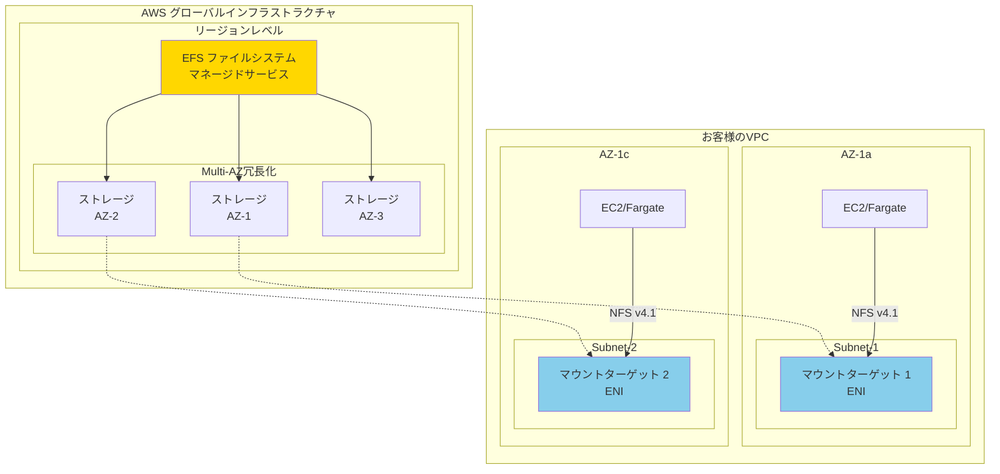
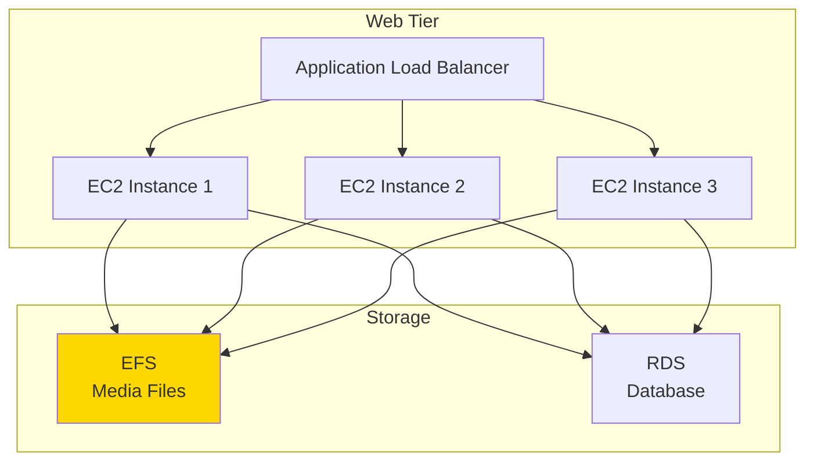

# About EFS

> [!NOTE]
> このドキュメントはAWS EFS（Elastic File System）に関する学習内容を体系的にまとめた要約版です。
> 詳細な実装例や日々の学習記録は、参照セクションのdaily-TILリンクをご確認ください。

## 目次

<details>
<summary>目次を開く</summary>

- [About EFS](#about-efs)
  - [目次](#目次)
  - [概要](#概要)
    - [キーポイント](#キーポイント)
  - [What - EFSとは何か](#what---efsとは何か)
    - [基本概念](#基本概念)
      - [定義](#定義)
      - [構成要素](#構成要素)
    - [主要な特徴](#主要な特徴)
    - [アーキテクチャ](#アーキテクチャ)
      - [配置レイヤーの詳細](#配置レイヤーの詳細)
  - [Why - なぜEFSが必要なのか](#why---なぜefsが必要なのか)
    - [解決する課題](#解決する課題)
      - [従来の問題点](#従来の問題点)
      - [EFSによる解決策](#efsによる解決策)
    - [メリット](#メリット)
      - [ビジネス面のメリット](#ビジネス面のメリット)
      - [技術面のメリット](#技術面のメリット)
    - [デメリット](#デメリット)
    - [他の選択肢との比較](#他の選択肢との比較)
  - [How - EFSの実装方法](#how---efsの実装方法)
    - [基本的な使い方](#基本的な使い方)
      - [Terraformでの実装](#terraformでの実装)
      - [EC2でのマウント](#ec2でのマウント)
      - [Fargateでの使用](#fargateでの使用)
    - [ベストプラクティス](#ベストプラクティス)
      - [1. パフォーマンスモードの選択](#1-パフォーマンスモードの選択)
      - [2. セキュリティの強化](#2-セキュリティの強化)
      - [3. コスト最適化](#3-コスト最適化)
    - [よくある実装パターン](#よくある実装パターン)
      - [パターン1: コンテンツ管理システム](#パターン1-コンテンツ管理システム)
      - [パターン2: コンテナ化されたマイクロサービス](#パターン2-コンテナ化されたマイクロサービス)
      - [パターン3: 機械学習ワークロード](#パターン3-機械学習ワークロード)
    - [トラブルシューティング](#トラブルシューティング)
      - [エラー1: マウントタイムアウト](#エラー1-マウントタイムアウト)
      - [エラー2: パフォーマンス低下](#エラー2-パフォーマンス低下)
      - [エラー3: アクセス拒否](#エラー3-アクセス拒否)
  - [参照：daily-TIL](#参照daily-til)
    - [What関連](#what関連)
    - [Why関連](#why関連)
    - [How関連](#how関連)
  - [バージョン履歴](#バージョン履歴)

</details>

---

## 概要

AWS EFSは、複数のEC2インスタンスやFargateコンテナから同時にアクセスできる、フルマネージドなNFSファイルシステムです。自動的にスケールし、高可用性を提供し、POSIXファイルシステムのセマンティクスをサポートします。

### キーポイント

- **共有ストレージ**: 複数のインスタンス/コンテナから同時アクセス可能
- **自動スケーリング**: ペタバイト規模まで自動的に拡張
- **二層構造**: EFS本体はAWSマネージド、マウントターゲットはVPC内配置

---

## What - EFSとは何か

### 基本概念

<details>
<summary>基本概念の詳細</summary>

EFSは、AWS上で動作するフルマネージドなネットワークファイルシステムです。NFSv4.1プロトコルを使用し、LinuxベースのワークロードにPOSIX準拠のファイルシステムを提供します。

#### 定義

複数のEC2インスタンスやコンテナから同時にアクセスできる、伸縮自在なファイルストレージサービス。容量の事前プロビジョニングが不要で、使用した分だけ課金される。

#### 構成要素

1. **EFSファイルシステム**
   - AWSマネージドインフラに存在
   - リージョンレベルのリソース
   - 自動的にMulti-AZ冗長化

2. **マウントターゲット**
   - VPC内のサブネットに配置
   - ENI（Elastic Network Interface）として実装
   - NFSエンドポイントを提供

3. **アクセスポイント**
   - アプリケーション固有のエントリーポイント
   - パスとアクセス権限を制御

</details>

### 主要な特徴

<details>
<summary>特徴の詳細</summary>

1. **同時アクセス**
   - 数千のEC2インスタンスから同時接続可能
   - 利点: 真の共有ストレージを実現

2. **自動スケーリング**
   - 使用量に応じて自動的に拡張・縮小
   - 利点: 容量管理が不要

3. **高可用性**
   - 複数AZにデータを自動複製
   - 利点: 99.999999999%（11 9's）の耐久性

4. **ライフサイクル管理**
   - Infrequent Access（IA）ストレージクラス
   - 利点: アクセス頻度に応じてコスト最適化

</details>

### アーキテクチャ

<details>
<summary>アーキテクチャの詳細</summary>



#### 配置レイヤーの詳細

| レイヤー | コンポーネント | 配置場所 | 管理主体 |
|---------|---------------|----------|----------|
| サービス層 | EFSファイルシステム | AWSリージョン | AWS完全管理 |
| データ層 | 実データストレージ | 複数AZに分散 | AWS完全管理 |
| アクセス層 | マウントターゲット | VPC内サブネット | 顧客が配置指定 |
| クライアント層 | EC2/Fargate等 | VPC内サブネット | 顧客管理 |

</details>

---

## Why - なぜEFSが必要なのか

### 解決する課題

<details>
<summary>課題の詳細</summary>

#### 従来の問題点

1. **共有ストレージの複雑性**
   - 影響: NFSサーバーの構築・管理が必要
   - 例: 可用性確保のためのクラスタリング設定

2. **スケーラビリティの制限**
   - 影響: 容量追加のたびにダウンタイム
   - 例: ディスク拡張やマイグレーション作業

3. **コンテナ環境での永続化**
   - 影響: コンテナ再起動でデータ消失
   - 例: Fargateでの設定ファイル共有困難

#### EFSによる解決策

- フルマネージドサービスで管理負荷ゼロ
- 自動スケーリングで容量管理不要
- コンテナネイティブな統合でデータ永続化

</details>

### メリット

<details>
<summary>メリットの詳細</summary>

#### ビジネス面のメリット

1. **運用コスト削減**
   - ストレージ管理工数: 90%削減
   - 計画的ダウンタイム: ゼロ

2. **柔軟なコスト管理**
   - 初期投資不要
   - 使用量に応じた従量課金

3. **ビジネス継続性**
   - 自動バックアップ
   - Multi-AZによる高可用性

#### 技術面のメリット

1. **シンプルな実装**
   - 標準的なNFSプロトコル
   - 既存アプリケーションとの互換性

2. **パフォーマンス**
   - 自動的なパフォーマンススケーリング
   - バーストモードでの高速アクセス

</details>

### デメリット

<details>
<summary>デメリットと対策</summary>

| デメリット | 影響 | 対策 |
|-----------|------|------|
| レイテンシー | EBSより高い | キャッシュ層の実装、読み取り重視ワークロード |
| Windows非対応 | Windowsワークロード不可 | FSx for Windows File Server使用 |
| コスト | 小容量では割高 | IAストレージクラス活用、S3との使い分け |

</details>

### 他の選択肢との比較

<details>
<summary>比較表</summary>

| 特性 | EFS | EBS | S3 | FSx |
|------|-----|-----|-----|-----|
| 共有アクセス | ✅ 複数同時 | ❌ 単一のみ | ✅ API経由 | ✅ 複数同時 |
| プロトコル | NFS v4.1 | ブロックレベル | REST/SDK | Lustre/Windows |
| レイテンシー | ミリ秒 | マイクロ秒 | 数十ミリ秒 | マイクロ秒 |
| スケーラビリティ | ペタバイト級 | 64TiB | 無制限 | ペタバイト級 |
| 料金体系 | 使用量課金 | 容量課金 | 使用量課金 | 容量課金 |
| ユースケース | 共有ファイル | OS/DB | 静的コンテンツ | HPC/ML |

</details>

---

## How - EFSの実装方法

### 基本的な使い方

<details>
<summary>基本実装例</summary>

#### Terraformでの実装

```hcl
# EFSファイルシステム
resource "aws_efs_file_system" "main" {
  creation_token = "${var.project_name}-efs-${var.environment}"
  
  performance_mode = "generalPurpose"  # or "maxIO"
  throughput_mode  = "bursting"        # or "provisioned"
  
  # 暗号化
  encrypted = true
  kms_key_id = aws_kms_key.efs.arn
  
  # ライフサイクル管理
  lifecycle_policy {
    transition_to_ia = "AFTER_30_DAYS"
  }
  
  lifecycle_policy {
    transition_to_primary_storage_class = "AFTER_1_ACCESS"
  }
  
  tags = {
    Name        = "${var.project_name}-efs-${var.environment}"
    Environment = var.environment
  }
}

# マウントターゲット（各AZに1つ）
resource "aws_efs_mount_target" "main" {
  count = length(var.private_subnet_ids)
  
  file_system_id  = aws_efs_file_system.main.id
  subnet_id       = var.private_subnet_ids[count.index]
  security_groups = [aws_security_group.efs.id]
}

# セキュリティグループ
resource "aws_security_group" "efs" {
  name_prefix = "${var.project_name}-efs-"
  vpc_id      = var.vpc_id
  
  ingress {
    from_port       = 2049
    to_port         = 2049
    protocol        = "tcp"
    security_groups = [var.app_security_group_id]
  }
  
  egress {
    from_port   = 0
    to_port     = 0
    protocol    = "-1"
    cidr_blocks = ["0.0.0.0/0"]
  }
  
  tags = {
    Name = "${var.project_name}-efs-sg-${var.environment}"
  }
}

# アクセスポイント（アプリケーション別）
resource "aws_efs_access_point" "app" {
  file_system_id = aws_efs_file_system.main.id
  
  posix_user {
    gid = 1000
    uid = 1000
  }
  
  root_directory {
    path = "/app-data"
    creation_info {
      owner_gid   = 1000
      owner_uid   = 1000
      permissions = "755"
    }
  }
  
  tags = {
    Name = "${var.project_name}-efs-ap-app"
  }
}
```

#### EC2でのマウント

```bash
# EFSヘルパーのインストール
sudo yum install -y amazon-efs-utils

# マウントポイント作成
sudo mkdir -p /mnt/efs

# /etc/fstabに追加（永続化）
echo "fs-12345678:/ /mnt/efs efs _netdev,tls,iam 0 0" | sudo tee -a /etc/fstab

# マウント
sudo mount -a
```

#### Fargateでの使用

```hcl
# タスク定義でEFSボリューム設定
resource "aws_ecs_task_definition" "app" {
  family                   = "${var.project_name}-app"
  network_mode            = "awsvpc"
  requires_compatibilities = ["FARGATE"]
  
  volume {
    name = "app-storage"
    
    efs_volume_configuration {
      file_system_id     = aws_efs_file_system.main.id
      transit_encryption = "ENABLED"
      
      authorization_config {
        access_point_id = aws_efs_access_point.app.id
        iam             = "ENABLED"
      }
    }
  }
  
  container_definitions = jsonencode([
    {
      name  = "app"
      image = "nginx:latest"
      
      mountPoints = [
        {
          sourceVolume  = "app-storage"
          containerPath = "/data"
        }
      ]
    }
  ])
}
```

</details>

### ベストプラクティス

<details>
<summary>推奨される実装方法</summary>

#### 1. パフォーマンスモードの選択

```hcl
# 一般的なワークロード（推奨）
performance_mode = "generalPurpose"

# 大規模並列アクセス
performance_mode = "maxIO"
```

**理由**: General Purposeは低レイテンシー、Max I/Oは高スループット

#### 2. セキュリティの強化

```hcl
# 暗号化の有効化
resource "aws_efs_file_system" "secure" {
  encrypted  = true
  kms_key_id = aws_kms_key.efs.arn
}

# アクセスポイントでの分離
resource "aws_efs_access_point" "isolated" {
  file_system_id = aws_efs_file_system.secure.id
  
  # アプリケーションごとに分離
  root_directory {
    path = "/app/${var.app_name}"
  }
}
```

**理由**: データの機密性保持とアプリケーション間の分離

#### 3. コスト最適化

```hcl
# ライフサイクルポリシー設定
lifecycle_policy {
  transition_to_ia = "AFTER_7_DAYS"  # アクセス頻度に応じて調整
}

# バックアップ設定
resource "aws_backup_plan" "efs" {
  name = "${var.project_name}-efs-backup"
  
  rule {
    rule_name         = "daily_backup"
    target_vault_name = aws_backup_vault.main.name
    schedule          = "cron(0 3 * * ? *)"  # 毎日3時
    
    lifecycle {
      delete_after = 30  # 30日後に削除
    }
  }
}
```

**理由**: 使用頻度の低いデータのコスト削減とデータ保護

</details>

### よくある実装パターン

<details>
<summary>実装パターン集</summary>

#### パターン1: コンテンツ管理システム

**用途**: WordPress、Drupalなどのメディアファイル共有



#### パターン2: コンテナ化されたマイクロサービス

**用途**: 設定ファイルとログの共有

```hcl
# 共有設定用アクセスポイント
resource "aws_efs_access_point" "config" {
  file_system_id = aws_efs_file_system.main.id
  
  root_directory {
    path = "/config"
    creation_info {
      permissions = "755"
    }
  }
}

# ログ用アクセスポイント
resource "aws_efs_access_point" "logs" {
  file_system_id = aws_efs_file_system.main.id
  
  root_directory {
    path = "/logs"
    creation_info {
      permissions = "775"
    }
  }
}
```

#### パターン3: 機械学習ワークロード

**用途**: トレーニングデータとモデルの共有

```hcl
# 高スループット設定
resource "aws_efs_file_system" "ml" {
  performance_mode = "maxIO"
  throughput_mode  = "provisioned"
  provisioned_throughput_in_mibps = 100
  
  tags = {
    Name = "ml-training-data"
  }
}
```

</details>

### トラブルシューティング

<details>
<summary>よくある問題と解決方法</summary>

#### エラー1: マウントタイムアウト

**原因**: セキュリティグループまたはネットワーク設定の問題
**解決方法**:

```bash
# セキュリティグループの確認
aws ec2 describe-security-groups \
  --group-ids sg-xxxxxx \
  --query 'SecurityGroups[0].IpPermissions[?FromPort==`2049`]'

# NFSポートの疎通確認
telnet fs-12345678.efs.region.amazonaws.com 2049
```

#### エラー2: パフォーマンス低下

**原因**: バーストクレジットの枯渇
**解決方法**:

```bash
# CloudWatchメトリクスの確認
aws cloudwatch get-metric-statistics \
  --namespace AWS/EFS \
  --metric-name BurstCreditBalance \
  --dimensions Name=FileSystemId,Value=fs-12345678 \
  --start-time 2024-01-01T00:00:00Z \
  --end-time 2024-01-02T00:00:00Z \
  --period 3600 \
  --statistics Average
```

対策:
- Provisioned Throughputモードへの変更
- ファイルシステムサイズの増加

#### エラー3: アクセス拒否

**原因**: IAMポリシーまたはファイルシステムポリシーの設定ミス
**解決方法**:

```json
// ECS TaskロールにEFSアクセス権限を追加
{
  "Version": "2012-10-17",
  "Statement": [
    {
      "Effect": "Allow",
      "Action": [
        "elasticfilesystem:ClientMount",
        "elasticfilesystem:ClientWrite"
      ],
      "Resource": "*",
      "Condition": {
        "StringEquals": {
          "aws:SecureTransport": "true"
        }
      }
    }
  ]
}
```

</details>

---

## 参照：daily-TIL

このドキュメントは以下のdaily-TILファイルから情報を集約・整理しています：

### What関連

- [2025.08.04.16.16 - what_efs_placement_in_aws_architecture.md](../daily/2025.08.04.16.16_what_efs_placement_in_aws_architecture.md)
  - EFSのAWSアーキテクチャにおける配置場所の詳細

### Why関連

- [2025.08.04.15.41 - why_efs_not_need_same_subnet_as_fargate.md](../daily/2025.08.04.15.41_why_efs_not_need_same_subnet_as_fargate.md)
  - EFSとFargateが同一サブネットである必要がない理由
- [2025.08.04.16.11 - why_efs_mount_target_must_in_subnet.md](../daily/2025.08.04.16.11_why_efs_mount_target_must_in_subnet.md)
  - マウントターゲットがサブネット内に必要な理由
- [2025.08.04.16.13 - why_efs_not_need_same_subnet_as_fargate_target.md](../daily/2025.08.04.16.13_why_efs_not_need_same_subnet_as_fargate_target.md)
  - EFSとFargateターゲットが同一サブネット不要な詳細

### How関連

- [2025.08.04.16.00 - how_judge_necessity_of_efs.md](../daily/2025.08.04.16.00_how_judge_necessity_of_efs.md)
  - EFSの必要性を判断する方法とフローチャート

---

## バージョン履歴

| バージョン | 更新日 | 主な変更内容 |
|-----------|---------|-------------|
| 1.0.0 | 2025-08-11 | 初版作成 |

---

> [!TIP]
> より詳細な情報や具体的な実装例については、上記のdaily-TILリンクを参照してください。
> このドキュメントは定期的に更新され、新しい学習内容が追加されます。
