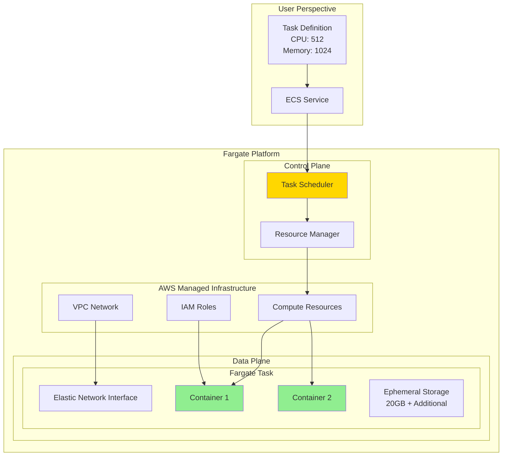
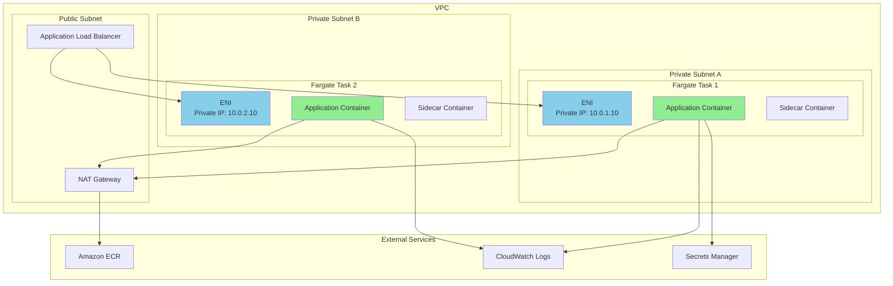
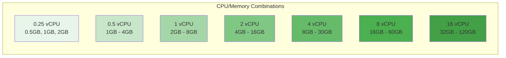

# About Fargate

> [!NOTE]
> このドキュメントはAWS Fargateに関する学習内容を体系的にまとめた要約版です。
> 詳細な実装例や日々の学習記録は、参照セクションのdaily-TILリンクをご確認ください。

## 目次

<details>
<summary>目次を開く</summary>

- [About Fargate](#about-fargate)
  - [目次](#目次)
  - [概要](#概要)
    - [キーポイント](#キーポイント)
  - [What - Fargateとは何か](#what---fargateとは何か)
    - [基本概念](#基本概念)
      - [定義](#定義)
      - [動作原理](#動作原理)
      - [リソース構成](#リソース構成)
    - [主要な特徴](#主要な特徴)
    - [アーキテクチャ](#アーキテクチャ)
      - [Fargateのネットワークアーキテクチャ](#fargateのネットワークアーキテクチャ)
      - [リソース割り当てパターン](#リソース割り当てパターン)
  - [Why - なぜFargateが必要なのか](#why---なぜfargateが必要なのか)
    - [解決する課題](#解決する課題)
      - [従来の問題点](#従来の問題点)
      - [Fargateによる解決策](#fargateによる解決策)
    - [メリット](#メリット)
      - [ビジネス面のメリット](#ビジネス面のメリット)
      - [技術面のメリット](#技術面のメリット)
    - [デメリット](#デメリット)
    - [他の選択肢との比較](#他の選択肢との比較)
  - [How - Fargateの実装方法](#how---fargateの実装方法)
    - [基本的な使い方](#基本的な使い方)
      - [Terraformでの実装](#terraformでの実装)
    - [ベストプラクティス](#ベストプラクティス)
      - [1. 適切なリソースサイジング](#1-適切なリソースサイジング)
      - [2. ネットワーク最適化](#2-ネットワーク最適化)
      - [3. ログとモニタリング](#3-ログとモニタリング)
    - [よくある実装パターン](#よくある実装パターン)
      - [パターン1: マイクロサービス構成](#パターン1-マイクロサービス構成)
      - [パターン2: サイドカーパターン](#パターン2-サイドカーパターン)
      - [パターン3: バッチ処理](#パターン3-バッチ処理)
    - [トラブルシューティング](#トラブルシューティング)
      - [エラー1: タスクが開始しない](#エラー1-タスクが開始しない)
      - [エラー2: メモリ不足](#エラー2-メモリ不足)
      - [エラー3: 接続性の問題](#エラー3-接続性の問題)
  - [参照：daily-TIL](#参照daily-til)
    - [What関連](#what関連)
    - [Why関連](#why関連)
    - [How関連](#how関連)
  - [バージョン履歴](#バージョン履歴)

</details>

---

## 概要

AWS Fargateは、コンテナ向けのサーバーレスコンピューティングエンジンです。インフラストラクチャの管理なしにコンテナを実行でき、ECSとEKSの両方で動作します。リソースの指定だけで、自動的に適切なコンピューティング環境が提供されます。

### キーポイント

- **サーバーレス**: インフラストラクチャ管理が完全に不要
- **柔軟なリソース**: vCPUとメモリを細かく指定可能
- **セキュア**: タスクレベルの分離とIAM統合

---

## What - Fargateとは何か

### 基本概念

<details>
<summary>基本概念の詳細</summary>

Fargateは、コンテナのためのサーバーレスコンピューティングプラットフォームです。

#### 定義

EC2インスタンスのプロビジョニングや管理なしに、コンテナを実行できるAWSのサーバーレスコンピューティングエンジン。

#### 動作原理



#### リソース構成

| リソース | 範囲 | 組み合わせ制限 |
|---------|------|---------------|
| vCPU | 0.25 - 16 | 特定の組み合わせのみ |
| メモリ | 0.5GB - 120GB | vCPUに応じた制限 |
| ストレージ | 20GB - 200GB | 追加可能 |

</details>

### 主要な特徴

<details>
<summary>特徴の詳細</summary>

1. **完全なサーバーレス**
   - インスタンス管理不要
   - 利点: 運用負荷ゼロ

2. **タスクレベルの分離**
   - 各タスクが独立した環境
   - 利点: 高いセキュリティ

3. **柔軟なリソース割り当て**
   - 細かいリソース指定
   - 利点: コスト最適化

4. **ネイティブVPC統合**
   - ENI経由でVPCに接続
   - 利点: 既存ネットワークとの統合

</details>

### アーキテクチャ

<details>
<summary>アーキテクチャ詳細</summary>

#### Fargateのネットワークアーキテクチャ



#### リソース割り当てパターン



</details>

---

## Why - なぜFargateが必要なのか

### 解決する課題

<details>
<summary>課題の詳細</summary>

#### 従来の問題点

1. **インフラ管理の負担**
   - 影響: EC2インスタンスの管理に時間を費やす
   - 例: パッチ適用、スケーリング、モニタリング

2. **リソースの無駄**
   - 影響: 過剰プロビジョニングによるコスト増
   - 例: ピーク時に合わせたインスタンスサイズ

3. **セキュリティの複雑性**
   - 影響: 共有インスタンスでの分離問題
   - 例: コンテナ間のリソース競合

#### Fargateによる解決策

- 完全マネージドなインフラストラクチャ
- 使用したリソース分のみの課金
- タスクレベルでの完全な分離

</details>

### メリット

<details>
<summary>メリットの詳細</summary>

#### ビジネス面のメリット

1. **運用コスト削減**
   - インフラ管理工数: ゼロ
   - パッチ管理: 自動化

2. **迅速なデプロイ**
   - インスタンス起動待ち時間なし
   - 即座にコンテナ実行

3. **正確なコスト管理**
   - リソース単位の課金
   - 過剰プロビジョニング不要

#### 技術面のメリット

1. **セキュリティ強化**
   - カーネルレベルの分離
   - 専用のENI

2. **スケーラビリティ**
   - 理論上無限のスケール
   - 自動的なリソース確保

</details>

### デメリット

<details>
<summary>デメリットと対策</summary>

| デメリット | 影響 | 対策 |
|-----------|------|------|
| 起動時間 | EC2より遅い | ウォームプール維持 |
| コスト | 小規模では割高 | 適切なサイジング |
| カスタマイズ制限 | OS設定不可 | コンテナ内で対応 |
| GPUサポートなし | ML/AI制限 | EC2起動タイプ使用 |

</details>

### 他の選択肢との比較

<details>
<summary>比較表</summary>

| 特徴 | Fargate | EC2 (ECS) | Lambda |
|------|---------|-----------|---------|
| 管理負荷 | なし | 高 | なし |
| 起動時間 | 30-60秒 | 2-5分 | ミリ秒 |
| 実行時間制限 | なし | なし | 15分 |
| リソース | 0.25-16 vCPU | 制限なし | 3GB RAM |
| 永続ストレージ | EFS可 | EBS可 | 不可 |
| コスト | 中 | 低〜高 | 低〜中 |

</details>

---

## How - Fargateの実装方法

### 基本的な使い方

<details>
<summary>基本実装例</summary>

#### Terraformでの実装

```hcl
# Task Definition for Fargate
resource "aws_ecs_task_definition" "fargate_app" {
  family                   = "${var.project_name}-fargate-task"
  network_mode            = "awsvpc"  # Fargate必須
  requires_compatibilities = ["FARGATE"]
  cpu                     = "512"      # 0.5 vCPU
  memory                  = "1024"     # 1 GB
  execution_role_arn      = aws_iam_role.ecs_execution.arn
  task_role_arn           = aws_iam_role.ecs_task.arn
  
  # Fargate用のストレージ設定
  ephemeral_storage {
    size_in_gib = 30  # デフォルト20GBから拡張
  }
  
  container_definitions = jsonencode([
    {
      name  = "app"
      image = "${aws_ecr_repository.app.repository_url}:latest"
      
      essential = true
      
      portMappings = [
        {
          containerPort = 8080
        }
      ]
      
      # Fargate用のリソース制限
      cpu    = 256  # 0.25 vCPU
      memory = 512  # 512 MB
      
      # 環境変数
      environment = [
        {
          name  = "ENVIRONMENT"
          value = var.environment
        }
      ]
      
      # Secrets Managerからの取得
      secrets = [
        {
          name      = "DB_PASSWORD"
          valueFrom = aws_secretsmanager_secret.db_password.arn
        }
      ]
      
      # ログ設定
      logConfiguration = {
        logDriver = "awslogs"
        options = {
          "awslogs-group"         = aws_cloudwatch_log_group.fargate.name
          "awslogs-region"        = var.region
          "awslogs-stream-prefix" = "fargate"
        }
      }
      
      # ヘルスチェック
      healthCheck = {
        command     = ["CMD-SHELL", "curl -f http://localhost:8080/health || exit 1"]
        interval    = 30
        timeout     = 5
        retries     = 3
        startPeriod = 60
      }
    }
  ])
}

# ECS Service with Fargate
resource "aws_ecs_service" "fargate_service" {
  name            = "${var.project_name}-fargate-service"
  cluster         = aws_ecs_cluster.main.id
  task_definition = aws_ecs_task_definition.fargate_app.arn
  desired_count   = var.desired_count
  
  # Fargateを指定
  launch_type = "FARGATE"
  
  # プラットフォームバージョン
  platform_version = "LATEST"
  
  # ネットワーク設定（必須）
  network_configuration {
    subnets          = var.private_subnet_ids
    security_groups  = [aws_security_group.fargate.id]
    assign_public_ip = false  # プライベートサブネット
  }
  
  # ロードバランサー設定
  load_balancer {
    target_group_arn = aws_lb_target_group.fargate.arn
    container_name   = "app"
    container_port   = 8080
  }
  
  # デプロイメント設定
  deployment_configuration {
    maximum_percent         = 200
    minimum_healthy_percent = 100
    
    deployment_circuit_breaker {
      enable   = true
      rollback = true
    }
  }
  
  # サービスディスカバリー
  service_registries {
    registry_arn = aws_service_discovery_service.fargate.arn
  }
  
  depends_on = [aws_lb_listener.app]
}

# Security Group for Fargate
resource "aws_security_group" "fargate" {
  name_prefix = "${var.project_name}-fargate-"
  vpc_id      = var.vpc_id
  
  ingress {
    from_port       = 8080
    to_port         = 8080
    protocol        = "tcp"
    security_groups = [aws_security_group.alb.id]
  }
  
  egress {
    from_port   = 0
    to_port     = 0
    protocol    = "-1"
    cidr_blocks = ["0.0.0.0/0"]
  }
  
  tags = {
    Name = "${var.project_name}-fargate-sg"
  }
}
```

</details>

### ベストプラクティス

<details>
<summary>推奨される実装方法</summary>

#### 1. 適切なリソースサイジング

```hcl
# 開発環境: 最小構成
variable "fargate_cpu_dev" {
  default = "256"  # 0.25 vCPU
}
variable "fargate_memory_dev" {
  default = "512"  # 0.5 GB
}

# 本番環境: 適切なサイズ
variable "fargate_cpu_prod" {
  default = "1024"  # 1 vCPU
}
variable "fargate_memory_prod" {
  default = "2048"  # 2 GB
}
```

**理由**: コスト最適化とパフォーマンスのバランス

#### 2. ネットワーク最適化

```hcl
# VPCエンドポイントの設定
resource "aws_vpc_endpoint" "ecr_api" {
  vpc_id              = var.vpc_id
  service_name        = "com.amazonaws.${var.region}.ecr.api"
  vpc_endpoint_type   = "Interface"
  subnet_ids          = var.private_subnet_ids
  security_group_ids  = [aws_security_group.vpc_endpoints.id]
}

resource "aws_vpc_endpoint" "ecr_dkr" {
  vpc_id              = var.vpc_id
  service_name        = "com.amazonaws.${var.region}.ecr.dkr"
  vpc_endpoint_type   = "Interface"
  subnet_ids          = var.private_subnet_ids
  security_group_ids  = [aws_security_group.vpc_endpoints.id]
}
```

**理由**: NAT Gatewayのコスト削減とパフォーマンス向上

#### 3. ログとモニタリング

```hcl
# Container Insights有効化
resource "aws_ecs_cluster" "main" {
  setting {
    name  = "containerInsights"
    value = "enabled"
  }
}

# FireLensによる高度なログ管理
container_definitions = jsonencode([
  {
    name  = "log-router"
    image = "amazon/aws-for-fluent-bit:latest"
    
    firelensConfiguration = {
      type = "fluentbit"
      options = {
        enable-ecs-log-metadata = "true"
        config-file-type        = "file"
        config-file-value       = "/fluent-bit/configs/parse-json.conf"
      }
    }
  }
])
```

**理由**: 可観測性の向上とトラブルシューティングの効率化

</details>

### よくある実装パターン

<details>
<summary>実装パターン集</summary>

#### パターン1: マイクロサービス構成

**用途**: 独立したサービスの実行

```hcl
# 各サービス用のタスク定義
resource "aws_ecs_task_definition" "microservice" {
  for_each = var.microservices
  
  family                   = "${each.key}-service"
  requires_compatibilities = ["FARGATE"]
  network_mode            = "awsvpc"
  cpu                     = each.value.cpu
  memory                  = each.value.memory
  
  container_definitions = jsonencode([
    {
      name  = each.key
      image = "${aws_ecr_repository.microservices[each.key].repository_url}:latest"
      
      environment = [
        {
          name  = "SERVICE_NAME"
          value = each.key
        }
      ]
    }
  ])
}
```

#### パターン2: サイドカーパターン

**用途**: ログ収集、プロキシ、監視

```hcl
container_definitions = jsonencode([
  {
    name      = "app"
    image     = "app:latest"
    essential = true
    
    dependsOn = [
      {
        containerName = "envoy"
        condition     = "START"
      }
    ]
  },
  {
    name      = "envoy"
    image     = "envoyproxy/envoy:latest"
    essential = true
    
    portMappings = [
      {
        containerPort = 9901
      }
    ]
  }
])
```

#### パターン3: バッチ処理

**用途**: 定期的なジョブ実行

```hcl
# EventBridgeによるスケジュール実行
resource "aws_cloudwatch_event_rule" "batch" {
  name                = "fargate-batch-job"
  schedule_expression = "cron(0 2 * * ? *)"  # 毎日2時
}

resource "aws_cloudwatch_event_target" "fargate" {
  rule      = aws_cloudwatch_event_rule.batch.name
  target_id = "fargate-batch"
  arn       = aws_ecs_cluster.main.arn
  role_arn  = aws_iam_role.events.arn
  
  ecs_target {
    task_definition_arn = aws_ecs_task_definition.batch.arn
    task_count          = 1
    launch_type         = "FARGATE"
    platform_version    = "LATEST"
    
    network_configuration {
      subnets          = var.private_subnet_ids
      security_groups  = [aws_security_group.batch.id]
      assign_public_ip = false
    }
  }
}
```

</details>

### トラブルシューティング

<details>
<summary>よくある問題と解決方法</summary>

#### エラー1: タスクが開始しない

**原因**: ネットワーク設定またはIAMロールの問題
**解決方法**:

```bash
# タスクの停止理由を確認
aws ecs describe-tasks \
  --cluster my-cluster \
  --tasks arn:aws:ecs:region:account:task/task-id \
  --query 'tasks[0].stoppedReason'

# よくある理由と対策
# "CannotPullContainerError" → ECRエンドポイントまたはIAMロール確認
# "ResourceInitializationError" → ENI作成失敗、サブネット/SG確認
```

#### エラー2: メモリ不足

**原因**: コンテナのメモリ使用量が割り当てを超過
**解決方法**:

```hcl
# メモリ予約を調整
container_definitions = jsonencode([
  {
    name   = "app"
    memory = 512          # ハードリミット
    memoryReservation = 256  # ソフトリミット
  }
])

# CloudWatch Metricsで監視
resource "aws_cloudwatch_metric_alarm" "memory" {
  alarm_name          = "fargate-high-memory"
  comparison_operator = "GreaterThanThreshold"
  evaluation_periods  = "2"
  metric_name         = "MemoryUtilization"
  namespace           = "AWS/ECS"
  period              = "300"
  statistic           = "Average"
  threshold           = "80"
}
```

#### エラー3: 接続性の問題

**原因**: VPCエンドポイントまたはNAT Gateway設定
**解決方法**:

```hcl
# 必要なVPCエンドポイント
locals {
  required_endpoints = [
    "com.amazonaws.${var.region}.ecr.api",
    "com.amazonaws.${var.region}.ecr.dkr",
    "com.amazonaws.${var.region}.s3",
    "com.amazonaws.${var.region}.logs",
    "com.amazonaws.${var.region}.secretsmanager"
  ]
}

resource "aws_vpc_endpoint" "required" {
  for_each = toset(local.required_endpoints)
  
  vpc_id              = var.vpc_id
  service_name        = each.value
  vpc_endpoint_type   = "Interface"
  subnet_ids          = var.private_subnet_ids
  security_group_ids  = [aws_security_group.vpc_endpoints.id]
}
```

</details>

---

## 参照：daily-TIL

このドキュメントは以下のdaily-TILファイルから情報を集約・整理しています：

### What関連

- [2025.08.07.11.33 - what_assign_public_ip_in_ecs_network_configuration.md](../daily/2025.08.07.11.33_what_assign_public_ip_in_ecs_network_configuration.md)
  - FargateでのパブリックIP設定について

### Why関連

- [2025.08.04.15.41 - why_efs_not_need_same_subnet_as_fargate.md](../daily/2025.08.04.15.41_why_efs_not_need_same_subnet_as_fargate.md)
  - FargateとEFSのサブネット配置について
- [2025.08.04.16.13 - why_efs_not_need_same_subnet_as_fargate_target.md](../daily/2025.08.04.16.13_why_efs_not_need_same_subnet_as_fargate_target.md)
  - Fargateのネットワーク分離について

### How関連

- [2025.08.07.11.27 - how_terraform_aws_ecs_service_implementation.md](../daily/2025.08.07.11.27_how_terraform_aws_ecs_service_implementation.md)
  - TerraformでのFargate実装方法

---

## バージョン履歴

| バージョン | 更新日 | 主な変更内容 |
|-----------|---------|-------------|
| 1.0.0 | 2025-08-11 | 初版作成 |

---

> [!TIP]
> より詳細な情報や具体的な実装例については、上記のdaily-TILリンクを参照してください。
> このドキュメントは定期的に更新され、新しい学習内容が追加されます。