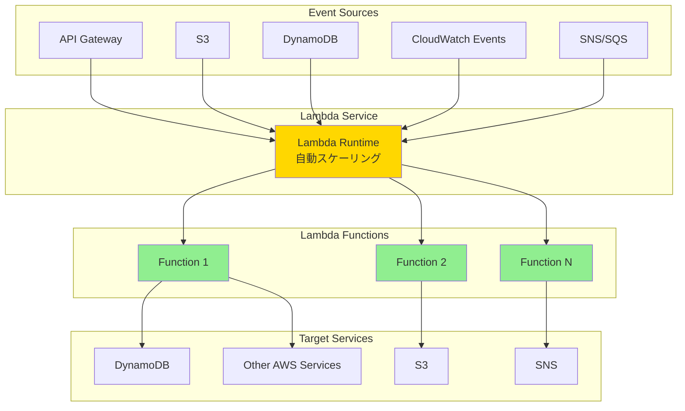

# About AWS Lambda

> [!NOTE]
> このドキュメントはAWS Lambdaに関する学習内容を体系的にまとめた要約版です。
> 詳細な実装例や日々の学習記録は、参照セクションのdaily-TILリンクをご確認ください。

## 目次

<details>
<summary>目次を開く</summary>

- [About AWS Lambda](#about-aws-lambda)
  - [目次](#目次)
  - [概要](#概要)
    - [キーポイント](#キーポイント)
  - [What - AWS Lambdaとは何か](#what---aws-lambdaとは何か)
    - [基本概念](#基本概念)
      - [定義](#定義)
      - [構成要素](#構成要素)
    - [主要な特徴](#主要な特徴)
    - [アーキテクチャ](#アーキテクチャ)
      - [レイヤー構成](#レイヤー構成)
      - [データフロー](#データフロー)
  - [Why - なぜAWS Lambdaが必要なのか](#why---なぜaws-lambdaが必要なのか)
    - [解決する課題](#解決する課題)
      - [従来の問題点](#従来の問題点)
      - [AWS Lambdaによる解決策](#aws-lambdaによる解決策)
    - [メリット](#メリット)
      - [ビジネス面のメリット](#ビジネス面のメリット)
      - [技術面のメリット](#技術面のメリット)
    - [デメリット](#デメリット)
    - [他の選択肢との比較](#他の選択肢との比較)
  - [How - AWS Lambdaの実装方法](#how---aws-lambdaの実装方法)
    - [基本的な使い方](#基本的な使い方)
      - [セットアップ](#セットアップ)
      - [基本的な実装](#基本的な実装)
      - [実行例](#実行例)
    - [ベストプラクティス](#ベストプラクティス)
      - [1. 環境変数の活用](#1-環境変数の活用)
      - [2. エラーハンドリング](#2-エラーハンドリング)
      - [3. コールドスタート対策](#3-コールドスタート対策)
    - [よくある実装パターン](#よくある実装パターン)
      - [パターン1: API Backend](#パターン1-api-backend)
      - [パターン2: S3イベント処理](#パターン2-s3イベント処理)
      - [パターン3: 定期実行](#パターン3-定期実行)
    - [トラブルシューティング](#トラブルシューティング)
      - [エラー1: タイムアウト](#エラー1-タイムアウト)
      - [エラー2: メモリ不足](#エラー2-メモリ不足)
      - [エラー3: 同時実行数制限](#エラー3-同時実行数制限)
  - [参照：daily-TIL](#参照daily-til)
    - [What関連](#what関連)
    - [Why関連](#why関連)
    - [How関連](#how関連)
  - [バージョン履歴](#バージョン履歴)

</details>

---

## 概要

AWS Lambdaは、サーバーレスコンピューティングを実現するイベント駆動型の実行環境です。インフラストラクチャの管理なしにコードを実行でき、使用した分だけ課金される革新的なサービスです。

### キーポイント

- **サーバーレス**: インフラ管理不要で、コードの実行に集中できる
- **イベント駆動**: 様々なAWSサービスやHTTPリクエストをトリガーに自動実行
- **従量課金**: 実行時間とリクエスト数に基づく課金で、アイドル時のコストゼロ

---

## What - AWS Lambdaとは何か

### 基本概念

<details>
<summary>基本概念の詳細</summary>

AWS Lambdaは、サーバーをプロビジョニングまたは管理することなくコードを実行できるコンピューティングサービスです。

#### 定義

イベントに応答してコードを実行し、コンピューティングリソースを自動的に管理するサーバーレスコンピューティングプラットフォーム。

#### 構成要素

1. **Lambda関数**
   - 実行可能なコードのパッケージ
   - ハンドラー関数がエントリーポイント

2. **実行環境**
   - サポート言語: Node.js, Python, Java, .NET, Go, Ruby
   - カスタムランタイムも作成可能

3. **設定パラメータ**
   - メモリ: 128MB〜10,240MB
   - タイムアウト: 最大15分
   - 同時実行数: デフォルト1,000

</details>

### 主要な特徴

<details>
<summary>特徴の詳細</summary>

1. **自動スケーリング**
   - 同時実行数に応じて自動的にスケール
   - 利点: トラフィック急増にも対応可能

2. **高可用性**
   - マルチAZで自動的に実行
   - 利点: 99.95% SLAを提供

3. **統合されたセキュリティ**
   - IAMロールによる細かい権限制御
   - 利点: セキュアな実行環境を提供

</details>

### アーキテクチャ

<details>
<summary>アーキテクチャ図と説明</summary>



#### レイヤー構成

- **イベントソース層**: API Gateway, S3, DynamoDB等
- **Lambda実行層**: 関数の実行環境とランタイム
- **統合サービス層**: DynamoDB, S3, SNS等の連携サービス

#### データフロー

1. イベントソースからトリガーを受信
2. Lambda関数が自動的に起動・実行
3. 結果を呼び出し元またはターゲットサービスに返却

</details>

---

## Why - なぜAWS Lambdaが必要なのか

### 解決する課題

<details>
<summary>課題の詳細</summary>

#### 従来の問題点

1. **インフラ管理の負担**
   - 影響: 開発工数の80%をインフラ管理に費やす
   - 例: サーバーのパッチ適用、スケーリング設定

2. **リソースの無駄**
   - 影響: アイドル時もコストが発生
   - 例: ピーク時に合わせたサーバー構成

#### AWS Lambdaによる解決策

- インフラ管理をAWSに完全委譲
- 使用時のみ課金される従量課金モデル
- 自動スケーリングによるリソース最適化

</details>

### メリット

<details>
<summary>メリットの詳細</summary>

#### ビジネス面のメリット

1. **コスト削減**
   - アイドル時のコストゼロ
   - 小規模アプリケーションで最大90%のコスト削減

2. **開発速度向上**
   - インフラ構築不要で即座にデプロイ可能
   - 開発に90%の時間を集中できる

3. **無限のスケーラビリティ**
   - トラフィック急増にも自動対応
   - ビジネス成長に合わせて拡張

#### 技術面のメリット

1. **高可用性**
   - マルチAZ自動実行で99.95% SLA

2. **セキュリティ**
   - IAMによる細かい権限制御
   - VPC統合によるネットワーク分離

</details>

### デメリット

<details>
<summary>デメリットと対策</summary>

| デメリット | 影響 | 対策 |
|-----------|------|------|
| コールドスタート | 初回実行時の遅延 | Provisioned Concurrencyの使用 |
| 実行時間制限（15分） | 長時間処理に不向き | Step FunctionsやECSとの組み合わせ |
| ベンダーロックイン | AWS依存 | 標準的なコンテナ化で移植性を確保 |

</details>

### 他の選択肢との比較

<details>
<summary>比較表</summary>

| 項目 | AWS Lambda | EC2 | ECS/Fargate |
|------|------------|-----|-------------|
| コスト | 従量課金 | 時間課金 | タスク単位課金 |
| 学習曲線 | 低い | 高い | 中程度 |
| パフォーマンス | コールドスタートあり | 常時稼働 | コンテナ起動時間 |
| 柔軟性 | 制限あり | 完全制御 | 高い柔軟性 |

</details>

---

## How - AWS Lambdaの実装方法

### 基本的な使い方

<details>
<summary>基本実装例</summary>

#### セットアップ

```bash
# AWS CLIでLambda関数を作成
aws lambda create-function \
  --function-name my-function \
  --runtime python3.9 \
  --role arn:aws:iam::123456789012:role/lambda-role \
  --handler index.handler \
  --zip-file fileb://function.zip
```

#### 基本的な実装

```python
# index.py
import json

def handler(event, context):
    # イベントデータの処理
    name = event.get('name', 'World')
    
    # レスポンスの返却
    return {
        'statusCode': 200,
        'body': json.dumps(f'Hello, {name}!')
    }
```

#### 実行例

```bash
# 関数の呼び出し
aws lambda invoke \
  --function-name my-function \
  --payload '{"name": "Lambda"}' \
  output.json
```

</details>

### ベストプラクティス

<details>
<summary>推奨される実装方法</summary>

#### 1. 環境変数の活用

```python
import os

# 環境変数から設定を読み込み
DB_HOST = os.environ['DB_HOST']
API_KEY = os.environ['API_KEY']
```

**理由**: ハードコーディングを避け、環境ごとの設定を容易に

#### 2. エラーハンドリング

```python
def handler(event, context):
    try:
        # メイン処理
        result = process_data(event)
        return success_response(result)
    except ValidationError as e:
        return error_response(400, str(e))
    except Exception as e:
        # CloudWatchにログ出力
        print(f"Error: {str(e)}")
        return error_response(500, "Internal Server Error")
```

**理由**: 適切なエラー処理でデバッグとユーザー体験を向上

#### 3. コールドスタート対策

- グローバルスコープで初期化処理を実行
- 軽量なデプロイパッケージを作成
- Provisioned Concurrencyの検討

</details>

### よくある実装パターン

<details>
<summary>実装パターン集</summary>

#### パターン1: API Backend

**用途**: REST APIのバックエンド処理

```python
def api_handler(event, context):
    http_method = event['httpMethod']
    path = event['path']
    
    if http_method == 'GET' and path == '/users':
        return get_users()
    elif http_method == 'POST' and path == '/users':
        return create_user(json.loads(event['body']))
```

#### パターン2: S3イベント処理

**用途**: アップロードされたファイルの自動処理

```python
def s3_handler(event, context):
    for record in event['Records']:
        bucket = record['s3']['bucket']['name']
        key = record['s3']['object']['key']
        
        # ファイル処理
        process_file(bucket, key)
```

#### パターン3: 定期実行

**用途**: バッチ処理やレポート生成

```python
def scheduled_handler(event, context):
    # CloudWatch Eventsからの定期実行
    generate_daily_report()
    cleanup_old_data()
```

</details>

### トラブルシューティング

<details>
<summary>よくある問題と解決方法</summary>

#### エラー1: タイムアウト

**原因**: 処理時間が設定値を超過
**解決方法**:

```python
# タイムアウト設定を増やす（最大15分）
# または処理を分割
def handler(event, context):
    remaining_time = context.get_remaining_time_in_millis()
    if remaining_time < 10000:  # 10秒未満
        # 処理を次のLambdaに引き継ぐ
        invoke_next_lambda(remaining_data)
```

#### エラー2: メモリ不足

**原因**: 割り当てメモリを超過
**解決方法**:

```python
# メモリ設定を増やす（最大10,240MB）
# またはストリーミング処理を使用
def handler(event, context):
    # 大きなファイルはストリーミングで処理
    with s3.get_object(Bucket=bucket, Key=key)['Body'] as stream:
        for chunk in iter(lambda: stream.read(1024), b''):
            process_chunk(chunk)
```

#### エラー3: 同時実行数制限

**原因**: アカウントの同時実行数上限に到達
**解決方法**:

```bash
# 予約済み同時実行数を設定
aws lambda put-function-concurrency \
  --function-name my-function \
  --reserved-concurrent-executions 100
```

</details>

---

## 参照：daily-TIL

このドキュメントは以下のdaily-TILファイルから情報を集約・整理しています：

### What関連

- [2025.07.28.17.36 - what_is-aws-lambda.md](../daily/2025.07.28.17.36_what_is-aws-lambda.md)
  - AWS Lambdaの基本概念と特徴の詳細説明
- [2025.07.28.16.45 - what_aws_lambda_security_restrictions.md](../daily/2025.07.28.16.45_what_aws_lambda_security_restrictions.md)
  - Lambdaのセキュリティ制限事項
- [2025.07.28.16.47 - what_aws_lambda_eventsource_distinction.md](../daily/2025.07.28.16.47_what_aws_lambda_eventsource_distinction.md)
  - イベントソースの種類と使い分け
- [2025.07.28.16.50 - what_aws_lambda_calltype_distinction.md](../daily/2025.07.28.16.50_what_aws_lambda_calltype_distinction.md)
  - 呼び出しタイプの詳細
- [2025.07.28.16.52 - what_aws_lambda_retry_specifications.md](../daily/2025.07.28.16.52_what_aws_lambda_retry_specifications.md)
  - リトライ仕様と設定
- [2025.07.28.16.54 - what_aws_lambda_vpc_access.md](../daily/2025.07.28.16.54_what_aws_lambda_vpc_access.md)
  - VPCアクセスの設定方法

### Why関連

- [2025.07.28.16.40 - why_server_complexity_vs_aws_lambda.md](../daily/2025.07.28.16.40_why_server_complexity_vs_aws_lambda.md)
  - 従来のサーバー管理の複雑さとLambdaによる解決
- [2025.07.28.16.42 - why_serverless_concept_aws_lambda.md](../daily/2025.07.28.16.42_why_serverless_concept_aws_lambda.md)
  - サーバーレスアーキテクチャの概念と利点

### How関連

- 実装例は上記のWhatファイルに含まれています

---

## バージョン履歴

| バージョン | 更新日 | 主な変更内容 |
|-----------|---------|-------------|
| 1.0.0 | 2025-08-11 | 初版作成 |

---

> [!TIP]
> より詳細な情報や具体的な実装例については、上記のdaily-TILリンクを参照してください。
> このドキュメントは定期的に更新され、新しい学習内容が追加されます。

