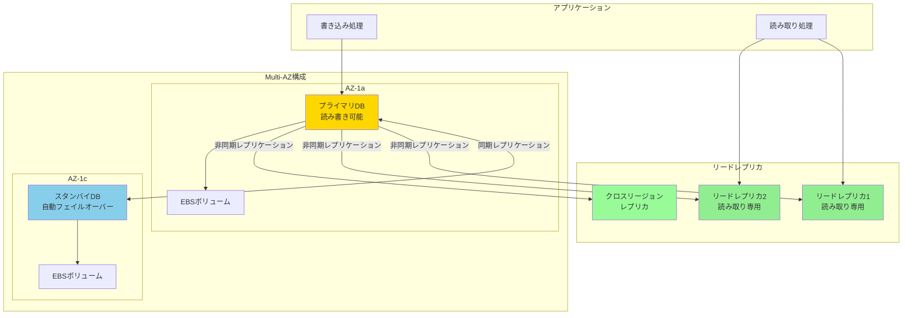
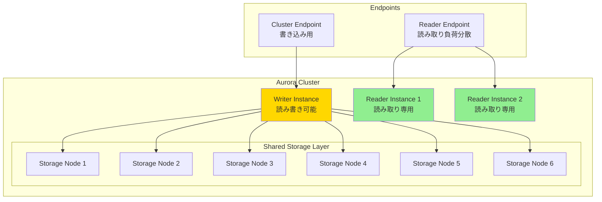
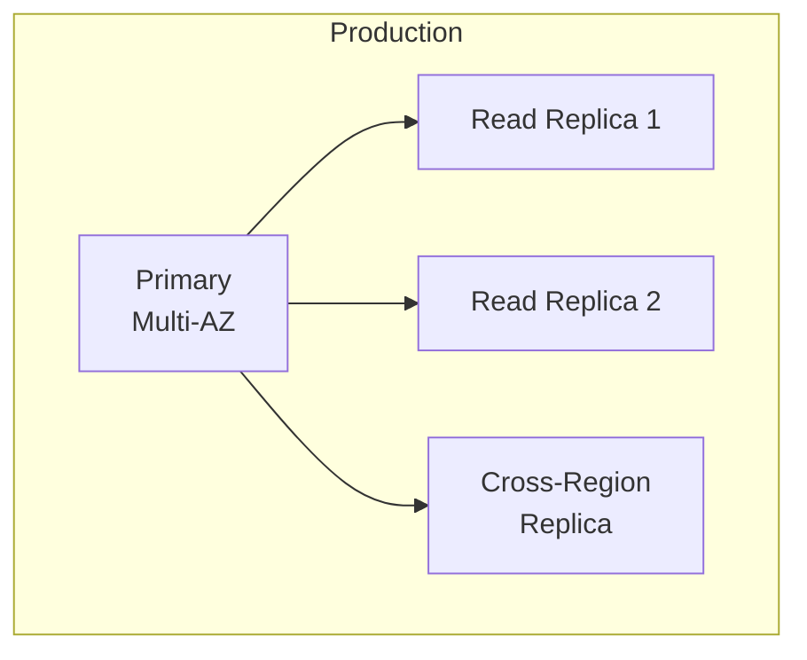

# About RDS & Database

> [!NOTE]
> このドキュメントはAWS RDS（Relational Database Service）に関する学習内容を体系的にまとめた要約版です。
> 詳細な実装例や日々の学習記録は、参照セクションのdaily-TILリンクをご確認ください。

## 目次

<details>
<summary>目次を開く</summary>

- [About RDS \& Database](#about-rds--database)
  - [目次](#目次)
  - [概要](#概要)
    - [キーポイント](#キーポイント)
  - [What - RDSとは何か](#what---rdsとは何か)
    - [基本概念](#基本概念)
      - [定義](#定義)
      - [対応エンジン](#対応エンジン)
    - [主要な特徴](#主要な特徴)
    - [アーキテクチャ](#アーキテクチャ)
      - [Aurora特有のアーキテクチャ](#aurora特有のアーキテクチャ)
  - [Why - なぜRDSが必要なのか](#why---なぜrdsが必要なのか)
    - [解決する課題](#解決する課題)
      - [従来の問題点](#従来の問題点)
      - [RDSによる解決策](#rdsによる解決策)
    - [メリット](#メリット)
      - [ビジネス面のメリット](#ビジネス面のメリット)
      - [技術面のメリット](#技術面のメリット)
    - [デメリット](#デメリット)
    - [他の選択肢との比較](#他の選択肢との比較)
      - [RDSとDynamoDBの使い分け](#rdsとdynamodbの使い分け)
  - [How - RDSの実装方法](#how---rdsの実装方法)
    - [基本的な使い方](#基本的な使い方)
      - [Terraformでの実装（Aurora）](#terraformでの実装aurora)
      - [パスワード管理（Secrets Manager）](#パスワード管理secrets-manager)
    - [ベストプラクティス](#ベストプラクティス)
      - [1. Multi-AZ構成](#1-multi-az構成)
      - [2. パラメータグループのカスタマイズ](#2-パラメータグループのカスタマイズ)
      - [3. 監視とアラート](#3-監視とアラート)
    - [よくある実装パターン](#よくある実装パターン)
      - [パターン1: 高可用性構成](#パターン1-高可用性構成)
      - [パターン2: 開発・本番環境の分離](#パターン2-開発本番環境の分離)
      - [パターン3: 分析用レプリカ](#パターン3-分析用レプリカ)
    - [トラブルシューティング](#トラブルシューティング)
      - [エラー1: 接続タイムアウト](#エラー1-接続タイムアウト)
      - [エラー2: ストレージ容量不足](#エラー2-ストレージ容量不足)
      - [エラー3: レプリカの遅延](#エラー3-レプリカの遅延)
  - [参照：daily-TIL](#参照daily-til)
    - [What関連](#what関連)
    - [Why関連](#why関連)
    - [How関連](#how関連)
  - [バージョン履歴](#バージョン履歴)

</details>

---

## 概要

AWS RDSは、クラウド上でリレーショナルデータベースを簡単にセットアップ、運用、スケールできるマネージドサービスです。MySQL、PostgreSQL、Oracle、SQL Server、MariaDB、Amazon Auroraなど複数のデータベースエンジンをサポートし、高可用性、自動バックアップ、セキュリティ機能を提供します。

### キーポイント

- **フルマネージド**: パッチ適用、バックアップ、レプリケーションを自動化
- **高可用性**: Multi-AZ配置による自動フェイルオーバー
- **Aurora**: AWSネイティブの高性能データベースエンジン

---

## What - RDSとは何か

### 基本概念

<details>
<summary>基本概念の詳細</summary>

RDSは、データベース管理の複雑さを軽減するAWSのマネージドデータベースサービスです。インフラストラクチャの管理をAWSに委譲し、アプリケーション開発に集中できます。

#### 定義

クラウド上でリレーショナルデータベースを簡単に設定、運用、スケールできるWebサービス。ハードウェアプロビジョニング、データベースセットアップ、パッチ適用、バックアップなどの管理タスクを自動化。

#### 対応エンジン

1. **Amazon Aurora**
   - MySQL/PostgreSQL互換
   - 最大5倍/3倍の性能向上
   - 自動ストレージスケーリング

2. **商用データベース**
   - Oracle Database
   - Microsoft SQL Server

3. **オープンソース**
   - MySQL
   - PostgreSQL
   - MariaDB

</details>

### 主要な特徴

<details>
<summary>特徴の詳細</summary>

1. **自動管理機能**
   - OSパッチの自動適用
   - 利点: 運用負荷の大幅削減

2. **高可用性アーキテクチャ**
   - Multi-AZ配置で99.95% SLA
   - 利点: 自動フェイルオーバーでダウンタイム最小化

3. **柔軟なスケーリング**
   - 垂直スケーリング（インスタンスサイズ変更）
   - 水平スケーリング（リードレプリカ追加）
   - 利点: 需要に応じた性能調整

4. **セキュリティ統合**
   - 保存時・転送時の暗号化
   - VPC内での分離
   - 利点: エンタープライズレベルのセキュリティ

</details>

### アーキテクチャ

<details>
<summary>レプリケーションアーキテクチャ</summary>



#### Aurora特有のアーキテクチャ



</details>

---

## Why - なぜRDSが必要なのか

### 解決する課題

<details>
<summary>課題の詳細</summary>

#### 従来の問題点

1. **運用負荷**
   - 影響: DBAが日々のメンテナンスに時間を費やす
   - 例: パッチ適用、バックアップ、モニタリング設定

2. **可用性の確保**
   - 影響: 手動でのフェイルオーバー設定が複雑
   - 例: レプリケーション設定、フェイルオーバー手順の構築

3. **スケーラビリティ**
   - 影響: 需要増加時の対応が遅れる
   - 例: ハードウェア調達、移行作業

#### RDSによる解決策

- 自動化された運用タスクで管理工数を80%削減
- Multi-AZ配置で自動フェイルオーバーを実現
- 数クリックでインスタンスサイズ変更可能

</details>

### メリット

<details>
<summary>メリットの詳細</summary>

#### ビジネス面のメリット

1. **運用コスト削減**
   - DBA工数: 80%削減
   - インフラコスト: オンデマンド利用で初期投資不要

2. **市場投入時間の短縮**
   - データベース構築: 数分で完了
   - 開発環境: テンプレートから即座に作成

3. **ビジネス継続性**
   - RPO（目標復旧時点）: 5分
   - RTO（目標復旧時間）: 数分（Multi-AZ）

#### 技術面のメリット

1. **自動化**
   - 日次バックアップ自動実行
   - OSパッチ自動適用

2. **パフォーマンス**
   - Aurora: 標準MySQLの5倍のスループット
   - リードレプリカによる読み取り負荷分散

</details>

### デメリット

<details>
<summary>デメリットと対策</summary>

| デメリット | 影響 | 対策 |
|-----------|------|------|
| カスタマイズ制限 | 特定のDB設定変更不可 | パラメータグループでカスタマイズ |
| ベンダーロックイン | AWS依存 | 標準SQLの使用、移行ツール準備 |
| コスト | 小規模では割高 | Reserved Instance、適切なサイジング |

</details>

### 他の選択肢との比較

<details>
<summary>比較表</summary>

| 項目 | RDS | EC2上の自己管理DB | DynamoDB |
|------|-----|------------------|----------|
| 管理負荷 | 低 | 高 | 最低 |
| カスタマイズ性 | 中 | 高 | 低 |
| コスト | 中 | 低〜高 | 従量課金 |
| スケーラビリティ | 垂直/水平 | 手動 | 自動・無限 |
| データモデル | リレーショナル | リレーショナル | NoSQL |

#### RDSとDynamoDBの使い分け

| 用途 | RDS | DynamoDB |
|------|-----|----------|
| 複雑なクエリ | ◎ | △ |
| トランザクション | ◎ | ○ |
| 大規模スケール | ○ | ◎ |
| 予測可能な負荷 | ◎ | ○ |
| 変動する負荷 | ○ | ◎ |

</details>

---

## How - RDSの実装方法

### 基本的な使い方

<details>
<summary>基本実装例</summary>

#### Terraformでの実装（Aurora）

```hcl
# DB Subnet Group
resource "aws_db_subnet_group" "main" {
  name       = "${var.project_name}-db-subnet-${var.environment}"
  subnet_ids = aws_subnet.private[*].id
  
  tags = {
    Name = "${var.project_name}-db-subnet-${var.environment}"
  }
}

# Security Group for RDS
resource "aws_security_group" "rds" {
  name_prefix = "${var.project_name}-rds-"
  vpc_id      = aws_vpc.main.id
  
  ingress {
    from_port       = 5432
    to_port         = 5432
    protocol        = "tcp"
    security_groups = [aws_security_group.app.id]
  }
  
  egress {
    from_port   = 0
    to_port     = 0
    protocol    = "-1"
    cidr_blocks = ["0.0.0.0/0"]
  }
  
  tags = {
    Name = "${var.project_name}-rds-${var.environment}"
  }
}

# Aurora Cluster
resource "aws_rds_cluster" "main" {
  cluster_identifier     = "${var.project_name}-${var.environment}"
  engine                 = "aurora-postgresql"
  engine_version         = "15.4"
  database_name          = var.database_name
  master_username        = "postgres"
  master_password        = random_password.rds_master.result
  
  db_subnet_group_name   = aws_db_subnet_group.main.name
  vpc_security_group_ids = [aws_security_group.rds.id]
  
  # Backup
  backup_retention_period = 7
  preferred_backup_window = "17:00-18:00"  # UTC
  
  # Encryption
  storage_encrypted = true
  kms_key_id       = aws_kms_key.rds.arn
  
  # Multi-AZ
  availability_zones = data.aws_availability_zones.available.names
  
  # Performance Insights
  enabled_cloudwatch_logs_exports = ["postgresql"]
  
  # Deletion Protection
  deletion_protection = var.environment == "production"
  
  tags = {
    Name        = "${var.project_name}-aurora-${var.environment}"
    Environment = var.environment
  }
}

# Aurora Instance
resource "aws_rds_cluster_instance" "main" {
  count              = var.aurora_instance_count
  identifier         = "${var.project_name}-${var.environment}-${count.index}"
  cluster_identifier = aws_rds_cluster.main.id
  instance_class     = var.db_instance_class
  engine             = aws_rds_cluster.main.engine
  engine_version     = aws_rds_cluster.main.engine_version
  
  performance_insights_enabled = true
  monitoring_interval         = 60
  monitoring_role_arn        = aws_iam_role.rds_monitoring.arn
  
  tags = {
    Name = "${var.project_name}-aurora-instance-${count.index}-${var.environment}"
  }
}
```

#### パスワード管理（Secrets Manager）

```hcl
# Generate random password
resource "random_password" "rds_master" {
  length  = 32
  special = true
  override_special = "!#$%&*()-_=+[]{}<>:?"
}

# Store in Secrets Manager
resource "aws_secretsmanager_secret" "rds_password" {
  name = "${var.project_name}-rds-password-${var.environment}"
  
  tags = {
    Name = "${var.project_name}-rds-password-${var.environment}"
  }
}

resource "aws_secretsmanager_secret_version" "rds_password" {
  secret_id     = aws_secretsmanager_secret.rds_password.id
  secret_string = jsonencode({
    username = aws_rds_cluster.main.master_username
    password = random_password.rds_master.result
    engine   = "postgres"
    host     = aws_rds_cluster.main.endpoint
    port     = aws_rds_cluster.main.port
    dbname   = aws_rds_cluster.main.database_name
  })
}
```

</details>

### ベストプラクティス

<details>
<summary>推奨される実装方法</summary>

#### 1. Multi-AZ構成

```hcl
# RDS Instance (非Aurora)
resource "aws_db_instance" "main" {
  multi_az = true  # 高可用性
  
  # スナップショットからの復元時も維持
  lifecycle {
    ignore_changes = [multi_az]
  }
}
```

**理由**: 自動フェイルオーバーで可用性99.95%を実現

#### 2. パラメータグループのカスタマイズ

```hcl
resource "aws_rds_cluster_parameter_group" "custom" {
  family = "aurora-postgresql15"
  name   = "${var.project_name}-aurora-pg15"
  
  parameter {
    name  = "shared_preload_libraries"
    value = "pg_stat_statements"
  }
  
  parameter {
    name  = "log_statement"
    value = "all"
  }
}
```

**理由**: アプリケーション要件に応じた最適化

#### 3. 監視とアラート

```hcl
resource "aws_cloudwatch_metric_alarm" "database_cpu" {
  alarm_name          = "${var.project_name}-rds-high-cpu"
  comparison_operator = "GreaterThanThreshold"
  evaluation_periods  = "2"
  metric_name         = "CPUUtilization"
  namespace           = "AWS/RDS"
  period              = "300"
  statistic           = "Average"
  threshold           = "80"
  alarm_description   = "This metric monitors RDS CPU utilization"
  
  dimensions = {
    DBClusterIdentifier = aws_rds_cluster.main.id
  }
}
```

**理由**: 問題の早期発見と対応

</details>

### よくある実装パターン

<details>
<summary>実装パターン集</summary>

#### パターン1: 高可用性構成

**用途**: ミッションクリティカルなアプリケーション



```hcl
# メインクラスター
resource "aws_rds_cluster" "main" {
  # ... 基本設定
  backup_retention_period = 35  # 最大保持
  enabled_cloudwatch_logs_exports = ["postgresql"]
}

# リードレプリカ
resource "aws_rds_cluster_instance" "reader" {
  count              = 2
  identifier         = "${var.project_name}-reader-${count.index}"
  cluster_identifier = aws_rds_cluster.main.id
  instance_class     = "db.r6g.large"
}
```

#### パターン2: 開発・本番環境の分離

**用途**: 環境別のデータベース管理

```hcl
# 開発環境（コスト最適化）
module "rds_dev" {
  source = "./modules/rds"
  
  environment    = "development"
  instance_class = "db.t3.micro"
  instance_count = 1
  backup_retention_period = 1
  deletion_protection = false
}

# 本番環境（高可用性）
module "rds_prod" {
  source = "./modules/rds"
  
  environment    = "production"
  instance_class = "db.r6g.xlarge"
  instance_count = 3
  backup_retention_period = 35
  deletion_protection = true
}
```

#### パターン3: 分析用レプリカ

**用途**: 本番影響なしの分析処理

```hcl
# 分析用の大型リードレプリカ
resource "aws_db_instance" "analytics" {
  identifier     = "${var.project_name}-analytics"
  replicate_source_db = aws_db_instance.main.identifier
  
  instance_class = "db.r6g.4xlarge"  # 分析用に大型インスタンス
  
  # 別のパラメータグループ
  parameter_group_name = aws_db_parameter_group.analytics.name
}
```

</details>

### トラブルシューティング

<details>
<summary>よくある問題と解決方法</summary>

#### エラー1: 接続タイムアウト

**原因**: セキュリティグループまたはネットワーク設定の問題
**解決方法**:

```bash
# セキュリティグループの確認
aws ec2 describe-security-groups \
  --group-ids sg-xxxxxx \
  --query 'SecurityGroups[0].IpPermissions'

# ネットワーク接続テスト
telnet cluster-endpoint.region.rds.amazonaws.com 5432
```

#### エラー2: ストレージ容量不足

**原因**: 自動拡張が無効またはログの蓄積
**解決方法**:

```hcl
# Auroraは自動拡張
# 通常のRDSの場合
resource "aws_db_instance" "main" {
  allocated_storage     = 100
  max_allocated_storage = 1000  # 自動拡張を有効化
}
```

#### エラー3: レプリカの遅延

**原因**: 書き込み負荷が高い、またはレプリカのスペック不足
**解決方法**:

```sql
-- レプリカラグの確認（PostgreSQL）
SELECT 
  client_addr,
  state,
  sent_lsn,
  write_lsn,
  flush_lsn,
  replay_lsn,
  write_lag,
  flush_lag,
  replay_lag
FROM pg_stat_replication;
```

</details>

---

## 参照：daily-TIL

このドキュメントは以下のdaily-TILファイルから情報を集約・整理しています：

### What関連

- [2025.08.04.16.34 - what_rds_replication.md](../daily/2025.08.04.16.34_what_rds_replication.md)
  - RDSレプリケーションの詳細（Multi-AZ、リードレプリカ）
- [2025.08.07.11.48 - what_aws_rds_cluster_terraform_resource.md](../daily/2025.08.07.11.48_what_aws_rds_cluster_terraform_resource.md)
  - Terraform aws_rds_clusterリソースの詳細
- [2025.08.07.06.18 - what_dynamodb.md](../daily/2025.08.07.06.18_what_dynamodb.md)
  - DynamoDBとの比較理解用

### Why関連

- [2025.08.07.06.25 - why_dynamodb_does_not_interfere_with_rds.md](../daily/2025.08.07.06.25_why_dynamodb_does_not_interfere_with_rds.md)
  - RDSとDynamoDBが競合しない理由

### How関連

- [2025.08.07.11.52 - how_secure_rds_password_with_secrets_manager.md](../daily/2025.08.07.11.52_how_secure_rds_password_with_secrets_manager.md)
  - Secrets Managerでのパスワード管理
- [2025.08.07.12.09 - how_use_secrets_manager_for_rds_in_terraform.md](../daily/2025.08.07.12.09_how_use_secrets_manager_for_rds_in_terraform.md)
  - TerraformでのSecrets Manager実装
- [2025.08.07.06.28 - how_to_use_distinction_between_rds_and_dynamodb.md](../daily/2025.08.07.06.28_how_to_use_distinction_between_rds_and_dynamodb.md)
  - RDSとDynamoDBの使い分け方

---

## バージョン履歴

| バージョン | 更新日 | 主な変更内容 |
|-----------|---------|-------------|
| 1.0.0 | 2025-08-11 | 初版作成 |

---

> [!TIP]
> より詳細な情報や具体的な実装例については、上記のdaily-TILリンクを参照してください。
> このドキュメントは定期的に更新され、新しい学習内容が追加されます。