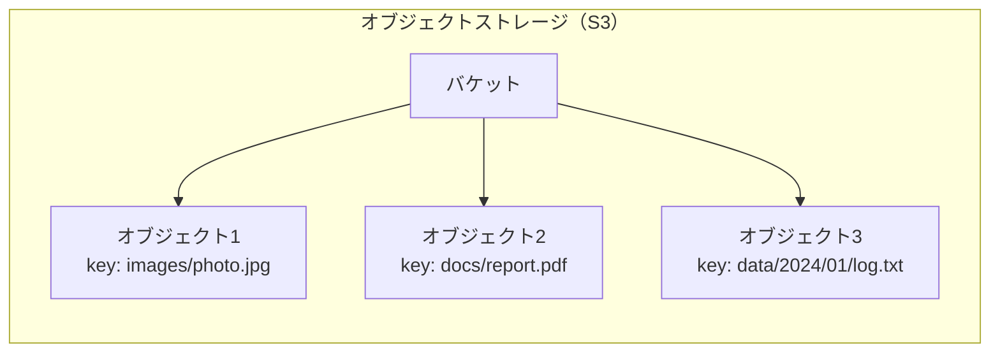
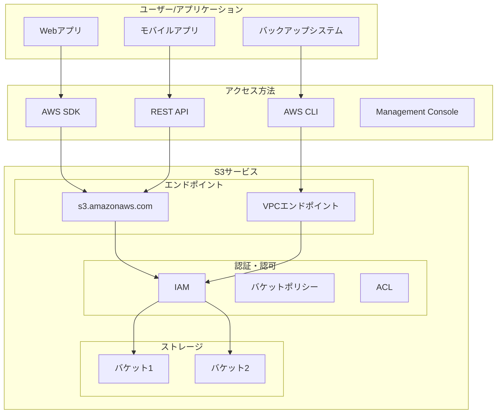

# About S3 (Simple Storage Service)

> [!NOTE]
> このドキュメントはAWS S3（Simple Storage Service）に関する学習内容を体系的にまとめた要約版です。
> 詳細な実装例や日々の学習記録は、参照セクションのdaily-TILリンクをご確認ください。

## 目次

<details>
<summary>目次を開く</summary>

- [About S3 (Simple Storage Service)](#about-s3-simple-storage-service)
  - [目次](#目次)
  - [概要](#概要)
    - [キーポイント](#キーポイント)
  - [What - S3とは何か](#what---s3とは何か)
    - [基本概念](#基本概念)
      - [オブジェクトストレージとは](#オブジェクトストレージとは)
      - [S3の構成要素](#s3の構成要素)
    - [主要な特徴](#主要な特徴)
    - [アーキテクチャ](#アーキテクチャ)
      - [アクセスパターン](#アクセスパターン)
  - [Why - なぜS3を使うのか](#why---なぜs3を使うのか)
    - [解決する課題](#解決する課題)
      - [従来のストレージの問題点](#従来のストレージの問題点)
      - [S3による解決](#s3による解決)
    - [メリット](#メリット)
      - [ビジネス面のメリット](#ビジネス面のメリット)
      - [技術面のメリット](#技術面のメリット)
    - [デメリット](#デメリット)
    - [他の選択肢との比較](#他の選択肢との比較)
  - [How - S3の実装方法](#how---s3の実装方法)
    - [基本的な使い方](#基本的な使い方)
      - [バケットの作成と設定](#バケットの作成と設定)
      - [基本的なオペレーション](#基本的なオペレーション)
    - [セキュリティ設定](#セキュリティ設定)
      - [1. パブリックアクセスブロック（必須）](#1-パブリックアクセスブロック必須)
      - [2. バケットポリシー](#2-バケットポリシー)
      - [3. 暗号化の強制](#3-暗号化の強制)
    - [高度な機能](#高度な機能)
      - [1. ライフサイクル管理](#1-ライフサイクル管理)
      - [2. イベント通知](#2-イベント通知)
      - [3. 静的ウェブサイトホスティング](#3-静的ウェブサイトホスティング)
      - [4. VPCエンドポイント](#4-vpcエンドポイント)
    - [ベストプラクティス](#ベストプラクティス)
      - [1. バケット命名規則](#1-バケット命名規則)
      - [2. タグ付け戦略](#2-タグ付け戦略)
      - [3. コスト最適化](#3-コスト最適化)
      - [4. 監視とロギング](#4-監視とロギング)
      - [5. 災害復旧](#5-災害復旧)
  - [参照：daily-TIL](#参照daily-til)
    - [What関連](#what関連)
    - [Why関連](#why関連)
    - [How関連](#how関連)
  - [バージョン履歴](#バージョン履歴)

</details>

---

## 概要

AWS S3（Simple Storage Service）は、業界をリードするスケーラビリティ、データ可用性、セキュリティ、パフォーマンスを提供するオブジェクトストレージサービスです。あらゆる規模のデータを、いつでも、どこからでも保存および取得できます。

### キーポイント

- **無制限のストレージ**: 容量を気にせずデータを保存
- **高い耐久性**: 99.999999999%（イレブンナイン）の耐久性
- **柔軟なアクセス制御**: きめ細かいセキュリティ設定
- **グローバルアクセス**: 世界中どこからでもアクセス可能

---

## What - S3とは何か

### 基本概念

<details>
<summary>基本概念の詳細</summary>

S3は、インターネット経由でデータを保存・取得できるオブジェクトストレージサービスです。

#### オブジェクトストレージとは

従来のファイルシステムとは異なり、階層構造を持たないフラットな名前空間でデータを管理します。



#### S3の構成要素

1. **バケット（Bucket）**
   - オブジェクトを格納するコンテナ
   - グローバルに一意な名前が必要
   - リージョンに属する

2. **オブジェクト（Object）**
   - 実際のデータとメタデータ
   - 最大5TBまでのファイル
   - 一意のキー（名前）で識別

3. **キー（Key）**
   - オブジェクトの一意の識別子
   - スラッシュ（/）で階層的に見せることも可能

</details>

### 主要な特徴

<details>
<summary>特徴の詳細</summary>

1. **スケーラビリティ**
   - 無制限のストレージ容量
   - 自動的なスケーリング
   - パフォーマンスの劣化なし

2. **耐久性と可用性**
   - 99.999999999%（11 9's）の耐久性
   - 99.99%の可用性SLA
   - 複数のアベイラビリティゾーンに自動レプリケーション

3. **セキュリティ**
   - デフォルトでプライベート
   - きめ細かいアクセス制御
   - 暗号化オプション（保存時・転送時）

4. **ストレージクラス**
   - Standard: 頻繁にアクセスするデータ
   - Standard-IA: 低頻度アクセス
   - Glacier: アーカイブ用
   - Intelligent-Tiering: 自動階層化

</details>

### アーキテクチャ

<details>
<summary>アーキテクチャ図と説明</summary>



#### アクセスパターン

1. **インターネット経由**
   - パブリックエンドポイント使用
   - SSL/TLS暗号化通信

2. **VPCエンドポイント経由**
   - プライベート接続
   - データ転送料金の削減

3. **Direct Connect経由**
   - 専用線接続
   - 安定した帯域幅

</details>

---

## Why - なぜS3を使うのか

### 解決する課題

<details>
<summary>課題の詳細</summary>

#### 従来のストレージの問題点

1. **容量の制限**
   - 物理的な容量制限
   - 事前の容量計画が必要
   - 拡張時のダウンタイム

2. **管理の複雑さ**
   - ハードウェアの保守
   - RAID構成の管理
   - バックアップの実装

3. **コスト効率**
   - 初期投資が大きい
   - 使用していない容量のコスト
   - 運用人員のコスト

#### S3による解決

- **無制限の容量**: 事前計画不要、使った分だけ課金
- **フルマネージド**: ハードウェア管理不要
- **高い耐久性**: 自動レプリケーション、バックアップ不要

</details>

### メリット

<details>
<summary>メリットの詳細</summary>

#### ビジネス面のメリット

1. **コスト最適化**
   - 初期投資ゼロ
   - 従量課金制
   - ストレージクラスによる最適化

2. **ビジネスアジリティ**
   - 即座に利用開始
   - グローバル展開が容易
   - 需要に応じた自動スケール

3. **信頼性**
   - SLAによる保証
   - データ損失リスクの最小化
   - 災害復旧の簡素化

#### 技術面のメリット

1. **統合の容易さ**
   - REST APIによる標準的なアクセス
   - 多言語SDK提供
   - AWSサービスとの連携

2. **高度な機能**
   - バージョニング
   - ライフサイクル管理
   - イベント通知
   - 静的ウェブサイトホスティング

</details>

### デメリット

<details>
<summary>デメリットと対策</summary>

| デメリット | 影響 | 対策 |
|-----------|------|------|
| レイテンシ | ファイルシステムより遅い | CloudFrontでキャッシュ |
| 一貫性モデル | 即座の一貫性でない場合がある | 2020年12月以降は強い一貫性 |
| コスト予測 | 使用量により変動 | コスト監視とアラート設定 |
| ベンダーロックイン | AWS依存 | 標準的なAPIを使用 |

</details>

### 他の選択肢との比較

<details>
<summary>比較表</summary>

| 項目 | S3 | EBS | EFS | オンプレミスNAS |
|------|-----|-----|-----|----------------|
| タイプ | オブジェクト | ブロック | ファイル | ファイル |
| 容量 | 無制限 | 64TiB | ペタバイト級 | 物理制限あり |
| 耐久性 | 99.999999999% | 99.999% | 99.999999999% | RAID依存 |
| アクセス | HTTP/HTTPS | EC2のみ | 複数EC2 | ネットワーク内 |
| 料金 | $0.023/GB | $0.10/GB | $0.30/GB | 初期投資大 |

</details>

---

## How - S3の実装方法

### 基本的な使い方

<details>
<summary>基本実装例</summary>

#### バケットの作成と設定

```hcl
# Terraformでのバケット作成
resource "aws_s3_bucket" "example" {
  bucket = "my-unique-bucket-name-12345"
  
  tags = {
    Name        = "My S3 Bucket"
    Environment = "Production"
  }
}

# バージョニングの有効化
resource "aws_s3_bucket_versioning" "example" {
  bucket = aws_s3_bucket.example.id
  
  versioning_configuration {
    status = "Enabled"
  }
}

# 暗号化の設定
resource "aws_s3_bucket_server_side_encryption_configuration" "example" {
  bucket = aws_s3_bucket.example.id
  
  rule {
    apply_server_side_encryption_by_default {
      sse_algorithm = "AES256"
    }
  }
}
```

#### 基本的なオペレーション

```bash
# ファイルのアップロード
aws s3 cp myfile.txt s3://my-bucket/

# フォルダごとアップロード
aws s3 sync ./local-folder s3://my-bucket/folder/

# ファイルのダウンロード
aws s3 cp s3://my-bucket/myfile.txt ./

# ファイルの一覧表示
aws s3 ls s3://my-bucket/
```

</details>

### セキュリティ設定

<details>
<summary>セキュリティ実装例</summary>

#### 1. パブリックアクセスブロック（必須）

```hcl
resource "aws_s3_bucket_public_access_block" "example" {
  bucket = aws_s3_bucket.example.id
  
  block_public_acls       = true
  block_public_policy     = true
  ignore_public_acls      = true
  restrict_public_buckets = true
}
```

#### 2. バケットポリシー

```hcl
resource "aws_s3_bucket_policy" "example" {
  bucket = aws_s3_bucket.example.id
  
  policy = jsonencode({
    Version = "2012-10-17"
    Statement = [
      {
        Sid    = "AllowSpecificIAMRole"
        Effect = "Allow"
        Principal = {
          AWS = aws_iam_role.app.arn
        }
        Action = [
          "s3:GetObject",
          "s3:PutObject"
        ]
        Resource = "${aws_s3_bucket.example.arn}/*"
      }
    ]
  })
}
```

#### 3. 暗号化の強制

```json
{
  "Version": "2012-10-17",
  "Statement": [
    {
      "Sid": "DenyUnencryptedObjectUploads",
      "Effect": "Deny",
      "Principal": "*",
      "Action": "s3:PutObject",
      "Resource": "arn:aws:s3:::my-bucket/*",
      "Condition": {
        "StringNotEquals": {
          "s3:x-amz-server-side-encryption": "AES256"
        }
      }
    }
  ]
}
```

</details>

### 高度な機能

<details>
<summary>高度な機能の実装</summary>

#### 1. ライフサイクル管理

```hcl
resource "aws_s3_bucket_lifecycle_configuration" "example" {
  bucket = aws_s3_bucket.example.id
  
  rule {
    id     = "archive-old-objects"
    status = "Enabled"
    
    transition {
      days          = 30
      storage_class = "STANDARD_IA"
    }
    
    transition {
      days          = 90
      storage_class = "GLACIER"
    }
    
    expiration {
      days = 365
    }
  }
}
```

#### 2. イベント通知

```hcl
resource "aws_s3_bucket_notification" "example" {
  bucket = aws_s3_bucket.example.id
  
  lambda_function {
    lambda_function_arn = aws_lambda_function.processor.arn
    events              = ["s3:ObjectCreated:*"]
    filter_prefix       = "uploads/"
    filter_suffix       = ".jpg"
  }
}
```

#### 3. 静的ウェブサイトホスティング

```hcl
resource "aws_s3_bucket_website_configuration" "example" {
  bucket = aws_s3_bucket.example.id
  
  index_document {
    suffix = "index.html"
  }
  
  error_document {
    key = "error.html"
  }
}
```

#### 4. VPCエンドポイント

```hcl
resource "aws_vpc_endpoint" "s3" {
  vpc_id       = aws_vpc.main.id
  service_name = "com.amazonaws.${var.region}.s3"
  
  route_table_ids = [aws_route_table.private.id]
  
  policy = jsonencode({
    Version = "2012-10-17"
    Statement = [
      {
        Effect    = "Allow"
        Principal = "*"
        Action    = "*"
        Resource  = "*"
      }
    ]
  })
}
```

</details>

### ベストプラクティス

<details>
<summary>推奨される実装方法</summary>

#### 1. バケット命名規則

```hcl
locals {
  bucket_name = "${var.project_name}-${var.environment}-${var.purpose}-${data.aws_caller_identity.current.account_id}"
}

# 例: myapp-prod-logs-123456789012
resource "aws_s3_bucket" "logs" {
  bucket = local.bucket_name
}
```

#### 2. タグ付け戦略

```hcl
locals {
  common_tags = {
    Project     = var.project_name
    Environment = var.environment
    ManagedBy   = "Terraform"
    CostCenter  = var.cost_center
    Owner       = var.owner_email
  }
}

resource "aws_s3_bucket" "example" {
  bucket = local.bucket_name
  tags   = local.common_tags
}
```

#### 3. コスト最適化

```hcl
# Intelligent-Tieringの活用
resource "aws_s3_bucket_intelligent_tiering_configuration" "example" {
  bucket = aws_s3_bucket.example.id
  name   = "entire-bucket"
  
  tiering {
    access_tier = "DEEP_ARCHIVE_ACCESS"
    days        = 180
  }
  
  tiering {
    access_tier = "ARCHIVE_ACCESS"
    days        = 90
  }
}
```

#### 4. 監視とロギング

```hcl
# アクセスログの設定
resource "aws_s3_bucket_logging" "example" {
  bucket = aws_s3_bucket.example.id
  
  target_bucket = aws_s3_bucket.log_bucket.id
  target_prefix = "access-logs/"
}

# CloudWatchメトリクスの設定
resource "aws_cloudwatch_metric_alarm" "bucket_size" {
  alarm_name          = "${local.bucket_name}-size-alarm"
  comparison_operator = "GreaterThanThreshold"
  evaluation_periods  = "1"
  metric_name        = "BucketSizeBytes"
  namespace          = "AWS/S3"
  period             = "86400"
  statistic          = "Average"
  threshold          = "1000000000000"  # 1TB
  
  dimensions = {
    BucketName = aws_s3_bucket.example.id
    StorageType = "StandardStorage"
  }
}
```

#### 5. 災害復旧

```hcl
# クロスリージョンレプリケーション
resource "aws_s3_bucket_replication_configuration" "example" {
  role   = aws_iam_role.replication.arn
  bucket = aws_s3_bucket.source.id
  
  rule {
    id     = "replicate-all"
    status = "Enabled"
    
    destination {
      bucket        = aws_s3_bucket.destination.arn
      storage_class = "STANDARD_IA"
    }
  }
}
```

</details>

---

## 参照：daily-TIL

このドキュメントは以下のdaily-TILファイルから情報を集約・整理しています：

### What関連

- [2025.08.07.09.21 - what_s3_bucket_policy.md](../daily/2025.08.07.09.21_what_s3_bucket_policy.md)
  - S3バケットポリシーの詳細設定
- [2025.08.07.09.18 - what_s3_bucket_versioning.md](../daily/2025.08.07.09.18_what_s3_bucket_versioning.md)
  - バージョニング機能の詳細
- [2025.08.07.08.00 - what_aws_s3_bucket_public_access_block.md](../daily/2025.08.07.08.00_what_aws_s3_bucket_public_access_block.md)
  - パブリックアクセスブロックの重要性
- [2025.08.07.07.53 - what_aws_s3_bucket_server_side_encryption_configuration.md](../daily/2025.08.07.07.53_what_aws_s3_bucket_server_side_encryption_configuration.md)
  - 暗号化設定の詳細
- [2025.08.02.11.50 - what_s3_only_static_assets_broadcasting.md](../daily/2025.08.02.11.50_what_s3_only_static_assets_broadcasting.md)
  - 静的ウェブサイトホスティング

### Why関連

- [2025.08.04.15.08 - why_s3_assigned_outside_of_subnet.md](../daily/2025.08.04.15.08_why_s3_assigned_outside_of_subnet.md)
  - S3がVPC外に存在する理由
- [2025.08.07.09.07 - why_block_public_acls_prevents_new_acl_settings.md](../daily/2025.08.07.09.07_why_block_public_acls_prevents_new_acl_settings.md)
  - パブリックACLブロックの必要性

### How関連

- [2025.08.04.15.13 - what_s3_inside_subnet_patterns.md](../daily/2025.08.04.15.13_what_s3_inside_subnet_patterns.md)
  - VPCからのS3アクセスパターン

---

## バージョン履歴

| バージョン | 更新日 | 主な変更内容 |
|-----------|---------|-------------|
| 1.0.0 | 2025-08-11 | 初版作成 |

---

> [!TIP]
> より詳細な情報や具体的な実装例については、上記のdaily-TILリンクを参照してください。
> このドキュメントは定期的に更新され、新しい学習内容が追加されます。
