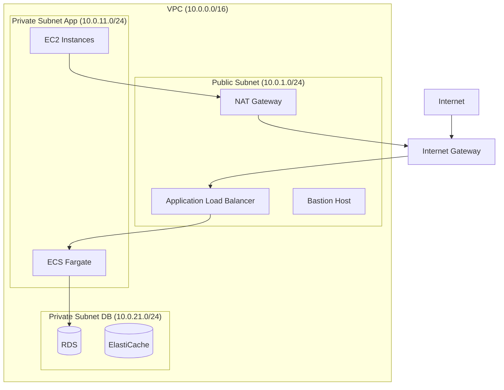
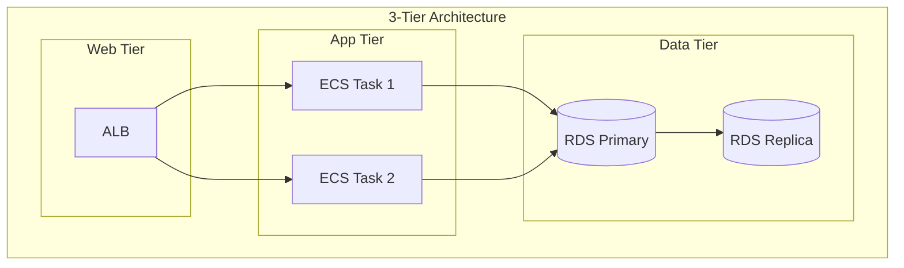
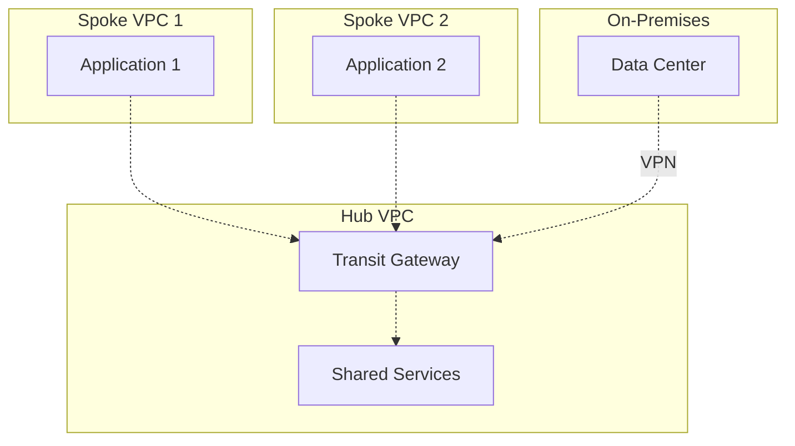

# About VPC & Networking

> [!NOTE]
> このドキュメントはAWS VPCとネットワーキングに関する学習内容を体系的にまとめた要約版です。
> 詳細な実装例や日々の学習記録は、参照セクションのdaily-TILリンクをご確認ください。

## 目次

<details>
<summary>目次を開く</summary>

- [About VPC \& Networking](#about-vpc--networking)
  - [目次](#目次)
  - [概要](#概要)
    - [キーポイント](#キーポイント)
  - [What - VPCとネットワーキングとは何か](#what---vpcとネットワーキングとは何か)
    - [基本概念](#基本概念)
      - [定義](#定義)
      - [構成要素](#構成要素)
    - [主要な特徴](#主要な特徴)
    - [アーキテクチャ](#アーキテクチャ)
      - [レイヤー構成](#レイヤー構成)
      - [データフロー](#データフロー)
  - [Why - なぜVPCが必要なのか](#why---なぜvpcが必要なのか)
    - [解決する課題](#解決する課題)
      - [従来の問題点](#従来の問題点)
      - [VPCによる解決策](#vpcによる解決策)
    - [メリット](#メリット)
      - [ビジネス面のメリット](#ビジネス面のメリット)
      - [技術面のメリット](#技術面のメリット)
    - [デメリット](#デメリット)
    - [他の選択肢との比較](#他の選択肢との比較)
  - [How - VPCの実装方法](#how---vpcの実装方法)
    - [基本的な使い方](#基本的な使い方)
      - [セットアップ](#セットアップ)
      - [基本的な実装](#基本的な実装)
      - [実行例](#実行例)
    - [ベストプラクティス](#ベストプラクティス)
      - [1. CIDR設計](#1-cidr設計)
      - [2. セキュリティグループの階層化](#2-セキュリティグループの階層化)
      - [3. VPC Flow Logsの有効化](#3-vpc-flow-logsの有効化)
    - [よくある実装パターン](#よくある実装パターン)
      - [パターン1: 3層アーキテクチャ](#パターン1-3層アーキテクチャ)
      - [パターン2: ハブ\&スポーク](#パターン2-ハブスポーク)
      - [パターン3: マルチリージョン](#パターン3-マルチリージョン)
    - [トラブルシューティング](#トラブルシューティング)
      - [エラー1: サブネット間の通信不可](#エラー1-サブネット間の通信不可)
      - [エラー2: インターネットアクセス不可](#エラー2-インターネットアクセス不可)
      - [エラー3: DNS解決の失敗](#エラー3-dns解決の失敗)
  - [参照：daily-TIL](#参照daily-til)
    - [What関連](#what関連)
    - [Why関連](#why関連)
    - [How関連](#how関連)
  - [バージョン履歴](#バージョン履歴)

</details>

---

## 概要

AWS VPC（Virtual Private Cloud）は、AWS上に構築する仮想ネットワークです。完全に分離されたネットワーク環境を提供し、IPアドレス範囲、サブネット、ルートテーブル、ネットワークゲートウェイを完全に制御できます。

### キーポイント

- **完全な分離**: 他のAWSアカウントから完全に分離された仮想ネットワーク
- **柔軟な設計**: カスタマイズ可能なIPアドレス範囲とサブネット構成
- **セキュリティ制御**: セキュリティグループとネットワークACLによる多層防御

---

## What - VPCとネットワーキングとは何か

### 基本概念

<details>
<summary>基本概念の詳細</summary>

VPCは、AWS上で論理的に分離されたセクションを作成し、定義した仮想ネットワーク内でAWSリソースを起動できるサービスです。

#### 定義

IPアドレス範囲の選択、サブネットの作成、ルートテーブルとネットワークゲートウェイの設定など、仮想ネットワーキング環境を完全に制御可能なサービス。

#### 構成要素

1. **VPC本体**
   - CIDR範囲: /16から/28まで
   - DNS設定: enable_dns_support, enable_dns_hostnames
   - テナンシー: default, dedicated, host

2. **サブネット**
   - パブリックサブネット: インターネットゲートウェイへの経路を持つ
   - プライベートサブネット: インターネットへの直接経路なし
   - map_public_ip_on_launch設定

3. **ルーティング**
   - ルートテーブル: トラフィックの経路を定義
   - ルートテーブル関連付け: サブネットとルートテーブルの紐付け

</details>

### 主要な特徴

<details>
<summary>特徴の詳細</summary>

1. **マルチAZ対応**
   - 複数のアベイラビリティゾーンにまたがるサブネット配置
   - 利点: 高可用性とフォールトトレランス

2. **セキュリティ層**
   - セキュリティグループ: インスタンスレベルのファイアウォール
   - ネットワークACL: サブネットレベルのファイアウォール
   - 利点: 多層防御による強固なセキュリティ

3. **監視機能**
   - VPC Flow Logs: トラフィックの記録と分析
   - 利点: セキュリティ監査とトラブルシューティング

</details>

### アーキテクチャ

<details>
<summary>アーキテクチャ図と説明</summary>



#### レイヤー構成

- **パブリック層**: インターネットゲートウェイに接続、パブリックIP保有
- **プライベートアプリ層**: NATゲートウェイ経由でインターネットアクセス
- **プライベートDB層**: 完全に隔離、アプリ層からのみアクセス可能

#### データフロー

1. インターネットからALBへのインバウンドトラフィック
2. ALBからプライベートサブネットのアプリケーションへ転送
3. アプリケーションからデータベースへの内部通信
4. NATゲートウェイ経由でのアウトバウンド通信

</details>

---

## Why - なぜVPCが必要なのか

### 解決する課題

<details>
<summary>課題の詳細</summary>

#### 従来の問題点

1. **セキュリティの懸念**
   - 影響: パブリッククラウドでの分離不足
   - 例: 他テナントとのリソース共有によるリスク

2. **ネットワーク制御の欠如**
   - 影響: IPアドレス管理の困難さ
   - 例: オンプレミスとの統合時の制約

#### VPCによる解決策

- 完全に分離された仮想ネットワーク環境
- カスタマイズ可能なIPアドレス範囲
- オンプレミスとのVPN/Direct Connect接続

</details>

### メリット

<details>
<summary>メリットの詳細</summary>

#### ビジネス面のメリット

1. **コンプライアンス対応**
   - データの地理的分離とアクセス制御
   - 監査ログの完全な記録

2. **コスト最適化**
   - 必要なリソースのみにパブリックIP割り当て
   - NATゲートウェイの共有によるコスト削減

3. **災害対策**
   - マルチAZ構成による自動フェイルオーバー
   - バックアップサイトへの迅速な切り替え

#### 技術面のメリット

1. **ネットワーク分離**
   - 環境（開発/本番）の完全分離
   - マイクロサービス間の通信制御

2. **接続性**
   - オンプレミスとのハイブリッド構成
   - 複数VPC間のピアリング接続

</details>

### デメリット

<details>
<summary>デメリットと対策</summary>

| デメリット | 影響 | 対策 |
|-----------|------|------|
| 設計の複雑さ | 初期構築に時間がかかる | テンプレートやモジュールの活用 |
| IPアドレス枯渇 | 拡張性の制限 | 事前の適切なCIDR設計 |
| 通信コスト | リージョン間/AZ間の転送料金 | エンドポイント活用とトラフィック最適化 |

</details>

### 他の選択肢との比較

<details>
<summary>比較表</summary>

| 項目 | AWS VPC | Azure VNet | GCP VPC |
|------|---------|------------|---------|
| グローバル性 | リージョン単位 | リージョン単位 | グローバル |
| サブネット | AZ単位 | リージョン内自由 | リージョン単位 |
| ルーティング | ルートテーブル | システムルート+UDR | 自動+カスタム |
| 料金 | 無料（通信は有料） | 無料（通信は有料） | 無料（通信は有料） |

</details>

---

## How - VPCの実装方法

### 基本的な使い方

<details>
<summary>基本実装例</summary>

#### セットアップ

```bash
# AWS CLIでの確認
aws ec2 describe-vpcs
aws ec2 describe-subnets
```

#### 基本的な実装

```hcl
# VPCの作成
resource "aws_vpc" "main" {
  cidr_block           = "10.0.0.0/16"
  enable_dns_support   = true
  enable_dns_hostnames = true
  
  tags = {
    Name = "${var.project_name}-vpc-${var.environment}"
  }
}

# パブリックサブネット
resource "aws_subnet" "public" {
  count                   = length(var.availability_zones)
  vpc_id                  = aws_vpc.main.id
  cidr_block              = cidrsubnet(aws_vpc.main.cidr_block, 8, count.index)
  availability_zone       = var.availability_zones[count.index]
  map_public_ip_on_launch = true
  
  tags = {
    Name = "${var.project_name}-public-${var.availability_zones[count.index]}"
    Type = "public"
  }
}

# インターネットゲートウェイ
resource "aws_internet_gateway" "main" {
  vpc_id = aws_vpc.main.id
  
  tags = {
    Name = "${var.project_name}-igw"
  }
}
```

#### 実行例

```bash
# Terraformでの適用
terraform init
terraform plan -var-file=environments/prod.tfvars
terraform apply -auto-approve
```

</details>

### ベストプラクティス

<details>
<summary>推奨される実装方法</summary>

#### 1. CIDR設計

```hcl
locals {
  vpc_cidr = "10.0.0.0/16"
  
  # サブネット計画
  subnet_cidrs = {
    public  = ["10.0.1.0/24", "10.0.2.0/24", "10.0.3.0/24"]
    private = ["10.0.11.0/24", "10.0.12.0/24", "10.0.13.0/24"]
    db      = ["10.0.21.0/24", "10.0.22.0/24", "10.0.23.0/24"]
  }
}
```

**理由**: 将来の拡張を考慮した計画的なアドレス配分

#### 2. セキュリティグループの階層化

```hcl
# ALB用セキュリティグループ
resource "aws_security_group" "alb" {
  name_prefix = "${var.project_name}-alb-"
  vpc_id      = aws_vpc.main.id
  
  ingress {
    from_port   = 443
    to_port     = 443
    protocol    = "tcp"
    cidr_blocks = ["0.0.0.0/0"]
  }
}

# アプリ用セキュリティグループ
resource "aws_security_group" "app" {
  name_prefix = "${var.project_name}-app-"
  vpc_id      = aws_vpc.main.id
  
  ingress {
    from_port       = 80
    to_port         = 80
    protocol        = "tcp"
    security_groups = [aws_security_group.alb.id]
  }
}
```

**理由**: 最小権限の原則に基づく段階的なアクセス制御

#### 3. VPC Flow Logsの有効化

```hcl
resource "aws_flow_log" "main" {
  iam_role_arn    = aws_iam_role.flow_log.arn
  log_destination = aws_s3_bucket.flow_log.arn
  traffic_type    = "ALL"
  vpc_id          = aws_vpc.main.id
  
  tags = {
    Name = "${var.project_name}-flow-logs"
  }
}
```

**理由**: セキュリティ監査とトラブルシューティングの効率化

</details>

### よくある実装パターン

<details>
<summary>実装パターン集</summary>

#### パターン1: 3層アーキテクチャ

**用途**: Web-App-DBの標準的な3層構成



#### パターン2: ハブ&スポーク

**用途**: 複数VPCの集中管理



#### パターン3: マルチリージョン

**用途**: グローバル展開とDR対策

```hcl
# リージョン間VPCピアリング
resource "aws_vpc_peering_connection" "tokyo_to_osaka" {
  peer_vpc_id   = aws_vpc.osaka.id
  vpc_id        = aws_vpc.tokyo.id
  peer_region   = "ap-northeast-3"
  
  tags = {
    Name = "tokyo-osaka-peering"
  }
}
```

</details>

### トラブルシューティング

<details>
<summary>よくある問題と解決方法</summary>

#### エラー1: サブネット間の通信不可

**原因**: セキュリティグループまたはネットワークACLの設定ミス
**解決方法**:

```bash
# セキュリティグループの確認
aws ec2 describe-security-groups --group-ids sg-xxxxxx

# ネットワークACLの確認
aws ec2 describe-network-acls --network-acl-ids acl-xxxxxx

# VPC Flow Logsで通信を確認
aws logs tail /aws/vpc/flowlogs --follow
```

#### エラー2: インターネットアクセス不可

**原因**: ルートテーブルの設定不足
**解決方法**:

```hcl
# パブリックサブネット用ルート
resource "aws_route" "public_internet" {
  route_table_id         = aws_route_table.public.id
  destination_cidr_block = "0.0.0.0/0"
  gateway_id             = aws_internet_gateway.main.id
}

# プライベートサブネット用ルート
resource "aws_route" "private_nat" {
  route_table_id         = aws_route_table.private.id
  destination_cidr_block = "0.0.0.0/0"
  nat_gateway_id         = aws_nat_gateway.main.id
}
```

#### エラー3: DNS解決の失敗

**原因**: VPCのDNS設定が無効
**解決方法**:

```bash
# VPCのDNS設定を確認
aws ec2 describe-vpcs --vpc-ids vpc-xxxxxx \
  --query 'Vpcs[0].[EnableDnsSupport,EnableDnsHostnames]'

# DNS設定を有効化
aws ec2 modify-vpc-attribute --vpc-id vpc-xxxxxx \
  --enable-dns-support
aws ec2 modify-vpc-attribute --vpc-id vpc-xxxxxx \
  --enable-dns-hostnames
```

</details>

---

## 参照：daily-TIL

このドキュメントは以下のdaily-TILファイルから情報を集約・整理しています：

### What関連

- [2025.08.04.16.52 - what_vpc_flow_logs.md](../daily/2025.08.04.16.52_what_vpc_flow_logs.md)
  - VPC Flow Logsの基本概念
- [2025.08.04.20.18 - what_terraform_aws_vpc_official_complete_reference.md](../daily/2025.08.04.20.18_what_terraform_aws_vpc_official_complete_reference.md)
  - TerraformでのVPC設定リファレンス
- [2025.08.04.21.28 - what_enable_dns_hostnames_in_terraform_aws_vpc.md](../daily/2025.08.04.21.28_what_enable_dns_hostnames_in_terraform_aws_vpc.md)
  - DNS設定の詳細
- [2025.08.07.07.47 - what_map_public_ip_on_launch_in_aws_subnet.md](../daily/2025.08.07.07.47_what_map_public_ip_on_launch_in_aws_subnet.md)
  - パブリックIP自動割り当て設定
- [2025.08.07.09.30 - what_route_table_association.md](../daily/2025.08.07.09.30_what_route_table_association.md)
  - ルートテーブル関連付けの詳細

### Why関連

- [2025.08.04.15.34 - why_alb_must_assign_in_public_subnet.md](../daily/2025.08.04.15.34_why_alb_must_assign_in_public_subnet.md)
  - ALBのパブリックサブネット配置理由
- [2025.08.04.16.56 - why_vpc_flow_logs_is_managed_service.md](../daily/2025.08.04.16.56_why_vpc_flow_logs_is_managed_service.md)
  - VPC Flow Logsがマネージドサービスである理由
- [2025.08.04.23.54 - why_bastion_ssh_tunnel_not_through_nat_gateway.md](../daily/2025.08.04.23.54_why_bastion_ssh_tunnel_not_through_nat_gateway.md)
  - 踏み台サーバーの通信経路

### How関連

- [2025.08.04.15.27 - how_connect_between_private_subnets.md](../daily/2025.08.04.15.27_how_connect_between_private_subnets.md)
  - プライベートサブネット間の接続方法
- [2025.08.07.09.47 - how_terraform_aws_route_table_implementation.md](../daily/2025.08.07.09.47_how_terraform_aws_route_table_implementation.md)
  - Terraformでのルートテーブル実装
- [2025.08.04.23.45 - how_terraform_bastion_server_setup.md](../daily/2025.08.04.23.45_how_terraform_bastion_server_setup.md)
  - 踏み台サーバーの設定方法

---

## バージョン履歴

| バージョン | 更新日 | 主な変更内容 |
|-----------|---------|-------------|
| 1.0.0 | 2025-08-11 | 初版作成 |

---

> [!TIP]
> より詳細な情報や具体的な実装例については、上記のdaily-TILリンクを参照してください。
> このドキュメントは定期的に更新され、新しい学習内容が追加されます。
