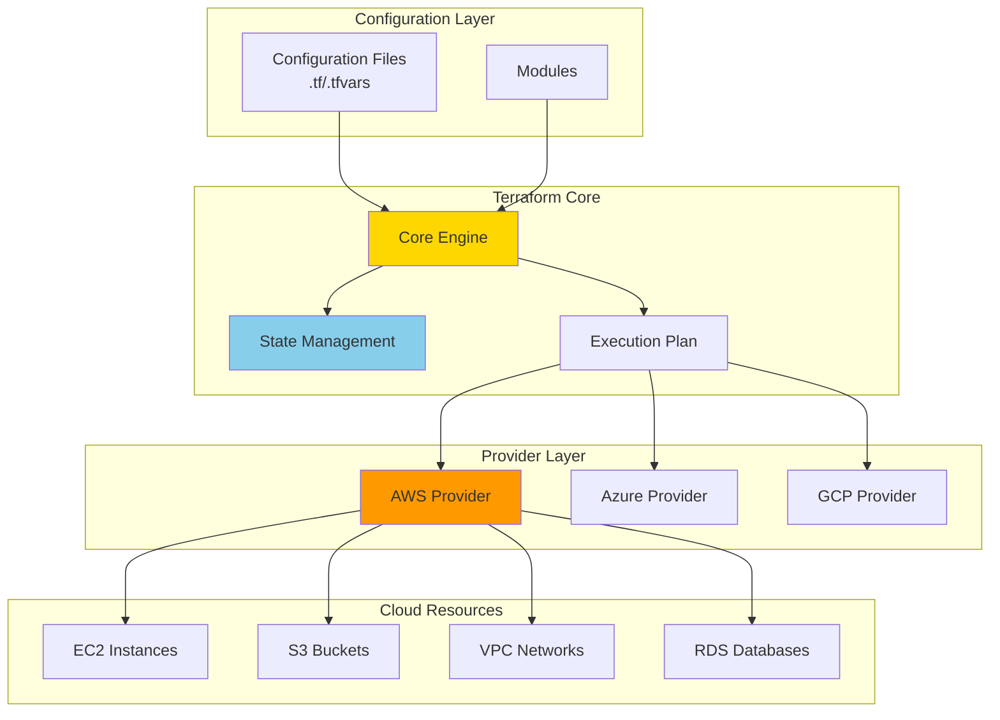

# About Terraform

> [!NOTE]
> このドキュメントはTerraformに関する学習内容を体系的にまとめた要約版です。
> 詳細な実装例や日々の学習記録は、参照セクションのdaily-TILリンクをご確認ください。

## 目次

<details>
<summary>目次を開く</summary>

- [About Terraform](#about-terraform)
  - [目次](#目次)
  - [概要](#概要)
    - [キーポイント](#キーポイント)
  - [What - Terraformとは何か](#what---terraformとは何か)
    - [基本概念](#基本概念)
      - [定義](#定義)
      - [構成要素](#構成要素)
    - [主要な特徴](#主要な特徴)
    - [アーキテクチャ](#アーキテクチャ)
      - [レイヤー構成](#レイヤー構成)
      - [データフロー](#データフロー)
  - [Why - なぜTerraformが必要なのか](#why---なぜterraformが必要なのか)
    - [解決する課題](#解決する課題)
      - [従来の問題点](#従来の問題点)
      - [Terraformによる解決策](#terraformによる解決策)
    - [メリット](#メリット)
      - [ビジネス面のメリット](#ビジネス面のメリット)
      - [技術面のメリット](#技術面のメリット)
    - [デメリット](#デメリット)
    - [他の選択肢との比較](#他の選択肢との比較)
  - [How - Terraformの実装方法](#how---terraformの実装方法)
    - [基本的な使い方](#基本的な使い方)
      - [セットアップ](#セットアップ)
      - [基本的な実装](#基本的な実装)
      - [実行例](#実行例)
    - [ベストプラクティス](#ベストプラクティス)
      - [1. モジュール化](#1-モジュール化)
      - [2. Backend設定](#2-backend設定)
      - [3. 変数とタグ管理](#3-変数とタグ管理)
    - [よくある実装パターン](#よくある実装パターン)
      - [パターン1: 環境別管理](#パターン1-環境別管理)
      - [パターン2: モジュールレジストリ](#パターン2-モジュールレジストリ)
      - [パターン3: GitOps統合](#パターン3-gitops統合)
    - [トラブルシューティング](#トラブルシューティング)
      - [エラー1: 状態ファイルのロック](#エラー1-状態ファイルのロック)
      - [エラー2: リソースの手動変更によるドリフト](#エラー2-リソースの手動変更によるドリフト)
      - [エラー3: プロバイダーのバージョン競合](#エラー3-プロバイダーのバージョン競合)
  - [参照：daily-TIL](#参照daily-til)
    - [What関連](#what関連)
    - [Why関連](#why関連)
    - [How関連](#how関連)
  - [バージョン履歴](#バージョン履歴)

</details>

---

## 概要

TerraformはHashiCorp社が開発したInfrastructure as Code（IaC）ツールで、クラウドインフラストラクチャをコードで定義・管理します。宣言的な構文でインフラを記述し、複数のクラウドプロバイダーに対応した統一的な管理を実現します。

### キーポイント

- **Infrastructure as Code**: インフラをコードとして管理し、バージョン管理やレビューが可能
- **宣言的構文**: 望ましい状態を記述するだけで、Terraformが現在の状態との差分を計算
- **マルチクラウド対応**: AWS、Azure、GCPなど複数のプロバイダーを統一的に管理

---

## What - Terraformとは何か

### 基本概念

<details>
<summary>基本概念の詳細</summary>

Terraformは、インフラストラクチャをコードとして管理するためのオープンソースツールです。HCL（HashiCorp Configuration Language）という独自の宣言的言語を使用します。

#### 定義

クラウドやオンプレミスのインフラストラクチャを安全かつ効率的に構築、変更、バージョン管理するためのツール。

#### 構成要素

1. **設定ファイル（.tfファイル）**
   - main.tf: メインのリソース定義
   - variables.tf: 入力変数の定義
   - outputs.tf: 出力値の定義

2. **状態管理（terraform.tfstate）**
   - 実際のインフラとの対応関係を記録
   - S3やTerraform Cloudで共有可能

3. **プロバイダー**
   - AWS、Azure、GCPなどのAPIと連携
   - 300以上のプロバイダーが利用可能

</details>

### 主要な特徴

<details>
<summary>特徴の詳細</summary>

1. **宣言的な構文**
   - 望ましい状態を記述
   - 利点: 手順ではなく結果に焦点を当てられる

2. **依存関係の自動解決**
   - リソース間の依存を自動的に判断
   - 利点: 正しい順序でリソースを作成・削除

3. **実行計画の事前確認**
   - terraform planで変更内容を事前確認
   - 利点: 意図しない変更を防止

</details>

### アーキテクチャ

<details>
<summary>アーキテクチャ図と説明</summary>



#### レイヤー構成

- **設定層**: HCLで記述された.tfファイル
- **コア層**: 状態管理と実行計画の生成
- **プロバイダー層**: 各クラウドサービスとの通信

#### データフロー

1. 設定ファイルから望ましい状態を読み込み
2. 現在の状態と比較して差分を計算
3. プロバイダー経由でリソースを作成・更新・削除

</details>

---

## Why - なぜTerraformが必要なのか

### 解決する課題

<details>
<summary>課題の詳細</summary>

#### 従来の問題点

1. **手動でのインフラ管理**
   - 影響: 人的ミスやドキュメント不整合
   - 例: 本番環境と開発環境の設定差異

2. **再現性の欠如**
   - 影響: 環境構築の属人化
   - 例: 災害復旧時の環境再構築困難

#### Terraformによる解決策

- コードによる一元管理で設定の可視化
- バージョン管理システムとの統合で変更履歴を追跡
- terraform applyで同一環境を何度でも再現

</details>

### メリット

<details>
<summary>メリットの詳細</summary>

#### ビジネス面のメリット

1. **コスト管理**
   - terraform planで事前にコスト影響を確認
   - 不要リソースの一括削除でコスト最適化

2. **生産性向上**
   - テンプレート化による環境構築の高速化
   - モジュール化による再利用性の向上

3. **ガバナンス強化**
   - コードレビューによる変更管理
   - タグ付けルールの自動適用

#### 技術面のメリット

1. **自動化**
   - CI/CDパイプラインとの統合
   - GitOpsワークフローの実現

2. **一貫性**
   - 環境間の設定差異を排除
   - ベストプラクティスのコード化

</details>

### デメリット

<details>
<summary>デメリットと対策</summary>

| デメリット | 影響 | 対策 |
|-----------|------|------|
| 学習曲線 | HCL習得に時間が必要 | 公式チュートリアルと実践的な演習 |
| 状態ファイル管理 | 破損時の影響大 | S3+DynamoDBでの管理とバックアップ |
| ドリフト検出 | 手動変更の検出が困難 | 定期的なterraform planの実行 |

</details>

### 他の選択肢との比較

<details>
<summary>比較表</summary>

| 項目 | Terraform | CloudFormation | Ansible |
|------|-----------|----------------|---------|
| 対応プロバイダー | マルチクラウド | AWSのみ | マルチクラウド |
| 言語 | HCL（宣言的） | JSON/YAML | YAML（手続き的） |
| 状態管理 | 必要 | 不要（AWS管理） | 不要 |
| エコシステム | 豊富なモジュール | AWS公式サポート | 豊富なロール |

</details>

---

## How - Terraformの実装方法

### 基本的な使い方

<details>
<summary>基本実装例</summary>

#### セットアップ

```bash
# Terraformのインストール
brew install terraform

# AWSプロバイダーの設定
export AWS_ACCESS_KEY_ID="your-access-key"
export AWS_SECRET_ACCESS_KEY="your-secret-key"
```

#### 基本的な実装

```hcl
# main.tf
terraform {
  required_providers {
    aws = {
      source  = "hashicorp/aws"
      version = "~> 5.0"
    }
  }
}

provider "aws" {
  region = var.aws_region
}

# VPCの作成
resource "aws_vpc" "main" {
  cidr_block = "10.0.0.0/16"
  
  tags = {
    Name        = "${var.project_name}-vpc-${var.environment}"
    Environment = var.environment
    ManagedBy   = "terraform"
  }
}
```

#### 実行例

```bash
# 初期化
terraform init

# 実行計画の確認
terraform plan

# 適用
terraform apply

# 削除
terraform destroy
```

</details>

### ベストプラクティス

<details>
<summary>推奨される実装方法</summary>

#### 1. モジュール化

```hcl
# modules/vpc/main.tf
resource "aws_vpc" "this" {
  cidr_block = var.cidr_block
  
  enable_dns_hostnames = true
  enable_dns_support   = true
}

# 使用例
module "vpc" {
  source = "./modules/vpc"
  
  cidr_block = "10.0.0.0/16"
}
```

**理由**: 再利用性と保守性の向上

#### 2. Backend設定

```hcl
# backend.tf
terraform {
  backend "s3" {
    bucket         = "my-terraform-state"
    key            = "prod/terraform.tfstate"
    region         = "ap-northeast-1"
    dynamodb_table = "terraform-state-lock"
    encrypt        = true
  }
}
```

**理由**: チーム開発での状態共有と排他制御

#### 3. 変数とタグ管理

```hcl
# variables.tf
variable "common_tags" {
  type = map(string)
  default = {
    Project     = "my-project"
    ManagedBy   = "terraform"
  }
}

# リソースでの使用
resource "aws_instance" "web" {
  # ...
  tags = merge(var.common_tags, {
    Name = "web-server"
    Role = "web"
  })
}
```

**理由**: 一貫性のあるタグ付けでコスト管理と運用を効率化

</details>

### よくある実装パターン

<details>
<summary>実装パターン集</summary>

#### パターン1: 環境別管理

**用途**: dev/staging/productionの環境分離

```bash
# ディレクトリ構造
environments/
├── dev/
│   └── terraform.tfvars
├── staging/
│   └── terraform.tfvars
└── prod/
    └── terraform.tfvars

# 実行方法
terraform workspace select prod
terraform apply -var-file=environments/prod/terraform.tfvars
```

#### パターン2: モジュールレジストリ

**用途**: 組織内での標準化されたモジュール共有

```hcl
module "vpc" {
  source  = "terraform-aws-modules/vpc/aws"
  version = "5.0.0"
  
  name = "my-vpc"
  cidr = "10.0.0.0/16"
  
  azs             = ["ap-northeast-1a", "ap-northeast-1c"]
  private_subnets = ["10.0.1.0/24", "10.0.2.0/24"]
  public_subnets  = ["10.0.101.0/24", "10.0.102.0/24"]
}
```

#### パターン3: GitOps統合

**用途**: Pull Requestベースのインフラ変更管理

```yaml
# .github/workflows/terraform.yml
name: Terraform
on:
  pull_request:
    paths:
      - '**.tf'
      
jobs:
  terraform:
    runs-on: ubuntu-latest
    steps:
      - uses: actions/checkout@v3
      - uses: hashicorp/setup-terraform@v2
      
      - name: Terraform Init
        run: terraform init
        
      - name: Terraform Plan
        run: terraform plan
```

</details>

### トラブルシューティング

<details>
<summary>よくある問題と解決方法</summary>

#### エラー1: 状態ファイルのロック

**原因**: 他のプロセスが状態ファイルを使用中
**解決方法**:

```bash
# ロックの強制解除（注意して使用）
terraform force-unlock <LOCK_ID>

# DynamoDBでロック状態を確認
aws dynamodb scan --table-name terraform-state-lock
```

#### エラー2: リソースの手動変更によるドリフト

**原因**: Terraform外でのリソース変更
**解決方法**:

```bash
# 現在の状態を更新
terraform refresh

# または特定リソースをインポート
terraform import aws_instance.web i-1234567890abcdef0
```

#### エラー3: プロバイダーのバージョン競合

**原因**: 異なる環境でのプロバイダーバージョン不一致
**解決方法**:

```hcl
# .terraform.lock.hcl をコミット
# またはバージョン制約を明確に
terraform {
  required_providers {
    aws = {
      source  = "hashicorp/aws"
      version = "~> 5.0, < 5.50"
    }
  }
}
```

</details>

---

## 参照：daily-TIL

このドキュメントは以下のdaily-TILファイルから情報を集約・整理しています：

### What関連

- [2025.08.07.05.43 - what_terraform_backend_tf.md](../daily/2025.08.07.05.43_what_terraform_backend_tf.md)
  - Terraform Backendの設定詳細
- [2025.08.07.06.51 - what_terraform_standard_module_structure_rule.md](../daily/2025.08.07.06.51_what_terraform_standard_module_structure_rule.md)
  - 標準的なモジュール構造
- [2025.08.07.13.28 - what_create_before_destroy_lifecycle_in_terraform.md](../daily/2025.08.07.13.28_what_create_before_destroy_lifecycle_in_terraform.md)
  - ライフサイクル設定の詳細
- [2025.08.04.21.12 - what_difference_between_name_and_tags_name_in_terraform.md](../daily/2025.08.04.21.12_what_difference_between_name_and_tags_name_in_terraform.md)
  - nameパラメータとtagsの違い

### Why関連

- [2025.08.07.03.29 - why_terraform_aws_components_need_tags.md](../daily/2025.08.07.03.29_why_terraform_aws_components_need_tags.md)
  - タグ付けの重要性と理由
- [2025.08.04.20.57 - why_terraform_resource_naming_by_environment.md](../daily/2025.08.04.20.57_why_terraform_resource_naming_by_environment.md)
  - 環境別命名の必要性
- [2025.08.07.05.46 - why_backend_tf_sometimes_unnecessary.md](../daily/2025.08.07.05.46_why_backend_tf_sometimes_unnecessary.md)
  - Backend設定が不要なケース

### How関連

- [2025.07.24.07.14 - how_to-create-terraform-module.md](../daily/2025.07.24.07.14_how_to-create-terraform-module.md)
  - Terraformモジュールの作成方法
- [2025.08.04.12.01 - how_compose_terraform_directory_architecture_separated_by_env.md](../daily/2025.08.04.12.01_how_compose_terraform_directory_architecture_separated_by_env.md)
  - 環境別ディレクトリ構成
- [2025.08.07.17.07 - how_terraform_github_actions_deployment.md](../daily/2025.08.07.17.07_how_terraform_github_actions_deployment.md)
  - GitHub Actionsでの自動化
- [2025.08.07.20.11 - how_terraform_code_error_checking.md](../daily/2025.08.07.20.11_how_terraform_code_error_checking.md)
  - エラーチェック方法
- [2025.08.07.10.07 - how_set_terraform_variable_values.md](../daily/2025.08.07.10.07_how_set_terraform_variable_values.md)
  - 変数値の設定方法

---

## バージョン履歴

| バージョン | 更新日 | 主な変更内容 |
|-----------|---------|-------------|
| 1.0.0 | 2025-08-11 | 初版作成 |

---

> [!TIP]
> より詳細な情報や具体的な実装例については、上記のdaily-TILリンクを参照してください。
> このドキュメントは定期的に更新され、新しい学習内容が追加されます。

