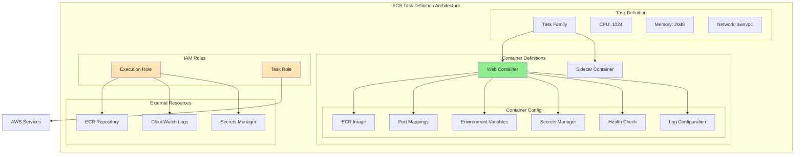

# About aws_ecs_task_definition
<!-- このファイルはaws_ecs_task_definitionに関する包括的な知識をまとめたものです -->
<!-- daily-TILから重要な内容を抽出・整理し、体系的にまとめています -->

> [!NOTE]
> このドキュメントはaws_ecs_task_definitionに関する学習内容を体系的にまとめた要約版です。
> 詳細な実装例や日々の学習記録は、参照セクションのdaily-TILリンクをご確認ください。

## 目次

<details>
<summary>目次を開く</summary>

- [About aws_ecs_task_definition](#about-aws_ecs_task_definition)
  - [目次](#目次)
  - [概要](#概要)
    - [キーポイント](#キーポイント)
  - [What - aws_ecs_task_definitionとは何か](#what---aws_ecs_task_definitionとは何か)
    - [基本概念](#基本概念)
      - [定義](#定義)
      - [構成要素](#構成要素)
    - [主要な特徴](#主要な特徴)
    - [アーキテクチャ](#アーキテクチャ)
      - [レイヤー構成](#レイヤー構成)
      - [データフロー](#データフロー)
  - [Why - なぜaws_ecs_task_definitionが必要なのか](#why---なぜaws_ecs_task_definitionが必要なのか)
    - [解決する課題](#解決する課題)
      - [従来の問題点](#従来の問題点)
      - [aws_ecs_task_definitionによる解決策](#aws_ecs_task_definitionによる解決策)
    - [メリット](#メリット)
      - [ビジネス面のメリット](#ビジネス面のメリット)
      - [技術面のメリット](#技術面のメリット)
    - [デメリット](#デメリット)
    - [他の選択肢との比較](#他の選択肢との比較)
  - [How - aws_ecs_task_definitionの実装方法](#how---aws_ecs_task_definitionの実装方法)
    - [基本的な使い方](#基本的な使い方)
      - [セットアップ](#セットアップ)
      - [基本的な実装](#基本的な実装)
      - [実行例](#実行例)
    - [ベストプラクティス](#ベストプラクティス)
      - [1. セキュアな秘密情報管理](#1-セキュアな秘密情報管理)
      - [2. 適切なリソース割り当て](#2-適切なリソース割り当て)
      - [3. ヘルスチェックの実装](#3-ヘルスチェックの実装)
    - [よくある実装パターン](#よくある実装パターン)
      - [パターン1: Webアプリケーション](#パターン1-webアプリケーション)
      - [パターン2: マルチコンテナタスク](#パターン2-マルチコンテナタスク)
      - [パターン3: バッチ処理タスク](#パターン3-バッチ処理タスク)
    - [トラブルシューティング](#トラブルシューティング)
      - [エラー1: InvalidParameterException](#エラー1-invalidparameterexception)
      - [エラー2: ResourceInitializationError](#エラー2-resourceinitializationerror)
      - [エラー3: CannotPullContainerError](#エラー3-cannotpullcontainererror)
  - [参照：daily-TIL](#参照daily-til)
    - [What関連](#what関連)
    - [Why関連](#why関連)
    - [How関連](#how関連)
  - [バージョン履歴](#バージョン履歴)

</details>

---

## 概要

aws_ecs_task_definitionはTerraformでAWS ECSタスクの設計図を作成・管理するためのリソースです。コンテナの実行に必要なCPU/メモリ、ネットワーク設定、環境変数、IAMロールなどを定義し、ECSでコンテナを実行するための青写真として機能します。

### キーポイント

- コンテナ実行のための包括的な設定を宣言的に管理
- Fargateおよびコンテナ化されたアプリケーションのデプロイメント
- セキュアな秘密情報管理とロググループの統合

---

## What - aws_ecs_task_definitionとは何か

### 基本概念

<details>
<summary>基本概念の詳細</summary>

aws_ecs_task_definitionリソースは、Amazon ECS（Elastic Container Service）でコンテナを実行するための設計図をTerraformで管理するためのリソースタイプです。Docker Composeファイルに似た役割を持ち、コンテナの実行環境を詳細に定義します。

#### 定義

aws_ecs_task_definitionは、ECSタスクの実行に必要なすべての設定情報を含むTerraformリソースです。どのDockerイメージを使用し、どのようなリソース（CPU、メモリ）を割り当て、どのような環境でコンテナを実行するかを宣言的に定義します。

#### 構成要素

1. **タスクファミリー**
   - タスク定義のバージョン管理単位

2. **コンテナ定義**
   - 実行するコンテナの詳細設定

3. **リソース要件**
   - CPU、メモリ、ネットワークモードなど

</details>

### 主要な特徴

<details>
<summary>特徴の詳細</summary>

1. **柔軟なコンテナ設定**
   - 複数コンテナのサポート
   - 利点: マイクロサービスアーキテクチャの実現

2. **統合されたセキュリティ**
   - IAMロール、Secrets Manager連携
   - 利点: 安全な秘密情報管理

3. **包括的なログ管理**
   - CloudWatch Logsとの自動統合
   - 利点: 一元的なログ管理とモニタリング

</details>

### アーキテクチャ

<details>
<summary>アーキテクチャ図と説明</summary>



#### レイヤー構成

- **定義層**: タスクファミリーとリソース設定
- **コンテナ層**: 個々のコンテナ設定
- **セキュリティ層**: IAMロールと権限管理

#### データフロー

1. タスク定義がECSサービスまたはタスクランナーから参照される
2. 実行ロールを使用してECRからイメージを取得
3. タスクロールでアプリケーションがAWSリソースにアクセス

</details>

---

## Why - なぜaws_ecs_task_definitionが必要なのか

### 解決する課題

<details>
<summary>課題の詳細</summary>

#### 従来の問題点

1. **手動でのコンテナ設定管理**
   - 影響: 環境間での設定の不整合
   - 例: 開発環境と本番環境で異なるメモリ設定

2. **秘密情報の安全でない管理**
   - 影響: 環境変数へのハードコーディング
   - 例: データベースパスワードの露出リスク

#### aws_ecs_task_definitionによる解決策

- コンテナ設定のコード化とバージョン管理
- Secrets Managerとの統合による安全な秘密情報管理
- 環境別の設定の標準化と再利用性

</details>

### メリット

<details>
<summary>メリットの詳細</summary>

#### ビジネス面のメリット

1. **コスト削減**
   - リソースの最適化による効率的な利用
   - 自動スケーリングとの連携

2. **生産性向上**
   - デプロイメントの自動化
   - 設定ミスの削減

3. **スケーラビリティ**
   - 需要に応じた柔軟なスケーリング
   - マルチコンテナアーキテクチャの実現

#### 技術面のメリット

1. **一貫性の確保**
   - 環境間での設定の統一
   - インフラストラクチャのコード化

2. **セキュリティの向上**
   - 最小権限の原則に基づいたロール設定
   - 秘密情報の安全な管理

</details>

### デメリット

<details>
<summary>デメリットと対策</summary>

| デメリット | 影響 | 対策 |
|-----------|------|------|
| 設定の複雑性 | 初期学習コストが高い | テンプレートとドキュメントの整備 |
| Fargate制約 | CPU/メモリの組み合わせ制限 | 事前の要件確認と適切なサイジング |
| デバッグの難しさ | コンテナ内部の状態確認が困難 | ECS Execの活用とログの充実 |

</details>

### 他の選択肢との比較

<details>
<summary>比較表</summary>

| 項目 | ECS Task Definition | Docker Compose | Kubernetes Pod |
|------|-------------------|----------------|----------------|
| コスト | 使用量ベース | インフラ依存 | クラスター管理コスト |
| 学習曲線 | 中程度 | 低い | 高い |
| 柔軟性 | AWS統合に特化 | 汎用的 | 非常に高い |
| 管理の容易さ | AWS管理 | 自己管理 | 複雑 |

</details>

---

## How - aws_ecs_task_definitionの実装方法

### 基本的な使い方

<details>
<summary>基本実装例</summary>

#### セットアップ

```hcl
# プロバイダーの設定
terraform {
  required_providers {
    aws = {
      source  = "hashicorp/aws"
      version = "~> 5.0"
    }
  }
}

provider "aws" {
  region = "ap-northeast-1"
}
```

#### 基本的な実装

```hcl
# ECSタスク定義
resource "aws_ecs_task_definition" "app" {
  family                   = "${var.project_name}-${var.environment}"
  network_mode             = "awsvpc"
  requires_compatibilities = ["FARGATE"]
  cpu                      = "256"
  memory                   = "512"
  execution_role_arn       = aws_iam_role.ecs_task_execution.arn
  task_role_arn            = aws_iam_role.ecs_task.arn

  container_definitions = jsonencode([
    {
      name  = "${var.project_name}-container"
      image = "${aws_ecr_repository.app.repository_url}:latest"

      portMappings = [
        {
          containerPort = 3000
          protocol      = "tcp"
        }
      ]

      environment = [
        {
          name  = "NODE_ENV"
          value = var.environment
        }
      ]

      logConfiguration = {
        logDriver = "awslogs"
        options = {
          "awslogs-group"         = aws_cloudwatch_log_group.app.name
          "awslogs-region"        = var.region
          "awslogs-stream-prefix" = "ecs"
        }
      }
    }
  ])

  tags = {
    Name        = "${var.project_name}-task-${var.environment}"
    Environment = var.environment
  }
}
```

#### 実行例

```bash
# 初期化
terraform init

# 計画の確認
terraform plan

# 適用
terraform apply
```

</details>

### ベストプラクティス

<details>
<summary>推奨される実装方法</summary>

#### 1. セキュアな秘密情報管理

```hcl
resource "aws_ecs_task_definition" "secure" {
  family = "${var.project_name}-secure"
  # ... 他の設定 ...

  container_definitions = jsonencode([
    {
      name  = "app"
      image = "${aws_ecr_repository.app.repository_url}:latest"

      # 環境変数（非機密情報のみ）
      environment = [
        {
          name  = "APP_ENV"
          value = var.environment
        }
      ]

      # 秘密情報はSecrets Managerから取得
      secrets = [
        {
          name      = "DATABASE_URL"
          valueFrom = aws_secretsmanager_secret.db_url.arn
        },
        {
          name      = "API_KEY"
          valueFrom = aws_secretsmanager_secret.api_key.arn
        }
      ]
    }
  ])
}
```

**理由**: 秘密情報の安全な管理とコンプライアンス要件の遵守

#### 2. 適切なリソース割り当て

```hcl
# Fargateの有効な組み合わせ
locals {
  fargate_cpu_memory = {
    "256"  = ["512", "1024", "2048"]
    "512"  = ["1024", "2048", "3072", "4096"]
    "1024" = ["2048", "3072", "4096", "5120", "6144", "7168", "8192"]
    "2048" = ["4096", "5120", "6144", "7168", "8192", "9216", "10240", "11264", "12288", "13312", "14336", "15360", "16384"]
    "4096" = ["8192", "9216", "10240", "11264", "12288", "13312", "14336", "15360", "16384", "17408", "18432", "19456", "20480", "21504", "22528", "23552", "24576", "25600", "26624", "27648", "28672", "29696", "30720"]
  }
}

resource "aws_ecs_task_definition" "optimized" {
  family = "${var.project_name}-optimized"
  cpu    = var.task_cpu
  memory = var.task_memory

  # CPU/メモリの組み合わせ検証
  lifecycle {
    precondition {
      condition     = contains(local.fargate_cpu_memory[var.task_cpu], var.task_memory)
      error_message = "Invalid CPU/memory combination for Fargate"
    }
  }
}
```

**理由**: Fargateの制約に準拠した適切なリソース設定

#### 3. ヘルスチェックの実装

```hcl
container_definitions = jsonencode([
  {
    name  = "app"
    image = "${aws_ecr_repository.app.repository_url}:latest"

    healthCheck = {
      command     = ["CMD-SHELL", "curl -f http://localhost:3000/health || exit 1"]
      interval    = 30
      timeout     = 5
      retries     = 3
      startPeriod = 60
    }
  }
])
```

**理由**: コンテナの健全性を確保し、自動復旧を実現

</details>

### よくある実装パターン

<details>
<summary>実装パターン集</summary>

#### パターン1: Webアプリケーション

**用途**: 一般的なWebアプリケーションのデプロイ

```hcl
resource "aws_ecs_task_definition" "web_app" {
  family                   = "${var.project_name}-web"
  network_mode             = "awsvpc"
  requires_compatibilities = ["FARGATE"]
  cpu                      = "512"
  memory                   = "1024"
  execution_role_arn       = aws_iam_role.ecs_execution.arn
  task_role_arn            = aws_iam_role.ecs_task.arn

  container_definitions = jsonencode([
    {
      name  = "web"
      image = "${aws_ecr_repository.web.repository_url}:${var.image_tag}"

      portMappings = [
        {
          containerPort = 8080
        }
      ]

      environment = [
        { name = "PORT", value = "8080" },
        { name = "ENV", value = var.environment }
      ]

      secrets = [
        {
          name      = "DATABASE_URL"
          valueFrom = aws_secretsmanager_secret.db_url.arn
        }
      ]

      logConfiguration = {
        logDriver = "awslogs"
        options = {
          "awslogs-group"         = aws_cloudwatch_log_group.web.name
          "awslogs-region"        = var.region
          "awslogs-stream-prefix" = "web"
        }
      }
    }
  ])
}
```

#### パターン2: マルチコンテナタスク

**用途**: サイドカーパターンの実装

```hcl
resource "aws_ecs_task_definition" "multi_container" {
  family = "${var.project_name}-multi"
  # ... 基本設定 ...

  container_definitions = jsonencode([
    {
      name      = "app"
      image     = "${aws_ecr_repository.app.repository_url}:latest"
      essential = true

      portMappings = [
        { containerPort = 3000 }
      ]

      dependsOn = [
        {
          containerName = "envoy"
          condition     = "HEALTHY"
        }
      ]
    },
    {
      name      = "envoy"
      image     = "envoyproxy/envoy:latest"
      essential = true

      portMappings = [
        { containerPort = 9901 }
      ]

      healthCheck = {
        command = ["CMD-SHELL", "curl -f http://localhost:9901/ready || exit 1"]
      }
    }
  ])
}
```

#### パターン3: バッチ処理タスク

**用途**: 定期的なバッチ処理やジョブの実行

```hcl
resource "aws_ecs_task_definition" "batch" {
  family                   = "${var.project_name}-batch"
  network_mode             = "awsvpc"
  requires_compatibilities = ["FARGATE"]
  cpu                      = "1024"
  memory                   = "2048"
  execution_role_arn       = aws_iam_role.batch_execution.arn
  task_role_arn            = aws_iam_role.batch_task.arn

  container_definitions = jsonencode([
    {
      name      = "batch-processor"
      image     = "${aws_ecr_repository.batch.repository_url}:latest"
      essential = true

      environment = [
        {
          name  = "BATCH_TYPE"
          value = "daily-aggregation"
        }
      ]

      logConfiguration = {
        logDriver = "awslogs"
        options = {
          "awslogs-group"         = aws_cloudwatch_log_group.batch.name
          "awslogs-region"        = var.region
          "awslogs-stream-prefix" = "batch"
        }
      }
    }
  ])
}
```

</details>

### トラブルシューティング

<details>
<summary>よくある問題と解決方法</summary>

#### エラー1: InvalidParameterException

**原因**: CPU/メモリの組み合わせがFargateの制約に違反
**解決方法**:

```hcl
# 有効な組み合わせを使用
resource "aws_ecs_task_definition" "valid" {
  cpu    = "512"   # 有効な値: 256, 512, 1024, 2048, 4096
  memory = "1024"  # CPUに対応する有効なメモリ値
  # ...
}
```

#### エラー2: ResourceInitializationError

**原因**: ログ設定のCloudWatchロググループが存在しない
**解決方法**:

```hcl
# ロググループを先に作成
resource "aws_cloudwatch_log_group" "app" {
  name              = "/ecs/${var.project_name}/${var.environment}"
  retention_in_days = 7
}

resource "aws_ecs_task_definition" "app" {
  # ...
  container_definitions = jsonencode([{
    # ...
    logConfiguration = {
      logDriver = "awslogs"
      options = {
        "awslogs-group" = aws_cloudwatch_log_group.app.name
        # ...
      }
    }
  }])

  depends_on = [aws_cloudwatch_log_group.app]
}
```

#### エラー3: CannotPullContainerError

**原因**: ECRからイメージをプルする権限がない
**解決方法**:

```hcl
# 実行ロールに必要な権限を付与
resource "aws_iam_role_policy_attachment" "ecs_execution" {
  role       = aws_iam_role.ecs_task_execution.name
  policy_arn = "arn:aws:iam::aws:policy/service-role/AmazonECSTaskExecutionRolePolicy"
}

# カスタムECRポリシー
resource "aws_iam_role_policy" "ecr_access" {
  role = aws_iam_role.ecs_task_execution.id

  policy = jsonencode({
    Version = "2012-10-17"
    Statement = [
      {
        Effect = "Allow"
        Action = [
          "ecr:GetAuthorizationToken",
          "ecr:BatchCheckLayerAvailability",
          "ecr:GetDownloadUrlForLayer",
          "ecr:BatchGetImage"
        ]
        Resource = "*"
      }
    ]
  })
}
```

</details>

---

## 参照：daily-TIL

このドキュメントは以下のdaily-TILファイルから情報を集約・整理しています：

### What関連

- [2025.08.07.11.37 - what_aws_ecs_task_definition.md](daily/2025.08.07.11.37_what_aws_ecs_task_definition.md)
  - ECSタスク定義の基本概念、設定項目、実装例について

### Why関連

- 現在のところ、aws_ecs_task_definitionの「なぜ」に関するdaily-TILファイルはありません

### How関連

- 現在のところ、aws_ecs_task_definitionの「どのように」に関するdaily-TILファイルはありません

---

## バージョン履歴

| バージョン | 更新日 | 主な変更内容 |
|-----------|---------|-------------|
| 1.0.0 | 2025-08-11 | 初版作成 |

---

> [!TIP]
> より詳細な情報や具体的な実装例については、上記のdaily-TILリンクを参照してください。
> このドキュメントは定期的に更新され、新しい学習内容が追加されます。