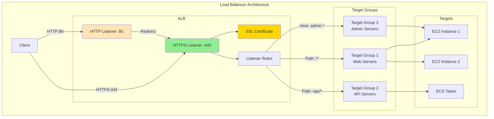

# About aws_lb_listener
<!-- このファイルはaws_lb_listenerに関する包括的な知識をまとめたものです -->
<!-- daily-TILから重要な内容を抽出・整理し、体系的にまとめています -->

> [!NOTE]
> このドキュメントはaws_lb_listenerに関する学習内容を体系的にまとめた要約版です。
> 詳細な実装例や日々の学習記録は、参照セクションのdaily-TILリンクをご確認ください。

## 目次

<details>
<summary>目次を開く</summary>

- [About aws_lb_listener](#about-aws_lb_listener)
  - [目次](#目次)
  - [概要](#概要)
    - [キーポイント](#キーポイント)
  - [What - aws_lb_listenerとは何か](#what---aws_lb_listenerとは何か)
    - [基本概念](#基本概念)
      - [定義](#定義)
      - [構成要素](#構成要素)
    - [主要な特徴](#主要な特徴)
    - [アーキテクチャ](#アーキテクチャ)
      - [レイヤー構成](#レイヤー構成)
      - [データフロー](#データフロー)
  - [Why - なぜaws_lb_listenerが必要なのか](#why---なぜaws_lb_listenerが必要なのか)
    - [解決する課題](#解決する課題)
      - [従来の問題点](#従来の問題点)
      - [aws_lb_listenerによる解決策](#aws_lb_listenerによる解決策)
    - [メリット](#メリット)
      - [ビジネス面のメリット](#ビジネス面のメリット)
      - [技術面のメリット](#技術面のメリット)
    - [デメリット](#デメリット)
    - [他の選択肢との比較](#他の選択肢との比較)
  - [How - aws_lb_listenerの実装方法](#how---aws_lb_listenerの実装方法)
    - [基本的な使い方](#基本的な使い方)
      - [セットアップ](#セットアップ)
      - [基本的な実装](#基本的な実装)
      - [実行例](#実行例)
    - [ベストプラクティス](#ベストプラクティス)
      - [1. HTTPからHTTPSへのリダイレクト](#1-httpからhttpsへのリダイレクト)
      - [2. セキュアなSSLポリシーの使用](#2-セキュアなsslポリシーの使用)
      - [3. 条件付きルーティングの活用](#3-条件付きルーティングの活用)
    - [よくある実装パターン](#よくある実装パターン)
      - [パターン1: 基本的なHTTPSリスナー](#パターン1-基本的なhttpsリスナー)
      - [パターン2: パスベースルーティング](#パターン2-パスベースルーティング)
      - [パターン3: ホストベースルーティング](#パターン3-ホストベースルーティング)
    - [トラブルシューティング](#トラブルシューティング)
      - [エラー1: CertificateNotFound](#エラー1-certificatenotfound)
      - [エラー2: DuplicateListener](#エラー2-duplicatelistener)
      - [エラー3: InvalidLoadBalancerAction](#エラー3-invalidloadbalanceraction)
  - [参照：daily-TIL](#参照daily-til)
    - [What関連](#what関連)
    - [Why関連](#why関連)
    - [How関連](#how関連)
  - [バージョン履歴](#バージョン履歴)

</details>

---

## 概要

aws_lb_listenerはTerraformでAWSロードバランサーのリスナーを作成・管理するためのリソースです。指定されたポートで接続要求をチェックし、設定されたルールに基づいてトラフィックを適切なターゲットグループにルーティングする、ロードバランサーの重要なコンポーネントです。

### キーポイント

- 特定のポートとプロトコルでトラフィックを受信し処理
- SSL/TLS終端とセキュリティポリシーの管理
- 柔軟なルーティングルールによるトラフィック制御

---

## What - aws_lb_listenerとは何か

### 基本概念

<details>
<summary>基本概念の詳細</summary>

aws_lb_listenerリソースは、AWS Application Load Balancer (ALB) やNetwork Load Balancer (NLB) のリスナーをTerraformで管理するためのリソースタイプです。クライアントからの接続要求を受け付け、設定されたルールに基づいてトラフィックを処理する入り口となります。

#### 定義

aws_lb_listenerは、ロードバランサーが特定のポートでクライアントからの接続を待ち受け、受信したリクエストを評価してアクションを実行するTerraformリソースです。HTTPSリスナーの場合は、SSL/TLS証明書の管理と暗号化通信の終端処理も行います。

#### 構成要素

1. **リスナー設定**
   - ポート番号とプロトコルの指定

2. **デフォルトアクション**
   - 条件に一致しないトラフィックの処理方法

3. **SSL/TLS設定**
   - 証明書とセキュリティポリシー（HTTPSの場合）

</details>

### 主要な特徴

<details>
<summary>特徴の詳細</summary>

1. **プロトコルサポート**
   - HTTP、HTTPS、TCP、TLS、UDP、TCP_UDP
   - 利点: 様々なアプリケーション要件に対応

2. **柔軟なアクション設定**
   - forward、redirect、fixed-response、認証など
   - 利点: 複雑なルーティング要件の実現

3. **SSL/TLS管理**
   - ACM証明書の統合とSNIサポート
   - 利点: セキュアな通信の簡単な実装

</details>

### アーキテクチャ

<details>
<summary>アーキテクチャ図と説明</summary>



#### レイヤー構成

- **リスナー層**: 接続の受付とプロトコル処理
- **ルール層**: 条件評価とアクション決定
- **ターゲット層**: 実際のトラフィック転送先

#### データフロー

1. クライアントがロードバランサーの特定ポートに接続
2. リスナーがリクエストを受信し、ルールを評価
3. 一致するルールのアクション（転送、リダイレクト等）を実行

</details>

---

## Why - なぜaws_lb_listenerが必要なのか

### 解決する課題

<details>
<summary>課題の詳細</summary>

#### 従来の問題点

1. **手動でのロードバランサー設定**
   - 影響: 設定ミスやドキュメント化の欠如
   - 例: コンソールでの複雑なルール設定

2. **SSL/TLS証明書の管理**
   - 影響: 証明書の期限切れやセキュリティの脆弱性
   - 例: 手動での証明書更新作業

#### aws_lb_listenerによる解決策

- トラフィックルーティングのコード化
- SSL/TLS設定の自動化と一元管理
- 複雑なルーティングルールの再現性確保

</details>

### メリット

<details>
<summary>メリットの詳細</summary>

#### ビジネス面のメリット

1. **コスト削減**
   - 効率的なトラフィック分散によるリソース最適化
   - 自動化による運用コスト削減

2. **生産性向上**
   - リスナー設定の自動化
   - 環境間での設定の一貫性

3. **スケーラビリティ**
   - トラフィック増加への柔軟な対応
   - 新しいサービスの迅速な追加

#### 技術面のメリット

1. **セキュリティの向上**
   - 最新のSSL/TLSポリシーの適用
   - HTTPSへの自動リダイレクト

2. **可用性の向上**
   - 複数ターゲットグループへの振り分け
   - ヘルスチェックとの連携

</details>

### デメリット

<details>
<summary>デメリットと対策</summary>

| デメリット | 影響 | 対策 |
|-----------|------|------|
| ルールの複雑性 | 管理が困難になる可能性 | 適切なドキュメント化とモジュール化 |
| 優先順位の管理 | ルール競合の可能性 | 明確な優先順位設計 |
| 証明書の依存性 | ACM証明書の事前準備が必要 | 証明書管理の自動化 |

</details>

### 他の選択肢との比較

<details>
<summary>比較表</summary>

| 項目 | aws_lb_listener | Classic LB | 手動設定 |
|------|----------------|------------|----------|
| コスト | ルール数に応じた課金 | 固定料金 | 無料（人件費除く） |
| 学習曲線 | 中程度 | 低い | 低い |
| 柔軟性 | 高い | 低い | 高い |
| 自動化 | 完全対応 | 部分的 | 不可 |

</details>

---

## How - aws_lb_listenerの実装方法

### 基本的な使い方

<details>
<summary>基本実装例</summary>

#### セットアップ

```hcl
# プロバイダーの設定
terraform {
  required_providers {
    aws = {
      source  = "hashicorp/aws"
      version = "~> 5.0"
    }
  }
}

provider "aws" {
  region = "ap-northeast-1"
}
```

#### 基本的な実装

```hcl
# HTTPSリスナーの作成
resource "aws_lb_listener" "https" {
  load_balancer_arn = aws_lb.main.arn
  port              = "443"
  protocol          = "HTTPS"
  ssl_policy        = "ELBSecurityPolicy-TLS-1-2-2017-01"
  certificate_arn   = aws_acm_certificate.main.arn

  default_action {
    type             = "forward"
    target_group_arn = aws_lb_target_group.main.arn
  }

  tags = {
    Name = "${var.project_name}-https-listener-${var.environment}"
  }
}

# HTTPリスナー（HTTPSへのリダイレクト）
resource "aws_lb_listener" "http" {
  load_balancer_arn = aws_lb.main.arn
  port              = "80"
  protocol          = "HTTP"

  default_action {
    type = "redirect"
    redirect {
      port        = "443"
      protocol    = "HTTPS"
      status_code = "HTTP_301"
    }
  }
}
```

#### 実行例

```bash
# 初期化
terraform init

# 計画の確認
terraform plan

# 適用
terraform apply
```

</details>

### ベストプラクティス

<details>
<summary>推奨される実装方法</summary>

#### 1. HTTPからHTTPSへのリダイレクト

```hcl
resource "aws_lb_listener" "http_redirect" {
  load_balancer_arn = aws_lb.main.arn
  port              = "80"
  protocol          = "HTTP"

  default_action {
    type = "redirect"
    redirect {
      port        = "443"
      protocol    = "HTTPS"
      status_code = "HTTP_301"
      host        = "#{host}"
      path        = "/#{path}"
      query       = "#{query}"
    }
  }
}
```

**理由**: すべてのHTTPトラフィックを暗号化された接続に移行

#### 2. セキュアなSSLポリシーの使用

```hcl
resource "aws_lb_listener" "secure_https" {
  load_balancer_arn = aws_lb.main.arn
  port              = "443"
  protocol          = "HTTPS"
  ssl_policy        = "ELBSecurityPolicy-TLS13-1-2-2021-06"  # 最新のポリシー
  certificate_arn   = aws_acm_certificate_validation.main.certificate_arn

  default_action {
    type             = "forward"
    target_group_arn = aws_lb_target_group.main.arn
  }
}

# 追加の証明書（SNI）
resource "aws_lb_listener_certificate" "additional" {
  listener_arn    = aws_lb_listener.secure_https.arn
  certificate_arn = aws_acm_certificate.additional.arn
}
```

**理由**: 最新のセキュリティ標準への準拠

#### 3. 条件付きルーティングの活用

- パスベースのルーティング
- ホストベースのルーティング
- HTTPヘッダーベースのルーティング

</details>

### よくある実装パターン

<details>
<summary>実装パターン集</summary>

#### パターン1: 基本的なHTTPSリスナー

**用途**: 標準的なWebアプリケーション

```hcl
resource "aws_lb_listener" "standard_https" {
  load_balancer_arn = aws_lb.main.arn
  port              = "443"
  protocol          = "HTTPS"
  ssl_policy        = "ELBSecurityPolicy-TLS-1-2-2017-01"
  certificate_arn   = aws_acm_certificate.main.arn

  default_action {
    type             = "forward"
    target_group_arn = aws_lb_target_group.web.arn
  }
}
```

#### パターン2: パスベースルーティング

**用途**: マイクロサービスアーキテクチャ

```hcl
# メインリスナー
resource "aws_lb_listener" "main" {
  load_balancer_arn = aws_lb.main.arn
  port              = "443"
  protocol          = "HTTPS"
  ssl_policy        = "ELBSecurityPolicy-TLS-1-2-2017-01"
  certificate_arn   = aws_acm_certificate.main.arn

  default_action {
    type             = "forward"
    target_group_arn = aws_lb_target_group.default.arn
  }
}

# APIルール
resource "aws_lb_listener_rule" "api" {
  listener_arn = aws_lb_listener.main.arn
  priority     = 100

  action {
    type             = "forward"
    target_group_arn = aws_lb_target_group.api.arn
  }

  condition {
    path_pattern {
      values = ["/api/*"]
    }
  }
}

# 管理画面ルール
resource "aws_lb_listener_rule" "admin" {
  listener_arn = aws_lb_listener.main.arn
  priority     = 200

  action {
    type             = "forward"
    target_group_arn = aws_lb_target_group.admin.arn
  }

  condition {
    path_pattern {
      values = ["/admin/*"]
    }
  }
}
```

#### パターン3: ホストベースルーティング

**用途**: マルチテナントアプリケーション

```hcl
# ホストベースのルーティング
resource "aws_lb_listener_rule" "tenant_a" {
  listener_arn = aws_lb_listener.main.arn
  priority     = 100

  action {
    type             = "forward"
    target_group_arn = aws_lb_target_group.tenant_a.arn
  }

  condition {
    host_header {
      values = ["tenant-a.example.com"]
    }
  }
}

resource "aws_lb_listener_rule" "tenant_b" {
  listener_arn = aws_lb_listener.main.arn
  priority     = 200

  action {
    type             = "forward"
    target_group_arn = aws_lb_target_group.tenant_b.arn
  }

  condition {
    host_header {
      values = ["tenant-b.example.com"]
    }
  }
}
```

</details>

### トラブルシューティング

<details>
<summary>よくある問題と解決方法</summary>

#### エラー1: CertificateNotFound

**原因**: 指定されたACM証明書が存在しないか、リージョンが異なる
**解決方法**:

```hcl
# 証明書の検証を含める
resource "aws_lb_listener" "https" {
  load_balancer_arn = aws_lb.main.arn
  port              = "443"
  protocol          = "HTTPS"
  certificate_arn   = aws_acm_certificate_validation.main.certificate_arn
  # 検証済みの証明書ARNを使用

  depends_on = [aws_acm_certificate_validation.main]
}
```

#### エラー2: DuplicateListener

**原因**: 同じポートに複数のリスナーを作成しようとしている
**解決方法**:

```hcl
# 既存のリスナーを確認
data "aws_lb_listener" "existing" {
  load_balancer_arn = aws_lb.main.arn
  port              = 443
}

# または別のポートを使用
resource "aws_lb_listener" "alternative" {
  load_balancer_arn = aws_lb.main.arn
  port              = "8443"  # 別のポート
  protocol          = "HTTPS"
  # ...
}
```

#### エラー3: InvalidLoadBalancerAction

**原因**: アクションタイプとパラメータの不一致
**解決方法**:

```hcl
# 正しいアクション設定
default_action {
  type = "forward"  # typeに応じた正しいパラメータ
  target_group_arn = aws_lb_target_group.main.arn
}

# または
default_action {
  type = "redirect"
  redirect {  # redirectタイプには redirect ブロックが必要
    port        = "443"
    protocol    = "HTTPS"
    status_code = "HTTP_301"
  }
}
```

</details>

---

## 参照：daily-TIL

このドキュメントは以下のdaily-TILファイルから情報を集約・整理しています：

### What関連

- [2025.08.07.11.42 - what_aws_lb_listener.md](daily/2025.08.07.11.42_what_aws_lb_listener.md)
  - AWS LB Listenerの基本概念、機能、設定項目について

### Why関連

- 現在のところ、aws_lb_listenerの「なぜ」に関するdaily-TILファイルはありません

### How関連

- 現在のところ、aws_lb_listenerの「どのように」に関するdaily-TILファイルはありません

---

## バージョン履歴

| バージョン | 更新日 | 主な変更内容 |
|-----------|---------|-------------|
| 1.0.0 | 2025-08-11 | 初版作成 |

---

> [!TIP]
> より詳細な情報や具体的な実装例については、上記のdaily-TILリンクを参照してください。
> このドキュメントは定期的に更新され、新しい学習内容が追加されます。