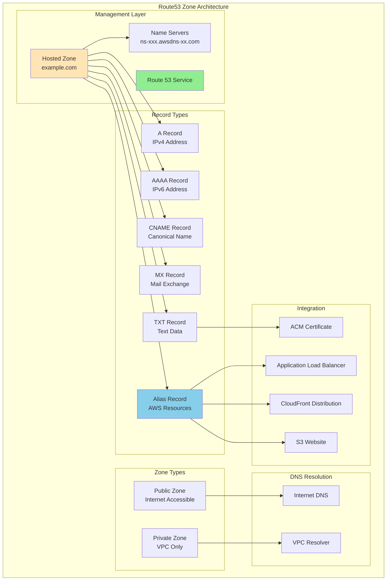

# About aws_route53_zone
<!-- このファイルはaws_route53_zoneに関する包括的な知識をまとめたものです -->
<!-- daily-TILから重要な内容を抽出・整理し、体系的にまとめています -->

> [!NOTE]
> このドキュメントはaws_route53_zoneに関する学習内容を体系的にまとめた要約版です。
> 詳細な実装例や日々の学習記録は、参照セクションのdaily-TILリンクをご確認ください。

## 目次

<details>
<summary>目次を開く</summary>

- [About aws_route53_zone](#about-aws_route53_zone)
  - [目次](#目次)
  - [概要](#概要)
    - [キーポイント](#キーポイント)
  - [What - aws_route53_zoneとは何か](#what---aws_route53_zoneとは何か)
    - [基本概念](#基本概念)
      - [定義](#定義)
      - [構成要素](#構成要素)
    - [主要な特徴](#主要な特徴)
    - [アーキテクチャ](#アーキテクチャ)
      - [レイヤー構成](#レイヤー構成)
      - [データフロー](#データフロー)
  - [Why - なぜaws_route53_zoneが必要なのか](#why---なぜaws_route53_zoneが必要なのか)
    - [解決する課題](#解決する課題)
      - [従来の問題点](#従来の問題点)
      - [aws_route53_zoneによる解決策](#aws_route53_zoneによる解決策)
    - [メリット](#メリット)
      - [ビジネス面のメリット](#ビジネス面のメリット)
      - [技術面のメリット](#技術面のメリット)
    - [デメリット](#デメリット)
    - [他の選択肢との比較](#他の選択肢との比較)
  - [How - aws_route53_zoneの実装方法](#how---aws_route53_zoneの実装方法)
    - [基本的な使い方](#基本的な使い方)
      - [セットアップ](#セットアップ)
      - [基本的な実装](#基本的な実装)
      - [実行例](#実行例)
    - [ベストプラクティス](#ベストプラクティス)
      - [1. ゾーン管理の階層化](#1-ゾーン管理の階層化)
      - [2. セキュリティの強化](#2-セキュリティの強化)
      - [3. 監視とロギング](#3-監視とロギング)
    - [よくある実装パターン](#よくある実装パターン)
      - [パターン1: パブリックホストゾーン](#パターン1-パブリックホストゾーン)
      - [パターン2: プライベートホストゾーン](#パターン2-プライベートホストゾーン)
      - [パターン3: サブドメイン委任](#パターン3-サブドメイン委任)
    - [トラブルシューティング](#トラブルシューティング)
      - [エラー1: HostedZoneNotEmpty](#エラー1-hostedzonenotempty)
      - [エラー2: DelegationSetNotReusable](#エラー2-delegationsetnotreusable)
      - [エラー3: InvalidVPCId](#エラー3-invalidvpcid)
  - [参照：daily-TIL](#参照daily-til)
    - [What関連](#what関連)
    - [Why関連](#why関連)
    - [How関連](#how関連)
  - [バージョン履歴](#バージョン履歴)

</details>

---

## 概要

aws_route53_zoneはTerraformでAWS Route 53ホストゾーンを作成・管理するためのリソースです。ドメイン名に対するDNS情報を管理する論理的なコンテナとして機能し、パブリックインターネットやVPC内でのDNS解決を提供します。高可用性と低レイテンシを実現する、フルマネージドなDNSサービスの基盤となります。

### キーポイント

- ドメインのDNSレコードを管理するホストゾーンの宣言的な構成
- パブリック/プライベートゾーンによる柔軟なアクセス制御
- 99.99%の可用性SLAによる高信頼性のDNSサービス

---

## What - aws_route53_zoneとは何か

### 基本概念

<details>
<summary>基本概念の詳細</summary>

aws_route53_zoneリソースは、AWS Route 53でホストゾーンを作成・管理するためのTerraformリソースタイプです。ホストゾーンは特定のドメイン（例：example.com）のDNSレコードを格納する論理的なコンテナとして機能し、DNSクエリに対する権威ある応答を提供します。

#### 定義

aws_route53_zoneは、ドメイン名に対するDNS情報を管理するRoute 53ホストゾーンを定義するTerraformリソースです。パブリックインターネットからアクセス可能なパブリックゾーン、またはVPC内からのみアクセス可能なプライベートゾーンとして構成できます。

#### 構成要素

1. **ホストゾーン**
   - ドメインのDNSレコードを格納するコンテナ

2. **ネームサーバー**
   - DNS解決を処理する権威DNSサーバー

3. **DNSレコード**
   - A、AAAA、CNAME、MX等のリソースレコード

</details>

### 主要な特徴

<details>
<summary>特徴の詳細</summary>

1. **高可用性**
   - 世界中に分散された冗長なDNSサーバー
   - 利点: 99.99%の可用性SLA

2. **グローバル分散**
   - エニーキャストによる最適なルーティング
   - 利点: 低レイテンシでのDNS解決

3. **フルマネージド**
   - インフラの管理が不要
   - 利点: 運用負荷の削減

</details>

### アーキテクチャ

<details>
<summary>アーキテクチャ図と説明</summary>



#### レイヤー構成

- **管理層**: Route 53サービスとホストゾーンの管理
- **レコード層**: 各種DNSレコードタイプの定義
- **統合層**: AWSサービスとの連携

#### データフロー

1. DNSクエリがRoute 53に到達
2. ホストゾーンで該当レコードを検索
3. 適切なDNS応答を返す

</details>

---

## Why - なぜaws_route53_zoneが必要なのか

### 解決する課題

<details>
<summary>課題の詳細</summary>

#### 従来の問題点

1. **DNS管理の複雑性**
   - 影響: 手動でのDNS設定によるミスのリスク
   - 例: ネームサーバーの設定ミスによるダウンタイム

2. **可用性の問題**
   - 影響: 単一障害点によるサービス停止
   - 例: DNSサーバー障害によるアクセス不能

#### aws_route53_zoneによる解決策

- フルマネージドサービスによる運用負荷の削減
- グローバル分散による高可用性の実現
- Infrastructure as Codeによる設定の自動化

</details>

### メリット

<details>
<summary>メリットの詳細</summary>

#### ビジネス面のメリット

1. **コスト効率**
   - 使用量ベースの料金体系
   - DNSサーバーの構築・運用コスト削減

2. **信頼性向上**
   - 99.99%の可用性SLA
   - ビジネス継続性の確保

3. **グローバル展開**
   - 世界中からの低レイテンシアクセス
   - 国際的なサービス展開の容易化

#### 技術面のメリット

1. **自動化対応**
   - TerraformによるIaC管理
   - CI/CDパイプラインとの統合

2. **AWSサービス統合**
   - エイリアスレコードによる簡単な連携
   - ヘルスチェックとの組み合わせ

</details>

### デメリット

<details>
<summary>デメリットと対策</summary>

| デメリット | 影響 | 対策 |
|-----------|------|------|
| ベンダーロックイン | AWS依存 | 標準的なDNSレコード形式を維持 |
| 料金体系 | クエリ数による課金 | CloudFrontとの組み合わせでキャッシュ |
| 学習曲線 | 初期設定の複雑さ | ドキュメントとテンプレートの活用 |

</details>

### 他の選択肢との比較

<details>
<summary>比較表</summary>

| 項目 | Route 53 | Cloudflare DNS | 自己管理DNS |
|------|----------|----------------|-------------|
| 可用性 | 99.99% SLA | 100% SLA | 自己責任 |
| 料金 | 従量課金 | 定額/従量 | インフラコスト |
| AWS統合 | ネイティブ | 制限あり | 手動設定 |
| 管理負荷 | 非常に低い | 低い | 高い |

</details>

---

## How - aws_route53_zoneの実装方法

### 基本的な使い方

<details>
<summary>基本実装例</summary>

#### セットアップ

```hcl
# プロバイダーの設定
terraform {
  required_providers {
    aws = {
      source  = "hashicorp/aws"
      version = "~> 5.0"
    }
  }
}

provider "aws" {
  region = "ap-northeast-1"
}
```

#### 基本的な実装

```hcl
# パブリックホストゾーン
resource "aws_route53_zone" "main" {
  name    = "example.com"
  comment = "Managed by Terraform"

  tags = {
    Name        = "${var.project_name}-zone"
    Environment = var.environment
  }
}

# 基本的なAレコード
resource "aws_route53_record" "www" {
  zone_id = aws_route53_zone.main.zone_id
  name    = "www.example.com"
  type    = "A"
  ttl     = 300
  records = ["192.0.2.1"]
}

# ALBへのエイリアスレコード
resource "aws_route53_record" "alb" {
  zone_id = aws_route53_zone.main.zone_id
  name    = "api.example.com"
  type    = "A"

  alias {
    name                   = aws_lb.main.dns_name
    zone_id                = aws_lb.main.zone_id
    evaluate_target_health = true
  }
}

# ネームサーバー情報の出力
output "name_servers" {
  value       = aws_route53_zone.main.name_servers
  description = "List of name servers for the zone"
}
```

#### 実行例

```bash
# 初期化
terraform init

# 計画の確認
terraform plan

# 適用
terraform apply

# ネームサーバーの確認
terraform output name_servers
```

</details>

### ベストプラクティス

<details>
<summary>推奨される実装方法</summary>

#### 1. ゾーン管理の階層化

```hcl
# 親ゾーン
resource "aws_route53_zone" "parent" {
  name = "example.com"
}

# 子ゾーン（サブドメイン）
resource "aws_route53_zone" "child" {
  name = "dev.example.com"
}

# 委任レコード
resource "aws_route53_record" "child_ns" {
  zone_id = aws_route53_zone.parent.zone_id
  name    = "dev.example.com"
  type    = "NS"
  ttl     = 172800

  records = aws_route53_zone.child.name_servers
}

# 環境別の管理
locals {
  zones = {
    production  = "example.com"
    staging     = "staging.example.com"
    development = "dev.example.com"
  }
}
```

**理由**: 環境やサービスごとの独立した管理と権限制御

#### 2. セキュリティの強化

```hcl
# プライベートホストゾーン
resource "aws_route53_zone" "private" {
  name = "internal.example.com"

  vpc {
    vpc_id = aws_vpc.main.id
  }

  # 追加VPCの関連付け
  lifecycle {
    ignore_changes = [vpc]
  }
}

# DNSSEC の有効化（パブリックゾーン）
resource "aws_route53_key_signing_key" "main" {
  hosted_zone_id             = aws_route53_zone.main.id
  key_management_service_arn = aws_kms_key.dnssec.arn
  name                       = "${var.project_name}-ksk"
}

resource "aws_route53_hosted_zone_dnssec" "main" {
  hosted_zone_id = aws_route53_key_signing_key.main.hosted_zone_id
}

# クエリロギングの設定
resource "aws_route53_query_log" "main" {
  depends_on = [aws_cloudwatch_log_resource_policy.route53]

  cloudwatch_log_group_arn = aws_cloudwatch_log_group.route53.arn
  zone_id                  = aws_route53_zone.main.zone_id
}
```

**理由**: DNS攻撃の防止とコンプライアンス対応

#### 3. 監視とロギング

```hcl
# CloudWatchロググループ
resource "aws_cloudwatch_log_group" "route53" {
  name              = "/aws/route53/${aws_route53_zone.main.name}"
  retention_in_days = 30
}

# ヘルスチェック
resource "aws_route53_health_check" "main" {
  fqdn              = "www.example.com"
  port              = 443
  type              = "HTTPS"
  resource_path     = "/health"
  failure_threshold = "3"
  request_interval  = "30"

  tags = {
    Name = "${var.project_name}-health-check"
  }
}

# CloudWatchアラーム
resource "aws_cloudwatch_metric_alarm" "health_check" {
  alarm_name          = "${var.project_name}-route53-health"
  comparison_operator = "LessThanThreshold"
  evaluation_periods  = "2"
  metric_name         = "HealthCheckStatus"
  namespace           = "AWS/Route53"
  period              = "60"
  statistic           = "Minimum"
  threshold           = "1"
  alarm_description   = "This metric monitors Route53 health check"

  dimensions = {
    HealthCheckId = aws_route53_health_check.main.id
  }
}
```

**理由**: DNSの可用性監視とトラブルシューティング

</details>

### よくある実装パターン

<details>
<summary>実装パターン集</summary>

#### パターン1: パブリックホストゾーン

**用途**: インターネットからアクセス可能なWebサービス

```hcl
# メインゾーン
resource "aws_route53_zone" "public" {
  name = var.domain_name

  tags = {
    Name = "${var.project_name}-public-zone"
    Type = "public"
  }
}

# ACM証明書の検証
resource "aws_acm_certificate" "main" {
  domain_name       = var.domain_name
  validation_method = "DNS"

  subject_alternative_names = [
    "*.${var.domain_name}"
  ]

  lifecycle {
    create_before_destroy = true
  }
}

resource "aws_route53_record" "cert_validation" {
  for_each = {
    for dvo in aws_acm_certificate.main.domain_validation_options : dvo.domain_name => {
      name   = dvo.resource_record_name
      record = dvo.resource_record_value
      type   = dvo.resource_record_type
    }
  }

  allow_overwrite = true
  name            = each.value.name
  records         = [each.value.record]
  ttl             = 60
  type            = each.value.type
  zone_id         = aws_route53_zone.public.zone_id
}

# CloudFrontディストリビューション用エイリアス
resource "aws_route53_record" "cloudfront" {
  zone_id = aws_route53_zone.public.zone_id
  name    = var.domain_name
  type    = "A"

  alias {
    name                   = aws_cloudfront_distribution.main.domain_name
    zone_id                = aws_cloudfront_distribution.main.hosted_zone_id
    evaluate_target_health = false
  }
}
```

#### パターン2: プライベートホストゾーン

**用途**: VPC内のみでアクセス可能な内部サービス

```hcl
# プライベートゾーン
resource "aws_route53_zone" "private" {
  name = "internal.${var.domain_name}"

  vpc {
    vpc_id = aws_vpc.main.id
  }

  tags = {
    Name = "${var.project_name}-private-zone"
    Type = "private"
  }
}

# RDSエンドポイント用CNAME
resource "aws_route53_record" "database" {
  zone_id = aws_route53_zone.private.zone_id
  name    = "db.internal.${var.domain_name}"
  type    = "CNAME"
  ttl     = 300
  records = [aws_rds_cluster.main.endpoint]
}

# 内部ALB用エイリアス
resource "aws_route53_record" "internal_alb" {
  zone_id = aws_route53_zone.private.zone_id
  name    = "api.internal.${var.domain_name}"
  type    = "A"

  alias {
    name                   = aws_lb.internal.dns_name
    zone_id                = aws_lb.internal.zone_id
    evaluate_target_health = true
  }
}

# 追加VPCの関連付け
resource "aws_route53_zone_association" "secondary" {
  zone_id = aws_route53_zone.private.zone_id
  vpc_id  = aws_vpc.secondary.id
}
```

#### パターン3: サブドメイン委任

**用途**: 部門やサービスごとの独立したDNS管理

```hcl
# 親ドメインのゾーン
resource "aws_route53_zone" "parent" {
  name = "example.com"
}

# 開発環境用サブドメイン
resource "aws_route53_zone" "dev" {
  name = "dev.example.com"

  tags = {
    Environment = "development"
  }
}

# 本番環境用サブドメイン
resource "aws_route53_zone" "prod" {
  name = "app.example.com"

  tags = {
    Environment = "production"
  }
}

# NSレコードによる委任
resource "aws_route53_record" "dev_delegation" {
  zone_id = aws_route53_zone.parent.zone_id
  name    = "dev.example.com"
  type    = "NS"
  ttl     = 172800
  records = aws_route53_zone.dev.name_servers
}

resource "aws_route53_record" "prod_delegation" {
  zone_id = aws_route53_zone.parent.zone_id
  name    = "app.example.com"
  type    = "NS"
  ttl     = 172800
  records = aws_route53_zone.prod.name_servers
}
```

</details>

### トラブルシューティング

<details>
<summary>よくある問題と解決方法</summary>

#### エラー1: HostedZoneNotEmpty

**原因**: ゾーンにレコードが残っている状態で削除しようとした
**解決方法**:

```hcl
# レコードの削除順序を管理
resource "aws_route53_record" "example" {
  # ...設定...

  # ゾーンより先に削除されるよう依存関係を設定
  lifecycle {
    create_before_destroy = false
  }
}

# または、ゾーンのforce_destroyを有効化（注意が必要）
resource "aws_route53_zone" "main" {
  name = "example.com"
  
  # 全レコードを強制削除（本番環境では非推奨）
  force_destroy = var.environment != "production"
}
```

#### エラー2: DelegationSetNotReusable

**原因**: 他のゾーンで使用中の委任セットを再利用しようとした
**解決方法**:

```hcl
# 再利用可能な委任セットの作成
resource "aws_route53_delegation_set" "main" {
  reference_name = var.project_name
}

# 委任セットを使用したゾーン作成
resource "aws_route53_zone" "main" {
  name              = "example.com"
  delegation_set_id = aws_route53_delegation_set.main.id
}
```

#### エラー3: InvalidVPCId

**原因**: プライベートゾーンに無効なVPC IDを指定
**解決方法**:

```hcl
# VPCの存在確認
data "aws_vpc" "selected" {
  id = var.vpc_id
}

resource "aws_route53_zone" "private" {
  name = "internal.example.com"

  vpc {
    vpc_id = data.aws_vpc.selected.id
  }

  # VPCが削除される前にゾーンを削除
  depends_on = [data.aws_vpc.selected]
}
```

</details>

---

## 参照：daily-TIL

このドキュメントは以下のdaily-TILファイルから情報を集約・整理しています：

### What関連

- [2025.07.17.12.21 - what_aws_route53.md](daily/2025.07.17.12.21_what_aws_route53.md)
  - AWS Route53の基本概念、主な機能、セキュリティ機能について

### Why関連

- 現在のところ、aws_route53_zoneの「なぜ」に関するdaily-TILファイルはありません

### How関連

- [2025.07.24.08.58 - how_aws_route53_tutorial.md](daily/2025.07.24.08.58_how_aws_route53_tutorial.md)
  - TerraformでのRoute53実装チュートリアル、各種レコードタイプの設定方法

- [2025.08.04.21.28 - what_enable_dns_hostnames_in_terraform_aws_vpc.md](daily/2025.08.04.21.28_what_enable_dns_hostnames_in_terraform_aws_vpc.md)
  - VPC内でのDNS設定とRoute53との連携について

---

## バージョン履歴

| バージョン | 更新日 | 主な変更内容 |
|-----------|---------|-------------|
| 1.0.0 | 2025-08-11 | 初版作成 |

---

> [!TIP]
> より詳細な情報や具体的な実装例については、上記のdaily-TILリンクを参照してください。
> このドキュメントは定期的に更新され、新しい学習内容が追加されます。