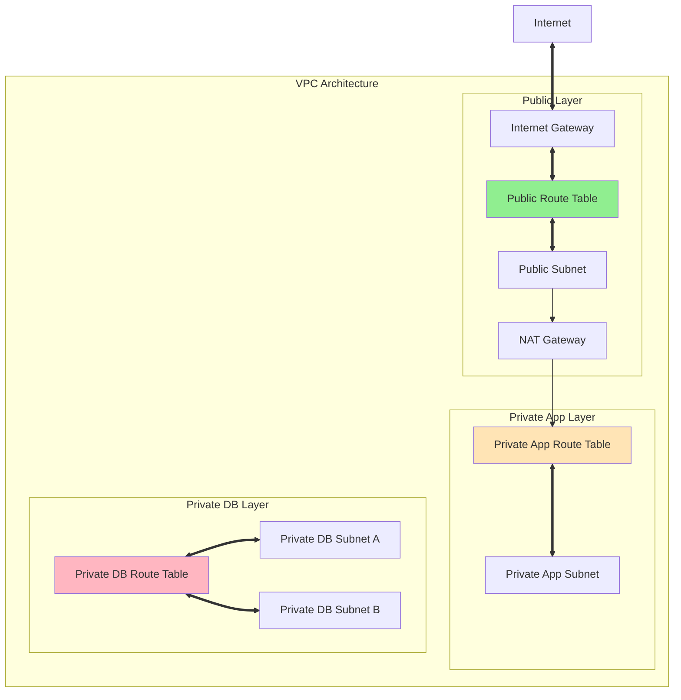

# About aws_route_table
<!-- このファイルはaws_route_tableに関する包括的な知識をまとめたものです -->
<!-- daily-TILから重要な内容を抽出・整理し、体系的にまとめています -->

> [!NOTE]
> このドキュメントはaws_route_tableに関する学習内容を体系的にまとめた要約版です。
> 詳細な実装例や日々の学習記録は、参照セクションのdaily-TILリンクをご確認ください。

## 目次

<details>
<summary>目次を開く</summary>

- [About aws_route_table](#about-aws_route_table)
  - [目次](#目次)
  - [概要](#概要)
    - [キーポイント](#キーポイント)
  - [What - aws_route_tableとは何か](#what---aws_route_tableとは何か)
    - [基本概念](#基本概念)
      - [定義](#定義)
      - [構成要素](#構成要素)
    - [主要な特徴](#主要な特徴)
    - [アーキテクチャ](#アーキテクチャ)
      - [レイヤー構成](#レイヤー構成)
      - [データフロー](#データフロー)
  - [Why - なぜaws_route_tableが必要なのか](#why---なぜaws_route_tableが必要なのか)
    - [解決する課題](#解決する課題)
      - [従来の問題点](#従来の問題点)
      - [aws_route_tableによる解決策](#aws_route_tableによる解決策)
    - [メリット](#メリット)
      - [ビジネス面のメリット](#ビジネス面のメリット)
      - [技術面のメリット](#技術面のメリット)
    - [デメリット](#デメリット)
    - [他の選択肢との比較](#他の選択肢との比較)
  - [How - aws_route_tableの実装方法](#how---aws_route_tableの実装方法)
    - [基本的な使い方](#基本的な使い方)
      - [セットアップ](#セットアップ)
      - [基本的な実装](#基本的な実装)
      - [実行例](#実行例)
    - [ベストプラクティス](#ベストプラクティス)
      - [1. 3層アーキテクチャの実装](#1-3層アーキテクチャの実装)
      - [2. 明示的なルートの設定](#2-明示的なルートの設定)
      - [3. タグによる管理](#3-タグによる管理)
    - [よくある実装パターン](#よくある実装パターン)
      - [パターン1: パブリックルートテーブル](#パターン1-パブリックルートテーブル)
      - [パターン2: プライベートルートテーブル（NAT経由）](#パターン2-プライベートルートテーブルnat経由)
      - [パターン3: 完全プライベートルートテーブル](#パターン3-完全プライベートルートテーブル)
    - [トラブルシューティング](#トラブルシューティング)
      - [エラー1: InvalidGatewayID.NotFound](#エラー1-invalidgatewayidnotfound)
      - [エラー2: Route.AlreadyExists](#エラー2-routealreadyexists)
      - [エラー3: InvalidSubnetID.NotFound](#エラー3-invalidsubnetidnotfound)
  - [参照：daily-TIL](#参照daily-til)
    - [What関連](#what関連)
    - [Why関連](#why関連)
    - [How関連](#how関連)
  - [バージョン履歴](#バージョン履歴)

</details>

---

## 概要

aws_route_tableはTerraformでAWS VPCのルーティングテーブルを作成・管理するためのリソースです。ネットワークトラフィックの経路を定義し、サブネット間やインターネットへの通信を制御する重要なネットワークコンポーネントです。

### キーポイント

- VPC内のネットワークトラフィックのルーティングを宣言的に管理
- セキュアな3層アーキテクチャの実現に必須のコンポーネント
- Internet Gateway、NAT Gateway、VPC Peeringなどとの統合設定

---

## What - aws_route_tableとは何か

### 基本概念

<details>
<summary>基本概念の詳細</summary>

aws_route_tableリソースは、AWS VPC内でネットワークトラフィックの経路を決定するルーティングテーブルをTerraformで管理するためのリソースタイプです。各サブネットからのトラフィックがどこに向かうべきかを定義する、ネットワークの交通ルールのような役割を果たします。

#### 定義

aws_route_tableは、VPC内のネットワークトラフィックのルーティングルールを定義するTerraformリソースです。送信先のCIDRブロックと、そのトラフィックを転送する先（ゲートウェイやネットワークインターフェース）のマッピングを管理します。

#### 構成要素

1. **ルートテーブル本体**
   - VPCに関連付けられたルーティングルールのコンテナ

2. **ルート（Route）**
   - 送信先CIDRブロックと転送先の組み合わせ

3. **関連付け（Association）**
   - ルートテーブルとサブネットの紐付け

</details>

### 主要な特徴

<details>
<summary>特徴の詳細</summary>

1. **階層的なネットワーク設計**
   - パブリック、プライベート、データベース層の分離
   - 利点: セキュリティの向上と管理の簡素化

2. **柔軟なルーティング制御**
   - Internet Gateway、NAT Gateway、VPC Peeringなど多様な転送先
   - 利点: 複雑なネットワーク要件にも対応可能

3. **サブネット単位の制御**
   - 各サブネットに異なるルーティングポリシーを適用
   - 利点: きめ細かなネットワークアクセス制御

</details>

### アーキテクチャ

<details>
<summary>アーキテクチャ図と説明</summary>



#### レイヤー構成

- **パブリックルートテーブル**: Internet Gatewayへの直接ルーティング
- **プライベートAppルートテーブル**: NAT Gateway経由のアウトバウンド通信
- **プライベートDBルートテーブル**: VPC内部通信のみ

#### データフロー

1. インバウンドトラフィックはInternet Gateway経由でパブリックサブネットへ
2. プライベートサブネットからのアウトバウンドはNAT Gateway経由
3. データベース層は完全に隔離されVPC内部通信のみ

</details>

---

## Why - なぜaws_route_tableが必要なのか

### 解決する課題

<details>
<summary>課題の詳細</summary>

#### 従来の問題点

1. **セキュリティの不備**
   - 影響: すべてのサブネットが同じルーティングルールを共有
   - 例: データベースサーバーが意図せずインターネットアクセス可能

2. **ネットワーク設計の複雑性**
   - 影響: 手動設定によるミスや不整合
   - 例: 環境間でルーティング設定が異なる

#### aws_route_tableによる解決策

- レイヤー別の明確なトラフィック制御
- インフラストラクチャのコード化によるバージョン管理
- 再利用可能なネットワーク設計パターン

</details>

### メリット

<details>
<summary>メリットの詳細</summary>

#### ビジネス面のメリット

1. **コスト削減**
   - 不要なインターネット通信の削減
   - NAT Gatewayの効率的な利用

2. **生産性向上**
   - ネットワーク設定の自動化
   - 環境構築時間の短縮

3. **スケーラビリティ**
   - 新しいサブネットへの迅速な対応
   - 複雑なネットワーク要件への柔軟な対応

#### 技術面のメリット

1. **セキュリティの強化**
   - 最小権限の原則に基づいたトラフィック制御
   - レイヤー別のアクセス制限

2. **運用の簡素化**
   - 一貫したネットワーク設計
   - トラブルシューティングの容易性

</details>

### デメリット

<details>
<summary>デメリットと対策</summary>

| デメリット | 影響 | 対策 |
|-----------|------|------|
| 設計の複雑性 | 初期学習コストの増加 | テンプレートとドキュメントの整備 |
| 依存関係の管理 | リソース作成順序のエラー | 明示的なdepends_onの使用 |
| ルート競合 | 同一CIDRへの複数ルート設定不可 | 事前の設計レビュー |

</details>

### 他の選択肢との比較

<details>
<summary>比較表</summary>

| 項目 | aws_route_table | VPCデフォルトルート | 手動設定 |
|------|----------------|-------------------|----------|
| コスト | 無料 | 無料 | 無料 |
| 学習曲線 | 中程度 | 低い | 低い |
| パフォーマンス | 高速 | 高速 | 高速 |
| エコシステム | IaC対応 | 限定的 | なし |

</details>

---

## How - aws_route_tableの実装方法

### 基本的な使い方

<details>
<summary>基本実装例</summary>

#### セットアップ

```hcl
# プロバイダーの設定
terraform {
  required_providers {
    aws = {
      source  = "hashicorp/aws"
      version = "~> 5.0"
    }
  }
}

provider "aws" {
  region = "ap-northeast-1"
}
```

#### 基本的な実装

```hcl
# ルートテーブルの作成
resource "aws_route_table" "public" {
  vpc_id = aws_vpc.main.id

  tags = {
    Name = "${var.project_name}-public-rt-${var.environment}"
  }
}

# ルートの追加
resource "aws_route" "public_internet" {
  route_table_id         = aws_route_table.public.id
  destination_cidr_block = "0.0.0.0/0"
  gateway_id             = aws_internet_gateway.main.id
}

# サブネットとの関連付け
resource "aws_route_table_association" "public" {
  subnet_id      = aws_subnet.public.id
  route_table_id = aws_route_table.public.id
}
```

#### 実行例

```bash
# 初期化
terraform init

# 計画の確認
terraform plan

# 適用
terraform apply
```

</details>

### ベストプラクティス

<details>
<summary>推奨される実装方法</summary>

#### 1. 3層アーキテクチャの実装

```hcl
# パブリック層
resource "aws_route_table" "public" {
  vpc_id = aws_vpc.main.id
  tags = {
    Name = "${var.project_name}-public-rt-${var.environment}"
    Type = "public"
  }
}

# プライベートApp層
resource "aws_route_table" "private_app" {
  vpc_id = aws_vpc.main.id
  tags = {
    Name = "${var.project_name}-private-app-rt-${var.environment}"
    Type = "private-app"
  }
}

# プライベートDB層
resource "aws_route_table" "private_db" {
  vpc_id = aws_vpc.main.id
  tags = {
    Name = "${var.project_name}-private-db-rt-${var.environment}"
    Type = "private-db"
  }
}
```

**理由**: セキュリティレベルに応じたトラフィック制御の実現

#### 2. 明示的なルートの設定

```hcl
# Internet Gatewayへのルート
resource "aws_route" "public_igw" {
  route_table_id         = aws_route_table.public.id
  destination_cidr_block = "0.0.0.0/0"
  gateway_id             = aws_internet_gateway.main.id
}

# NAT Gatewayへのルート
resource "aws_route" "private_nat" {
  route_table_id         = aws_route_table.private_app.id
  destination_cidr_block = "0.0.0.0/0"
  nat_gateway_id         = aws_nat_gateway.main.id
}
```

**理由**: ルーティング設定の明確化と管理の容易性

#### 3. タグによる管理

- 環境とリソースタイプを含むタグ付け
- 一貫した命名規則の適用
- 自動化ツールとの連携を考慮

</details>

### よくある実装パターン

<details>
<summary>実装パターン集</summary>

#### パターン1: パブリックルートテーブル

**用途**: ALB、NAT Gateway、Bastion Hostなど

```hcl
resource "aws_route_table" "public" {
  vpc_id = aws_vpc.main.id

  route {
    cidr_block = "0.0.0.0/0"
    gateway_id = aws_internet_gateway.main.id
  }

  tags = {
    Name = "${var.project_name}-public-rt-${var.environment}"
  }
}
```

#### パターン2: プライベートルートテーブル（NAT経由）

**用途**: アプリケーションサーバー、ECSタスクなど

```hcl
resource "aws_route_table" "private_app" {
  vpc_id = aws_vpc.main.id

  tags = {
    Name = "${var.project_name}-private-app-rt-${var.environment}"
  }
}

resource "aws_route" "private_nat" {
  route_table_id         = aws_route_table.private_app.id
  destination_cidr_block = "0.0.0.0/0"
  nat_gateway_id         = aws_nat_gateway.main.id
}
```

#### パターン3: 完全プライベートルートテーブル

**用途**: データベース、内部サービスなど

```hcl
resource "aws_route_table" "private_db" {
  vpc_id = aws_vpc.main.id

  # ローカルルートのみ（外部ルートなし）

  tags = {
    Name = "${var.project_name}-private-db-rt-${var.environment}"
  }
}
```

</details>

### トラブルシューティング

<details>
<summary>よくある問題と解決方法</summary>

#### エラー1: InvalidGatewayID.NotFound

**原因**: Internet GatewayやNAT Gatewayが存在しない、またはIDが誤っている
**解決方法**:

```hcl
# 依存関係を明示的に設定
resource "aws_route" "public_internet" {
  route_table_id         = aws_route_table.public.id
  destination_cidr_block = "0.0.0.0/0"
  gateway_id             = aws_internet_gateway.main.id

  depends_on = [aws_internet_gateway.main]
}
```

#### エラー2: Route.AlreadyExists

**原因**: 同じ送信先CIDRブロックへのルートが既に存在
**解決方法**:

```hcl
# 既存のルートを確認
data "aws_route_table" "existing" {
  route_table_id = aws_route_table.main.id
}

# 重複しないルートを設定
```

#### エラー3: InvalidSubnetID.NotFound

**原因**: ルートテーブル関連付けで.idの付け忘れ
**解決方法**:

```hcl
# 誤り
resource "aws_route_table_association" "wrong" {
  subnet_id      = aws_subnet.example  # .idが必要
  route_table_id = aws_route_table.example.id
}

# 正しい
resource "aws_route_table_association" "correct" {
  subnet_id      = aws_subnet.example.id
  route_table_id = aws_route_table.example.id
}
```

</details>

---

## 参照：daily-TIL

このドキュメントは以下のdaily-TILファイルから情報を集約・整理しています：

### What関連

- [2025.08.07.09.30 - what_route_table_association.md](daily/2025.08.07.09.30_what_route_table_association.md)
  - ルートテーブル関連付け（Route Table Association）の基本概念と仕組みについて

### Why関連

- 現在のところ、aws_route_tableの「なぜ」に関するdaily-TILファイルはありません

### How関連

- [2025.08.07.09.47 - how_terraform_aws_route_table_implementation.md](daily/2025.08.07.09.47_how_terraform_aws_route_table_implementation.md)
  - 3層アーキテクチャでのルートテーブル実装パターンとベストプラクティス

---

## バージョン履歴

| バージョン | 更新日 | 主な変更内容 |
|-----------|---------|-------------|
| 1.0.0 | 2025-08-11 | 初版作成 |

---

> [!TIP]
> より詳細な情報や具体的な実装例については、上記のdaily-TILリンクを参照してください。
> このドキュメントは定期的に更新され、新しい学習内容が追加されます。