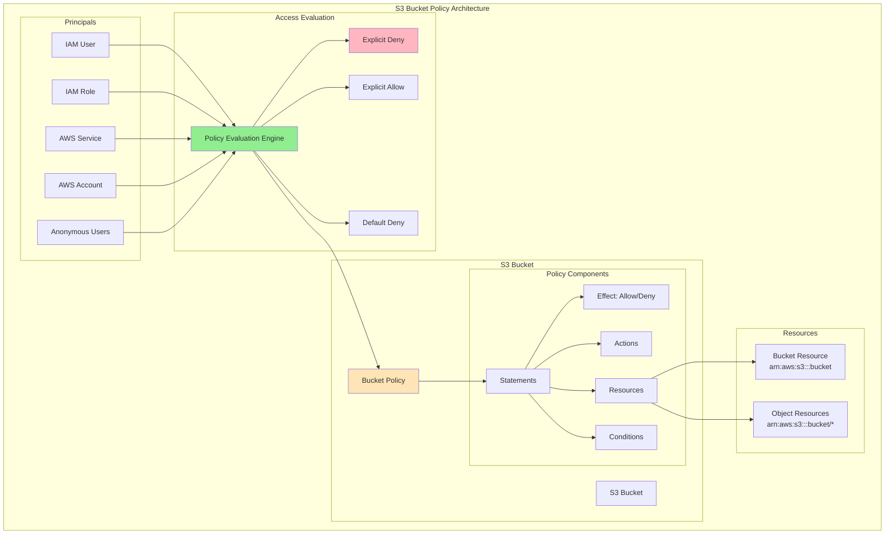

# About aws_s3_bucket_policy
<!-- このファイルはaws_s3_bucket_policyに関する包括的な知識をまとめたものです -->
<!-- daily-TILから重要な内容を抽出・整理し、体系的にまとめています -->

> [!NOTE]
> このドキュメントはaws_s3_bucket_policyに関する学習内容を体系的にまとめた要約版です。
> 詳細な実装例や日々の学習記録は、参照セクションのdaily-TILリンクをご確認ください。

## 目次

<details>
<summary>目次を開く</summary>

- [About aws_s3_bucket_policy](#about-aws_s3_bucket_policy)
  - [目次](#目次)
  - [概要](#概要)
    - [キーポイント](#キーポイント)
  - [What - aws_s3_bucket_policyとは何か](#what---aws_s3_bucket_policyとは何か)
    - [基本概念](#基本概念)
      - [定義](#定義)
      - [構成要素](#構成要素)
    - [主要な特徴](#主要な特徴)
    - [アーキテクチャ](#アーキテクチャ)
      - [レイヤー構成](#レイヤー構成)
      - [データフロー](#データフロー)
  - [Why - なぜaws_s3_bucket_policyが必要なのか](#why---なぜaws_s3_bucket_policyが必要なのか)
    - [解決する課題](#解決する課題)
      - [従来の問題点](#従来の問題点)
      - [aws_s3_bucket_policyによる解決策](#aws_s3_bucket_policyによる解決策)
    - [メリット](#メリット)
      - [ビジネス面のメリット](#ビジネス面のメリット)
      - [技術面のメリット](#技術面のメリット)
    - [デメリット](#デメリット)
    - [他の選択肢との比較](#他の選択肢との比較)
  - [How - aws_s3_bucket_policyの実装方法](#how---aws_s3_bucket_policyの実装方法)
    - [基本的な使い方](#基本的な使い方)
      - [セットアップ](#セットアップ)
      - [基本的な実装](#基本的な実装)
      - [実行例](#実行例)
    - [ベストプラクティス](#ベストプラクティス)
      - [1. 最小権限の原則](#1-最小権限の原則)
      - [2. 明示的な拒否の活用](#2-明示的な拒否の活用)
      - [3. 条件付きアクセス制御](#3-条件付きアクセス制御)
    - [よくある実装パターン](#よくある実装パターン)
      - [パターン1: CloudFront経由のアクセス](#パターン1-cloudfront経由のアクセス)
      - [パターン2: クロスアカウントアクセス](#パターン2-クロスアカウントアクセス)
      - [パターン3: 暗号化の強制](#パターン3-暗号化の強制)
    - [トラブルシューティング](#トラブルシューティング)
      - [エラー1: AccessDenied](#エラー1-accessdenied)
      - [エラー2: MalformedPolicy](#エラー2-malformedpolicy)
      - [エラー3: PolicySizeExceeded](#エラー3-policysizeexceeded)
  - [参照：daily-TIL](#参照daily-til)
    - [What関連](#what関連)
    - [Why関連](#why関連)
    - [How関連](#how関連)
  - [バージョン履歴](#バージョン履歴)

</details>

---

## 概要

aws_s3_bucket_policyはTerraformでS3バケットへのアクセス権限をJSON形式で定義するリソースベースポリシーです。特定のプリンシパル（ユーザー、ロール、サービス）に対してバケットとオブジェクトへのアクセスを詳細に制御し、クロスアカウントアクセスやパブリックアクセスの管理を可能にします。

### キーポイント

- リソースベースのアクセス制御を宣言的に管理
- クロスアカウントアクセスとパブリックアクセスの制御
- IAMポリシーと連携した多層的なセキュリティ実現

---

## What - aws_s3_bucket_policyとは何か

### 基本概念

<details>
<summary>基本概念の詳細</summary>

aws_s3_bucket_policyリソースは、S3バケットに直接アタッチされるJSON形式のポリシードキュメントをTerraformで管理するためのリソースタイプです。バケットとその中のオブジェクトへのアクセス権限を、IAMポリシーとは独立して制御できます。

#### 定義

aws_s3_bucket_policyは、S3バケットレベルでアクセス制御を定義するTerraformリソースです。誰が（Principal）、何を（Action）、どのリソースに対して（Resource）、どのような条件で（Condition）アクセスできるかを宣言的に定義します。

#### 構成要素

1. **ポリシードキュメント**
   - JSON形式で記述される権限定義

2. **ステートメント**
   - 個々のアクセスルールを定義

3. **評価ロジック**
   - 明示的な拒否が最優先される評価システム

</details>

### 主要な特徴

<details>
<summary>特徴の詳細</summary>

1. **リソースベースポリシー**
   - バケットに直接アタッチ
   - 利点: クロスアカウントアクセスの簡単な実現

2. **きめ細かいアクセス制御**
   - オブジェクトレベルでの権限設定
   - 利点: セキュリティ要件に応じた柔軟な制御

3. **条件付きアクセス**
   - IP制限、暗号化強制、MFA要求など
   - 利点: 高度なセキュリティ要件への対応

</details>

### アーキテクチャ

<details>
<summary>アーキテクチャ図と説明</summary>



#### レイヤー構成

- **プリンシパル層**: アクセスを要求する主体
- **ポリシー層**: アクセスルールの定義
- **評価層**: アクセス可否の判定

#### データフロー

1. プリンシパルがS3リソースへのアクセスを要求
2. ポリシー評価エンジンがバケットポリシーを評価
3. 明示的な拒否→明示的な許可→デフォルト拒否の順で判定

</details>

---

## Why - なぜaws_s3_bucket_policyが必要なのか

### 解決する課題

<details>
<summary>課題の詳細</summary>

#### 従来の問題点

1. **クロスアカウントアクセスの複雑性**
   - 影響: 異なるAWSアカウント間でのデータ共有が困難
   - 例: パートナー企業とのデータ連携

2. **パブリックアクセスの管理**
   - 影響: 意図しないデータ露出のリスク
   - 例: 静的Webサイトホスティングでの制御

#### aws_s3_bucket_policyによる解決策

- リソースベースでの直接的なアクセス制御
- 条件付きアクセスによる高度なセキュリティ
- IAMポリシーと組み合わせた多層防御

</details>

### メリット

<details>
<summary>メリットの詳細</summary>

#### ビジネス面のメリット

1. **コスト削減**
   - IAMユーザー作成不要でアクセス制御
   - 管理オーバーヘッドの削減

2. **コラボレーション促進**
   - 外部パートナーとの安全なデータ共有
   - きめ細かいアクセス制御

3. **コンプライアンス対応**
   - 監査ログと連携した証跡管理
   - 規制要件への準拠

#### 技術面のメリット

1. **柔軟なアクセス制御**
   - IP制限、暗号化強制など高度な条件設定
   - オブジェクトレベルでの権限管理

2. **セキュリティの向上**
   - 明示的な拒否による確実なブロック
   - 最小権限の原則の実現

</details>

### デメリット

<details>
<summary>デメリットと対策</summary>

| デメリット | 影響 | 対策 |
|-----------|------|------|
| ポリシーの複雑性 | 設定ミスのリスク | ポリシーシミュレーターでのテスト |
| サイズ制限（20KB） | 大規模なポリシー作成不可 | ポリシーの分割と最適化 |
| 評価順序の理解 | 意図しないアクセス許可/拒否 | 明示的な拒否の活用 |

</details>

### 他の選択肢との比較

<details>
<summary>比較表</summary>

| 項目 | バケットポリシー | IAMポリシー | ACL |
|------|----------------|-------------|-----|
| スコープ | リソースベース | アイデンティティベース | オブジェクトレベル |
| クロスアカウント | 簡単 | 複雑（AssumeRole必要） | 限定的 |
| きめ細かさ | 高い | 高い | 低い |
| 管理の容易さ | 中程度 | 中程度 | 簡単 |

</details>

---

## How - aws_s3_bucket_policyの実装方法

### 基本的な使い方

<details>
<summary>基本実装例</summary>

#### セットアップ

```hcl
# プロバイダーの設定
terraform {
  required_providers {
    aws = {
      source  = "hashicorp/aws"
      version = "~> 5.0"
    }
  }
}

provider "aws" {
  region = "ap-northeast-1"
}
```

#### 基本的な実装

```hcl
# S3バケット
resource "aws_s3_bucket" "example" {
  bucket = "${var.project_name}-bucket"
}

# バケットポリシー
resource "aws_s3_bucket_policy" "example" {
  bucket = aws_s3_bucket.example.id

  policy = jsonencode({
    Version = "2012-10-17"
    Statement = [
      {
        Sid    = "AllowSpecificIAMRole"
        Effect = "Allow"
        Principal = {
          AWS = aws_iam_role.app_role.arn
        }
        Action = [
          "s3:GetObject",
          "s3:PutObject",
          "s3:DeleteObject"
        ]
        Resource = "${aws_s3_bucket.example.arn}/*"
      },
      {
        Sid    = "AllowListBucket"
        Effect = "Allow"
        Principal = {
          AWS = aws_iam_role.app_role.arn
        }
        Action = "s3:ListBucket"
        Resource = aws_s3_bucket.example.arn
      }
    ]
  })
}
```

#### 実行例

```bash
# 初期化
terraform init

# 計画の確認
terraform plan

# 適用
terraform apply

# ポリシーの確認
aws s3api get-bucket-policy --bucket example-bucket
```

</details>

### ベストプラクティス

<details>
<summary>推奨される実装方法</summary>

#### 1. 最小権限の原則

```hcl
resource "aws_s3_bucket_policy" "minimal_permissions" {
  bucket = aws_s3_bucket.example.id

  policy = jsonencode({
    Version = "2012-10-17"
    Statement = [
      {
        Sid    = "ReadOnlyAccess"
        Effect = "Allow"
        Principal = {
          AWS = aws_iam_role.reader_role.arn
        }
        Action = [
          "s3:GetObject",
          "s3:GetObjectVersion"
        ]
        Resource = "${aws_s3_bucket.example.arn}/public/*"
        # 特定のプレフィックスのみアクセス可能
      },
      {
        Sid    = "ListSpecificPrefix"
        Effect = "Allow"
        Principal = {
          AWS = aws_iam_role.reader_role.arn
        }
        Action = "s3:ListBucket"
        Resource = aws_s3_bucket.example.arn
        Condition = {
          StringLike = {
            "s3:prefix" = ["public/*"]
          }
        }
      }
    ]
  })
}
```

**理由**: 必要な権限のみを付与し、セキュリティリスクを最小化

#### 2. 明示的な拒否の活用

```hcl
resource "aws_s3_bucket_policy" "with_explicit_deny" {
  bucket = aws_s3_bucket.sensitive.id

  policy = jsonencode({
    Version = "2012-10-17"
    Statement = [
      # 通常のアクセス許可
      {
        Sid    = "AllowAuthorizedAccess"
        Effect = "Allow"
        Principal = {
          AWS = var.authorized_role_arns
        }
        Action = ["s3:GetObject", "s3:PutObject"]
        Resource = "${aws_s3_bucket.sensitive.arn}/*"
      },
      # 重要な操作の明示的な拒否
      {
        Sid    = "DenyDangerousOperations"
        Effect = "Deny"
        Principal = "*"
        Action = [
          "s3:DeleteBucket",
          "s3:DeleteBucketPolicy",
          "s3:PutBucketPolicy"
        ]
        Resource = aws_s3_bucket.sensitive.arn
      },
      # 暗号化されていないアップロードの拒否
      {
        Sid    = "DenyUnencryptedObjectUploads"
        Effect = "Deny"
        Principal = "*"
        Action = "s3:PutObject"
        Resource = "${aws_s3_bucket.sensitive.arn}/*"
        Condition = {
          StringNotEquals = {
            "s3:x-amz-server-side-encryption" = "AES256"
          }
        }
      }
    ]
  })
}
```

**理由**: 明示的な拒否は最優先され、確実に危険な操作をブロック

#### 3. 条件付きアクセス制御

```hcl
resource "aws_s3_bucket_policy" "conditional_access" {
  bucket = aws_s3_bucket.restricted.id

  policy = jsonencode({
    Version = "2012-10-17"
    Statement = [
      {
        Sid    = "AllowFromSpecificIP"
        Effect = "Allow"
        Principal = {
          AWS = aws_iam_role.app_role.arn
        }
        Action = "s3:*"
        Resource = [
          aws_s3_bucket.restricted.arn,
          "${aws_s3_bucket.restricted.arn}/*"
        ]
        Condition = {
          IpAddress = {
            "aws:SourceIp" = var.allowed_ip_ranges
          }
        }
      },
      {
        Sid    = "RequireMFAForDelete"
        Effect = "Deny"
        Principal = "*"
        Action = "s3:DeleteObject"
        Resource = "${aws_s3_bucket.restricted.arn}/*"
        Condition = {
          Bool = {
            "aws:MultiFactorAuthPresent" = "false"
          }
        }
      },
      {
        Sid    = "AllowSSLRequestsOnly"
        Effect = "Deny"
        Principal = "*"
        Action = "s3:*"
        Resource = [
          aws_s3_bucket.restricted.arn,
          "${aws_s3_bucket.restricted.arn}/*"
        ]
        Condition = {
          Bool = {
            "aws:SecureTransport" = "false"
          }
        }
      }
    ]
  })
}
```

**理由**: 環境やセキュリティ要件に応じた柔軟なアクセス制御

</details>

### よくある実装パターン

<details>
<summary>実装パターン集</summary>

#### パターン1: CloudFront経由のアクセス

**用途**: 静的コンテンツ配信でCloudFront経由のみアクセス許可

```hcl
# Origin Access Identity
resource "aws_cloudfront_origin_access_identity" "oai" {
  comment = "${var.project_name}-oai"
}

resource "aws_s3_bucket_policy" "cloudfront_only" {
  bucket = aws_s3_bucket.static_content.id

  policy = jsonencode({
    Version = "2012-10-17"
    Statement = [
      {
        Sid    = "AllowCloudFrontAccess"
        Effect = "Allow"
        Principal = {
          AWS = aws_cloudfront_origin_access_identity.oai.iam_arn
        }
        Action   = "s3:GetObject"
        Resource = "${aws_s3_bucket.static_content.arn}/*"
      },
      {
        Sid    = "DenyDirectAccess"
        Effect = "Deny"
        Principal = "*"
        Action   = "s3:*"
        Resource = [
          aws_s3_bucket.static_content.arn,
          "${aws_s3_bucket.static_content.arn}/*"
        ]
        Condition = {
          StringNotEquals = {
            "AWS:SourceArn" = aws_cloudfront_distribution.main.arn
          }
        }
      }
    ]
  })
}
```

#### パターン2: クロスアカウントアクセス

**用途**: 異なるAWSアカウントからの安全なアクセス

```hcl
resource "aws_s3_bucket_policy" "cross_account" {
  bucket = aws_s3_bucket.shared.id

  policy = jsonencode({
    Version = "2012-10-17"
    Statement = [
      {
        Sid    = "AllowCrossAccountAccess"
        Effect = "Allow"
        Principal = {
          AWS = [
            "arn:aws:iam::${var.partner_account_id}:root",
            "arn:aws:iam::${var.partner_account_id}:role/data-access-role"
          ]
        }
        Action = [
          "s3:GetObject",
          "s3:ListBucket"
        ]
        Resource = [
          aws_s3_bucket.shared.arn,
          "${aws_s3_bucket.shared.arn}/shared/*"
        ]
        Condition = {
          StringEquals = {
            "s3:ExistingObjectTag/SharedWith" = var.partner_account_id
          }
        }
      }
    ]
  })
}
```

#### パターン3: 暗号化の強制

**用途**: すべてのオブジェクトの暗号化を強制

```hcl
resource "aws_s3_bucket_policy" "enforce_encryption" {
  bucket = aws_s3_bucket.encrypted.id

  policy = jsonencode({
    Version = "2012-10-17"
    Statement = [
      {
        Sid    = "DenyInsecureConnections"
        Effect = "Deny"
        Principal = "*"
        Action = "s3:*"
        Resource = [
          aws_s3_bucket.encrypted.arn,
          "${aws_s3_bucket.encrypted.arn}/*"
        ]
        Condition = {
          Bool = {
            "aws:SecureTransport" = "false"
          }
        }
      },
      {
        Sid    = "DenyUnencryptedObjectUploads"
        Effect = "Deny"
        Principal = "*"
        Action = "s3:PutObject"
        Resource = "${aws_s3_bucket.encrypted.arn}/*"
        Condition = {
          StringNotEquals = {
            "s3:x-amz-server-side-encryption" = "aws:kms"
          }
        }
      },
      {
        Sid    = "DenyWrongKMSKey"
        Effect = "Deny"
        Principal = "*"
        Action = "s3:PutObject"
        Resource = "${aws_s3_bucket.encrypted.arn}/*"
        Condition = {
          StringNotEquals = {
            "s3:x-amz-server-side-encryption-aws-kms-key-id" = aws_kms_key.s3.arn
          }
        }
      }
    ]
  })
}
```

</details>

### トラブルシューティング

<details>
<summary>よくある問題と解決方法</summary>

#### エラー1: AccessDenied

**原因**: ポリシーの評価で拒否されている
**解決方法**:

```hcl
# デバッグ用の一時的なポリシー
resource "aws_s3_bucket_policy" "debug" {
  bucket = aws_s3_bucket.example.id

  policy = jsonencode({
    Version = "2012-10-17"
    Statement = [
      {
        Sid    = "DebugAccess"
        Effect = "Allow"
        Principal = {
          AWS = data.aws_caller_identity.current.arn
        }
        Action   = "s3:*"
        Resource = "*"
      }
    ]
  })
}

# CloudTrailでアクセス拒否の詳細を確認
data "aws_cloudtrail_events" "access_denied" {
  lookup_attributes {
    attribute_key = "EventName"
    attribute_value = "GetObject"
  }
  
  start_time = timeadd(timestamp(), "-1h")
}
```

#### エラー2: MalformedPolicy

**原因**: JSONポリシーの構文エラー
**解決方法**:

```hcl
# jsonencode()を使用して構文エラーを防ぐ
resource "aws_s3_bucket_policy" "valid" {
  bucket = aws_s3_bucket.example.id

  # TerraformのJSON検証機能を活用
  policy = jsonencode({
    Version = "2012-10-17"
    Statement = [{
      Sid       = "ValidStatement"
      Effect    = "Allow"
      Principal = { AWS = "*" }
      Action    = ["s3:GetObject"]
      Resource  = "${aws_s3_bucket.example.arn}/*"
    }]
  })
}

# ポリシーの検証
resource "null_resource" "validate_policy" {
  triggers = {
    policy = aws_s3_bucket_policy.valid.policy
  }

  provisioner "local-exec" {
    command = "echo '${self.triggers.policy}' | jq ."
  }
}
```

#### エラー3: PolicySizeExceeded

**原因**: ポリシーサイズが20KBを超過
**解決方法**:

```hcl
# ポリシーを分割して最適化
locals {
  # 共通のプリンシパルをローカル値で管理
  authorized_principals = [
    aws_iam_role.app_role.arn,
    aws_iam_role.admin_role.arn
  ]
  
  # アクションをグループ化
  read_actions = [
    "s3:GetObject",
    "s3:GetObjectVersion",
    "s3:ListBucket"
  ]
}

resource "aws_s3_bucket_policy" "optimized" {
  bucket = aws_s3_bucket.example.id

  policy = jsonencode({
    Version = "2012-10-17"
    Statement = [
      {
        Sid       = "ConsolidatedReadAccess"
        Effect    = "Allow"
        Principal = { AWS = local.authorized_principals }
        Action    = local.read_actions
        Resource  = [
          aws_s3_bucket.example.arn,
          "${aws_s3_bucket.example.arn}/*"
        ]
      }
    ]
  })
}
```

</details>

---

## 参照：daily-TIL

このドキュメントは以下のdaily-TILファイルから情報を集約・整理しています：

### What関連

- [2025.08.07.09.21 - what_s3_bucket_policy.md](daily/2025.08.07.09.21_what_s3_bucket_policy.md)
  - S3バケットポリシーの基本概念、構成要素、IAMポリシーとの違いについて

### Why関連

- [2025.08.07.09.07 - why_block_public_acls_prevents_new_acl_settings.md](daily/2025.08.07.09.07_why_block_public_acls_prevents_new_acl_settings.md)
  - パブリックアクセスブロックとACL設定について

### How関連

- 現在のところ、aws_s3_bucket_policyの実装方法に関するdaily-TILファイルはありません

---

## バージョン履歴

| バージョン | 更新日 | 主な変更内容 |
|-----------|---------|-------------|
| 1.0.0 | 2025-08-11 | 初版作成 |

---

> [!TIP]
> より詳細な情報や具体的な実装例については、上記のdaily-TILリンクを参照してください。
> このドキュメントは定期的に更新され、新しい学習内容が追加されます。